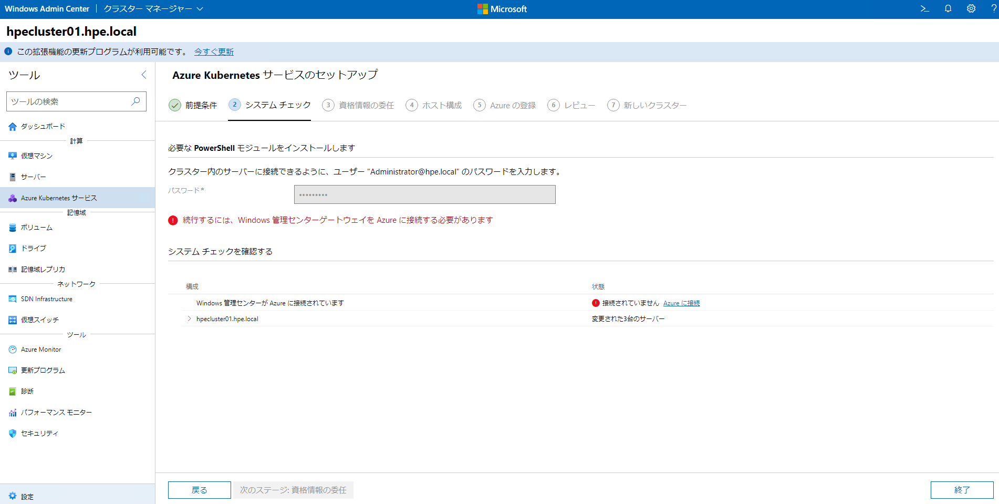

# Azure Kubernetes Service on Azure Stack HCIを使ってみる
マネージドK8sのAzure K8s ServiceがオンプレHCIの上でも対応しましたので、下記にその利用方法をまとめます。


## AKS on Azure Stack HCIとは
Azure Kubernetes Service（以下AKS）は、Microsoft社が提供するマネージドK8sサービスです。管理が煩雑になりがちなK8s環境を簡単に提供してくれるので重宝する一方、ネットワークトラフィックが膨大になるとパフォーマンスやコストの観点で△となることも。そこで登場したのが、ハイブリッドK8s環境を提供できるAKS on Azure Stack HCIです（と理解してます。）<br>
トラディショナルなワークロード（仮想環境）とクラウドネイティブなワークロード（コンテナ環境）はライフサイクルも異なるため両立が難しいのが一般的ですが、そんな両立した環境を実現できるのが、Azure Stack HCIおよび、AKS on Azure Stack HCIソリューションになります。


## AKS on Azure Stack HCIデプロイ前の前提条件
- Azureに登録済のAzure Stack HCIクラスタおよびWindows Admin Center
- Azure Active Directory（以下AAD）と同期されたオンプレミスのActive Directory
- Azure Stack HCIクラスター共有ボリューム：1TB（事前作成の必要有）
- 推奨コンピューティング要件（クラスターを構成するサーバーあたり）：
  - CPUコア：32コア
  - RAM：256GB
- オンプレミスネットワークからAzureへの安定した接続
- オンプレミスネットワークから「必要な URL の一覧」に記載されているすべての必須 URL へのアクセス
- インターネット接続可能な仮想スイッチ（事前作成の必要有）

-----
**※** 参照ドキュメントはこちら：<br>
- [Azure Kubernetes Service (AKS) ハイブリッド展開オプションのドキュメント](https://learn.microsoft.com/ja-jp/azure/aks/hybrid/)
- [Azure Kubernetes Service on Azure Stack HCI and Windows Server のシステム要件](https://learn.microsoft.com/ja-jp/azure/aks/hybrid/system-requirements?tabs=allow-table)
- [Azure からの AKS ハイブリッド クラスター プロビジョニングの概要 (プレビュー)](https://learn.microsoft.com/ja-jp/azure/aks/hybrid/aks-hybrid-preview-overview)
-----

## デプロイの流れ
①Azure Stack HCI上にAKS管理クラスターを作成します。<br>
②Azure Stack HCI上に使用するK8sクラスター（ワークロードクラスター）を作成します。<br>
③ワークロードクラスターにリモート接続します<br>
④サンプルコンテナを動かしてみます<br>

## ① AKS管理クラスターの作成
Windows Admin Center管理画面より、> クラスターマネージャー > Azure Kubernetes サービス を選択します。


ホストするシステムの要件を確認後、次に進みます。


システムチェックの際に、Azureへの接続が切れてしまっている場合は、再度登録しなおします。



改めて接続が完了しましたら、次に進みます。


デプロイ先のAzure Stack HCIクラスターも確認できていることがわかります。


Azure Stack HCIクラスターのペインを開くとメモリ情報や、共有ボリューム、仮想スイッチ等が条件を満たしているかどうかの確認が可能です。<br>


資格情報委任のため、CredSSPを有効にする必要があります。


ここからAKS関連情報を入力し、構成していきます。
- 管理クラスター名：任意の名前で設定します。
- VMイメージを格納するフォルダー：作成済みの共有ボリュームを選択します。AKS管理クラスターを構成するVMイメージなどが格納されます。
- インターネットに接続された仮想スイッチ：作成済みの仮想スイッチを選択します。AKSホストおよび、ワーカーノードの通信用に使用されます。
- CloudagentIP：AKSを構成するVMを管理するためにAKS管理エージェントが使用するIPアドレスを指定します。


- KubernetesノードのIPプール：AKSホストおよびK8sワーカーノード用に利用するIPレンジを指定します。
- ロードバランサー：クラスター外部との通信を実施する場合に利用するK8s Service用のIPレンジを指定します。


使用するAzureアカウント、サブスクリプション、リソースグループ、リージョンを指定します。


入力した構成情報に誤りがないかチェックし、先に進みます。


"Azure Kubernetesサービスを設定しています"の下に、今実施している作業内容と、継続時間が表示されるので、しばらく待ちます。


どのくらいかかるでしょうか...。

ようやくセットアップ完了！7時間越え、、、長かった...。

-----
## Tips
Podのイメージが引っ張ってこれないようなエラーが出た際には、設定しているDNSサーバーがきちんとインターネット接続できるようフォワードされているか疑うと良いかもしれません。

```
PS C:\> nslookup ecpacr.azurecr.io 10.7.24.14
Server:  ws-dns.hpe.local
Address:  10.7.24.14

Non-authoritative answer:
Name:    r1007wus2.westus2.cloudapp.azure.com
Address:  40.64.135.165
Aliases:  ecpacr.azurecr.io
          1c87b13eef30480bb8aa59de6f06eb22.trafficmanager.net
          wus2.fe.azcr.io
          wus2-acr-reg.trafficmanager.net
```
この例だと、きちんとDNSサーバー(ws-dns.hpe.local)が設定されていて、解決できない場合はフォワードできるように設定されていることがわかります。これだとOKです。
