# Azure Kubernetes Service on Azure Stack HCIを使ってみる
マネージドK8sのAzure K8s ServiceがオンプレHCIの上でも対応しましたので、下記にその利用方法をまとめます。

-----
**※** 参照ドキュメントはこちら： 
- [クイック スタート: Windows Admin Centerを使用して AKS ハイブリッドでローカル Kubernetes クラスターを作成する](https://learn.microsoft.com/ja-jp/azure/aks/hybrid/create-kubernetes-cluster)
-----

## ② K8sクラスターの作成
Windows Admin Center管理画面より、> クラスターマネージャー > Azure Kubernetes サービス を選択し、次のステージに進みます。
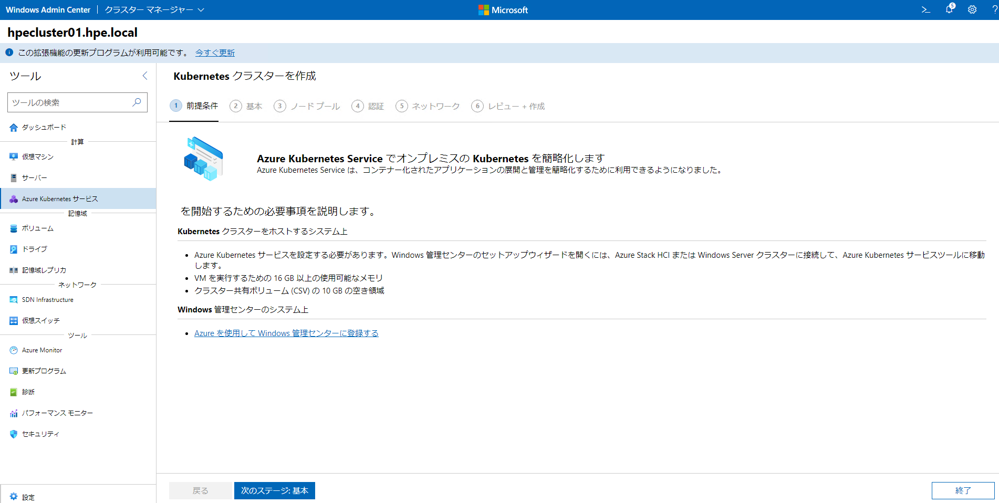

バックエンドでAzure Arcの機能を利用したほうが、Azure Portalから一元的に管理・運用が可能となるため、必要な情報を入力していきます。
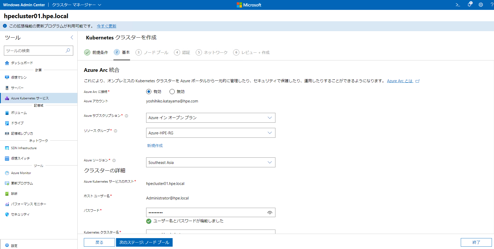

ワークロード用のK8sクラスターの名前、バージョンを選択し、

ワークロード用K8sクラスターを構成するための、ロードバランサーノードと、コントロールプレーン用のマスターノードのスペックを設定しておきます。（Azure IaaSと同様のサイズ感です）

続いて、ワーカーノードのノードプールの設定を実施します。 
Linuxワーカーなのか、Windowsワーカーなのか、またノード数とノード当たりのスペックを設定します。 
Podのスケジューリングを支援するテイント機能もGUIで設定することが可能です。

今回はLinuxプールを作成してみます。
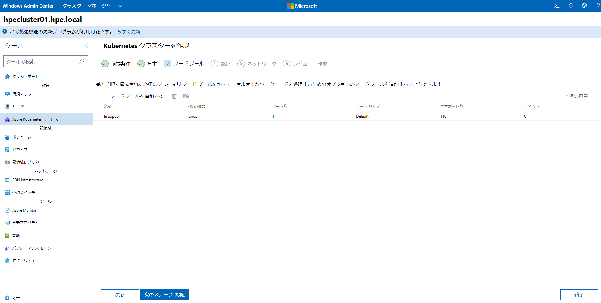

次にActive Directoryを利用したユーザー認証をするか否かの設定をします。
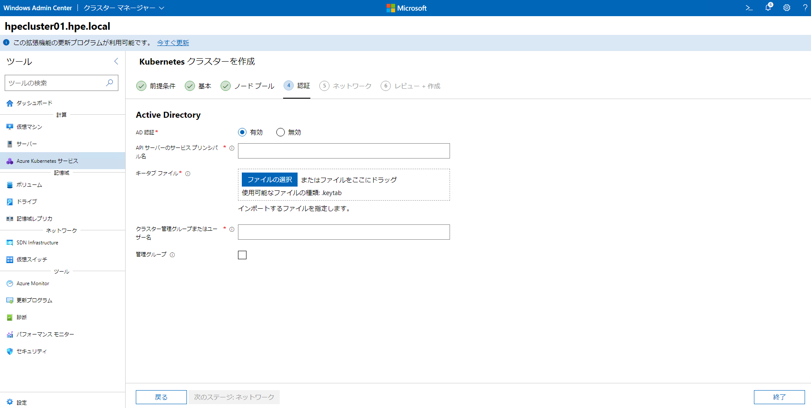

今回はAD連携はせずに進めます。

次にネットワークの設定をします。事前に用意した仮想ネットワークを追加し、K8sのCNIプラグインや、ロードバランサー手法などを選択します。
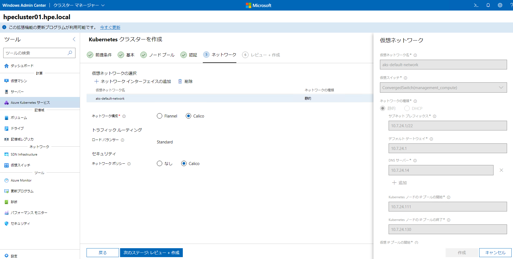

設定した情報を確認します。
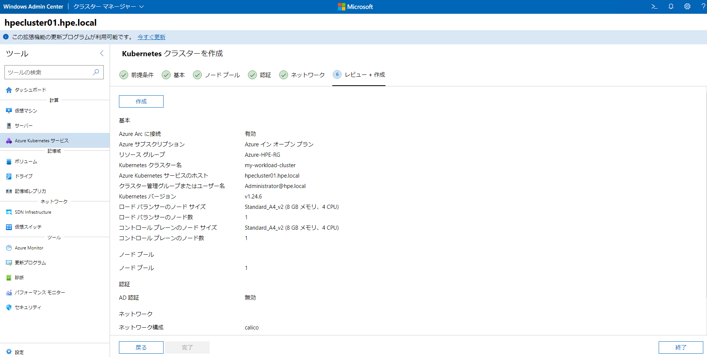

"作成"をクリックしてワークロード用K8sクラスターを作成します。
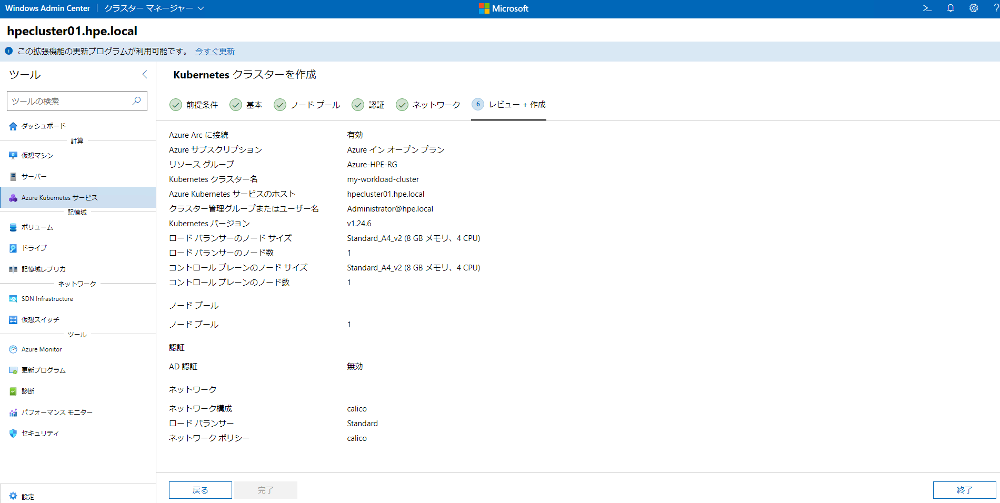

エラーが出てますが作成できてそう、、、。
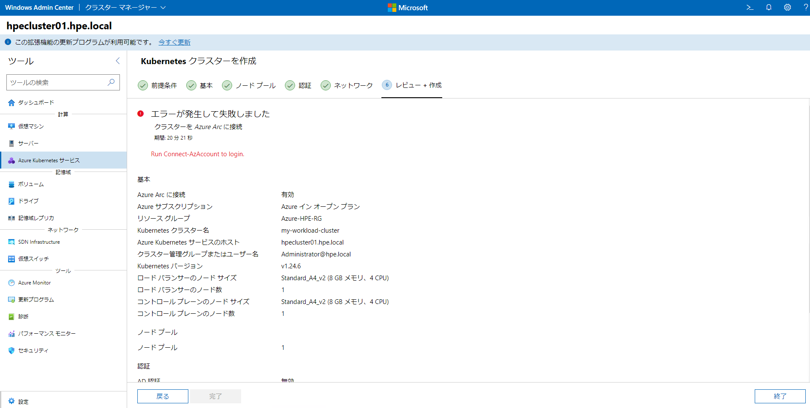

"Azure Kubernetes サービス" > "Kubernetesクラスター"を見てみると、「my-workload-cluster」が作成できてますね。

「my-workload-cluster」を覗いてみると、きちんとAzure Arc登録されていて、K8sのバージョン情報等も確認できます。
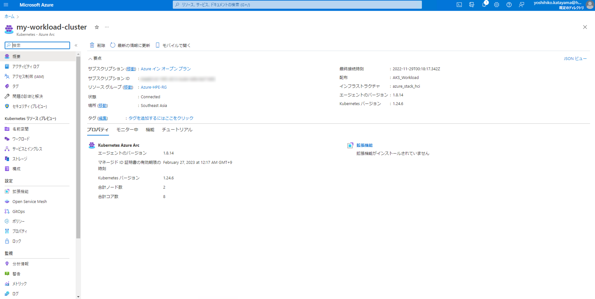

主要なメトリクスもこちらの画面から確認可能です。
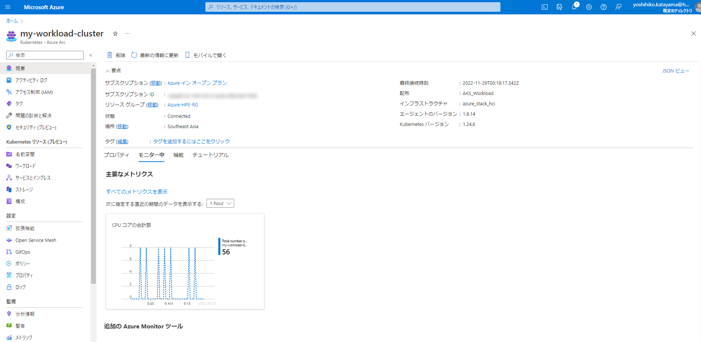

拡張機能や、チュートリアルなどはこのように見えます。
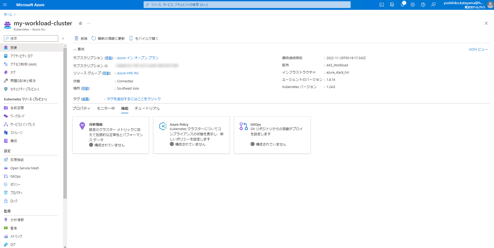

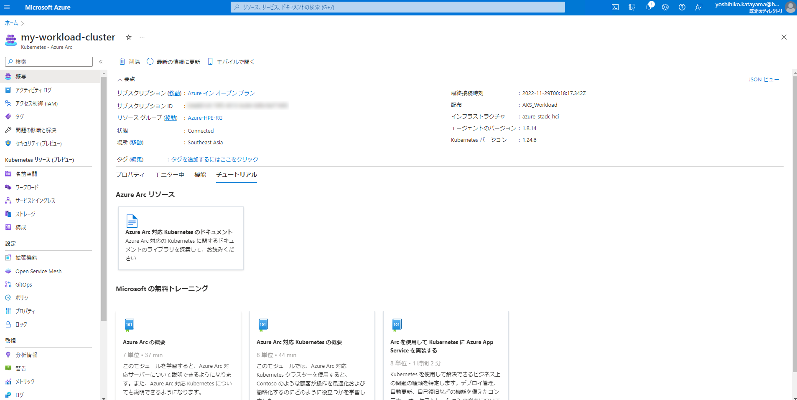

クラスター内に作成された仮想マシンを確認してみると、 
管理クラスターノード、ワークロード用K8sのロードバランサーノード、マスターノード、ワーカーノードと、各役割を担う仮想マシンが作成されていることがわかります。
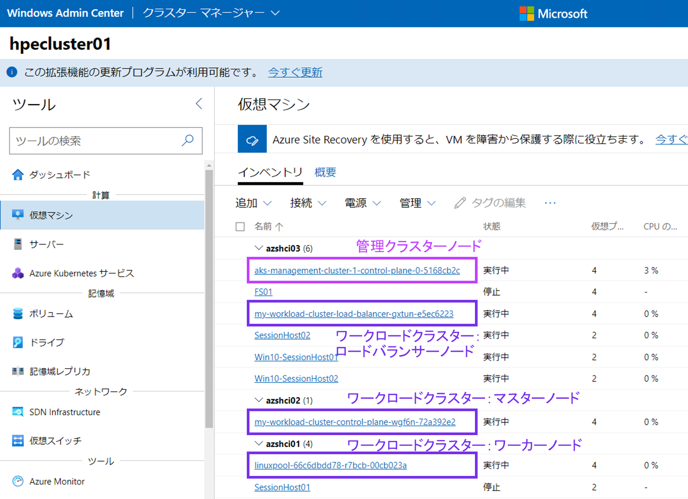

Azure Portal上からみると、management-cluster、workload-clusterともに作成されていることがわかります。
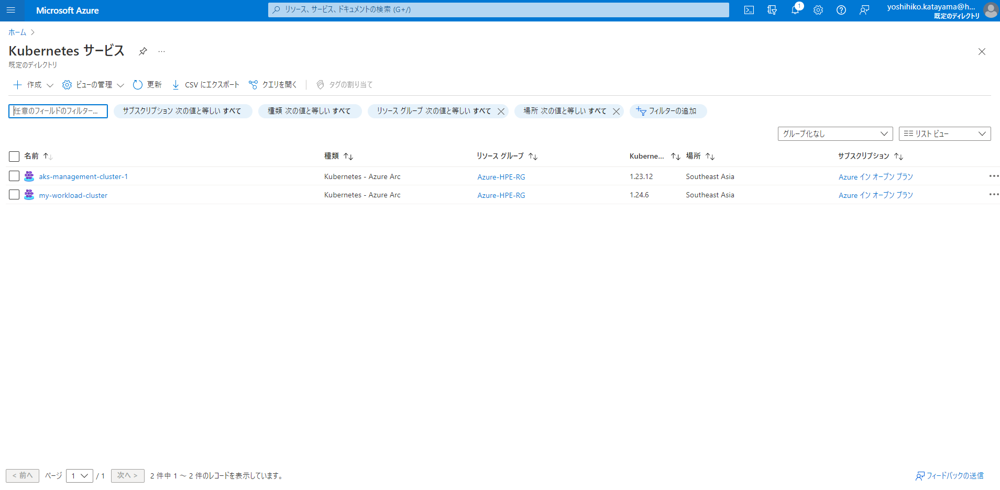

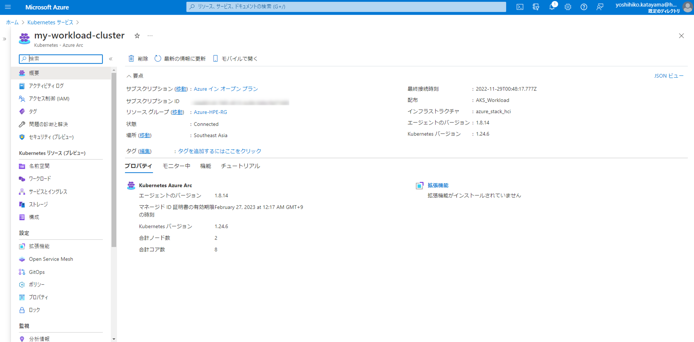
Management-Cluster、Workload-CLusterともにWindows Admin Centerでの表示内容と類似した管理画面となってます。
