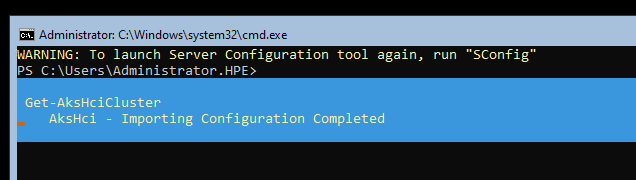
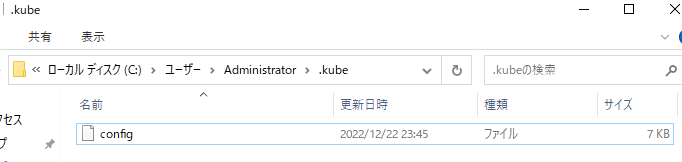
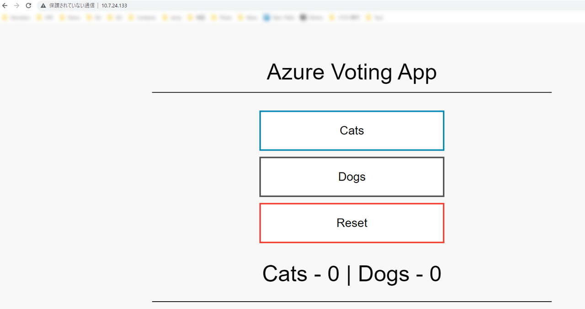
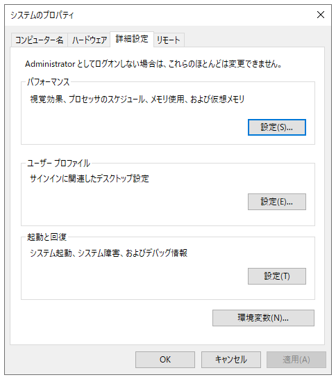
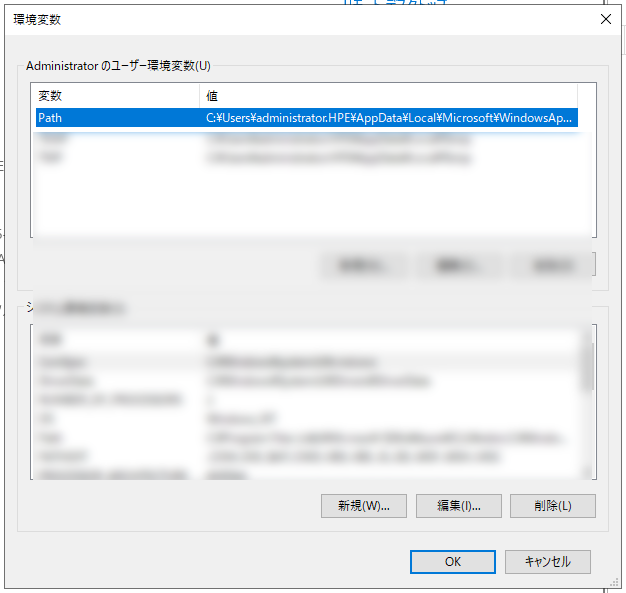
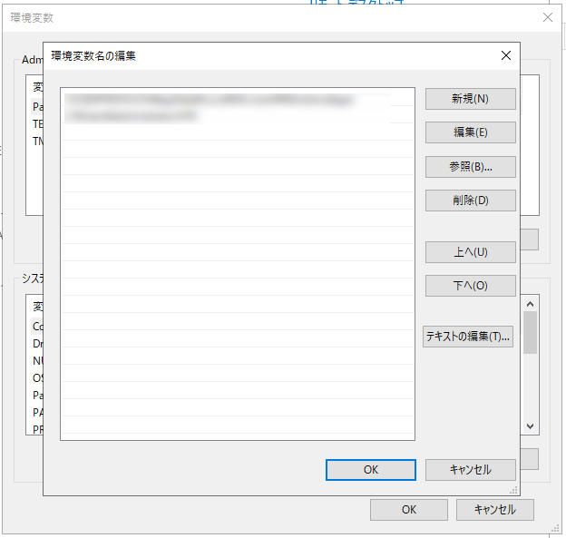

# Azure Kubernetes Service on Azure Stack HCIを使ってみる
マネージドK8sのAzure K8s ServiceがオンプレHCIの上でも対応しましたので、下記にその利用方法をまとめます。


## ③ ワークロードクラスターにリモート接続して操作する
リモート端末からワークロードクラスターにアクセスするまでの手順を記載していきます。

1. **任意の Azure Stack HCI ノードのコンソールに接続し、AksHciコマンドにて使用できるK8sクラスターを確認**



```
PS C:\Users\Administrator.HPE> Get-AksHciCluster                                                                        
Status                : {ProvisioningState, Details, Error}
ProvisioningState     : ClusterPending
KubernetesVersion     : v1.24.6
PackageVersion        : v1.24.6
NodePools             : linuxpool
WindowsNodeCount      : 0
LinuxNodeCount        : 1
ControlPlaneNodeCount : 1
ControlPlaneVmSize    : Standard_A4_v2
AutoScalerEnabled     : False
AutoScalerProfile     :
LoadBalancer          : {VMSize, Count, Sku}
Name                  : my-workload-cluster
```

2. **次のコマンドを実行して kubeconfig を生成**

```
PS C:\Users\Administrator.HPE> Get-AksHciCredential -name my-workload-cluster -configPath C:\work\config
Confirm
Are you sure you want to perform this action?
Performing the operation "Retrieve and write the cluster kubeconfig file to C:\work\config" on target
"my-workload-cluster".
[Y] Yes  [A] Yes to All  [N] No  [L] No to All  [S] Suspend  [?] Help (default is "Y"): a
```
kubeconfigが作成されていることを確認します。

```
PS C:\Users\Administrator.HPE> ls C:\work\config


     Directory: C:\work\config


Mode                 LastWriteTime         Length Name
----                 -------------         ------ ----
-a----        2022/12/22      6:45           7095 kubeconfig-my-workload-cluster
```


3. **HCIホストではなく、リモート管理端末で Windows PowerShell を管理者として実行し、.kubeディレクトリを作成**

```
PS C:\Users\administrator.HPE> cmd /c --%  mkdir %USERPROFILE%\.kube
```


4. **上記で作成した .kube フォルダーに、手順 3. で生成した kubeconfig ファイルをファイル名 config としてコピーを作成**<br>
※ファイル保存パスの例：  C:\Users\Administrator\.kube\config



5. **kubectl.exe をダウンロードしていない場合、PowerShell上で次のコマンドを実行して kubectl.exe をダウンロード (バージョン 1.23.0 をダウンロードする例)**

```
PS C:\Users\administrator.HPE> cmd /c --%  curl -LO https://dl.k8s.io/release/v1.23.0/bin/windows/amd64/kubectl.exe
  % Total    % Received % Xferd  Average Speed   Time    Time     Time  Current
                                 Dload  Upload   Total   Spent    Left  Speed
100   138  100   138    0     0    138      0  0:00:01 --:--:--  0:00:01   552
100 45.6M  100 45.6M    0     0  45.6M      0  0:00:01  0:00:01 --:--:-- 41.1M
```

(参考情報) [Windowsへkubectlをインストールする](https://kubernetes.io/ja/docs/tasks/tools/install-kubectl/#install-kubectl-on-windows)

6. **.\kubectl cluster-info や .\kubetl get nodes 等のコマンドで、作成したワークロードクラスターに接続できるかどうか確認**<br>
※PowerShell の場合カレントディレクトリにパスが通っていないので、.\ のようにコマンドを実行する時に明示的にパスを設定する必要があります。

```
PS C:\Users\administrator.HPE> .\kubectl cluster-info
Kubernetes control plane is running at https://10.7.24.132:6443
CoreDNS is running at https://10.7.24.132:6443/api/v1/namespaces/kube-system/services/kube-dns:dns/proxy

To further debug and diagnose cluster problems, use 'kubectl cluster-info dump'.
PS C:\Users\administrator.HPE> .\kubectl get nodes
NAME              STATUS   ROLES                  AGE   VERSION
moc-li02mzha2b0   Ready    control-plane,master   13h   v1.24.6
moc-lzo3rh21fin   Ready    <none>                 13h   v1.24.6
```

無事kubectlコマンドの利用が可能になりました。

## チュートリアルにあるLinuxアプリをデプロイしてみる

チュートリアル：[AKSハイブリッドでLinuxアプリをデプロイする](https://learn.microsoft.com/ja-jp/azure/aks/hybrid/deploy-linux-application)

```
PS C:\Users\administrator.HPE> kubectl get nodes
NAME              STATUS   ROLES                  AGE   VERSION
moc-li02mzha2b0   Ready    control-plane,master   13h   v1.24.6
moc-lzo3rh21fin   Ready    <none>                 13h   v1.24.6
```

yamlは[こちら](manifests/azure-vote.yaml)
```
PS C:\Users\administrator.HPE> kubectl apply -f .\.kube\azure-vote.yaml
Warning: spec.template.spec.nodeSelector[beta.kubernetes.io/os]: deprecated since v1.14; use "kubernetes.io/os" instead
deployment.apps/azure-vote-back created
service/azure-vote-back created
deployment.apps/azure-vote-front created
service/azure-vote-front created
```
```
PS C:\Users\administrator.HPE> kubectl get service azure-vote-front --watch
NAME               TYPE           CLUSTER-IP      EXTERNAL-IP   PORT(S)        AGE
azure-vote-front   LoadBalancer   10.100.52.209   10.7.24.133   80:32125/TCP   34s
```

External-IPでアクセスするとこんな感じ


-----
## Tips
**AksHciモジュールの利用用途に関して**<br>
ワークロードクラスター展開後に AksHci モジュールのコマンドを使うシチュエーションとしては、マネジメントクラスターやワークロードクラスターのアップグレード、<br>
トラブルシューティングのときには "Get-AksHciLogs" というコマンドレットで一括して AKS 関連のログを取得可能です。<br>
また、AksHciモジュールはAzure Stack HCIホスト上のみで実行可能です。

**参考文献**
- [Upgrade the AKS host in AKS hybrid using PowerShell](
https://learn.microsoft.com/en-us/azure/aks/hybrid/update-akshci-host-powershell)
- [Get-AksHciLogs for AKS on Azure Stack HCI and Windows Server](https://learn.microsoft.com/en-us/azure/aks/hybrid/reference/ps/get-akshcilogs)

**コマンドパスの通し方**<br>
毎度.\kubectlだと面倒くさいのでコマンドのパスを設定しておきます。

コントロールパネル ＞ システムとセキュリティ ＞ システム ＞ システムの詳細設定 ＞ 環境変数<br>


Pathを編集します。<br>


新規でpathに新しい参照元ファイルの在りかを張り付けます<br>


Powershellを開きなおして、再度試すと普通にkubectlが使えるようになります。
```
PS C:\Users\administrator.HPE> kubectl get nodes
NAME              STATUS   ROLES                  AGE   VERSION
moc-li02mzha2b0   Ready    control-plane,master   13h   v1.24.6
moc-lzo3rh21fin   Ready    <none>                 13h   v1.24.6
```
