# Azure Arc Enabled Infrastrucureを使ってみる
Azure Arc Enabled Infrastrucureとは、マルチクラウド、ハイブリッドクラウド管理を実現するAzure Arcの主要サービス群となります。
Azure Arcより、他クラウド環境および、オンプレ環境を一元的に監視することが可能となります。
今回はオンプレミスVMware環境（vCenter Server）をAzure Arcに接続して、どのように見えるのかについて実施方法をまとめます。
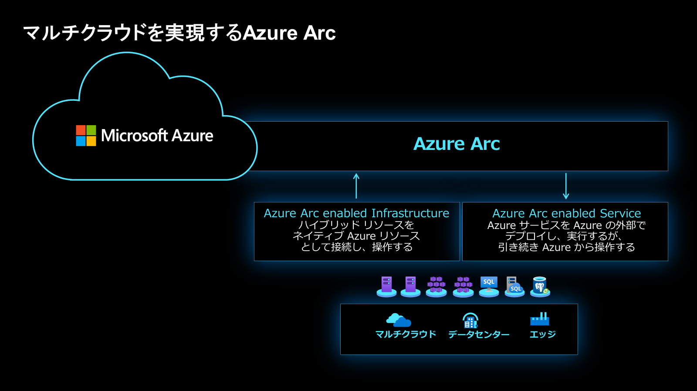

## vCenter ServerをAzure Arcに接続したあとのソリューションスタック
Azure ArcにvCenterを接続することで、Azure Portal上でVMware環境もある程度一元監視することが可能となります。vCenterとAzure Arcを接続するためのハブの役目を果たすリソースブリッジが仮想マシンとして対象のVMwareインフラ環境にデプロイされることで、Azure Portal側でもVMware環境（vCenter）を一リソースとして見えてきます。
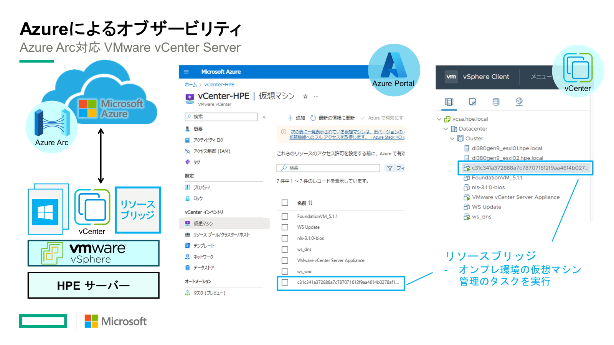

**※** 参照ドキュメントはこちら：<br>
[クイックスタート: ヘルパー スクリプトを使用して VMware vCenter Server を Azure Arc に接続する](https://learn.microsoft.com/ja-jp/azure/azure-arc/vmware-vsphere/quick-start-connect-vcenter-to-arc-using-script)


## Azure ArcにVCenter Serverを接続する
Azure Portalより、Azure Arcの画面を開きます。<br>
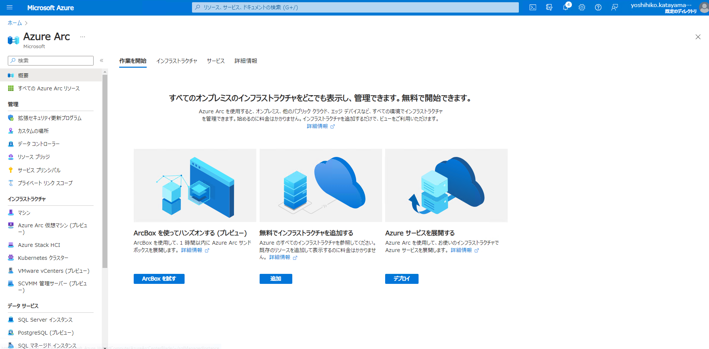

左ペインより、"VMware vCenters"を選択、"追加"をクリックし、作業を開始します。<br>
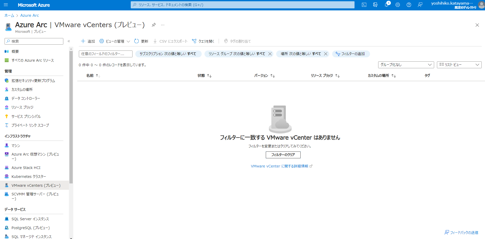

"リソースブリッジの新規作成"をクリックします。<br>
"リソースブリッジ"はvCenterとAzure Arcのつなぎ役となり、対象の仮想環境上に仮想アプライアンスとしてデプロイされます（内部でK8sが動きます）。
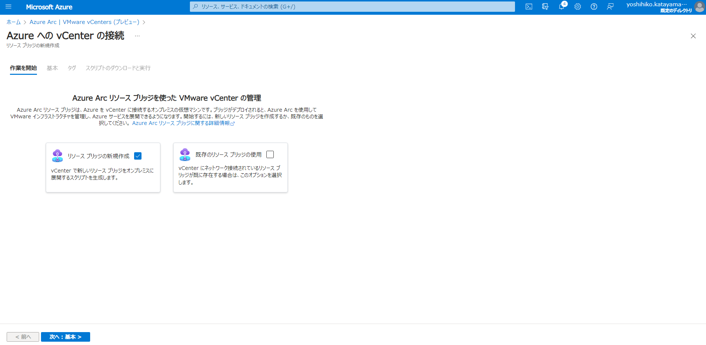

Arcに接続するvCenterに対応させるAzure側のリソースを指定します。<br>
vCenterの接続情報はリソースブリッジをデプロイするためのスクリプトキック後に指定します。
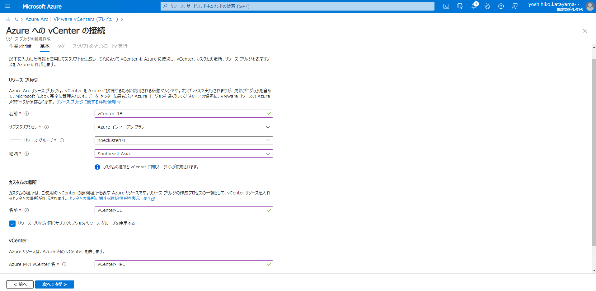

タグ付けが必要な場合はここで設定します。
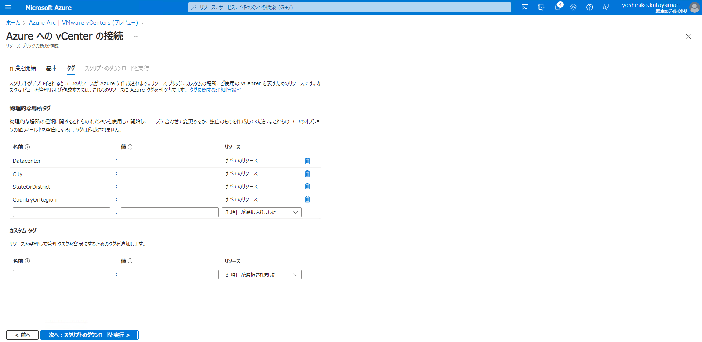

リソースブリッジをデプロイするためのPowerShellスクリプトが生成されるので、
ダウンロードし、Azure環境に接続できるPowerShell環境に置きます。
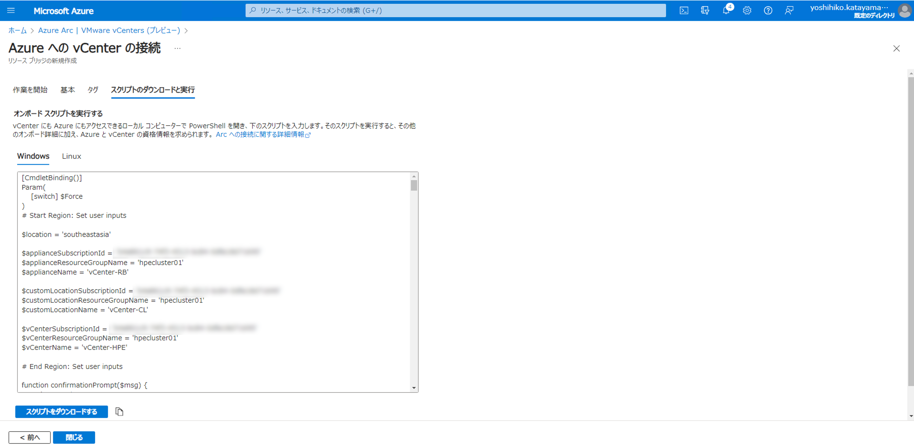

```
PS C:\Users\administrator.HPE> .\resource-bridge-onboarding-script.ps1


 0-0-0-0-0-0-0-0-0-0-0-0-0-0-0-0-0-0-0-0-0-0-0-0-0-0-0-0-0-0-0-0-0-0-0-0-0-0-0-0-
                    Step 1/5: Setting up the current workstation
 0-0-0-0-0-0-0-0-0-0-0-0-0-0-0-0-0-0-0-0-0-0-0-0-0-0-0-0-0-0-0-0-0-0-0-0-0-0-0-0-

Is the current workstation behind a proxy?
Yes(y)/No(n)?: n
Setting the TLS Protocol for the current session to TLS 1.3 if supported, else TLS 1.2.
==> Validating and installing 64-bit azure-cli
Azure CLI version 2.53.1 found in PATH at location: 'C:\Program Files\Microsoft SDKs\Azure\CLI2\wbin\az.cmd'
Python location 'C:\Program Files\Microsoft SDKs\Azure\CLI2\python.exe'
Determining the bitness of Python at 'C:\Program Files\Microsoft SDKs\Azure\CLI2\python.exe'
==> 64-bit Azure CLI is already installed. Checking for updates...
Azure CLI is up to date.
Enabling long path support for python...
==> Installing az cli extensions for Arc
Extension 'arcappliance' 1.0.0 is already installed.
Latest version of 'arcappliance' is already installed.
Extension 'k8s-extension' 1.5.1 is already installed.
Latest version of 'k8s-extension' is already installed.
Extension 'customlocation' 0.1.3 is already installed.
Latest version of 'customlocation' is already installed.
Extension 'connectedvmware' 0.2.1 is already installed.
Latest version of 'connectedvmware' is already installed.
==> az --version
azure-cli                         2.53.1

core                              2.53.1
telemetry                          1.1.0

Extensions:
appservice-kube                    0.1.9
arcappliance                       1.0.0
connectedk8s                       1.5.3
connectedvmware                    0.2.1
customlocation                     0.1.3
k8s-extension                      1.5.1

Dependencies:
msal                            1.24.0b2
azure-mgmt-resource             23.1.0b2

Python location 'C:\Program Files\Microsoft SDKs\Azure\CLI2\python.exe'

......
※長いので一部割愛します。
......

0-0-0-0-0-0-0-0-0-0-0-0-0-0-0-0-0-0-0-0-0-0-0-0-0-0-0-0-0-0-0-0-0-0-0-0-0-0-0-0-
                   Step 1/5: Workstation was set up successfully
0-0-0-0-0-0-0-0-0-0-0-0-0-0-0-0-0-0-0-0-0-0-0-0-0-0-0-0-0-0-0-0-0-0-0-0-0-0-0-0-


0-0-0-0-0-0-0-0-0-0-0-0-0-0-0-0-0-0-0-0-0-0-0-0-0-0-0-0-0-0-0-0-0-0-0-0-0-0-0-0-
                    Step 2/5: Creating the Arc resource bridge
0-0-0-0-0-0-0-0-0-0-0-0-0-0-0-0-0-0-0-0-0-0-0-0-0-0-0-0-0-0-0-0-0-0-0-0-0-0-0-0-

==> Provide vCenter details to deploy Arc resource bridge VM. The credentials will be used by Arc resource bridge to update and scale itself.

......
※このあたりからvCenterに関する接続情報等をウィザードに沿って入力していきます。
......

Please select datacenter:
1) /Datacenter
Enter number: 1
You Selected: /Datacenter

Please select network:
1) VM Network
Enter number: 1
You Selected: VM Network
Please enter Static IP address prefix in CIDR format (ex: 192.168.7.1/24): 10.7.24.1/22
Please enter Static gateway: 10.7.24.1
Arc resource bridge requires internal and external DNS resolution to required sites and the on-premises management machine. To configure its DNS settings, please enter the IP address(es) of DNS server(s) as a comma separated list (ex: 127.0.0.53, 127.0.0.51)10.7.24.14
Arc resource bridge consists of an on-premises appliance VM that requires two IP addresses, one for the appliance VM and one for its upgrade. The IPs are provided as an IP range with a minimum size of 2 addresses. Please specify the start range IP:10.7.24.151
Please specify the end range IP:10.7.24.152

Please select resourcepool:
1) Cluster/Resources (Complete path - /Datacenter/host/Cluster/Resources)
Enter number: 1
You Selected: Cluster/Resources (Complete path - /Datacenter/host/Cluster/Resources)

Please select datastore:
1) datastore1
2) datastore1 (2)
Enter number: 1
You Selected: datastore1

Please select folder:
1) Discovered virtual machine (Complete path - /Datacenter/vm/Discovered virtual machine)
Enter number: 1
You Selected: Discovered virtual machine (Complete path - /Datacenter/vm/Discovered virtual machine)

Please provide Appliance cluster configuration
Please enter appliance VM control plane IP: 10.7.24.153
Do you want to configure the appliance VM proxy settings? (y/n) n


......
※入力した情報が正しいかの検証後デプロイ作業がはじまります。
......

2023-10-27T17:38:58+09:00       INFO    ImageDeprovision: VSphere: Image deprovision successful
2023-10-27T17:38:58+09:00       INFO    Successfully deprovisioned the canary image 5d44751c-c1bc-4158-9b92-43acc1d398b5 to cloud fabric in 2.416007 seconds
2023-10-27T17:38:58+09:00       INFO    Validation completed successfully
Appliance configuration validation was successful

.....
.....
2023-10-27T17:39:01+09:00       INFO    The discovered kubernetes version is v1.25.7
2023-10-27T17:39:01+09:00       INFO    vsphereProvider: Image Client: Checking if a template is provisioned...
2023-10-27T17:39:01+09:00       INFO    ProvisionImage: Discovering image download information...

2023-10-27T17:39:01+09:00       INFO    ProvisionImage: Downloading and validating image...


2023-10-27T17:45:54+09:00       INFO    vsphereProvider: Image Client Provision: Deploying the template...
2023-10-27T17:45:57+09:00       INFO    Uploading template to the datastore... (1%, 28.7MiB/s)
2023-10-27T17:45:58+09:00       INFO    Uploading template to the datastore... (2%, 26.2MiB/s)
.....
.....
2023-10-27T17:47:27+09:00       INFO    Uploading template to the datastore... (99%, 44.9MiB/s)
2023-10-27T17:47:28+09:00       INFO    Uploading template to the datastore... (100%, 44.9MiB/s)
2023-10-27T17:47:28+09:00       INFO    Uploading template to the datastore... Complete
2023-10-27T17:47:28+09:00       INFO    ImageProvision: VSphere: Template Deployed. Creating snapshot and finishing aftersteps....
2023-10-27T17:47:29+09:00       INFO    ImageProvision: VSphere: Image Provision is successful
Appliance configuration was prepared successfully


Starting to create ARM resource of Arc Resource Bridge in Azure.

cli.azext_arcappliance.custom: added all necessary management keys to deploy config
.....
.....
Starting deployment of Arc Resource Bridge on-prem cluster

.....
.....

2023-10-27T17:54:20+09:00       INFO    core: Waiting for deployment 'config-agent' to be scheduled
2023-10-27T17:54:20+09:00       INFO    core: Waiting for deployment 'extension-manager' to be ready
2023-10-27T17:54:20+09:00       INFO    core: Waiting for secret 'appliance-public-key' to be created
Successfully saved kubeconfig to: kubeconfig
Appliance creation was successful

Cluster successfully deployed.

Starting to update the ARM resource of Arc Resource Bridge in Azure.

.....
.....
Waiting for the appliance to be ready...


 0-0-0-0-0-0-0-0-0-0-0-0-0-0-0-0-0-0-0-0-0-0-0-0-0-0-0-0-0-0-0-0-0-0-0-0-0-0-0-0-
                  Step 2/5: Arc resource bridge is up and running
 0-0-0-0-0-0-0-0-0-0-0-0-0-0-0-0-0-0-0-0-0-0-0-0-0-0-0-0-0-0-0-0-0-0-0-0-0-0-0-0-


 0-0-0-0-0-0-0-0-0-0-0-0-0-0-0-0-0-0-0-0-0-0-0-0-0-0-0-0-0-0-0-0-0-0-0-0-0-0-0-0-
                       Step 3/5: Installing cluster extension
 0-0-0-0-0-0-0-0-0-0-0-0-0-0-0-0-0-0-0-0-0-0-0-0-0-0-0-0-0-0-0-0-0-0-0-0-0-0-0-0-

{
  "aksAssignedIdentity": null,
  "autoUpgradeMinorVersion": true,
  "configurationProtectedSettings": {},
  "configurationSettings": {
    "Microsoft.CustomLocation.ServiceAccount": "azure-vmwareoperator"
  },
  "currentVersion": "1.0.72",
  "customLocationSettings": null,
  "errorInfo": null,
  "extensionType": "microsoft.vmware",
  "id": "/subscriptions/b4a861c9-74f3-4513-bc84-0dfa18d71695/resourceGroups/hpecluster01/providers/Microsoft.ResourceConnector/appliances/vCenter-RB/providers/Microsoft.KubernetesConfiguration/extensions/azure-vmwareoperator",
  "identity": {
    "principalId": "a7d4963b-47b9-4eef-a086-35dfec4e8652",
    "tenantId": null,
    "type": "SystemAssigned"
  },
  "isSystemExtension": false,
  "name": "azure-vmwareoperator",
  "packageUri": null,
  "plan": null,
  "provisioningState": "Succeeded",
  "releaseTrain": "Stable",
  "resourceGroup": "hpecluster01",
  "scope": {
    "cluster": {
      "releaseNamespace": "azure-vmwareoperator"
    },
    "namespace": null
  },
  "statuses": [],
  "systemData": {
    "createdAt": "2023-10-27T08:52:37.007779+00:00",
    "createdBy": null,
    "createdByType": null,
    "lastModifiedAt": "2023-10-27T08:52:37.007779+00:00",
    "lastModifiedBy": null,
    "lastModifiedByType": null
  },
  "type": "Microsoft.KubernetesConfiguration/extensions",
  "version": null
}


 0-0-0-0-0-0-0-0-0-0-0-0-0-0-0-0-0-0-0-0-0-0-0-0-0-0-0-0-0-0-0-0-0-0-0-0-0-0-0-0-
                 Step 3/5: Cluster extension installed successfully
 0-0-0-0-0-0-0-0-0-0-0-0-0-0-0-0-0-0-0-0-0-0-0-0-0-0-0-0-0-0-0-0-0-0-0-0-0-0-0-0-


 0-0-0-0-0-0-0-0-0-0-0-0-0-0-0-0-0-0-0-0-0-0-0-0-0-0-0-0-0-0-0-0-0-0-0-0-0-0-0-0-
                         Step 4/5: Creating custom location
 0-0-0-0-0-0-0-0-0-0-0-0-0-0-0-0-0-0-0-0-0-0-0-0-0-0-0-0-0-0-0-0-0-0-0-0-0-0-0-0-

{
  "authentication": {
    "type": null,
    "value": null
  },
  "clusterExtensionIds": [
    "/subscriptions/b4a861c9-74f3-4513-bc84-0dfa18d71695/resourceGroups/hpecluster01/providers/Microsoft.ResourceConnector/appliances/vCenter-RB/providers/Microsoft.KubernetesConfiguration/extensions/azure-vmwareoperator"
  ],
  "displayName": "vCenter-CL",
  "hostResourceId": "/subscriptions/<subscription-name>/resourceGroups/hpecluster01/providers/Microsoft.ResourceConnector/appliances/vCenter-RB",
  "hostType": "Kubernetes",
  "id": "/subscriptions/<subscription-name>/resourceGroups/hpecluster01/providers/Microsoft.ExtendedLocation/customLocations/vCenter-CL",
  "identity": null,
  "location": "southeastasia",
  "name": "vCenter-CL",
  "namespace": "vcenter-cl",
  "provisioningState": "Succeeded",
  "resourceGroup": "hpecluster01",
  "systemData": {
    "createdAt": "2023-10-27T08:53:45.421288+00:00",
    "createdBy": "yoshihiko.katayama@hpe.com",
    "createdByType": "User",
    "lastModifiedAt": "2023-10-27T08:53:45.421288+00:00",
    "lastModifiedBy": "yoshihiko.katayama@hpe.com",
    "lastModifiedByType": "User"
  },
  "tags": null,
  "type": "Microsoft.ExtendedLocation/customLocations"
}


 0-0-0-0-0-0-0-0-0-0-0-0-0-0-0-0-0-0-0-0-0-0-0-0-0-0-0-0-0-0-0-0-0-0-0-0-0-0-0-0-
                   Step 4/5: Custom location created successfully
 0-0-0-0-0-0-0-0-0-0-0-0-0-0-0-0-0-0-0-0-0-0-0-0-0-0-0-0-0-0-0-0-0-0-0-0-0-0-0-0-


 0-0-0-0-0-0-0-0-0-0-0-0-0-0-0-0-0-0-0-0-0-0-0-0-0-0-0-0-0-0-0-0-0-0-0-0-0-0-0-0-
                          Step 5/5: Connecting to vCenter
 0-0-0-0-0-0-0-0-0-0-0-0-0-0-0-0-0-0-0-0-0-0-0-0-0-0-0-0-0-0-0-0-0-0-0-0-0-0-0-0-

==> Provide vCenter details
        * These credentials will be used when you perform vCenter operations through Azure.
        * You can provide the same credentials that you provided for Arc resource bridge earlier.
Please provide vcenter FQDN or IP address: vcsa.hpe.local
Please provide vcenter username: Administrator@vsphere.local
Please provide vcenter password: *********
Please confirm vcenter password: *********
Confirm vcenter details? [Y/n]: y
{
  "connectionStatus": "Connected",
  "credentials": {
    "password": null,
    "username": "Administrator@vsphere.local"
  },
  "customResourceName": "96c63529-75e2-4350-8ca4-8ba85ee4b5d5",
  "extendedLocation": {
    "name": "/subscriptions/<subscription-name>/resourceGroups/hpecluster01/providers/Microsoft.ExtendedLocation/customLocations/vCenter-CL",
    "type": "CustomLocation"
  },
  "fqdn": "vcsa.hpe.local",
  "id": "/subscriptions/<subscription-name>/resourceGroups/hpecluster01/providers/Microsoft.ConnectedVMwarevSphere/vcenters/vCenter-HPE",
  "instanceUuid": "510e49ef-f7cc-4e86-bf5d-9ddc6a805d64",
  "kind": "VMware",
  "location": "southeastasia",
  "name": "vCenter-HPE",
  "port": 443,
  "provisioningState": "Succeeded",
  "resourceGroup": "hpecluster01",
  "statuses": [
    {
      "lastUpdatedAt": "2023-10-28T14:33:01+00:00",
      "message": null,
      "reason": null,
      "severity": null,
      "status": "True",
      "type": "Connected"
    },
    {
      "lastUpdatedAt": "2023-10-28T14:33:08.663115+00:00",
      "message": null,
      "reason": null,
      "severity": null,
      "status": "True",
      "type": "Ready"
    },
    {
      "lastUpdatedAt": "2023-10-28T14:33:08.663115+00:00",
      "message": null,
      "reason": null,
      "severity": null,
      "status": "True",
      "type": "Idle"
    }
  ],
  "systemData": {
    "createdAt": "2023-10-28T14:32:42.069344+00:00",
    "createdBy": "yoshihiko.katayama@hpe.com",
    "createdByType": "User",
    "lastModifiedAt": "2023-10-28T14:32:42.069344+00:00",
    "lastModifiedBy": "yoshihiko.katayama@hpe.com",
    "lastModifiedByType": "User"
  },
  "tags": {},
  "type": "microsoft.connectedvmwarevsphere/vcenters",
  "uuid": "96c63529-75e2-4350-8ca4-8ba85ee4b5d5",
  "version": "7.0.0"
}


 0-0-0-0-0-0-0-0-0-0-0-0-0-0-0-0-0-0-0-0-0-0-0-0-0-0-0-0-0-0-0-0-0-0-0-0-0-0-0-0-
                    Step 5/5: vCenter was connected successfully
 0-0-0-0-0-0-0-0-0-0-0-0-0-0-0-0-0-0-0-0-0-0-0-0-0-0-0-0-0-0-0-0-0-0-0-0-0-0-0-0-


 0-0-0-0-0-0-0-0-0-0-0-0-0-0-0-0-0-0-0-0-0-0-0-0-0-0-0-0-0-0-0-0-0-0-0-0-0-0-0-0-
             Your vCenter has been successfully onboarded to Azure Arc!
 0-0-0-0-0-0-0-0-0-0-0-0-0-0-0-0-0-0-0-0-0-0-0-0-0-0-0-0-0-0-0-0-0-0-0-0-0-0-0-0-

To continue onboarding and to complete Arc enabling your vSphere resources, view your vCenter resource in Azure portal.
https://portal.azure.com/#resource/subscriptions/<subscription-name>/resourceGroups/hpecluster01/providers/Microsoft.ConnectedVMwarevSphere/vcenters/vCenter-HPE/overview
```
デプロイDone!!

vCenter管理下のESXiクラスターにリソースブリッジが作成されました。
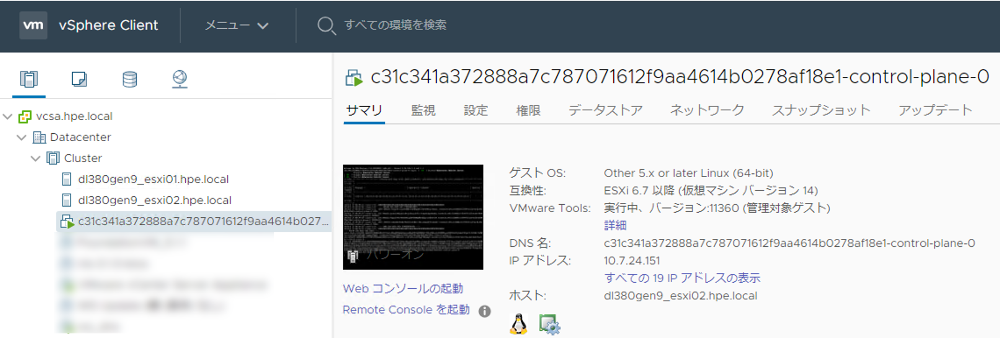

Azure Portal側からみると下記のような感じで見えます。
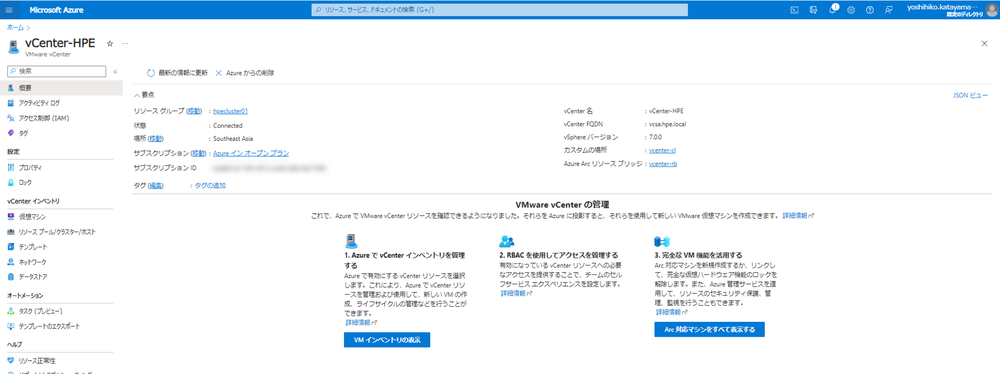

他のVMもきちんと見えました。
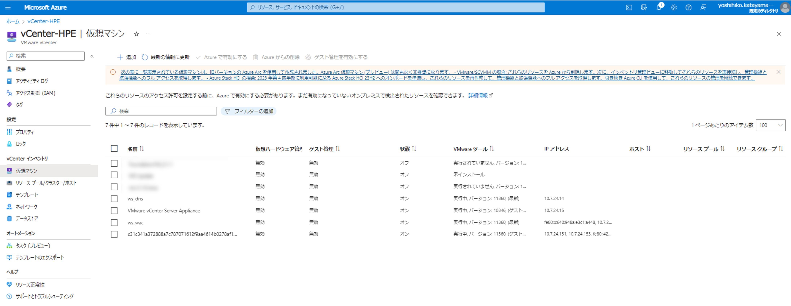
