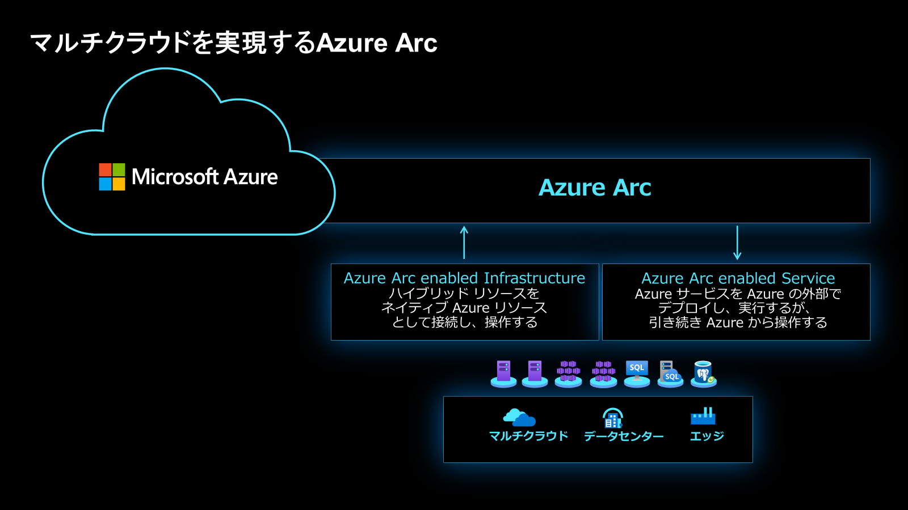
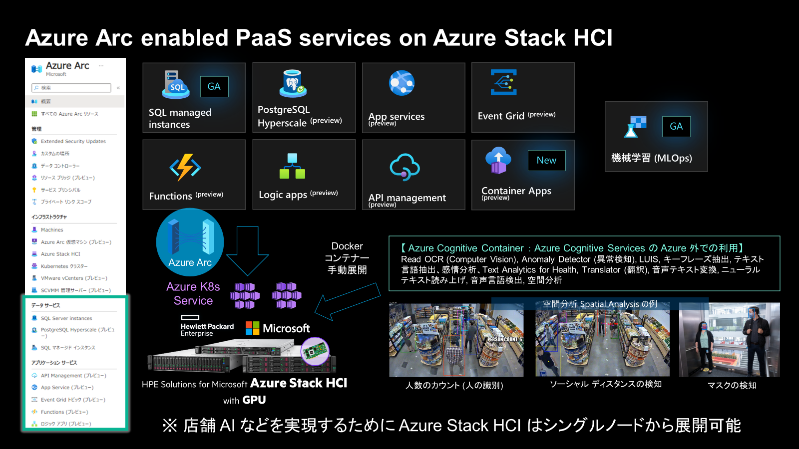
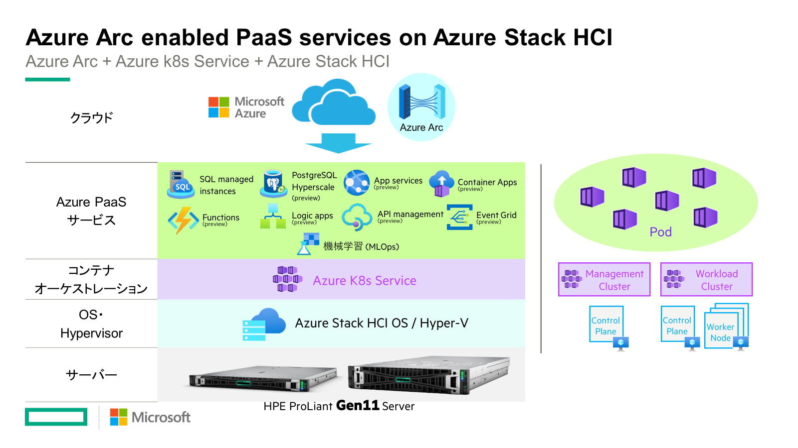
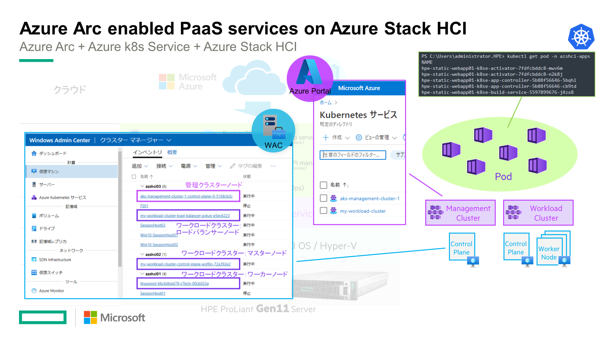
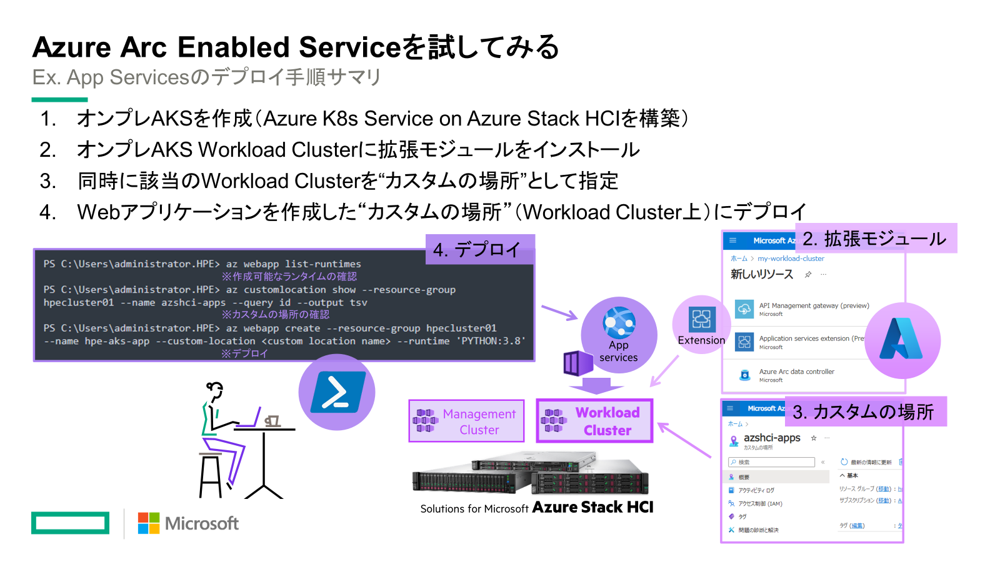
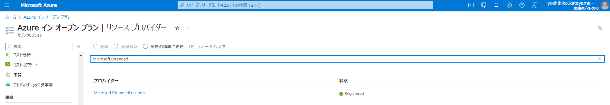

# Azure Arc Enabled Serviceを使ってみる
Azure Arc Enabled Serviceとは、マルチクラウド、ハイブリッドクラウド管理を実現するAzure Arcの主要サービス群となります。Azure Arcより、Azureの一部サービスをオンプレミス環境ないし他のクラウド環境にデプロイして使用することが可能となります。今回はオンプレミス環境にAzure Stack HCIを用意し、Azure Arc Enabled Serviceに対応している（執筆時点ではPreview）App Serviceをデプロイしてみます。下記にその利用方法をまとめます。


## Azure Arc Enabled Serviceをデプロイするためのソリューションスタック
Azure Arc Enabled Serviceでは、一部のAzure PaaSをオンプレAKS(Azure Kubernetes Services) on Azure Stack HCI上にデプロイして利用することが可能です。

本投稿時点ではまだPreview中のサービスが多く、オンプレ対応のAzure PaaS一覧がまとまっているようなドキュメントはないため、Azureサービス毎に対応状況の確認が必要となりますが、対応しているサービスの一覧はこちらになります。


またソリューションスタックとしては、AKSで管理されているWorkload Cluster上に、対応PaaSをPod群としてデプロイして利用します。どのPodで動かすかなどは管理者も特に意識することなく、Azure Arcがデプロイしてくれます。


各Control Planeや、Worker Nodeは仮想マシンとしてAzure Stack HCI上に作成されます。


## Arc対応App ServiceをAzure Stack HCIにデプロイするまでの手順
① オンプレAKSを作成+事前準備（Azure K8s Service on Azure Stack HCIを構築）<br>
② オンプレAKS Workload Clusterに拡張モジュールをインストール<br>
③ 同時に該当のWorkload Clusterを"カスタムの場所"として指定<br>
④ Webアプリケーションを作成した"カスタムの場所"（Workload Cluster上）にデプロイ<br>
のが構築手順の大まかな流れとなります。



## Azure Arc | App Service実装①：オンプレAKSを作成+事前準備
事前準備の前に、Azure K8s ServiceをAzure Stack HCI上に構築しておく必要があります。<br>
※AKS on Azure Stack HCIの構築に関しては、[こちら](../../aks-on-azshci)をご参照ください。<br>

次に、拡張モジュールのインストールおよび、カスタム ロケーションを作成する前に以下のコマンドにてクラスターでカスタムの場所を有効化します。<br>
カスタム ロケーションのデプロイを実施したタイミングでは対象のサブスクリプションに対して、<br> "Microsoft.ExtendedLocation" リソースプロバイダーが未登録だとデプロイができないため、<br>
下記を実施する必要あります。

----------
"Microsoft.ExtendedLocation" のプロバイダー登録の完了を確認します。

1. 次のコマンドを入力します。<br>
Azure CLIにて、
```
C:\Users\administrator.HPE>az provider register --namespace Microsoft.ExtendedLocation'
```

2. 登録プロセスを監視します。 登録には最大で 10 分かかる場合があります。
Azure CLI
登録後、RegistrationState 状態に Registered 値が与えられます。
```
C:\Users\administrator.HPE>az provider show -n Microsoft.ExtendedLocation -o table
Namespace                   RegistrationPolicy    RegistrationState
Microsoft.ExtendedLocation  RegistrationRequired  Registered
```


**※** 参照ドキュメントはこちら：<br>
[Azure Arc 対応 Kubernetes にカスタムの場所を作成および管理する - 前提条件](https://learn.microsoft.com/ja-jp/azure/azure-arc/kubernetes/custom-locations#prerequisites)

サブスクリプション > リソースプロバイダーより、<br>
"Microsoft.ExtendedLocation"のリソースプロバイダーがRegisterできていることを確認します。
<br>


3. 次にクラスターでカスタムの場所の利用を有効にします。

**※** 参照ドキュメントはこちら：<br>
[クラスターでカスタムの場所を有効にする](https://learn.microsoft.com/ja-jp/azure/azure-arc/kubernetes/custom-locations#enable-custom-locations-on-your-cluster)

```
C:\Users\administrator.HPE>az connectedk8s enable-features -n my-workload-cluster -g hpecluster01 --features cluster-connect custom-locations
This command is in preview and under development. Reference and support levels: https://aka.ms/CLI_refstatus
This operation might take a while...

Retrieving ARM metadata from: https://management.azure.com//metadata/endpoints?api-version=2022-09-01
"Successsfully enabled features: ['cluster-connect', 'custom-locations'] for the Connected Cluster my-workload-cluster"
```

以下のドキュメントでは az webapp create コマンドから作成する手順となっているため、今回はAzure CLIで作成しました。

**※** 参照ドキュメントはこちら：<br>
[Azure Arc で App Service アプリを作成する (プレビュー)]
(https://learn.microsoft.com/ja-jp/azure/app-service/quickstart-arc)

下記の「Creating your Web App」にもあるように、Web アプリの作成時にリージョンからカスタム ロケーションを選択いただくことでポータルからも作成は可能です。

**※** 参照ドキュメントはこちら：<br>
[Creating your Web App](https://azure.github.io/AppService/2021/07/08/How-to-create-a-blazor-webassembly-grpc-web-app-using-app-service-on-an-azure-arc-enabled-kubernetes-cluster.html#:~:text=drop%20down%20menu%20and%20choose%20your%20custom%20location,Arc%20region.%20Where%20you%20typically%20would%20see%20azurewebsites.netk4apps.io)
