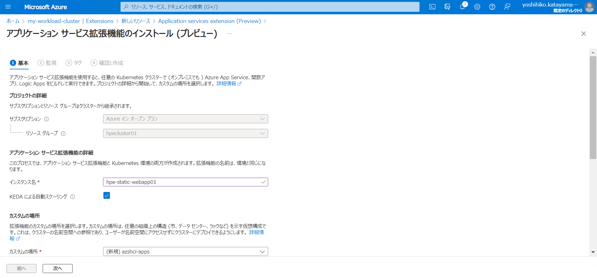

## Azure Arc | App Service実装②：オンプレAKS Workload Clusterに拡張モジュールをインストール
および、
## Azure Arc | App Service実装③：同時に該当のWorkload Clusterを"カスタムの場所"として指定<br>

作成したAKSのWorkload Clusterにアクセスします。（Azure Portal）


左ペインの”Extensions”をクリックします。


＋の追加をクリック


今回はWebAppをAKS on HCI上に入れたいので、”Application services extension(Preview)”を選択します。

”作成”をクリックします。


必要情報を入力していきます。<br>
拡張機能のインスタンス名 ≒ サービスを提供するPod名の命名規則にもなります。<br>
カスタムの場所 ＝ Webappを乗せる場所 → AKS on HCI上に作成する必要があります。


AKSとしての構成情報を入力していきます。


ログ置き場を有効にしておく場合は設定します。


作成予定の内容の確認をします。


作成


デプロイ中


Extensionのデプロイ完了


作成された拡張モジュールの詳細情報


カスタムの場所もちゃんとできてます。


Extension関連のPodやServiceが作成されていることをkubectlコマンドでも確認します。

```
PS C:\Users\administrator.HPE> kubectl get pod -n azshci-apps
NAME                                                              READY   STATUS    RESTARTS       AGE
hpe-static-webapp01-k8se-activator-7fdfcbddc8-mwv6m               1/1     Running   0              5m7s
hpe-static-webapp01-k8se-activator-7fdfcbddc8-n2k8j               1/1     Running   0              5m5s
hpe-static-webapp01-k8se-app-controller-5b88f56646-5bqhl          1/1     Running   0              5m7s
hpe-static-webapp01-k8se-app-controller-5b88f56646-cb9td          1/1     Running   0              5m6s
hpe-static-webapp01-k8se-build-service-5597899676-j4zx8           2/2     Running   0              7m12s
hpe-static-webapp01-k8se-envoy-7987b4df8d-bf4zb                   1/1     Running   0              7m12s
hpe-static-webapp01-k8se-envoy-7987b4df8d-f7z2k                   1/1     Running   0              7m12s
hpe-static-webapp01-k8se-envoy-7987b4df8d-q46j6                   1/1     Running   0              7m12s
hpe-static-webapp01-k8se-envoy-controller-575b6478bb-2jrpb        1/1     Running   0              5m1s
hpe-static-webapp01-k8se-envoy-controller-575b6478bb-bbg5h        1/1     Running   0              5m7s
hpe-static-webapp01-k8se-http-scaler-5fd56b884c-8wfjj             1/1     Running   0              7m12s
hpe-static-webapp01-k8se-img-cacher-5dtrd                         1/1     Running   0              7m12s
hpe-static-webapp01-k8se-img-cacher-nrgqb                         1/1     Running   0              7m12s
hpe-static-webapp01-k8se-img-cacher-qbcns                         1/1     Running   0              7m12s
hpe-static-webapp01-k8se-keda-metrics-apiserver-7dbc96f4bftwh2f   1/1     Running   0              7m11s
hpe-static-webapp01-k8se-keda-operator-6fc87dd55-snqgb            1/1     Running   0              7m11s
hpe-static-webapp01-k8se-log-processor-879pj                      1/1     Running   2 (5m6s ago)   7m12s
hpe-static-webapp01-k8se-log-processor-n78j9                      1/1     Running   1 (5m7s ago)   7m12s
hpe-static-webapp01-k8se-log-processor-qfbmm                      1/1     Running   2 (5m6s ago)   7m12s
hpe-static-webapp01-k8se-log-processor-rc29x                      1/1     Running   1 (5m7s ago)   7m12s
```

```
PS C:\Users\administrator.HPE> kubectl get svc -n azshci-apps
NAME                                              TYPE           CLUSTER-IP      EXTERNAL-IP   PORT(S)                      AGE
hpe-static-webapp01-k8se-activator                ClusterIP      10.103.222.51   <none>        4045/TCP,4050/TCP,4046/TCP   8m2s
hpe-static-webapp01-k8se-build-service            ClusterIP      10.97.230.72    <none>        8181/TCP,4343/TCP            8m2s
hpe-static-webapp01-k8se-envoy                    LoadBalancer   10.105.82.67    10.7.24.133   80:31047/TCP,443:31674/TCP   8m2s
hpe-static-webapp01-k8se-envoy-controller         ClusterIP      10.98.43.27     <none>        9090/TCP                     8m2s
hpe-static-webapp01-k8se-envoy-internal           ClusterIP      10.98.151.66    <none>        80/TCP,443/TCP               8m2s
hpe-static-webapp01-k8se-http-scaler              ClusterIP      10.101.59.222   <none>        4055/TCP,4050/TCP            8m2s
hpe-static-webapp01-k8se-keda-metrics-apiserver   ClusterIP      10.99.76.130    <none>        443/TCP,80/TCP               8m2s
```
