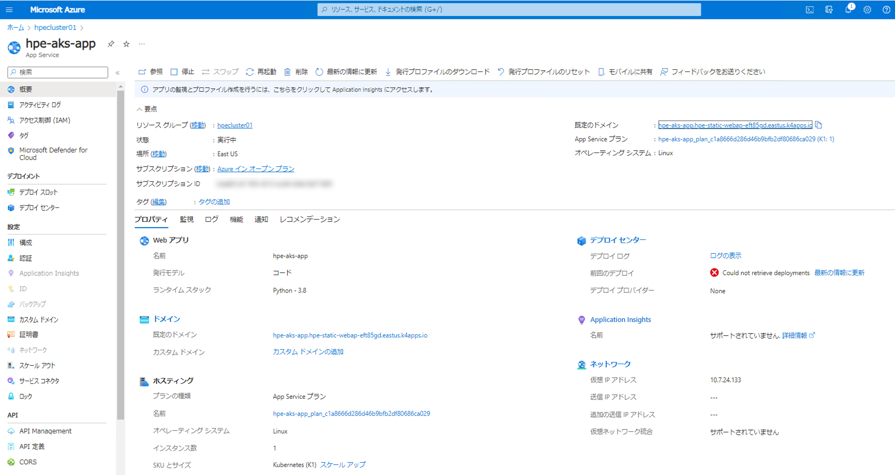
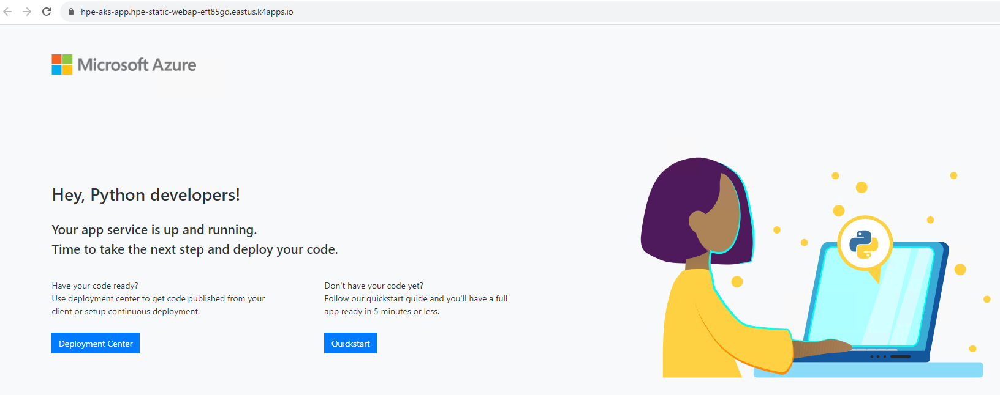

## Azure Arc | App Service実装④：Webアプリケーションを作成した"カスタムの場所"（Workload Cluster上）にデプロイ

WebApp(Node.js 18LTS)をコマンドでデプロイしてみます。
```
PS C:\Users\administrator.HPE> az webapp create --resource-group hpecluster01 --plan MyPlan --name hpe-aks-app --custom-location /subscriptions/<subscription-name>/resourceGroups/hpecluster01/providers/Microsoft.ExtendedLocation/customLocations/azshci-apps --runtime 'NODE:18-lts'
unrecognized arguments: --custom-location /subscriptions/<subscription-name>/resourceGroups/hpecluster01/providers/Microsoft.ExtendedLocation/customLocations/azshci-apps

Examples from AI knowledge base:
az webapp create --resource-group MyResourceGroup --plan MyPlan --name MyUniqueAppName
Create a web app with the default configuration.

az webapp create --resource-group MyResourceGroup --plan MyPlan --name MyUniqueAppName --deployment-container-image-name nginx
Create a web app with an image from DockerHub.

https://docs.microsoft.com/en-US/cli/azure/webapp#az_webapp_create
Read more about the command in reference docs
```
→　Custom-Locationが認識されていない模様。<br>
これはどうやらappservice-kubeのExtensionが足りない、インストールの必要あります。

いまインストールされているExtensionのリストを表示します。
```
PS C:\Users\administrator.HPE> az extension list
[
  {
    "experimental": false,
    "extensionType": "whl",
    "name": "connectedk8s",
    "path": "C:\\Users\\administrator.HPE\\.azure\\cliextensions\\connectedk8s",
    "preview": false,
    "version": "1.4.0"
  },
  {
    "experimental": false,
    "extensionType": "whl",
    "name": "customlocation",
    "path": "C:\\Users\\administrator.HPE\\.azure\\cliextensions\\customlocation",
    "preview": false,
    "version": "0.1.3"
  },
  {
    "experimental": false,
    "extensionType": "whl",
    "name": "k8s-extension",
    "path": "C:\\Users\\administrator.HPE\\.azure\\cliextensions\\k8s-extension",
    "preview": false,
    "version": "1.4.5"
  }
]
```
”appservice-kube”がないのでインストール

```
PS C:\Users\administrator.HPE> az extension add --upgrade --yes --name appservice-kube
The installed extension 'appservice-kube' is in preview.
```

再度”appservice-kube”がインストールされているかを確認します。
```
PS C:\Users\administrator.HPE> az extension list
[
  {
    "experimental": false,
    "extensionType": "whl",
    "name": "appservice-kube",
    "path": "C:\\Users\\administrator.HPE\\.azure\\cliextensions\\appservice-kube",
    "preview": true,
    "version": "0.1.9"
  },
  {
    "experimental": false,
    "extensionType": "whl",
    "name": "connectedk8s",
    "path": "C:\\Users\\administrator.HPE\\.azure\\cliextensions\\connectedk8s",
    "preview": false,
    "version": "1.4.0"
  },
  {
    "experimental": false,
    "extensionType": "whl",
    "name": "customlocation",
    "path": "C:\\Users\\administrator.HPE\\.azure\\cliextensions\\customlocation",
    "preview": false,
    "version": "0.1.3"
  },
  {
    "experimental": false,
    "extensionType": "whl",
    "name": "k8s-extension",
    "path": "C:\\Users\\administrator.HPE\\.azure\\cliextensions\\k8s-extension",
    "preview": false,
    "version": "1.4.5"
  }
]
```

Azure CLIのバージョンを確認
```
PS C:\Users\administrator.HPE> az version
{
  "azure-cli": "2.52.0",
  "azure-cli-core": "2.52.0",
  "azure-cli-telemetry": "1.1.0",
  "extensions": {
    "appservice-kube": "0.1.9",
    "connectedk8s": "1.4.0",
    "customlocation": "0.1.3",
    "k8s-extension": "1.4.5"
  }
}
```
バージョンが古いのでアップグレード

```
PS C:\Users\administrator.HPE> az upgrade
This command is in preview and under development. Reference and support levels: https://aka.ms/CLI_refstatus
Your current Azure CLI version is 2.52.0. Latest version available is 2.53.0.
Please check the release notes first: https://docs.microsoft.com/cli/azure/release-notes-azure-cli
Do you want to continue? (Y/n): y
Updating Azure CLI with MSI from https://aka.ms/installazurecliwindowsx64
Downloading MSI to C:\Users\ADMINI~1.HPE\AppData\Local\Temp\tmpg1dysftn\azure-cli-2.53.0-x64.msi
Installing MSI
Succeeded. Deleting C:\Users\ADMINI~1.HPE\AppData\Local\Temp\tmpg1dysftn
Upgrading extensions
Checking update for appservice-kube
Latest version of 'appservice-kube' is already installed.

Use --debug for more information
Checking update for connectedk8s
Checking update for customlocation
Latest version of 'customlocation' is already installed.

Use --debug for more information
Checking update for k8s-extension
Upgrade finished.You can enable auto-upgrade with 'az config set auto-upgrade.enable=yes'. More details in https://docs.microsoft.com/cli/azure/update-azure-cli#automatic-update
```

```
PS C:\Users\administrator.HPE> az version
{
  "azure-cli": "2.53.0",
  "azure-cli-core": "2.53.0",
  "azure-cli-telemetry": "1.1.0",
  "extensions": {
    "appservice-kube": "0.1.9",
    "connectedk8s": "1.5.2",
    "customlocation": "0.1.3",
    "k8s-extension": "1.5.0"
  }
}
```
これで準備が整いました。<br>
作成可能なWebappのランタイムバージョンを確認します。

```
PS C:\Users\administrator.HPE> az webapp list-runtimes
{
  "linux": [
    "DOTNETCORE:8.0",
    "DOTNETCORE:7.0",
    "DOTNETCORE:6.0",
    "NODE:18-lts",
    "NODE:16-lts",
    "PYTHON:3.11",
    "PYTHON:3.10",
    "PYTHON:3.9",
    "PYTHON:3.8",
    "PHP:8.2",
    "PHP:8.1",
    "PHP:8.0",
    "JAVA:17-java17",
    "JAVA:11-java11",
    "JAVA:8-jre8",
    "JBOSSEAP:7-java17",
    "JBOSSEAP:7-java11",
    "JBOSSEAP:7-java8",
    "TOMCAT:10.0-java17",
    "TOMCAT:10.0-java11",
    "TOMCAT:10.0-jre8",
    "TOMCAT:9.0-java17",
    "TOMCAT:9.0-java11",
    "TOMCAT:9.0-jre8",
    "TOMCAT:8.5-java11",
    "TOMCAT:8.5-jre8",
    "GO:1.19"
  ],
  "windows": [
    "dotnet:8",
    "dotnet:7",
    "dotnet:6",
    "ASPNET:V4.8",
    "ASPNET:V3.5",
    "NODE:18LTS",
    "NODE:16LTS",
    "java:1.8:Java SE:8",
    "java:11:Java SE:11",
    "java:17:Java SE:17",
    "java:1.8:TOMCAT:10.0",
    "java:11:TOMCAT:10.0",
    "java:17:TOMCAT:10.0",
    "java:1.8:TOMCAT:9.0",
    "java:11:TOMCAT:9.0",
    "java:17:TOMCAT:9.0",
    "java:1.8:TOMCAT:8.5",
    "java:11:TOMCAT:8.5",
    "java:17:TOMCAT:8.5"
  ]
}
```

上記リスト掲載のランタイムは必ずしもArc対応のランタイムバージョンではないため、
2023/10時点でデプロイ可だったものを以下にリストします。

----------
 "DOTNETCORE:6.0","PYTHON:3.8","JAVA:11-java11","JAVA:8-jre8","TOMCAT:9.0-java11","TOMCAT:9.0-jre8","TOMCAT:8.5-java11","TOMCAT:8.5-jre8",

----------
<br>
また、2023/10時点では下記ドキュメントにはサポートされるランタイムバージョン情報は未反映でした。<br>

----------
**※** Azure ArcのApp Service（プレビュー） - 拡張機能のリリースノート<br>
[アプリケーション サービス拡張機能 v 0.9.0 (2021 年 5 月)](
https://learn.microsoft.com/ja-jp/azure/app-service/overview-arc-integration#application-services-extension-v-090-may-2021)
-- Web application runtime support -- <br>
.NET 3.1 and 5.0; Node JS 12 and 14; Python 3.6, 3.7, and 3.8; PHP 7.3 and 7.4; Ruby 2.5, 2.5.5, 2.6, and 2.6.2; Java SE 8u232, 8u242, 8u252, 11.05, 11.06 and 11.07; Tomcat 8.5, 8.5.41, 8.5.53, 8.5.57, 9.0, 9.0.20, 9.0.33, and 9.0.37.

----------

改めてカスタムロケーションの確認します。

```
PS C:\Users\administrator.HPE> az customlocation show --resource-group hpecluster01 --name azshci-apps --query id --output tsv
/subscriptions/<subscription-name>/resourceGroups/hpecluster01/providers/Microsoft.ExtendedLocation/customLocations/azshci-apps
```

Python3.8でWebAppを作成してみます。Planは指示しなければ自動で作成されるので、<br>
az webapp createコマンドより、

```
PS C:\Users\administrator.HPE> az webapp create --resource-group hpecluster01 --name hpe-aks-app --custom-location /subscriptions/<subscription-name>/resourceGroups/hpecluster01/providers/Microsoft.ExtendedLocation/customLocations/azshci-apps --runtime 'PYTHON:3.8'
The behavior of this command has been altered by the following extension: appservice-kube
Plan not specified. Creating Plan 'hpe-aks-app_plan_c1a8666d286d46b9bfb2df80686ca029' with sku 'K1'
{
  "availabilityState": "Normal",
  "clientAffinityEnabled": null,
  "clientCertEnabled": null,
  "clientCertExclusionPaths": null,
  "clientCertMode": null,
  "cloningInfo": null,
  "containerSize": null,
  "customDomainVerificationId": "AE60751C217BE8E47F8FDB0E9B27E1D35C67C086302FC12124E602A492275D1D",
  "dailyMemoryTimeQuota": null,
  "defaultHostName": "hpe-aks-app.hpe-static-webap-eft85gd.eastus.k4apps.io",
  "enabled": true,
  "enabledHostNames": [
    "hpe-aks-app.hpe-static-webap-eft85gd.eastus.k4apps.io",
    "hpe-aks-app.scm.hpe-static-webap-eft85gd.eastus.k4apps.io"
  ],
  "extendedLocation": {
    "name": "/subscriptions/<subscription-name>/resourceGroups/hpecluster01/providers/Microsoft.ExtendedLocation/customLocations/azshci-apps",
    "type": "customLocation"
  },
  "hostNameSslStates": [
    {
      "certificateResourceId": null,
      "hostType": "Standard",
      "ipBasedSslResult": null,
      "ipBasedSslState": "NotConfigured",
      "name": "hpe-aks-app.hpe-static-webap-eft85gd.eastus.k4apps.io",
      "sslState": "Disabled",
      "thumbprint": null,
      "toUpdate": null,
      "toUpdateIpBasedSsl": null,
      "virtualIPv6": null,
      "virtualIp": null
    },
    {
      "certificateResourceId": null,
      "hostType": "Repository",
      "ipBasedSslResult": null,
      "ipBasedSslState": "NotConfigured",
      "name": "hpe-aks-app.scm.hpe-static-webap-eft85gd.eastus.k4apps.io",
      "sslState": "Disabled",
      "thumbprint": null,
      "toUpdate": null,
      "toUpdateIpBasedSsl": null,
      "virtualIPv6": null,
      "virtualIp": null
    }
  ],
  "hostNames": [
    "hpe-aks-app.hpe-static-webap-eft85gd.eastus.k4apps.io"
  ],
  "hostNamesDisabled": null,
  "hostingEnvironmentProfile": null,
  "httpsOnly": false,
  "hyperV": false,
  "id": "/subscriptions/<subscription-name>/resourceGroups/hpecluster01/providers/Microsoft.Web/sites/hpe-aks-app",
  "identity": null,
  "inProgressOperationId": null,
  "isDefaultContainer": null,
  "isXenon": false,
  "keyVaultReferenceIdentity": null,
  "kind": "app,linux,kubernetes",
  "lastModifiedTimeUtc": null,
  "location": "East US",
  "maxNumberOfWorkers": null,
  "name": "hpe-aks-app",
  "outboundIpAddresses": null,
  "possibleOutboundIpAddresses": null,
  "publicNetworkAccess": null,
  "redundancyMode": null,
  "repositorySiteName": "hpe-aks-app",
  "reserved": null,
  "resourceGroup": "hpecluster01",
  "scmSiteAlsoStopped": false,
  "serverFarmId": "/subscriptions/<subscription-name>/resourceGroups/hpecluster01/providers/Microsoft.Web/serverfarms/hpe-aks-app_plan_c1a8666d286d46b9bfb2df80686ca029",
  "siteConfig": {
    "acrUseManagedIdentityCreds": null,
    "acrUserManagedIdentityId": null,
    "alwaysOn": true,
    "antivirusScanEnabled": null,
    "apiDefinition": null,
    "apiManagementConfig": null,
    "appCommandLine": null,
    "appSettings": [],
    "autoHealEnabled": null,
    "autoHealRules": null,
    "autoSwapSlotName": null,
    "azureMonitorLogCategories": null,
    "azureStorageAccounts": null,
    "connectionStrings": null,
    "cors": null,
    "customAppPoolIdentityAdminState": null,
    "customAppPoolIdentityTenantState": null,
    "defaultDocuments": null,
    "detailedErrorLoggingEnabled": null,
    "documentRoot": null,
    "elasticWebAppScaleLimit": null,
    "experiments": null,
    "fileChangeAuditEnabled": null,
    "ftpsState": null,
    "functionAppScaleLimit": null,
    "functionsRuntimeScaleMonitoringEnabled": null,
    "handlerMappings": null,
    "healthCheckPath": null,
    "http20Enabled": true,
    "http20ProxyFlag": null,
    "httpLoggingEnabled": null,
    "ipSecurityRestrictions": [
      {
        "action": "Allow",
        "description": "Allow all access",
        "headers": null,
        "ipAddress": "Any",
        "name": "Allow all",
        "priority": 2147483647,
        "subnetMask": null,
        "subnetTrafficTag": null,
        "tag": null,
        "vnetSubnetResourceId": null,
        "vnetTrafficTag": null
      }
    ],
    "ipSecurityRestrictionsDefaultAction": null,
    "javaContainer": null,
    "javaContainerVersion": null,
    "javaVersion": null,
    "keyVaultReferenceIdentity": null,
    "limits": null,
    "linuxFxVersion": "PYTHON|3.8",
    "loadBalancing": null,
    "localMySqlEnabled": false,
    "logsDirectorySizeLimit": null,
    "machineKey": null,
    "managedPipelineMode": null,
    "managedServiceIdentityId": null,
    "metadata": null,
    "minTlsCipherSuite": null,
    "minTlsVersion": null,
    "minimumElasticInstanceCount": null,
    "netFrameworkVersion": "v4.6",
    "nodeVersion": null,
    "numberOfWorkers": null,
    "phpVersion": null,
    "powerShellVersion": null,
    "preWarmedInstanceCount": null,
    "publicNetworkAccess": null,
    "publishingPassword": "07c67b6a-33e5-4379-a51a-20deaa42b514",
    "publishingUsername": "$hpe-aks-app",
    "push": null,
    "pythonVersion": null,
    "remoteDebuggingEnabled": null,
    "remoteDebuggingVersion": null,
    "requestTracingEnabled": null,
    "requestTracingExpirationTime": null,
    "routingRules": null,
    "runtimeADUser": null,
    "runtimeADUserPassword": null,
    "scmIpSecurityRestrictions": [
      {
        "action": "Allow",
        "description": "Allow all access",
        "headers": null,
        "ipAddress": "Any",
        "name": "Allow all",
        "priority": 2147483647,
        "subnetMask": null,
        "subnetTrafficTag": null,
        "tag": null,
        "vnetSubnetResourceId": null,
        "vnetTrafficTag": null
      }
    ],
    "scmIpSecurityRestrictionsDefaultAction": null,
    "scmIpSecurityRestrictionsUseMain": null,
    "scmMinTlsVersion": null,
    "scmType": "None",
    "sitePort": null,
    "sitePrivateLinkHostEnabled": null,
    "storageType": null,
    "supportedTlsCipherSuites": null,
    "tracingOptions": null,
    "use32BitWorkerProcess": null,
    "virtualApplications": null,
    "vnetName": null,
    "vnetPrivatePortsCount": null,
    "vnetRouteAllEnabled": null,
    "webSocketsEnabled": null,
    "websiteTimeZone": null,
    "winAuthAdminState": null,
    "winAuthTenantState": null,
    "windowsConfiguredStacks": null,
    "windowsFxVersion": null,
    "xManagedServiceIdentityId": null
  },
  "slotSwapStatus": null,
  "state": "Running",
  "storageAccountRequired": false,
  "suspendedTill": null,
  "tags": null,
  "targetSwapSlot": null,
  "trafficManagerHostNames": null,
  "type": "Microsoft.Web/sites",
  "usageState": "Normal",
  "virtualNetworkSubnetId": null,
  "vnetContentShareEnabled": null,
  "vnetImagePullEnabled": null,
  "vnetRouteAllEnabled": null
}
PS C:\Users\administrator.HPE>
```
できたっぽい




既定のドメインをクリックすると、デプロイされたWebappにアクセスできました。



Kubernetes側からも確認してみます。
```
PS C:\Users\administrator.HPE> kubectl get pod -n azshci-apps
NAME                                                              READY   STATUS    RESTARTS   AGE
hpe-aks-app-699c7dd74-l8kvb                                       1/1     Running   0          86m
hpe-static-webapp01-k8se-activator-6d7f9f5999-46tjn               1/1     Running   0          44h
hpe-static-webapp01-k8se-activator-6d7f9f5999-q4njg               1/1     Running   0          44h
hpe-static-webapp01-k8se-app-controller-587cc6c4d9-42vhq          1/1     Running   0          44h
hpe-static-webapp01-k8se-app-controller-587cc6c4d9-q5lxf          1/1     Running   0          44h
hpe-static-webapp01-k8se-build-service-6d85b6c4c6-tbfhf           2/2     Running   0          44h
hpe-static-webapp01-k8se-envoy-7c45444fd7-9cr9f                   1/1     Running   0          44h
hpe-static-webapp01-k8se-envoy-7c45444fd7-ptpfg                   1/1     Running   0          44h
hpe-static-webapp01-k8se-envoy-7c45444fd7-xjd5g                   1/1     Running   0          44h
hpe-static-webapp01-k8se-envoy-controller-55b4fc9d76-bqrmm        1/1     Running   0          44h
hpe-static-webapp01-k8se-envoy-controller-55b4fc9d76-xn5zn        1/1     Running   0          44h
hpe-static-webapp01-k8se-http-scaler-7544d7cb45-n4djb             1/1     Running   0          44h
hpe-static-webapp01-k8se-img-cacher-hn6t8                         1/1     Running   0          44h
hpe-static-webapp01-k8se-img-cacher-p76mv                         1/1     Running   0          44h
hpe-static-webapp01-k8se-img-cacher-s2kph                         1/1     Running   0          44h
hpe-static-webapp01-k8se-keda-metrics-apiserver-7dbc96f4bftwh2f   1/1     Running   0          9d
hpe-static-webapp01-k8se-keda-operator-6fc87dd55-snqgb            1/1     Running   0          9d
hpe-static-webapp01-k8se-log-processor-2v697                      1/1     Running   0          44h
hpe-static-webapp01-k8se-log-processor-52nvn                      1/1     Running   0          44h
hpe-static-webapp01-k8se-log-processor-jh5jh                      1/1     Running   0          44h
hpe-static-webapp01-k8se-log-processor-xphrj                      1/1     Running   0          44h
```
hpe-aks-app-699c7dd74-l8kvb  という名前のPodが作られていることがわかります。<br>
これでデプロイ完了です！
