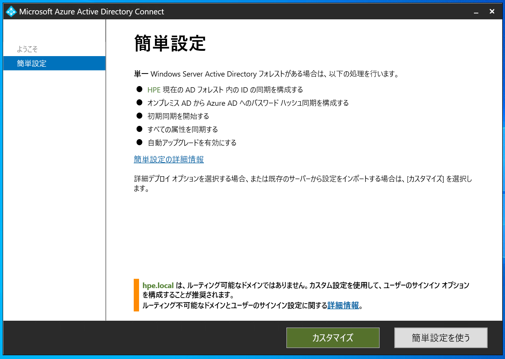

# Azure Virtual Desktop for Azure Stack HCIを使ってみる
マネージドVDIのAzure Virtual Desktopのユーザーリソース（セッションホスト）をAzure Stack HCIのクラスター環境を利用することが可能な、Azure Virtual Desktop for Azure Stack HCIについて、下記にその利用方法をまとめます。


## AVD for Azure Stack HCIとは
Azure Virtual Desktop（以下AVD）は、VDIの管理部分（ID管理やコネクションブローカーなど）および、ユーザーリソース分をクラウドのリソースを活用して利用するマネージドVDIのサービスです。<br>
クライアント端末（エンドユーザーデバイス）をつなぐ仮想環境（セッションホスト）はAzure IaaS VMを利用して実施するのが通常のAVDですが、<br>
このセッションホストとしてオンプレミスのVM環境（Azure Stack HCIクラスター上のVMリソース）を利用する方式がAVD for Azure Stack HCIのソリューションになります。


本投稿時点ではまだPreview中なのですが、セッションホストとしてオンプレVMを使用する利点（ガバナンス対策、パフォーマンス観点、運用コストの最適化）があげられます。


## AVD for Azure Stack HCIデプロイ前の前提条件
- Azureに登録済のAzure Stack HCIクラスタ
- Azure Active Directory（以下AAD）と同期されたオンプレミスのActive Directory
- オンプレミスネットワークからAzureへの安定した接続
- オンプレミスネットワークから「必要な URL の一覧」に記載されているすべての必須 URL へのアクセス

**※** 参照ドキュメントはこちら：<br>
[Azure Stack HCI用Azure Virtual Desktopを構成する](https://learn.microsoft.com/ja-jp/azure/virtual-desktop/azure-stack-hci?tabs=manual-setup)


## 事前準備 - Azure AD Connect
- Azure AD Connectを使用してAADとADを同期させる
- AADとADを同期させることで、AADがオンプレミスのADのユーザーを認証することができるようになる
- 制約として、.localドメインなどADDSが非ルーティングドメインのみを使用している場合同期できない
- 本環境は非ルーティングドメインを使用しているため、AADにカスタムドメインを追加し、オンプレミスのADのUPNサフィックスに上記で作成したカスタムドメインを入力<br>

本環境はhpe.localドメインで作成してしまっていたので、別途UPNサフィックスを用意して試していきます<br>


ドメイン参加済みのサーバーに、Azure AD Connectをダウンロードします。<br>
[ダウンロード先はこちら](https://www.microsoft.com/en-us/download/details.aspx?id=47594)
<br>

Azure AD Connect（AADとADの同期設定）を実施していきます<br>
<br>

今回は”簡単設定を使う”を選択<br>
<br>

グローバル管理者権限を所持するAzure ADのユーザー名とパスワード入力します。<br>


Azure ADのエンタープライズ管理者の権限を所持するユーザー名、パスワードを選択。


”一部のUPNサフィックスが確認済みドメインに一致しなくても続行する”をクリック、次へ


構成の確認をし、”インストール”


構成が完了すると、Azure AD Connectが開始されます。


Azure AD Connect は既定の設定により 30 分毎に自動で同期します。<br>
同期対象のユーザーはオンプレ AD のすべてのユーザーとすることも、特定のユーザーに絞ることも可能なので、<br>
同期するユーザーを調整する場合は、以下公開情報の “ドメインと OU のフィルター処理を変更する。” <br>
のリンクをご参照ください。<br>
**<公開情報>** [同期オプションをカスタマイズする](https://learn.microsoft.com/ja-jp/azure/active-directory/hybrid/how-to-connect-installation-wizard#customize-synchronization-options)

即時に同期したい場合には PowerShell コマンドによる手動実行も可能です。<br>
Azure AD Connect がインストールされているサーバーにて PowerShell を起動し以下のコマンドを実行します。<br>
```
Start-ADSyncSyncCycle -PolicyType Delta
```
**<公開情報>** [Azure AD Connect 同期: Scheduler](https://learn.microsoft.com/ja-jp/azure/active-directory/hybrid/how-to-connect-sync-feature-scheduler#start-the-scheduler)

Azure PortalでAzure AD Connectを確認すると同期が有効かされていることが確認できます。


同期が完了すると、AADにオンプレミスADのユーザーが表示されます。


## Tips：
**ユーザープリンシパル名が微妙に異なるユーザーが作成されてしまう問題**
もう一度AADにオンプレミスADのユーザーが同期された画面を見てみると、

表示名"hpe-user02"のユーザープリンシパル名が微妙に異なるもの2つのものが存在しています。

少々ややこしいのですが、Azure AD Connect にはソフトマッチと呼ばれる機能があり、<br>
オンプレ AD 側のユーザーの UPN や ProxyAddresses と Azure AD 側の UPN や ProxyAddresses が一致する場合にオンプレ AD 側のユーザーと Azure AD 側のユーザーが同一であると認識し、紐づけて同期します。<br>

**※**オンプレ AD 側の情報で、 Aziure AD 側のユーザーの情報を上書きし、この Azure AD のユーザーはオンプレミスから同期されたユーザーとなるみたいです。<br>
**<Microsoft社ブログ>** [ソフトマッチによる Azure AD (Office 365) 上のユーザーをオンプレミス Active Directory ユーザーと紐付ける方法](https://jpazureid.github.io/blog/azure-active-directory-connect/aboutSoftMatching/)

このソフトマッチが行われない場合、オンプレ AD のユーザーは Azure AD 側の新規のユーザーとして登録されますが、<br>
UPN や ProxyAddresses が一致していても、Azure AD 側のユーザーに Azure AD ロールが割り当てられている場合、例外としてソフトマッチを行い仕様となっているみたいです。<br>
**<公開情報>** [Azure AD Connect:既存のテナントがある場合 - 管理者ロールに関する考慮事項](https://learn.microsoft.com/ja-jp/azure/active-directory/hybrid/how-to-connect-install-existing-tenant#admin-role-considerations)

つまり今回試している環境でのオンプレ側のユーザー"hpe-user02" は、<br>
Azure AD 側のユーザー"hpe-user02"と UPN が一致しますが、Azure AD 側のユーザー ”hpe-user02” に Azure AD ロールが割り当てられているためにソフトマッチが行われませんでした。<br>
その結果オンプレ側のユーザー ”hpe-user02”は、既存のユーザーと UPN が重複しないよう、<br>
ランダムな値を付与した結果、"hpe-user021197@ykatayama0906gmail.onmicrosoft.com" として Azure AD へ同期されたといった事象となります。

解消するにはAzure AD側で"hpe-user021197@ykatayama0906gmail.onmicrosoft.com"を削除すれば、<br>
ユーザープリンシパル名が微妙に異なるユーザーは作成されないまま正常に同期していることが確認できました。

