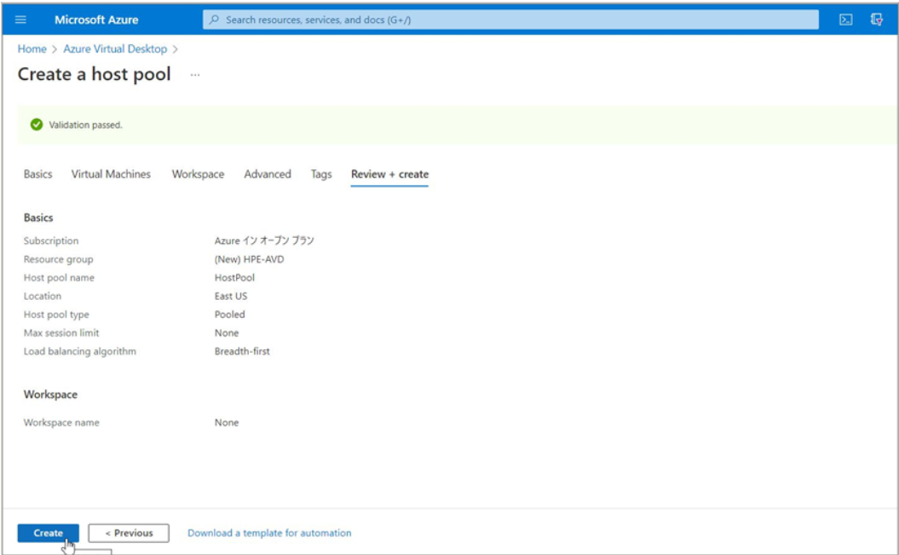
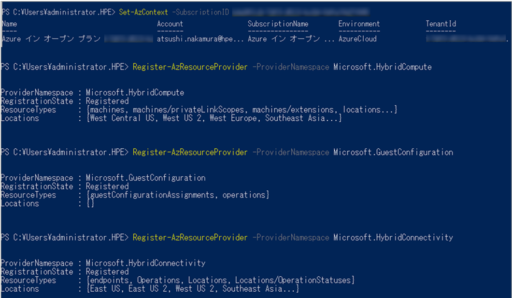
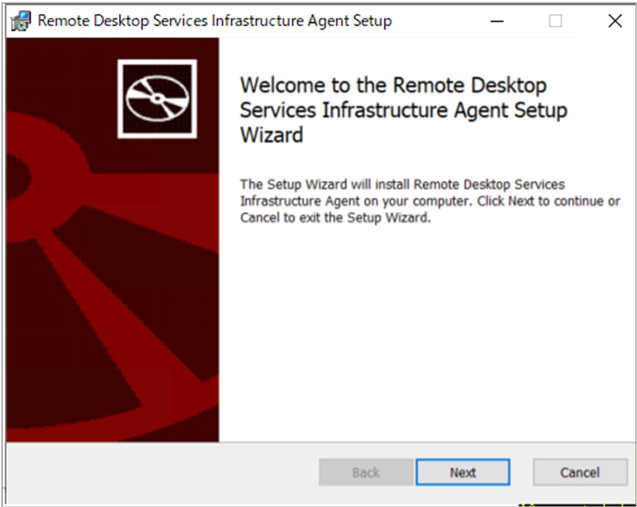

# Azure Virtual Desktop for Azure Stack HCIを使ってみる
マネージドVDIのAzure Virtual Desktopのユーザーリソース（セッションホスト）をAzure Stack HCIのクラスター環境を利用することが可能な、Azure Virtual Desktop for Azure Stack HCIについて、下記にその利用方法をまとめます。


事前準備が完了したところで、AVD for Azure Stack HCIの環境を作成していきます。<br>
デプロイ作業のおおまかな流れは、<br>
① ホストプールを作成<br>
② ワークスペースを作成<br>
③ セッションホストをAzure Stack HCI上に作成<br>
④ Connected Machine AgentをインストールしてセッションホストをAzureに接続<br>
⑤ ホストプールに仮想マシンを追加<br>
⑥ アプリグループの作成とユーザーアクセスの割り当て<br>
となります。

---------
**用語の整理**
- **アプリケーショングループ**
  - ホストプール内のデスクトップやアプリケーションを論理的にまとめたグループ
  - Desktop Application Group（デスクトップサービスを提供するグループ）とRemoteApp Application Group（提供するアプリケーションを定義したグループ）がある
- **ワークスペース**
  - ワークスペースは作成したアプリケーショングループと紐づけられるグループ
- **セッションホスト**
  - プール化されたAVD仮想マシン
- **ホストプール**
  - 1つまたは複数のセッションホストをまとめたもの
- **Connected Machine Agent**
  - サーバーをAzureに登録するために必要なコンポーネント
- **Azure Virtual Desktop Agent**
  - サービスと仮想マシンの接続を可能にするコンポーネント
---------

【参考】[Azure Stack HCI 用 Azure Virtual Desktop (プレビュー) をセットアップする](https://docs.microsoft.com/ja-jp/azure/virtual-desktop/azure-stack-hci)

## ① ホストプールを作成<br>
Azure Portalより、"Azure Virtual Desktop"を選択します。


"Create a host pool"より、新規ホストプールを作成します。


ホストプールの設定、Validation environment Yes/No（プレビュー機能を使用したい場合はYesに）



ホストプールとDAG(Desktop Application Group)が規定で作成されます。


## ② ワークスペースの作成<br>
AVD用のリソースグループに新規リソースを作成します。


Workspaceを検索し、Create。


Workspaceの情報を入力していきます。


“+Register application groups” でDAGをWorkspaceに登録します。


①で作成されたApplication group（HostPool-DAG）を選択します。


"Create"で進めれば、作成完了です。


## ③ セッションホストをAzure Stack HCI上に作成<br>
セッションホストとは、プール化されたAVD用の仮想マシンのことを指します。<br>
まず、あらかじめAzure Stack HCI上にWindows仮想マシンを用意します。<br>
ドメインに参加後、
サーバーマネージャー > "役割と機能の追加" で、”リモートデスクトップサービス”をインストールします。<br>


Remote Desktop Session Host ロールを選択します。


機能をインストールしたらセッションホストの下準備は完了です。


## ④ Connected Machine AgentをインストールしてセッションホストをAzureに接続<br>


続いてAVD for Azure Stack HCIでは、セッションホスト（プール化されたAVD仮想マシン）をハイブリッド管理させるために、Azure Arcに対応させる必要があります。<br>
そのため、下記3つのリソースプロバイダーをサブスクリプションに登録します。<br>
- ”Microsoft.HybridCompute”
- ”Microsoft.GuestConfiguration”
- ”Microsoft.HybridConnectivity”<br>

セッションホスト上でPowershellを起動し、登録していきます。<br>

まずAzureに所持しているサブスクリプションで接続し、
```
PS C:\Users\Administrator.HPE> Connect-AzAccount
Account                    SubscriptionName           TenantId                             Environment
-------                    ----------------           --------                             -----------
<YOUR NAME> Azure イン オープン プラン fa98495c-427d-4a8b-9cbd-xxxxxxxxxxxx AzureCloud
```

各リソースプロバイダーを登録していきます。
```
PS C:\Users\Administrator.HPE> Register-AzResourceProvider -ProviderNamespace Microsoft.HybridCompute
ProviderNamespace : Microsoft.HybridCompute
RegistrationState : Registered
ResourceTypes     : {machines, machines/privateLinkScopes, machines/extensions, locations...}
Locations         : {West Central US, West US 2, West Europe, Southeast Asia...}
```

```
PS C:\Users\Administrator.HPE> Register-AzResourceProvider -ProviderNamespace Microsoft.GuestConfiguration
ProviderNamespace : Microsoft.GuestConfiguration
RegistrationState : Registered
ResourceTypes     : {guestConfigurationAssignments, operations}
Locations         : {}
```

```
PS C:\Users\Administrator.HPE> Register-AzResourceProvider -ProviderNamespace Microsoft.HybridConnectivity
ProviderNamespace : Microsoft.HybridConnectivity
RegistrationState : Registered
ResourceTypes     : {endpoints, Operations, Locations, Locations/OperationStatuses}
Locations         : {East US, East US 2, West US 2, Southeast Asia...}
```
登録されているリソースプロバイダーは、<br>
Azure Portalの"ホーム" > "サブスクリプション" > "サブスクリプション名" > "リソース プロバイダー" で確認可能です。


Azure Arc対応サーバーの管理のために、次のAzure組み込みロールが該当ユーザーに割り当てられている必要があります。<br>
 - Azure Connected Machine Onboarding または 共同作成者ロール （マシンのオンボード）
 - Azure Connected Machine Resource Administrator （マシンの読み取り、変更、削除）


次に作成したセッションホストをAzure Arcに登録します。<br>
Azure Portalの"Azure Arc"からサーバーを追加します。<br>


"単一サーバーの追加" > "スクリプトを作成"


追加するサーバーのリソース情報を入力します。


tagを使用したサーバーインベントリの管理も可能ですので、カスタムタグを設定しておきます。


Connected Machine Agent インストール用のスクリプトを発行＆ダウンロードします。


ダウンロードしたスクリプトをセッションホスト仮想マシンに配置します。<br>
セッションホストでスクリプトを実行します。
```
PS C:\Users\Administrator.HPE> ls
    ディレクトリ: C:\Users\Administrator.HPE
Mode                 LastWriteTime         Length Name
----                 -------------         ------ ----
d-----        2023/02/02     16:33                .Azure
d-r---        2023/02/02     15:52                3D Objects
d-r---        2023/02/02     15:52                Contacts
d-r---        2023/02/02     16:50                Desktop
d-r---        2023/02/02     16:13                Documents
d-r---        2023/02/02     15:52                Downloads
d-r---        2023/02/02     15:52                Favorites
d-r---        2023/02/02     15:52                Links
d-r---        2023/02/02     15:52                Music
d-r---        2023/02/02     15:52                Pictures
d-r---        2023/02/02     15:52                Saved Games
d-r---        2023/02/02     15:52                Searches
d-r---        2023/02/02     15:52                Videos
-a----        2023/02/02     16:45           1637 OnboardingScript.ps1
```
```
PS C:\Users\Administrator.HPE> .\OnboardingScript.ps1
詳細: Installing Azure Connected Machine Agent
詳細:
詳細: .NET Framework version: 4.8.4161
詳細: Downloading agent package from https://aka.ms/AzureConnectedMachineAgent to C:\Users\ADMINI~1.HPE\AppData\Local\Temp\AzureConnectedMachineAgent.msi
詳細: Installing agent package
Installation of azcmagent completed successfully
INFO    マシンを Azure に接続しています... これには数分かかる場合があります。
INFO    認証するには、ポップアップ ブラウザーを使用してログインしてください。
  20% [==>            ]
  30% [===>           ]
  INFO    Azure でリソースを作成しています...                        Correlation ID=914283e4-b8ca-41cd-8705-6f193afc81ff Resource ID=/subscriptions/b4a861c9-74f3-4513-bc84-0dfa18d71695/resourceGroups/HPE-AVD/providers/Microsoft.HybridCompute/machines/SessionHost02
  60% [========>      ]
  80% [===========>   ]
 100% [===============]
  INFO    Azure にマシンを接続しました
INFO    マシンの概要ページ: https://portal.azure.com/#@fa98495c-427d-4a8b-9cbd-d5f6917810c1/resource/subscriptions/b4a861c9-74f3-4513-bc84-xxxxxxxxxxxx/resourceGroups/HPE-AVD/providers/Microsoft.HybridCompute/machines/SessionHost02/overview
```
Azure Arcサーバーの一覧に表示されたら無事セッションホストのAzureへの接続は完了です。


## ⑤ ホストプールに仮想マシンを追加<br>
"Azure Virtual Desktop" > "Host pools" > "HostPool名" > "登録キー" > "Generate new key" でセッションホストをホストプールに追加するためのトークンを発行します。


次に、「Azure Virtual Desktop ホスト プールに仮想マシンを登録する」の”Azure Virtual Desktop エージェントをダウンロードします”から、AVDエージェントをセッションホスト仮想マシンにダウンロードします。

※[Azure Virtual Desktopホストプールに仮想マシンを登録する](https://learn.microsoft.com/ja-jp/azure/virtual-desktop/create-host-pools-powershell?tabs=azure-powershell)
<br>

<br>

インストーラーを起動し、EULAに同意<br>
<br>

キーが求められるので、”Enter Registration token”に発行したトークンを入力します。<br>
<br>

Powershellで"Get-AzWvdHostPoolRegistrationToken"を入力することで発行したトークンの表示も可能です。<br>
<br>

Installを実施<br>
<br>

<br>

次に、「Azure Virtual Desktop ホスト プールに仮想マシンを登録する」の<br>
”Azure Virtual Desktop エージェント ブートローダーをダウンロードします”より、<br>
AVDエージェント ブートローダーをセッションホスト仮想マシンにダウンロードします。
<br>

<br>
AVDエージェントブートローダーを起動し、EULAに同意します。<br>
<br>

<br>

AVD エージェント ブートローダーはインストール時のトークンの入力が不要です。<br>
<br>

Azure Portalで確認すると、SessionHost02.hpe.localが"使用可能"な状態になっていることがわかります。
<br>
ここまでで準備は完了となります。
