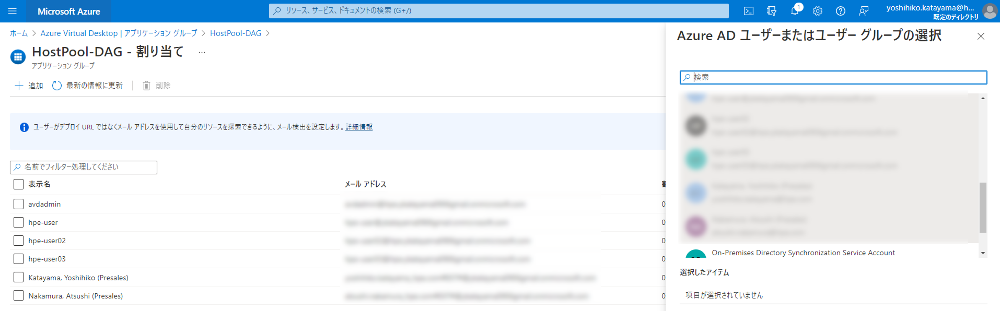
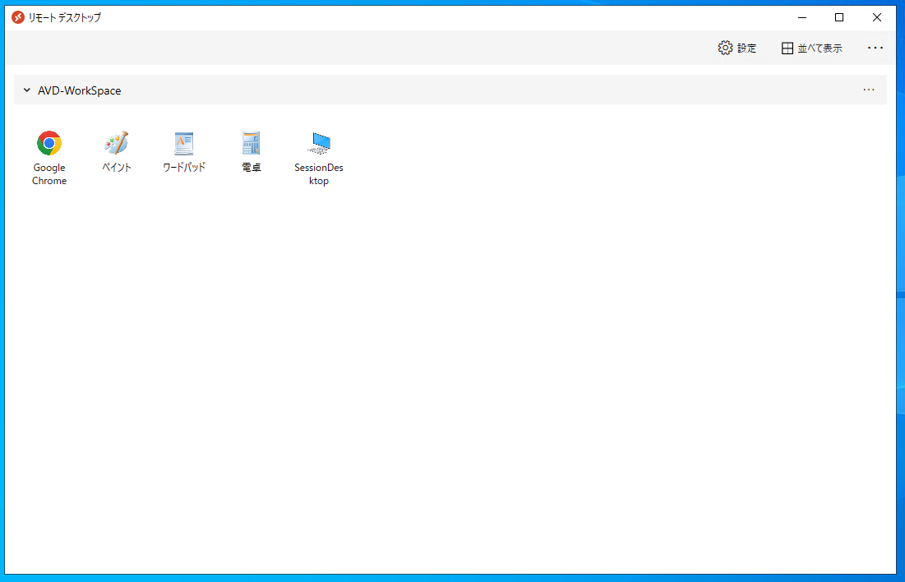
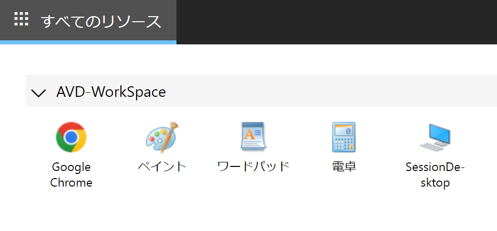
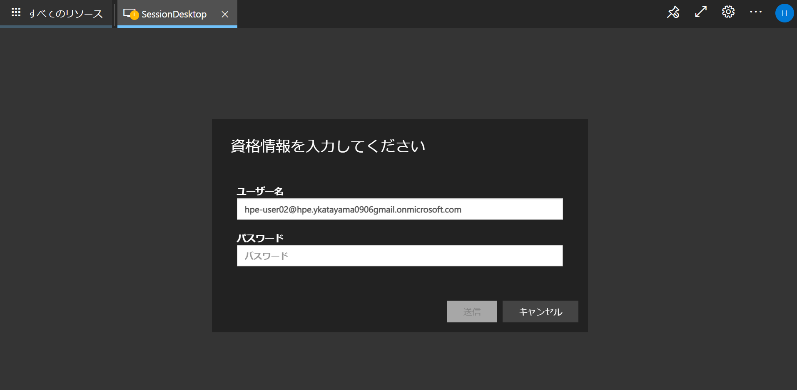
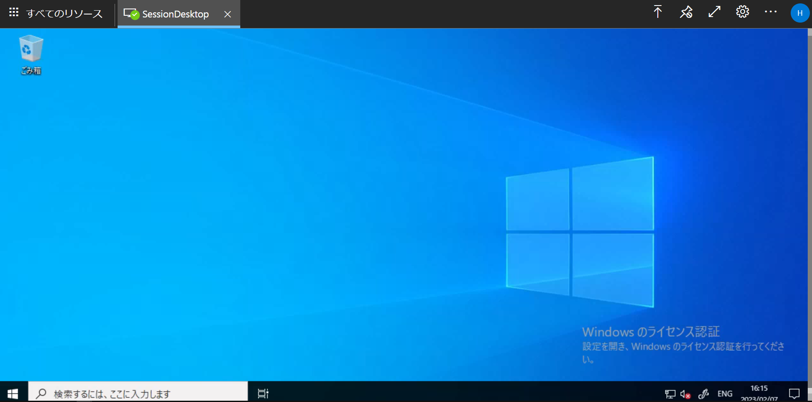
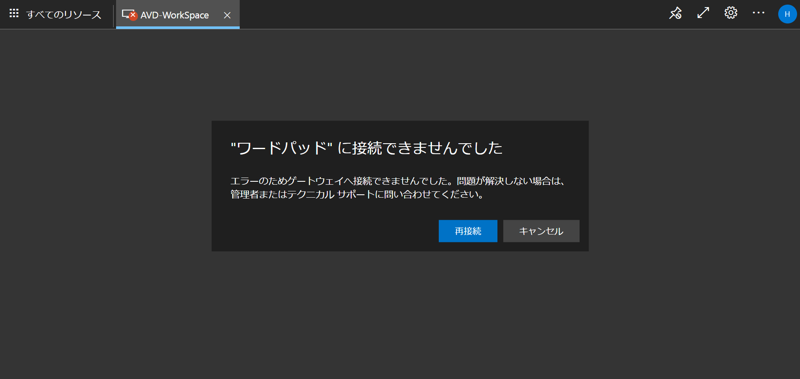

# Azure Virtual Desktop for Azure Stack HCIを使ってみる
マネージドVDIのAzure Virtual Desktopのユーザーリソース（セッションホスト）をAzure Stack HCIのクラスター環境を利用することが可能な、Azure Virtual Desktop for Azure Stack HCIについて、下記にその利用方法をまとめます。


AVD for Azure Stack HCIの環境デプロイ作業のおおまかな流れは、<br>
① ホストプールを作成<br>
② ワークスペースを作成<br>
③ セッションホストをAzure Stack HCI上に作成<br>
④ Connected Machine AgentをインストールしてセッションホストをAzureに接続<br>
⑤ ホストプールに仮想マシンを追加<br>
⑥ アプリグループの作成とユーザーアクセスの割り当て<br>
となります。

---------
**用語の整理**
- **アプリケーショングループ**
  - ホストプール内のデスクトップやアプリケーションを論理的にまとめたグループ
  - Desktop Application Group（デスクトップサービスを提供するグループ）とRemoteApp Application Group（提供するアプリケーションを定義したグループ）がある
- **ワークスペース**
  - ワークスペースは作成したアプリケーショングループと紐づけられるグループ
- **セッションホスト**
  - プール化されたAVD仮想マシン
- **ホストプール**
  - 1つまたは複数のセッションホストをまとめたもの
- **Connected Machine Agent**
  - サーバーをAzureに登録するために必要なコンポーネント
- **Azure Virtual Desktop Agent**
  - サービスと仮想マシンの接続を可能にするコンポーネント
---------

【参考】[Azure Stack HCI 用 Azure Virtual Desktop (プレビュー) をセットアップする](https://docs.microsoft.com/ja-jp/azure/virtual-desktop/azure-stack-hci)

## ⑥ アプリグループの作成とユーザーアクセスの割り当て<br>
テスト用アプリケーショングループを作成し、ユーザーアクセスを割り当てていきます。

アプリケーションの配信を行う場合はRemoteApp アプリケーショングループを作成します。<br>
"Azure Portal" > "Azure Virtual Desktop|アプリケーショングループ" > "DAG名" > "追加
" でデスクトップを利用可能なユーザー/ユーザーグループを選択し、追加します。



デスクトップへのアクセス手法は2パターンあり、
1. Windows デスクトップ クライアントを使用してアクセス
 - クライアントダウンロードは[こちら](https://go.microsoft.com/fwlink/?linkid=2068602)
2. Web クライアント（Webブラウザから）アクセス
 - Web クライアントのURLは[こちら](https://client.wvd.microsoft.com/arm/webclient/index.html)<br>

1.のデスクトップクライアントアクセスだと下記のようなUI


2.のWebクライアントだと下記のようなUIとなります。


Webクライアントで試していくと、"SessionDesktop"を選択し、<br>
AADおよびAD双方の認証が可能なユーザーでアクセスします。<br>


無事接続できました。


AVDでは、AADでアカウントを確認して、その後オンプレのADでアカウントを確認する仕組みため、
AADで登録されていないユーザーでアクセスを試みるとそもそも最初のクライアントアクセスができない状況になり、<br>
AADでは登録されているけど、ADでは同期されておらず登録されていないようなユーザーでアクセスすると、<br>

クライアントアクセス後の各リソース（アプリケーションだったり、リモートデスクトップだったり）にアクセスができないという事象となります。

### Tips:
セッションホストにつながらないなどのネットワーク問題の切り分けの際には下記のような接続テストツールも用意されているので有効です。<br>
セッションホスト上からアクセス必須のURLへの接続テストを実施することが可能です。<br>
URL チェック ツールは[こちら](https://learn.microsoft.com/ja-jp/azure/virtual-desktop/required-url-check-tool?source=recommendations)。

ツールをインストール後、セッションホストのコマンドプロンプトから、
```
C:\Users\Administrator.HPE>cd "C:\Program Files\Microsoft RDInfra\RDAgent_1.0.5739.9800"
```
```
C:\Program Files\Microsoft RDInfra\RDAgent_1.0.5739.9800>WVDAgentUrlTool.exe
==============================================================
Azure Virtual Desktop Agent URL Tool
Copyright (c) 2022 Microsoft Corporation. All rights reserved.
Version 1.0.5739.9800
==============================================================

Connecting to Azure Virtual Desktop Agent (Attempt: #1)
UrlsAccessibleCheck :  Outcome: HealthCheckSucceeded
Additional Contextual Information:<empty>

Accessible URLs:
======================================================
fbc91b00-e6a4-4b2c-a7d8-68c7a740fe9f.rdbroker-g-us-r0.wvd.microsoft.com
fbc91b00-e6a4-4b2c-a7d8-68c7a740fe9f.rdbroker.wvd.microsoft.com
fbc91b00-e6a4-4b2c-a7d8-68c7a740fe9f.rddiagnostics-g-us-r0.wvd.microsoft.com
rdgateway-host-green-c100-jpe-r0.wvd.microsoft.com
mrsglobalsteus2prod.blob.core.windows.net
gcs.prod.monitoring.core.windows.net
production.diagnostics.monitoring.core.windows.net
eastus2-shared.prod.warm.ingest.monitor.core.windows.net
qos.prod.warm.ingest.monitor.core.windows.net

NOT Accessible URLs:
======================================================
<empty>

Acquired on:2023/02/03 4:32:13 UTC

C:\Program Files\Microsoft RDInfra\RDAgent_1.0.5739.9800>
```
上記例では、"Not Accesible URLs" が "Empty"のため、問題なさそうとネットワークアクセスに関しては問題なさそうと判断できます。
