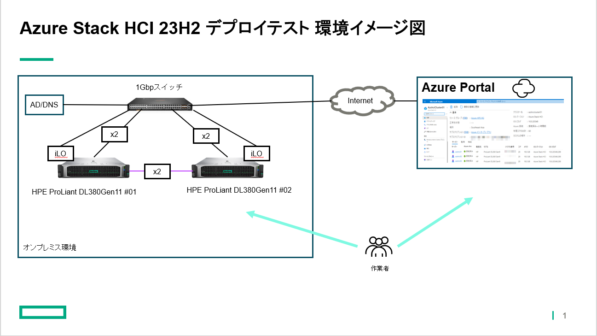

# Azure Stack HCI 23H2 構築

## 目次
### Azure Stack HCI (Azure Stack HCI OS 23H2 - )
- [環境説明：デプロイを実施する環境についての説明](../installation00)  

デプロイを実施する環境のイメージ図は以下になります。

HPE Proliant DL380Gen11サーバを2台使用します。各サーバへ計4本のLANケーブルを接続しています。
各サーバからスイッチへつながる2本のLANケーブルは管理兼コンピュート用として使用します。直結でサーバ間を接続している2本の結線はストレージ用のネットワークとして使用します。NICへの接続の他にサーバの管理モジュールであるiLOへも接続できるようにしています。

サーバ1台当たりに搭載しているディスクはHDD x4本,SSDx4本となります。
HDD x4本についてはRAIDを構成しているためOSからは1ボリュームとして認識されています。

その他AD/DNSも必要なためWindows2022が稼働する仮想マシンを用意しています。

構築手順は以下URLを参考にしています。
https://learn.microsoft.com/ja-jp/azure-stack/hci/deploy/deployment-introduction
※　2024/04時点での上記URLの内容でセットアップを実施しています。アップデートにより手順変更が起こる可能性もありますので必ずこちらのURLの内容を確認しながら進めてください。

Azure Stack HCI 23H2からのデプロイに関しての大きな変更はWindows Admin Center(WAC)を使用せずAzure Portalを使用してデプロイを実施する点です。
デプロイの大まかな流れとしましては、オンプレミス環境で各種設定を実施してAzure Portalからサーバを認識できるようにします。その後Azure Portalからデプロイ作業を実施します。
