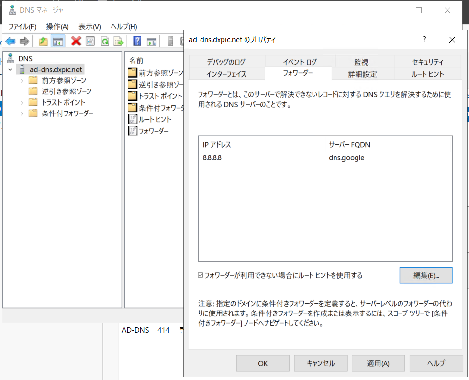
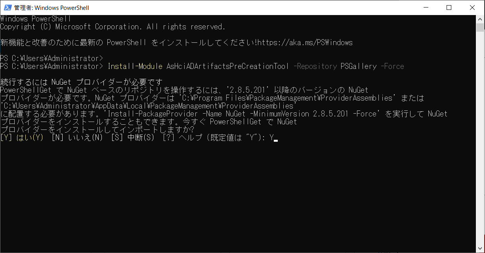
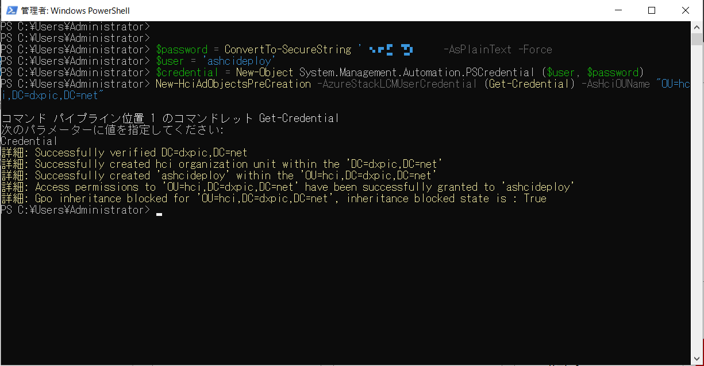
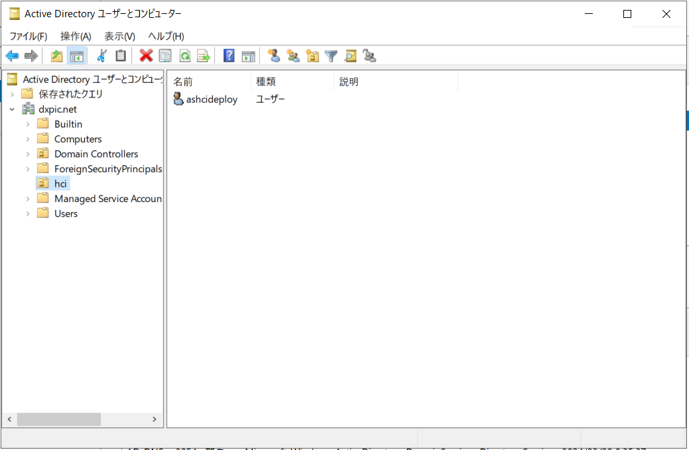

# Azure Stack HCI 23H2 構築


## 目次
### Azure Stack HCI (Azure Stack HCI OS 23H2 - )
- [Azure Stack HCIデプロイメント①：Active Directory を準備する](../installation01)

AD/DNS自体の構築手順は割愛します。DNS構築後、今回の環境ではインターネットを使用できるようにするため以下のように8.8.8.8へフォワードする設定を入れています。



AD/DNSサーバへログイン後、PowerShellを開きます。
その後、以下コマンドを実行して専用のOUを作成します。
```
Install-Module AsHciADArtifactsPreCreationTool -Repository PSGallery -Force
```



続いてデプロイ用ユーザーとパスワードを指定します。今回は例としてashcideployというユーザー名を使用しています。
※ユーザー名とパスワードには以下制限がありますのでご注意ください。
https://learn.microsoft.com/ja-jp/azure-stack/hci/deploy/deployment-prep-active-directory
`（上記URLより抜粋）ユーザー名のみが指定されていることを確認します。 この名前には、ドメイン名を含めてはなりません。たとえば、 contoso\username 
ユーザー名は 1 ~ 64 文字にする必要があり、文字、数字、ハイフン、アンダースコアのみを含む必要があり、ハイフンまたは数字で始まる場合はありません。
パスワードが複雑さと長さの要件を満たしていることを確認します。 12 文字以上で、小文字、大文字、数字、特殊文字を含むパスワードを使用します。`

```
$password = ConvertTo-SecureString '<password>' -AsPlainText -Force
$user = 'ashcideploy'
$credential = New-Object System.Management.Automation.PSCredential ($user, $password)
```
先ほど入力したユーザーとパスワードの情報を使用してAzure Stack HCI専用のOUを作成します。
今回は例としてhciというOU名とdxpic.netというドメイン名を使用しています。
PowerShell実行後に別でユーザー名、パスワードの入力が求められるのでコマンドと同じものを入力します。
```
New-HciAdObjectsPreCreation -AzureStackLCMUserCredential (Get-Credential) -AsHciOUName "OU=hci,DC=dxpic,DC=net"
```


ユーザー名、パスワード入力後の画面


コマンド実行後ADにOUとユーザーが作成されているかを確認します。

