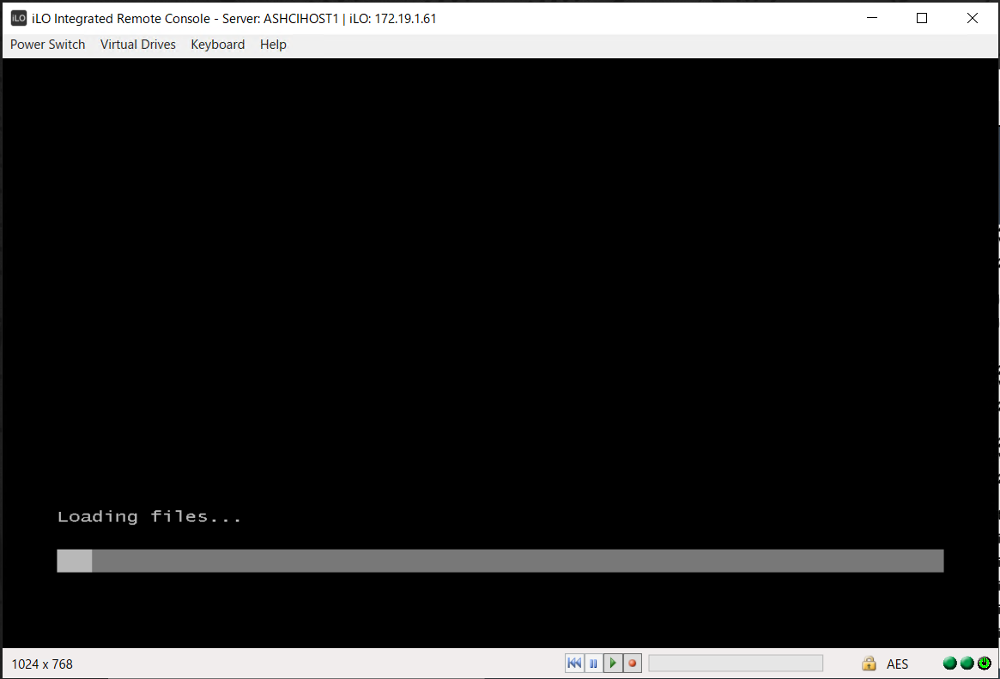

# Azure Stack HCI 23H2

## 目次
### Azure Stack HCI (Azure Stack HCI OS 23H2 - )
- [Azure Stack HCIデプロイメント②：Azure Stack HCI OS をインストールする](installation02)  

#### インストール前の事前準備
インストール前にAzure Stack HCI バージョン 23H2 のデプロイの前提条件を以下URLで確認します。
https://learn.microsoft.com/ja-jp/azure-stack/hci/deploy/deployment-prerequisites

今回の環境ではシステム要件の「セキュアブート」を有効化する必要がありました。
https://learn.microsoft.com/ja-jp/azure-stack/hci/concepts/system-requirements-23h2

##### セキュアブートの有効化
作業は踏み台のWindows OSから実施します。この踏み台に「HPE iLO スタンドアロンリモートコンソール」をインストールして、このツールを利用してサーバの操作をしていきます。

※以下の作業はAzure Stack HCI全てのノード(今回ですと2つのサーバの両方)で実施してください。

ツールで対象のiLOへ接続後、サーバの電源をONにします。しばらくすると以下画面が表示されるのでF9キーを押します。

しばらくすると以下画面が表示されるので「System Configuration」を選択します。

続いて「BIOS/Platform Configuration (RBSU)」を選択します。

「Server Security」を選択します。

「Server Boot Settings」を選択します。

「Attempt Secure Boot」のプルダウンをDisabled→Enabledへ変更します。
その後画面右下「F12: Save and Exit」を選択すると設定を有効化するためサーバが再起動します。

Azure Stack HCIのノード全てでこの作業を実施します。

#### Azure Stack HCI OSのインストール
※以下の作業はAzure Stack HCI全てのノード(今回ですと2つのサーバの両方)で実施してください。
※今回の手順には記載していませんが必要に応じてAzure Stack HCI OSのインストール先となるボリュームのRAID設定を実施します。今回の環境ですとHDD x3本を使用してRAID5を構成してHDD x1本をスペアディスクとして設定しています。

ツールを使用してiLOへ接続します。
「Virtual Drives」を選択後、「Image File CD-ROM/DVD」にチェックを入れます。

Azure Stack HCI OSのISOイメージを選択して「開く」を押します。
※Azure Stack HCI OSはAzure PortalのAzure Stack HCIのメニューからダウンロードしています。詳しくはこちらをご参照ください。
https://learn.microsoft.com/ja-jp/azure-stack/hci/deploy/download-azure-stack-hci-23h2-software

サーバを起動させて「F11」を選択します。

ブートメニューの選択画面になるので、「iLO Virtual USB 3: iLO Virtual CD_ROM」を押します。

ISOメディアからの起動が開始されるので何かしらのキーボードのキーを押します。

ISOメディアのデータの読み込みが開始されます。

Azure Stack HCI OSのインストール画面が表示されるので適宜メニューを選択して「Next」を押します。(今回は英語を言語として選択しています。)

画面真ん中「Install now」を選択します。

以下画面が表示されるので少し待ちます。

チェックを入れて「Next」を選択します。

「Custom: Install the newer version of Azure Stack HCI only (advanced)」を選択します。

OSをインストールする対象のDiskを選択して「Next」を押します。今回はHDD を使用したRAIDボリュームを選択します。他に見えているディスクはSSD x4本になります。

インストールが開始されてます。インストール完了後に自動でサーバが再起動されます。

Azure Stack HCIのノード全てでこの作業を実施します。
