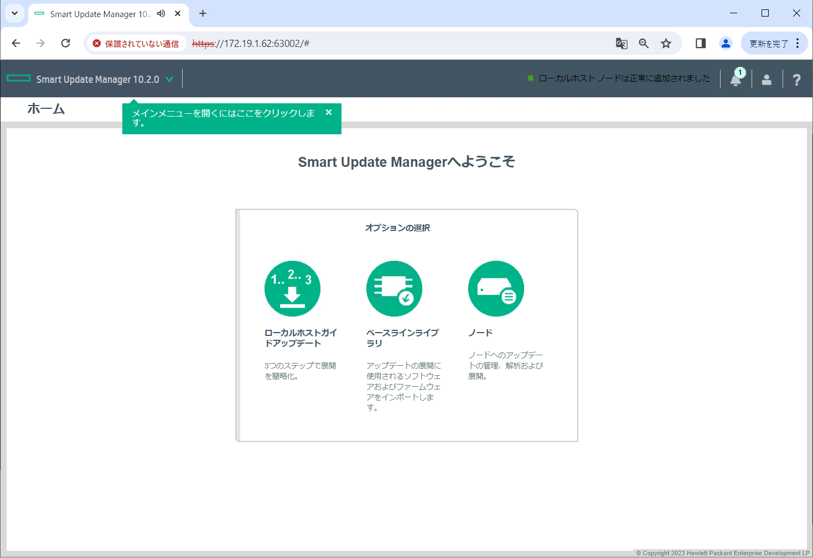

# Azure Stack HCI 23H2


## 目次
### Azure Stack HCI (Azure Stack HCI OS 23H2 - )
- [Azure Stack HCIデプロイメント③：Azure Stack HCI OS を設定する](../installation03)  


#### Azure Stack HCI OSへの設定
※以下の作業はAzure Stack HCI全てのノード(今回ですと2つのサーバの両方)で実施してください。設定内容は適宜各ノードに合わせたパラメータを入力してください。

OSインストール直後の画面は以下になります。引き続きiLOへツールを使用してアクセスします。


画面上部「Keyboard」を選択後、「CTRL-ALT-DEL」を押します。


パスワード変更を求めるメッセージが表示されますのでOKを選択してEnterキーを押します。


パスワードを設定します。
`注意：パスワードには以下要件があります。しかしながらこの時点では要件を満たさないパスワードをAzure Stack HCI OSへ設定できてしまいますのでご注意ください。もし要件を満たさないパスワードを設定した場合は後に実行される事前チェックでエラーとなります。`


https://learn.microsoft.com/ja-jp/azure-stack/hci/deploy/deployment-install-os


Azure Stack HCI OSではおなじみのメニューが表示されました。
まずはOSにIPを設定します。PowerShellで設定するので 15 を入力してEnterキーを押します。


Get-NetAdapterコマンドでIPを設定するポートとifIndexを確認。
その情報を使用してNew-NetIPAddressコマンドでIPを設定します。


設定後、exitコマンドを実行してメインメニューに戻ります。DNSのIPはこちらのメニュー画面から設定を実施したいと思います。8 を入力してEnterキーを押します。


先ほどIPを設定したポートを選択するため、6 を入力してEnterキーを押します。


DNSを設定するため、2 を入力してEnterキーを押します。


DNSのIPを入力してEnterキーを数度押し設定を反映させます。


リモートデスクトップを有効化するため、7 を入力してEnterキーを押します。


2 を入力後、数回Enterキーを押します。


再度PowerShellを使って設定をするため、15 を入力してEnterキーを押します。


NTPを設定します。
```
w32tm /config /manualpeerlist:"<NTP Server>" /syncfromflags:manual /update
```
ホスト名を変更します。
```
Rename-Computer -NewName "<hostname>" -Force
```

ファイヤーウォールをOFFにします。
理由はこの後SPP(Service Pack for ProLiant)というドライバやファームウェア群を適用していくのですが、その際Smart Update Manager (SUM) というツールを使って適用します。そのSUMに対してhttpsでアクセスするのですが、このhttpsアクセスをファイヤーウォールでブロックされないようにするためです。本番環境ではない点と一時的にOFFにするだけですのでファイヤーウォール全てをOFFにしています。
```
Set-NetFirewallProfile -Profile Domain,Public,Private -Enabled False
```


SPPを適用していきます。まずはSPPのメディアをiLOに仮想メディアとしてマウントします。


SPPがマウントされたディレクトリへ移動して以下スクリプトを実行します。
```
.\smartupdate
```

しばらくするとSUMが立ち上がります。


起動後、踏み台などのAzure Stack HCIに設定したIPへ到達できる端末上でブラウザを立ち上げます。ブラウザには以下のように63002ポートを使用して対象のIPへアクセスするようURLを入力します。SUMへのログインの際はAzure Stack HCI OSへ設定したAdministerユーザのログイン情報を使用します。
```
https://<Azure Stack HCI OSのIP>:63002
```


SUMへログイン後以下画面が表示されるので、「ローカルホストアップデート」を選択します。


デフォルト設定のまま画面下へ移動して「OK」を選択します。


ベースラインやインベントリの設定が実行されるので待ちます。


しばらくすると「次へ」ボタンを選択できるようになるので押します。


適用されるドライバやファームウェアが表示されます。


画面下へ移動してTPMに関する警告が出た場合はチェックを入れます。その後「展開」ボタンを押すとドライバやファームウェアのインストールが開始されます。


適用が完了すると以下画面のような画面が表示されるので画面下へ移動します。


「再起動」ボタンを選択してサーバを再起動させます。


サーバの再起動を以下の画面が表示されたら、マウントしていたSPPのメディアをアンマウントします。チェックを外せばアンマウントされます。
<span style="color:red;">注意：必ずアンマウントをしてください。忘れるとデプロイ時に仮想メディアを不明なディスクとして認識して後々エラーになる可能性があります。</span>


OFFにしていたファイヤーウォールをONに戻します。
```
Set-NetFirewallProfile -Profile Domain,Public,Private -Enabled True
```


Hyper-Vロールをインストールします。
```
Enable-WindowsOptionalFeature -Online -FeatureName Microsoft-Hyper-V -All
```


インストール後、OS再起動させる旨の確認が入るのでYを選択してサーバを再起動させます。

