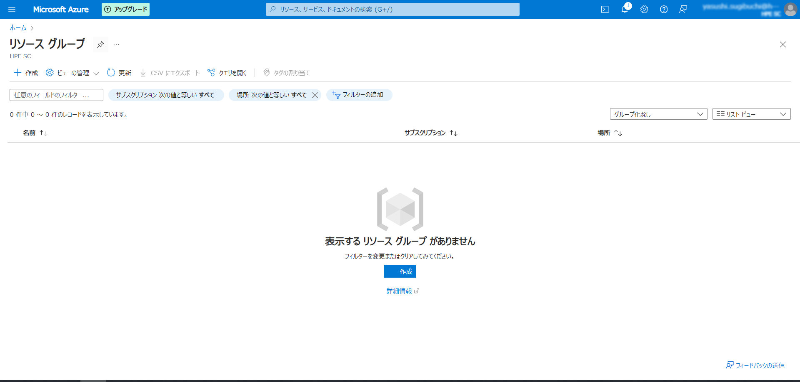
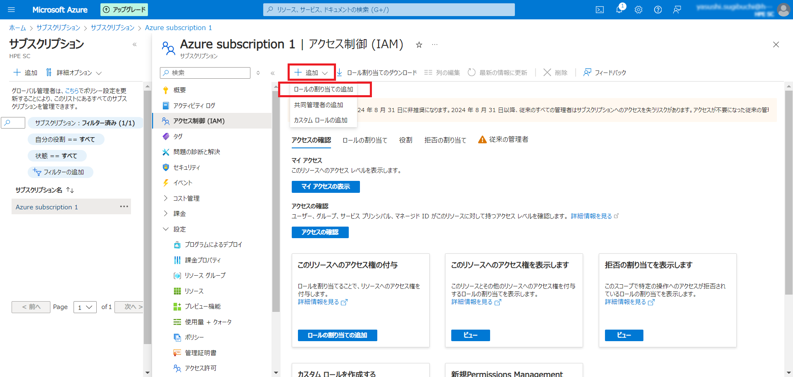

# Azure Stack HCI 23H2


## 目次
### Azure Stack HCI (Azure Stack HCI OS 23H2 - )
- [Azure Stack HCIデプロイメント④：Azure Arc にサーバーを登録する](installation04)  


#### Azure Portal 上での準備作業
Azure ArcリソースとしてAzure Stack HCI OSを登録するための準備をAzure Portal上で実施していきます。

##### リソースグループの作成
Azure Portalへアクセスします。
リソースグループを作成するため「リソースグループ」サービスのメニューへ移動します。その後「+作成」ボタンを選択します。


必要に応じて使用するサブスクリプションを選択します。併せて希望するリソースグループ名を入力します。その後リージョンを選択しますが注意点としましてAzure Stack HCI 23H2をデプロイできるリージョンには制限があります。以下URLよりサポートされるリージョンをご確認の上選択をしてください。
https://learn.microsoft.com/ja-jp/azure-stack/hci/concepts/system-requirements-23h2
必要事項を入力後、「次：タグ >」を選択します。


今回はタグは使用しないので「次：確認および作成 >」を選択します。


入力項目の確認が実施され問題なければ「 作成 」を選択できるようになりますのでクリックします。


リソースグループが作成されました。


##### リソースグループへの権限付与
次に必要な権限の付与を実施していきますが、作業実施前に必ず最新のマニュアルを参考にして付与が必要な権限を確認してください。
https://learn.microsoft.com/ja-jp/azure-stack/hci/deploy/deployment-arc-register-server-permissions?tabs=powershell#assign-required-permissions-for-deployment

リソースグループに対して権限付与を実行します。以下6つのロールを付与する必要ありますが今回は「Azure Connected Machine のオンボード」のみを例として手順を記載します。
```
Azure Connected Machine のオンボード
Azure Connected Machine のリソース管理者
Key Vault データ アクセス管理者
Key Vault シークレット責任者
Key Vault共同作成者
ストレージ アカウント共同作成者
```

先ほど作成したリソースグループのメニューへ移動します。その後「 アクセス制御 (IAM) 」を左ペインから選択します。続いて表示される画面で「 + 追加 」ボタンを選択すると「ロールの割り当ての追加」の項目が表示されるのでクリックします。


虫眼鏡アイコンが表示されている検索窓から該当するロール名を入力して検索をします。
※目的のロールが検索にヒットしない際はブラウザの言語を英語にして英語表記のロール名で検索するとヒットすることがあります。ロール名の英語表記は以下のURLのようにマニュアルの言語を英語にすることで可能です。
https://learn.microsoft.com/en-us/azure-stack/hci/deploy/deployment-arc-register-server-permissions?tabs=powershell#assign-required-permissions-for-deployment


ロールを割り当てるユーザーを検索して割り当てを実施します。


##### サブスクリプションへの権限付与
次はサブスクリプション対して権限付与を実行します。以下2つのロールを付与する必要ありますが今回は「Azure Stack HCI 管理者」のみを例として手順を記載します。
```
Azure Stack HCI 管理者
Reader
```

「サブスクリプション」サービスのメニューへ移動して使用するサブスクリプションを選択します。その後「 アクセス制御 (IAM) 」を左ペインから選択します。続いて表示される画面で「 + 追加 」ボタンを選択すると「ロールの割り当ての追加」の項目が表示されるのでクリックします。


今回は英語でロールを検索してみます。


先ほどと同様にロールを割り当てるユーザーを検索して割り当てを実施します。


##### リソースプロバイダーの登録

必要なリソースプロバイダーの登録をしていきます。以下6つプロバイダーを登録する必要ありますが今回は「Microsoft.HybridCompute」のみを例として手順を記載します。

```
Microsoft.HybridCompute
Microsoft.GuestConfiguration
Microsoft.HybridConnectivity
Microsoft.AzureStackHCI
Microsoft.Storage
Microsoft.Insights
```

使用するサブスクリプションのメニューへ移動して左ペインから「リソースプロバイダー」を選択します。


画面右上の虫眼鏡アイコンが表示されている検索窓に目的のリソースプロバイダー名を入力します。目的のリソースプロバイダー名を選択した状態で「登録」ボタンをクリックします。


しばらくすると登録が完了します。


#### Azure Arcへサーバを登録する
##### 登録のためのスクリプト実行
※以下の作業はAzure Stack HCI全てのノード(今回ですと2つのサーバの両方)で実施してください。

Azure Stack HCI OSへリモートデスクトップ接続をします。その後PowerShellを開きます。

初めにPSGalleryレポジトリの登録を実行します。
※本環境では既にレポジトリが存在するとの表示がされました
```
Register-PSRepository -Default -InstallationPolicy Trusted
```


続いてAzure Arcの登録に必要なモジュールのインストールを実施します。
```
Install-Module AzsHCI.ARCinstaller
Install-Module Az.Accounts -Force
Install-Module Az.ConnectedMachine -Force
Install-Module Az.Resources -Force
```


登録に使用するAzureの情報を入力します。
```
$Subscription = "(サブスクリプションID)"
$RG = "(リソースグループ名)"
$Tenant = "(テナントID)"
$Region = "(リージョン)"
```


サブスクリプションIDとテナントIDは以下Azure Portalの画面の赤枠内に記載されています。
「サブスクリプション」メニューから使用しているサブスクリプションを選択、左ペインの概要からサブスクリプションIDを表示。

「Microsoft Entra ID」メニューを選択後、左ペインの概要からテナントIDを表示。


Azureアカウントへ接続します。
```
Connect-AzAccount -SubscriptionId $Subscription -TenantId $Tenant -DeviceCode
```

コマンド実行後、コードが表示されるのでメモやコピーをしておきます。併せてブラウザで　<https://microsoft.com/devicelogin>　へアクセスします。


アクセス後、コードの入力が求められるので先ほどのコードを入力します。


環境によって多要素認証を求められる場合がありますが、無事認証が完了すると以下のような画面が表示されます。


続いてAzureアカウントのTokenとアカウントID情報を取得します。
```
$ARMtoken = (Get-AzAccessToken).Token
$id = (Get-AzContext).Account.Id
```


取得した各種情報を使用してAzure Arcへの登録を実施します。
```
Invoke-AzStackHciArcInitialization -SubscriptionID $Subscription -ResourceGroup $RG -TenantID $Tenant -Region $Region -Cloud "AzureCloud" -ArmAccessToken $ARMtoken -AccountID $id
```


この処理には時間がかかるので完了するまで待ちます。


##### Azure Portalからの確認
コマンド完了後、Azure Portalへアクセスします。
「Azure Arc」サービスへ移動して、左ペインから「Azure Arcリソース」のプルダウンを展開、その後「マシン」を選択します。
登録したサーバの1つを選択します。


選択後左ペインの「設定」のプルダウンを展開して「拡張機能」を選択します。状態の項目が全て成功になるまで待ちます。


他のサーバも問題なくAzure Arcへ登録されて拡張機能の状態が成功になっていることを確認します。
もし拡張機能の状態が失敗になった場合、こちらが正式な手順が不明確ですが私の環境では失敗になったサーバのみAzure Arcのサーバの登録を削除して再登録（以下コマンドの再実行）を実施して回避していました。
```
Invoke-AzStackHciArcInitialization -SubscriptionID $Subscription -ResourceGroup $RG -TenantID $Tenant -Region $Region -Cloud "AzureCloud" -ArmAccessToken $ARMtoken -AccountID $id
```

Azure Stack HCI用ノード全てをAzure Arcへ登録することを忘れないでください。
