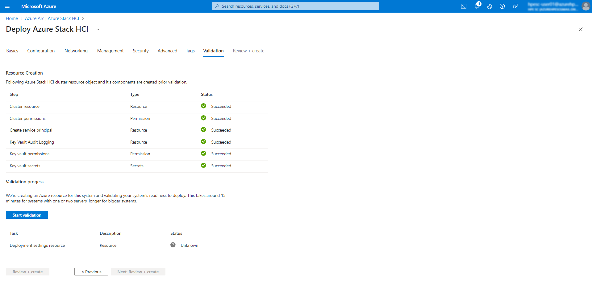

# Azure Stack HCI 23H2

## 目次
### Azure Stack HCI (Azure Stack HCI OS 23H2 - )
- [Azure Stack HCIデプロイメント⑤：Azure portal経由でデプロイする](../installation05)  

#### Azure Portal からのデプロイ
Azure Portalを使用してHCI環境をデプロイします。日本語環境だとデプロイ前の事前チェックが通らないことがあったので英語環境にしています。

Azure Portalから「Azure Arc」サービスへ移動します。左ペイン「ホスト環境」のプルダウンを展開して、「Azure Stack HCI」を選択します。
画面右側の「Deploy cluster」ボタンを押してデプロイを開始します。

使用するサブスクリプションやリソースグループを選択します。
併せてデプロイするクラスタの名前やリージョンを選択します。Key vaultが必要なので本環境では新規に作成します。

画面下部へ移動してクラスタへ組み込むサーバを選択します。先ほどAzure Arcに登録したサーバが表示されるのでチェックを入れて「Validate selected servers」を選択して待ちます。問題なくチェックが完了すると「Next: Configuration」ボタンを押せるようになるのでクリックします。

「New configuration」を選択した状態で画面下部「Next: Networking」を選択します。

各種ネットワーク情報を入力していきます。今回ストレージ用ネットワークにはスイッチがない構成ですので「No switch for storage」を選択します。

本環境では管理用とコンピュート用、両方のネットワークを同一のネットワークアダプター上に構成するので「Group menagement and compute traffic」を選択します。

使用するネットワークポートを選択します。管理兼コンピュート用とストレージ用にそれぞれネットワークポートを指定します。指定後、「Customize network settings」を選択します。選択後画面右側に各種設定が表示されるので入力または選択を実施します。
`※「Jumbo frame size(bytes)」や「RDMA protocol」の設定がデプロイする環境と異なると事前チェックまたはデプロイ時にエラーの原因となりますのでご注意ください。`

Azure Stack HCIクラスタに設定するIPアドレス情報を入力します。
※本環境のDNSは8.8.8.8へフォワードしています。
入力後「Next: Management」を選択します。

クラスタをデプロイするロケーション名を設定します。
併せてストレージアカウントを設定または新規作成をします。

ADについての入力項目もあるので　- [Azure Stack HCIデプロイメント①：Active Directory を準備する](../installation01)　で設定した情報を入力します。
全ての項目を入力後「Next: Security」を選択します。

セキュリティについての設定を選択します。今回は「Recommended security settings」を選びます。続いて「Next: Advanced」を選択します。

作成するHCI用ボリュームの設定を選びます。今回はデフォルトで選択されている「Create workload volumes and required infrastructure volumes (Recommended)」のままにします。続いて「Next: Tags」を選択します。

タグは今回使用しないので何も入力せずに「Next: Validation」を選択します。

事前チェックの画面になります。少し待つと必要なリソースを自動で作成する処理が開始されます。

しばらくすると処理が完了します。この段階で権限不足やリソースプロバイダーが設定されていない等様々な理由で処理が失敗することがあります。失敗した場合は設定漏れやミスがないかを今一度確認します。処理が全ての項目で成功すると「Start validation」を押すことができるようになるので選択します。

事前チェックが開始されます。時間がかかるので待ちます。この段階でも権限不足やリソースプロバイダーが設定されていない等様々な理由で事前チェックが失敗することがあります。失敗した場合は設定漏れやミスがないかを今一度確認します。

全てのチェックを通過すると「Next: Review + create」ボタンを押せるようになるので選択します。

構成に問題ないことを確認の上「Create」ボタンを選択します。

しばらくするとデプロイを開始した旨のメッセージが表示されます。

デプロイの進捗を表示する画面になりますが、あまりリアルタイムに進捗を表示はしていなさそうです。

数時間待つとデプロイが完了します。以下はデプロイが成功した画面ですがこの段階でも構成に間違えがあるとエラーになることもありました。

