# 待望のMSソリューションで利用可能になったGPU Partitioning機能を使ってみる
Remote FX機能以来のMicrosoft SolutionでのGPU Partitioning機能（以下GPU-P：いわゆるvGPU）がAzure Stack HCI 22H2より利用可能になりましたので、下記にその方法をまとめます。


## 前提条件
**Host OS**<br>
- Azure Stack HCI 22H2以降<br>

**Guest OS**<br>
- Client OS: Windows 10, Windows 11, マルチセッションWindows 10 Enterprise, マルチセッションWindows 11
- Server OS: Windows Server 2019, Windows Server 2022
- Linux: Ubuntu 18.04 LTS, Ubuntu 20.04 LTS

**GPU**<br>
- NVIDIA A2, A10, A16, A40

**vGPU Software**<br>
- Version 15.0以降<br>

**Hardware Platform**<br>
- HPE ProLiant DL380 Gen10 Plus

**※** 参照ドキュメントはこちら：<br>
[Azure Stack HCI 上の仮想マシンとの GPU のパーティション分割と共有](https://learn.microsoft.com/ja-jp/azure-stack/hci/manage/partition-gpu?tabs=windows-admin-center)
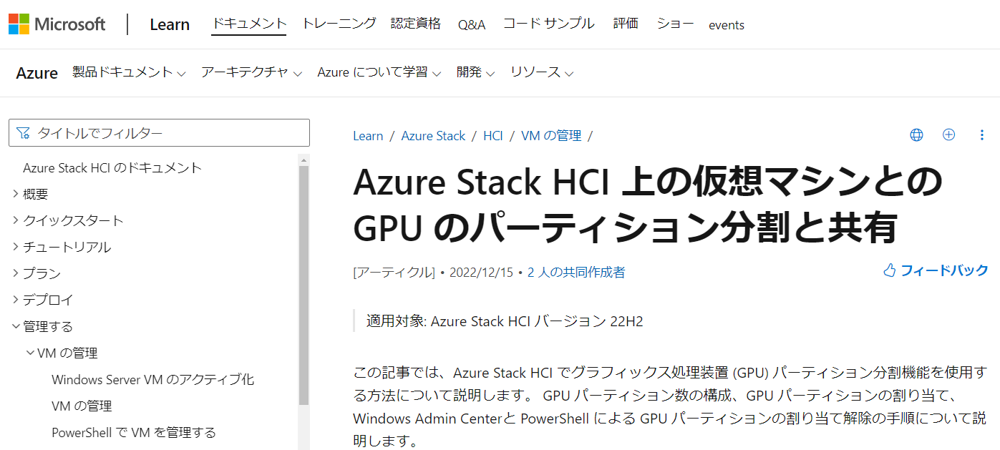

[vGPU Software Supported Products](https://docs.nvidia.com/grid/latest/product-support-matrix/index.html)
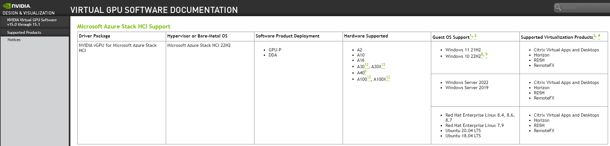

[Microsoft Azure Stack HCI Catalog - GPU-P Capable](https://hcicatalog.azurewebsites.net/#/catalog?GpuSupported=GPUPCapable&IntegratedSystem=Validated+Node&Manufacturer=Hewlett+Packard+Enterprise)
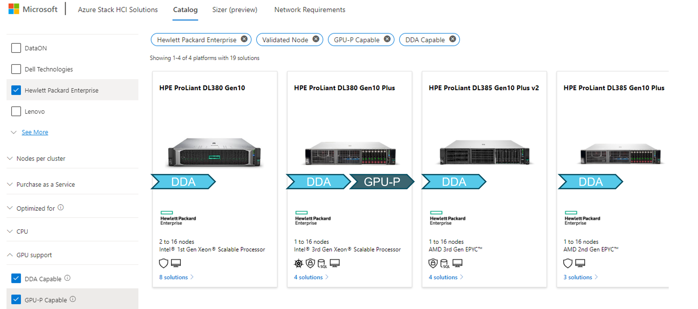

## 事前準備
Azure Stack HCI用のvGPUホストドライバーを入手します。<br>
[NVIDIA Licensing Portal](https://nvid.nvidia.com/dashboard/#/dashboard)より、適切なアカウントでログイン後、"Software Downloads"項目より、"Microsoft Azure Stack HCI用のvGPU Software pacakage"を入手します。
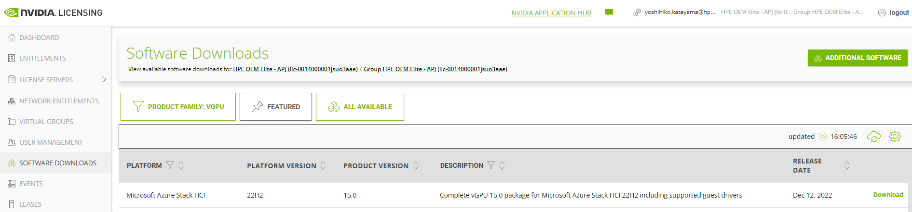

ダウンロードしたパッケージの中身はHost Driversだけではなく、Guest Driversも含まれているので、のちにAzure Stack HCI上のゲストOSからGPU-Pをつかみに行くために利用します。

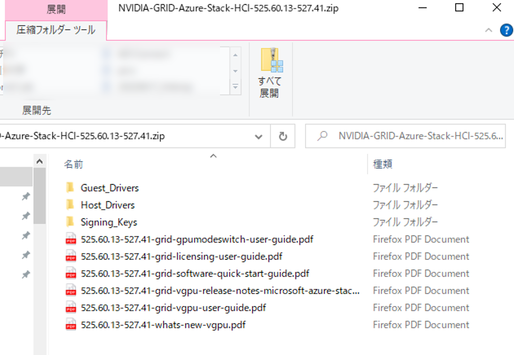

GPU-Pが利用できるまでに実施するおおまかな流れは、<br>
 ① ホストドライバーをインストール<br>
 ② Windows Admin Centerに拡張モジュールをインストール<br>
 ③ GPU-Pの分割設定およびゲストVMにGPU-Pをアサイン<br>
 ④ ゲストドライバーのインストール<br>
 ⑤ ライセンスサーバーの設定<br>
※事前にHCIの構築、仮想マシンや仮想スイッチ等の準備は実施しておく前提です<br>

## ① ホストドライバーのインストール
今回検証で使用した機材はDL380 Gen10 Plus x1、GPUはNVIDIA A40を利用しています。
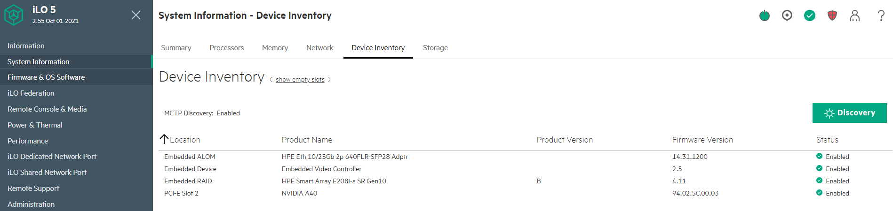

対象のドライバーをHCIホストにコピーしておきます。
以下Powershellでの実行例（管理端末→HCIホスト）
```
PS C:\Users\Administrator.HPE> Copy-Item C:\NVIDIA-GRID-Azure-Stack-HCI-525.60.13-527.41.zip -destination \\10.7.24.45\C$\Users\Administrator.HPE
```

HCIホストより、ドライバーパッケージがコピーされていることを確認
```
PS C:\Users\Administrator.HPE> ls

    Directory: C:\Users\Administrator.HPE

Mode                 LastWriteTime         Length Name
----                 -------------         ------ ----
...省略...
d-----        12/23/2022  10:35 AM                .Azure
-a----        12/23/2022   2:03 PM     2154005170 NVIDIA-GRID-Azure-Stack-HCI-525.60.13-527.41.zip
```
vGPU用のディレクトリを作成
```
PS C:\Users\Administrator.HPE> mkdir vgpu

    Directory: C:\Users\Administrator

Mode                 LastWriteTime         Length Name
----                 -------------         ------ ----
d-----        12/23/2022   4:37 PM                vgpu
```

解凍
```
PS C:\Users\Administrator.HPE> Expand-Archive -path .\NVIDIA-GRID-Azure-Stack-HCI-525.60.13-527.41.zip -DestinationPath C:\Users\Administrator.HPE\vgpu
```

確認
```
PS C:\Users\Administrator.HPE\vgpu> ls

    Directory: C:\Users\Administrator\vgpu

Mode                 LastWriteTime         Length Name
----                 -------------         ------ ----
d-----        12/23/2022   4:34 PM                Guest_Drivers
d-----        12/23/2022   4:34 PM                Host_Drivers
d-----        12/23/2022   4:34 PM                Signing_Keys
-a----        11/28/2022   2:06 AM         385022 525.60.13-527.41-grid-gpumodeswitch-user-guide.pdf
-a----        11/28/2022   2:12 AM         364468 525.60.13-527.41-grid-licensing-user-guide.pdf
-a----        11/28/2022   1:47 AM        3442026 525.60.13-527.41-grid-software-quick-start-guide.pdf
-a----        12/10/2022  11:20 AM         435193 525.60.13-527.41-grid-vgpu-release-notes-microsoft-azure-stack-hci.pdf
-a----        12/10/2022  11:20 AM        6735815 525.60.13-527.41-grid-vgpu-user-guide.pdf
-a----        11/28/2022   1:44 AM         172874 525.60.13-527.41-whats-new-vgpu.pdf
```

展開後、”Host_Drivers\Azure-Stack-HCI"のディレクトリに移動し、**PnPUtil** ツールを使用してドライバパッケージをドライバストアに追加します。**PnPUtil (PnPUtil.exe)** は、管理者が ドライバーパッケージに対してアクションを実行できるようにするコマンドラインツールです。
```
PS C:\Users\Administrator.HPE\vgpu\Host_Drivers\Azure-Stack-HCI> pnputil /add-driver nvgridswhci.inf /subdirs /install /reboot
Microsoft PnP Utility

Adding driver package:  Display.Driver\nvgridswhci.inf
Driver package added successfully. (Already exists in the system)
Published Name:         oem0.inf

Total driver packages:  1
Added driver packages:  1
```

再起動後、nvidia-smiコマンドで確認
```
PS C:\Users\Administrator.HPE> nvidia-smi
Fri Jan 20 08:08:36 2023
+-----------------------------------------------------------------------------+
| NVIDIA-SMI 527.41       Driver Version: 527.41       CUDA Version: N/A      |
|-------------------------------+----------------------+----------------------+
| GPU  Name            TCC/WDDM | Bus-Id        Disp.A | Volatile Uncorr. ECC |
| Fan  Temp  Perf  Pwr:Usage/Cap|         Memory-Usage | GPU-Util  Compute M. |
|                               |                      |               MIG M. |
|===============================+======================+======================|
|   0  NVIDIA A40         WDDM  | 00000000:37:00.0 Off |                  Off |
|  0%   33C    P8    12W / 300W |  48638MiB / 49140MiB |      0%      Default |
|                               |                      |                  N/A |
+-------------------------------+----------------------+----------------------+

+-----------------------------------------------------------------------------+
| Processes:                                                                  |
|  GPU   GI   CI        PID   Type   Process name                  GPU Memory |
|        ID   ID                                                   Usage      |
|=============================================================================|
|  No running processes found                                                 |
+-----------------------------------------------------------------------------+
```
無事見えていることが確認できました。

**※** 参照ドキュメントはこちら：<br>
[Installing and Configuring the NVIDIA Virtual GPU Manager for Microsoft Azure Stack HCI](https://docs.nvidia.com/grid/15.0/grid-vgpu-user-guide/index.html#microsoft-azure-stack-hci-install-configure-vgpu)

## ② Windows Admin Centerに拡張モジュールをインストール
Windows Admin Center(以下WAC)にログインし、"設定" > "拡張" を選択します。<br>
"利用可能な拡張機能"の中から、"GPUs"の項目を探し、選択。<br>
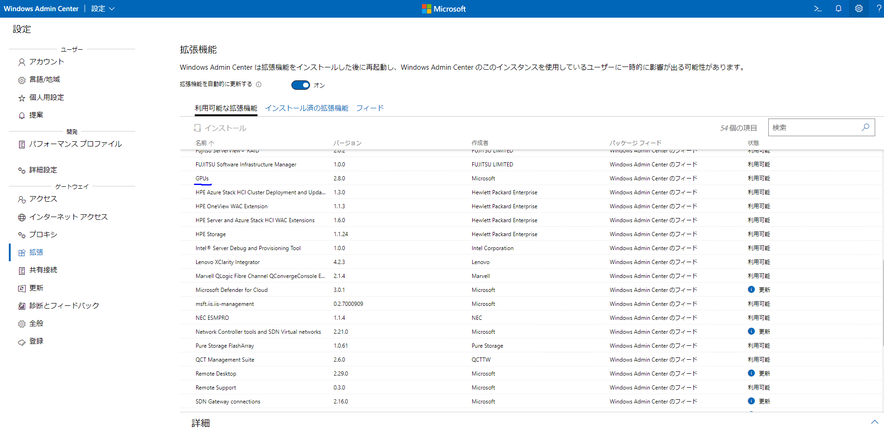

少々わかりづらいですが、各追加可能モジュール上部にある"インストール"をクリック<br>
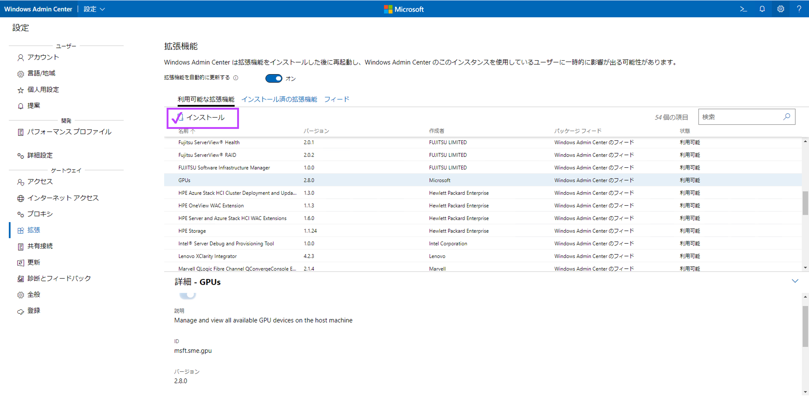

インストール実行中<br>
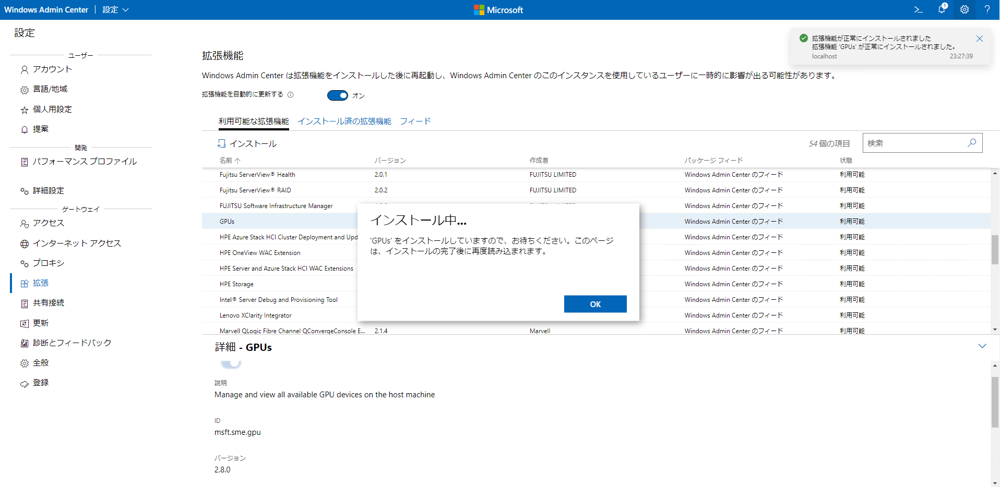

"GPUs"が**インストール済**になっていることを確認<br>
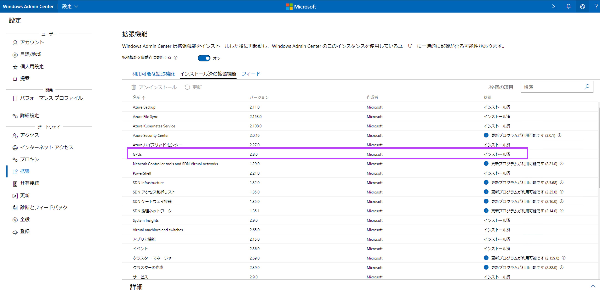

ダッシュボード画面、左下に拡張モジュールとして"GPUs"が追加されていればOKです。<br>
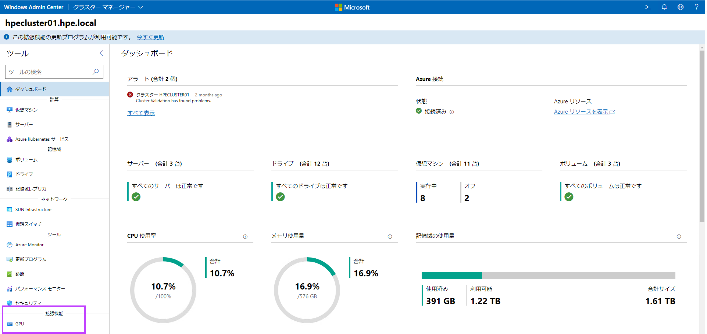

## ③ GPU-Pの分割設定およびゲストVMにGPU-Pをアサイン<br>
WAC内でGPUを搭載したサーバーで構成しているクラスターを選択します。（本環境ではhpecluster02）<br>
"GPUs"をクリックし、A40がきちんと認識されているかどうかを確認します。<br>
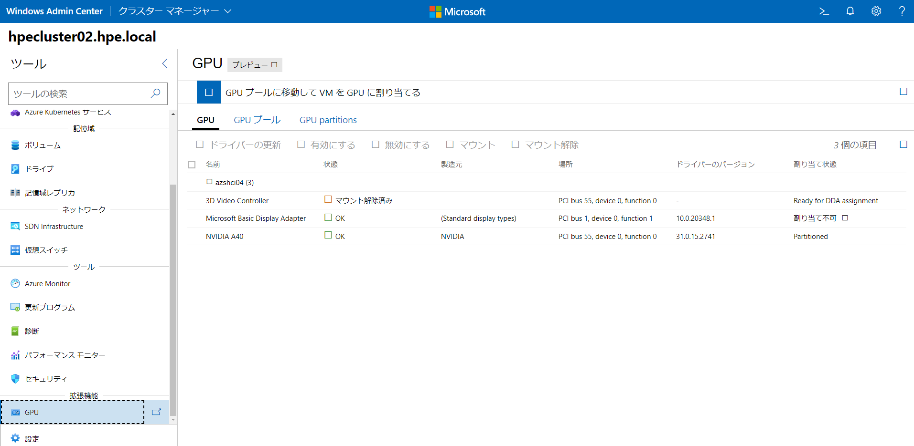


"GPU partitions"を選択します。<br>
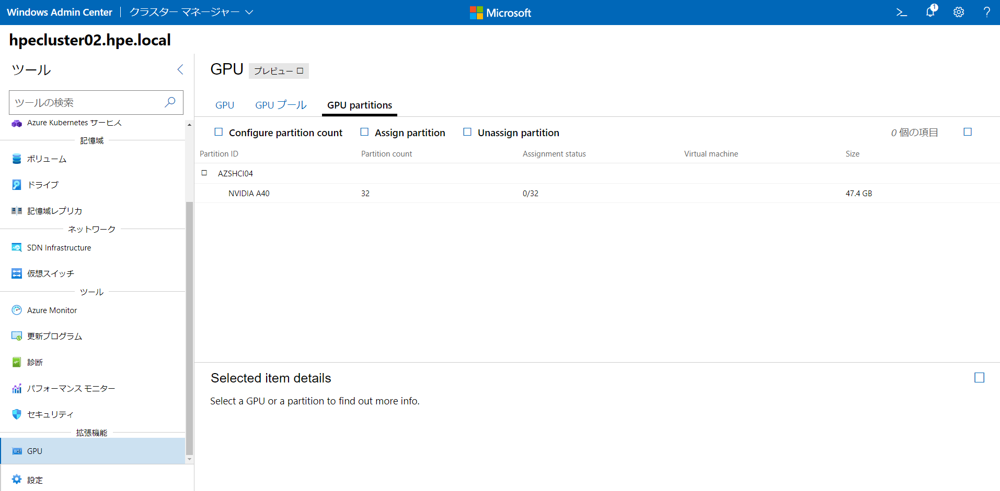

対象のGPUを選択し、詳細情報を確認後、”Configure partition count”を選択します。<br>
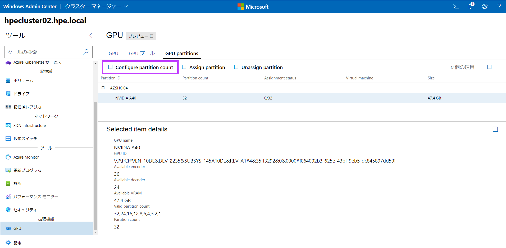

GPU-Pを構成可能なGPU（今回はA40）とその状態および、最大分割数などの情報が閲覧できます。<br>
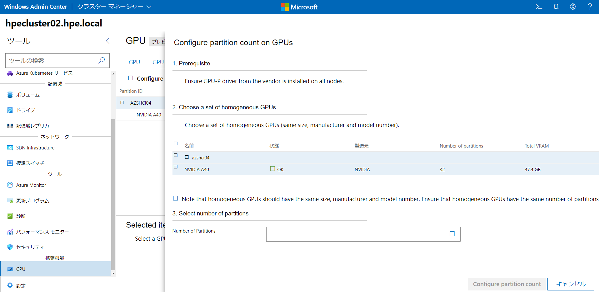

"Number of Partions"より分割数を設定します。<br>
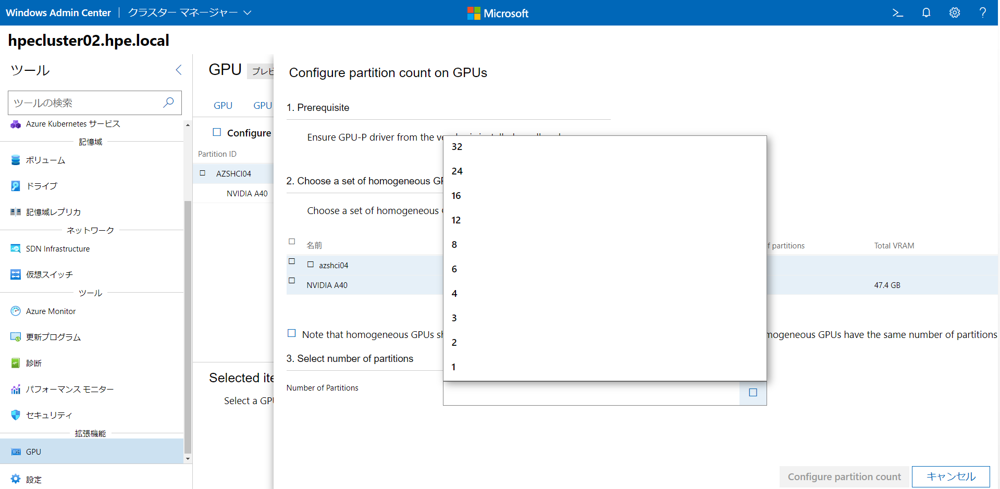

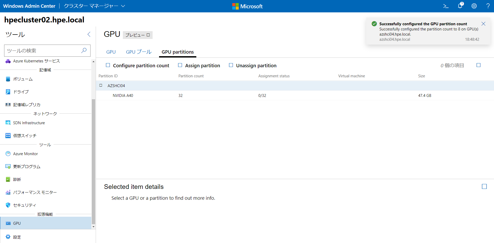

設定が完了すると、分割数や、現在のGPU-Pのアサイン状況が確認できます。<br>
この時点ではまだ仮想マシンに適用していないので0/8となっています。<br>
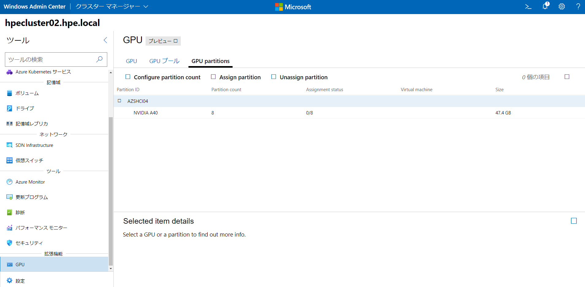
分割設定完了のため、ゲストVMに対してGPU-Pをアサインする準備が整いました。<br>

GPUパーティションをVMに割り当てます。<br>
"GPU" > "Assign Partition"より、アサインしたいGPUを選択します。<br>
どこのサーバー上で動いているどのVMに対してアサインするかを選択し、アサインします。<br>
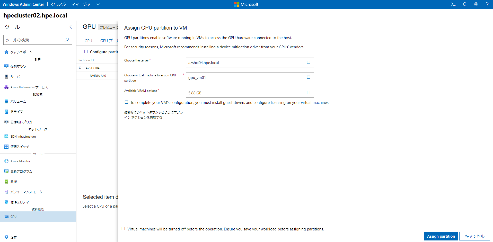

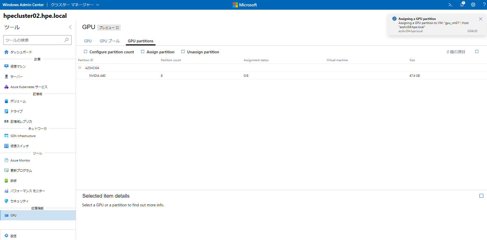

アサインが完了すると、分割されたGPU-PとアサインされたVMが一覧で確認できるようになります。<br>
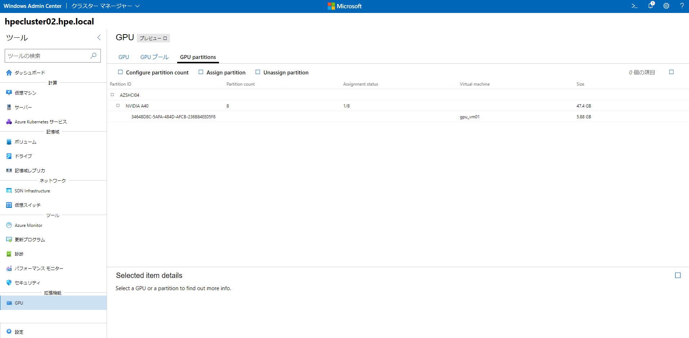

**※** 参照ドキュメントはこちら：<br>
[Azure Stack HCI 上の仮想マシンとの GPU のパーティション分割と共有](https://learn.microsoft.com/ja-jp/azure-stack/hci/manage/partition-gpu?tabs=windows-admin-center)
