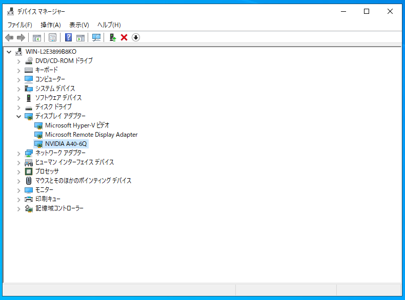

# 待望のMSソリューションで利用可能になったGPU Partitioning機能を使ってみる
GPU-Pを利用するうえで、Azure Stack HCIホスト側の設定後の続きを下記にまとめます。


GPU-Pが利用できるまでに実施するおおまかな流れをおさらいすると、<br>
 ① ホストドライバーをインストール<br>
 ② Windows Admin Centerに拡張モジュールをインストール<br>
 ③ GPU-Pの分割設定およびゲストVMにGPU-Pをアサイン<br>
 ④ ゲストドライバーのインストール<br>
 ⑤ ライセンスサーバーの設定<br>
※事前にHCIの構築、仮想マシンや仮想スイッチ等の準備は実施しておく前提です<br>

## ④ ゲストドライバーのインストール
**Windows VMにドライバーを割り当てる**

ゲストOS用のドライバーも、"”NVIDIA-GRID-Azure-Stack-HCI-525.60.13-527.41.zip”のなかに含まれています。<br>
<br>

パッケージの展開<br>


インストール<br>


使用許諾の同意<br>


オプションの選択<br>


<br>

無事ドライバーがインストールできました<br>


デバイスマネージャーで見てみると、きちんとA40のGPU-Pが見えていることが確認できました。


**Ubuntu VMにドライバーを割り当てる**

aptで適用したドライバーでは動きませんでした、、、。<br>
きちんと"NVIDIA-GRID-Azure-Stack-HCI-525.60.13-527.41.zip"に内包されるドライバーの適用が必須みたいです（Ubuntu公式レポジトリにはあがってないみたい）<br>


こちらの該当ファイルをUbuntu VMに転送しておき、実行します。
今回は最新のUbuntu22.04で試しました（まだ未サポートバージョンではありますが、、、）
```
root@gpuvm03:/home/yoshihiko# lsb_release -a
No LSB modules are available.
Distributor ID: Ubuntu
Description:    Ubuntu 22.04.1 LTS
Release:        22.04
Codename:       jammy
```

デバイス（A40の分割済みパーティション）は見えてます。
```
root@gpuvm03:/home/yoshihiko# lspci | grep NVIDIA
3c5a:00:00.0 3D controller: NVIDIA Corporation GA102GL [A40] (rev a1)
```

ドライバーをインストールします。
```
yoshihiko@gpuvm03:~$ sudo bash NVIDIA-Linux-x86_64-525.60.13-grid.run
Verifying archive integrity... OK
Uncompressing NVIDIA Accelerated Graphics Driver for Linux-x86_64 525.60.13...................................................................................................................................................................................................................................................................................................................................................................................................................................................................................................................................................................................................................................................................................................................................................................................................................................................................................................................................................................................................................................................................................
```
<br>
画面に沿って、インストールを進めます。


インストールが完了しました。<br>


nvidia-smiコマンドできちんと確認できました。
```
yoshihiko@gpuvm03:~$ nvidia-smi
Fri Jan 27 16:41:46 2023
+-----------------------------------------------------------------------------+
| NVIDIA-SMI 525.60.13    Driver Version: 525.60.13    CUDA Version: 12.0     |
|-------------------------------+----------------------+----------------------+
| GPU  Name        Persistence-M| Bus-Id        Disp.A | Volatile Uncorr. ECC |
| Fan  Temp  Perf  Pwr:Usage/Cap|         Memory-Usage | GPU-Util  Compute M. |
|                               |                      |               MIG M. |
|===============================+======================+======================|
|   0  NVIDIA A40-6Q       Off  | 00003C5A:00:00.0 Off |                  N/A |
| N/A   N/A    P8    N/A /  N/A |      0MiB /  6144MiB |      0%      Default |
|                               |                      |             Disabled |
+-------------------------------+----------------------+----------------------+

+-----------------------------------------------------------------------------+
| Processes:                                                                  |
|  GPU   GI   CI        PID   Type   Process name                  GPU Memory |
|        ID   ID                                                   Usage      |
|=============================================================================|
|  No running processes found                                                 |
+-----------------------------------------------------------------------------+
```

**※** 参照ドキュメントはこちら：<br>
[Installing the NVIDIA vGPU Software Graphics Driver](https://docs.nvidia.com/grid/15.0/grid-vgpu-user-guide/index.html#installing-grid-vgpu-display-drivers)

## インスタレーションTips
公式レポジトリから引っ張って来たドライバーだと認識しない、、、
```
root@gpuvm03:/home/yoshihiko# ubuntu-drivers devices
== /sys/devices/LNXSYSTM:00/LNXSYBUS:00/ACPI0004:00/VMBUS:00/9e3cb4a2-3c5a-4f29-a754-569de3eef38b/pci3c5a:00/3c5a:00:00.0 ==
modalias : pci:v000010DEd00002235sv000010DEsd000014DBbc03sc02i00
vendor   : NVIDIA Corporation
model    : GA102GL [A40]
driver   : nvidia-driver-470-server - distro non-free
driver   : nvidia-driver-525-open - distro non-free recommended
driver   : nvidia-driver-510 - distro non-free
driver   : nvidia-driver-515 - distro non-free
driver   : nvidia-driver-525-server - distro non-free
driver   : nvidia-driver-515-open - distro non-free
driver   : nvidia-driver-470 - distro non-free
driver   : nvidia-driver-515-server - distro non-free
driver   : nvidia-driver-525 - distro non-free
driver   : xserver-xorg-video-nouveau - distro free builtin
```
```
root@gpuvm03:/home/yoshihiko# apt -y install nvidia-driver-525-server
Reading package lists... Done
Building dependency tree... Done
Reading state information... Done
The following additional packages will be installed:
  build-essential bzip2 cpp cpp-11 cpp-12 dctrl-tools dkms dpkg-dev fakeroot
  fontconfig-config fonts-dejavu-core g++ g++-11 gcc gcc-11 gcc-11-base gcc-12
  libalgorithm-diff-perl libalgorithm-diff-xs-perl libalgorithm-merge-perl
  libasan6 libasan8 libatomic1 libc-dev-bin libc-devtools libc6-dev libcc1-0
以下略...

No VM guests are running outdated hypervisor (qemu) binaries on this host.
```

```
root@gpuvm03:/home/yoshihiko# nvidia-smi
NVIDIA-SMI has failed because it couldn't communicate with the NVIDIA driver. Make sure that the latest NVIDIA driver is installed and running.
```
動かない

```
root@gpuvm03:/home/yoshihiko# vi /etc/modprobe.d/blacklist-nouveau.conf
# 最終行に追記 (ファイルがない場合は新規作成)
blacklist nouveau
options nouveau modeset=0
```
```
root@gpuvm03:/home/yoshihiko# update-initramfs -u
update-initramfs: Generating /boot/initrd.img-5.15.0-58-generic
```
と実施しても状況変わらず、、、。

**＜結論＞**
公式レポジトリに提供されているドライバーでは動かないため、"NVIDIA-GRID-Azure-Stack-HCI-525.60.13-527.41"の中に含まれるゲストOSドライバーの利用が必要です。

※ライセンスサーバーの利用方法に関しては、[こちら](../../../vmware/vgpu/installation02)をご参照ください。
