# aaS版HPE Ezmeral Data Fabric 7.3をインストール

## 前提要件
検証用の非サポート構成です。

- ブートストラップ用のDocker環境があること
- Data Fabric Node x2があること
    - オンプレ仮想環境
  - Ubuntu 20.04
  - CPU: 8 vcore
  - RAM: 32 GB
  - データディスク: 500GB (raw)
  - network設定やNTP、DNSなど基本設定が終えていること

## ドキュメント
- [HPE Ezmeral Data Fabric 7.3](https://internal.support.hpe.com/hpesc/public/docDisplay?docId=a00edfaas73hen_us&page=index.html)

## ブートストラップノードの準備
ブートストラップノードをDocker環境にデプロイします。

### コンテナイメージの取得
ブートストラップノード用のコンテナイメージを取得します。

```
$ docker pull maprtech/dev-sandbox-container:7.3.0_9.1.1_dfaas

$ docker images

```
### コンテナの起動
ブートストラップノードのコンテナイメージを起動します。スクリプトが用意されているので、それを使って起動します。*sudo*ユーザー相当の権限が必要です。また、ブートストラップノードを公開するネットワークインターフェースを指定する必要があります。

```
$ wget https://raw.githubusercontent.com/mapr-demos/mapr-db-730-getting-started/main/datafabric_container_setup.sh

$ chmod +x datafabric_container_setup.sh

$ ./datafabric_container_setup.sh  -nwiterface ens160 -image maprtech/dev-sandbox-container:7.3.0_9.1.1_dfaas
Please enter the local sudo password for root

Developer Sandbox Container f973b506dc90 is running..
sed: can't read /maprdemo/d: No such file or directory
sed: can't read /maprdemo/d: No such file or directory
sed: can't read /opt/mapr/conf/mapr-clusters.conf: No such file or directory

Docker Container is coming up....
Client has been configured with the docker container.

It will take 5 to 10 mins for all the services to be up and running 

Login to DF UI at https://10.7.16.52:8443/app/dfui using root/mapr to deploy data fabric
For user documentation, see https://docs.ezmeral.hpe.com/datafabric/home/installation/installation_main.html

```

数分待つとブラウザからアクセスが可能になります。コンテナ起動時の出力に従ってログインします。

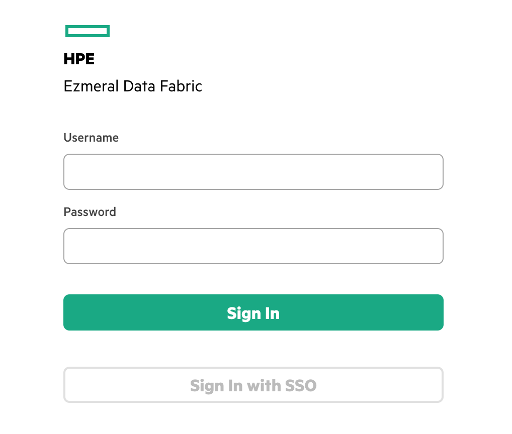
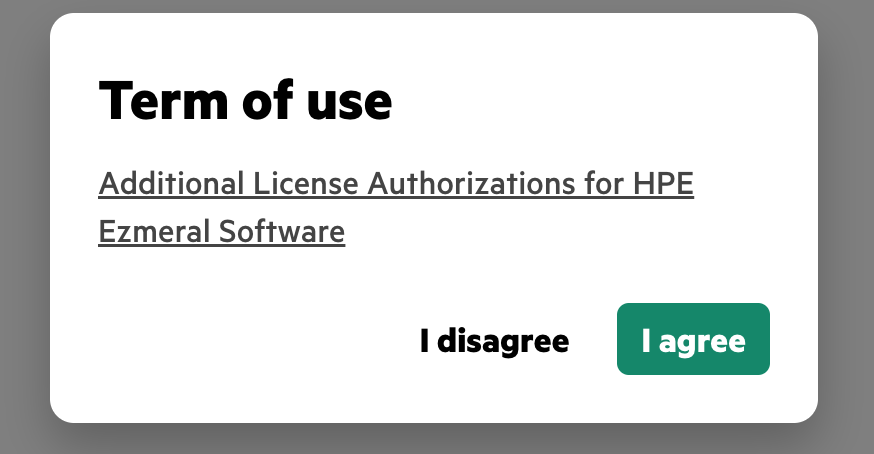
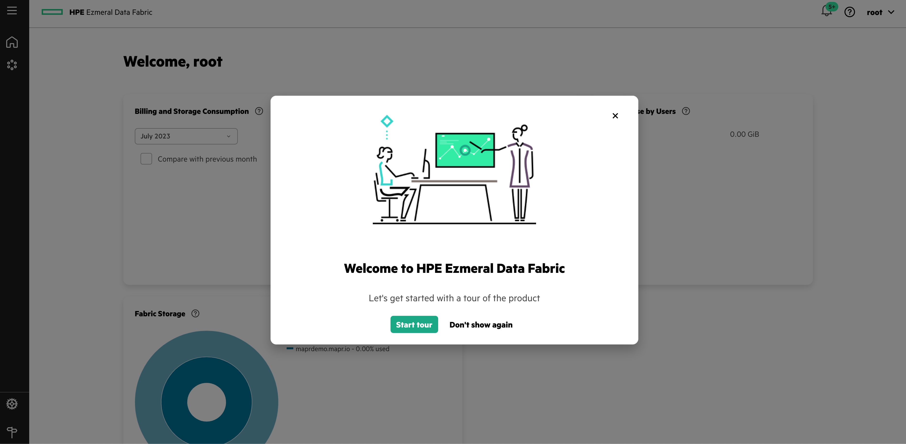
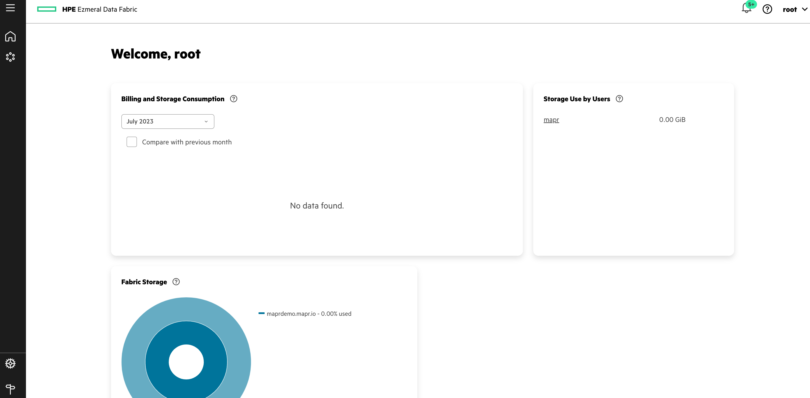
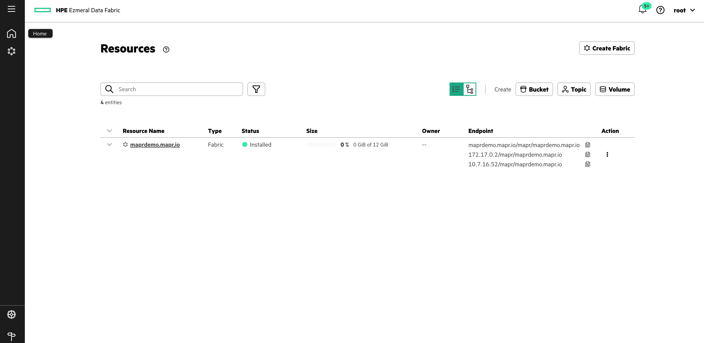

**maprdemo.mapr.io**というリソースはコンテナ起動させたブートストラップノードです。最初のData Fabricを作成後、このコンテナは削除して問題ないです。

## Data Fabricノードの準備
基本設定を終えているData Fabricノードに対して、Data Fabric要件を適用していきます。

### Data Fabricデフォルトユーザーの作成
[こちらの要件](https://internal.support.hpe.com/hpesc/public/docDisplay?docId=a00edfaas73hen_us&page=installation/user_reqs.html)に従って、ユーザーを作成します。複数ノードある場合は、全ノードで設定する必要があります。

```
$ adduser mapr

```

### umaskの設定
全Data Fabricノードでrootユーザーのumaskを*0022*します。

```
$ vi /etc/profile
umask 0022

$ source /etc/profile
```

## Data Fabric インストール
### GUIからインストール
ブートストラップGUIから準備しておいたVMにData Fabricをインストールします。左ペインから*Resources*ページに移動して、右上の*Create Fabric*ボタンを押します。


今回はオンプレ環境にデプロイするので、Providerは*On-premise*を選択してください。まずは１つのData Fabricを作るので、１ノードのみを指定します。インストーラーを立ち上げるノードは、先に指定したData FabricのノードのFQDNを指定します。

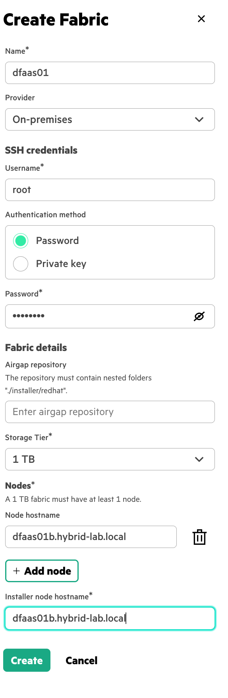
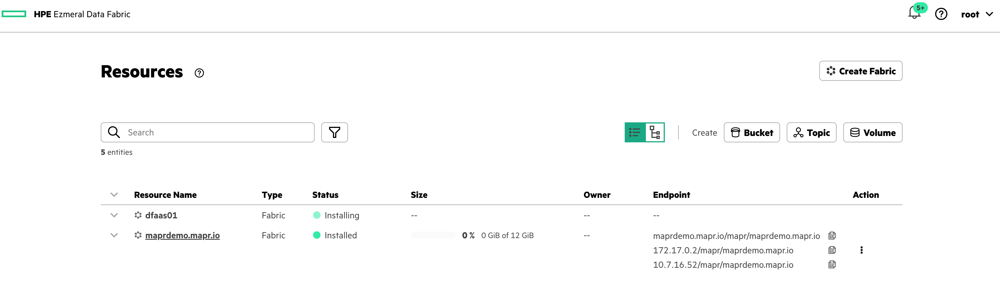

### ログの参照
ログはコンテナにsshして参照できます。パスワードは[こちら](https://internal.support.hpe.com/hpesc/public/docDisplay?docId=a00edfaas73hen_us&page=installation/aws_seed_node_deployment.html)です。

```
$ ssh root@localhost -p 2222
root@localhost's password: 
Welcome to Ubuntu 20.04.5 LTS (GNU/Linux 5.4.0-152-generic x86_64)

 * Documentation:  https://help.ubuntu.com
 * Management:     https://landscape.canonical.com
 * Support:        https://ubuntu.com/advantage

This system has been minimized by removing packages and content that are
not required on a system that users do not log into.

To restore this content, you can run the 'unminimize' command.

The programs included with the Ubuntu system are free software;
the exact distribution terms for each program are described in the
individual files in /usr/share/doc/*/copyright.

Ubuntu comes with ABSOLUTELY NO WARRANTY, to the extent permitted by
applicable law.

root@maprdemo:~# cd /opt/mapr/installer/ezdfaas/deployments/dfaas01/logs/
root@maprdemo:/opt/mapr/installer/ezdfaas/deployments/dfaas01/logs# ls
create-cluster-23-07-25_01:10:54.log

```
### 確認
ステータスが*installed*になっているかを確認します。
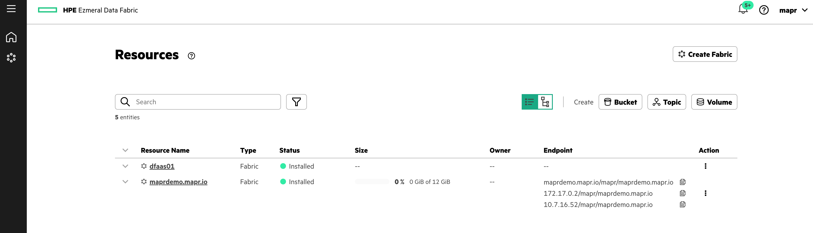

### ブートストラップノードの削除
*installed*のステータスになったら、出来上がったEzmeral Data FabricのUIにアクセスします。URLは*https://<Node IP>:8443/app/dfui*です。
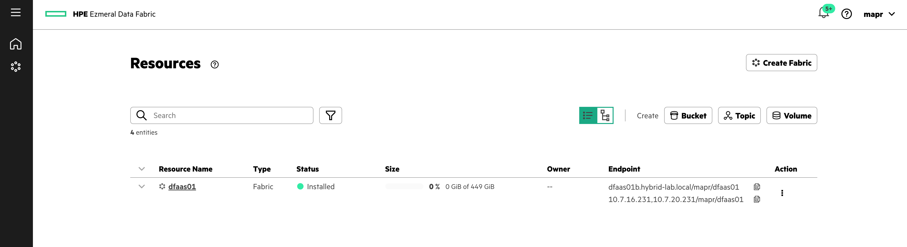

こちらのUIからもう１つData Fabricを作ってみますので、ブートストラップノードは削除してください。

```
$ docker ps

$ docker rm -f c18cdb2c597f
```

### Data Fabricの作成パート２
先ほどと同じ手順で、もう１つData Fabricを作成します。その前に、先に作ったData Fabric上で以下のPythonライブラリをインストールしておきます。(2つめのData Fabricを作る時にライブラリがないと怒られました。。。)

```
$ pip install paramiko
```

準備ができたらインストールを開始します。
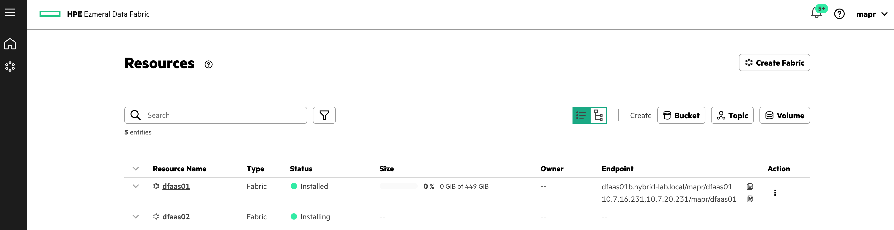

しばらく待つと、先ほどと同じようにインストールが完了します。簡単にData Fabricをさまざまな環境に増殖できます。
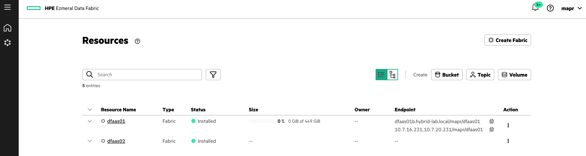
