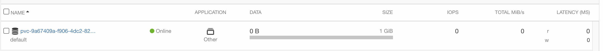

# HPE Storage用CSIドライバーをインストールしてみる


## 要件
- Ezmeral Runtimeが既にあること (本検証では5.4を使用)
- HPE Nimble/Alletra/3PAR/PrimeraのいづれがEzmeralと接続されていること(本検証ではNimble iSCSI)
- 端末側にHELMがインストールされていること

## 手順
### Ezmeral Kubernetes Versionの確認
Cluster Admin権限を持っているユーザーでKubernetes Versionを確認します。(ここからalias k='kubectl')

```
✗ k version                  
WARNING: This version information is deprecated and will be replaced with the output from kubectl version --short.  Use --output=yaml|json to get the full version.
Client Version: version.Info{Major:"1", Minor:"25", GitVersion:"v1.25.0", GitCommit:"a866cbe2e5bbaa01cfd5e969aa3e033f3282a8a2", GitTreeState:"clean", BuildDate:"2022-08-23T17:36:43Z", GoVersion:"go1.19", Compiler:"gc", Platform:"darwin/amd64"}
Kustomize Version: v4.5.7
Server Version: version.Info{Major:"1", Minor:"21", GitVersion:"v1.21.10", GitCommit:"a7a32748b5c60445c4c7ee904caf01b91f2dbb71", GitTreeState:"clean", BuildDate:"2022-02-16T11:18:16Z", GoVersion:"go1.16.14", Compiler:"gc", Platform:"linux/amd64"}
WARNING: version difference between client (1.25) and server (1.21) exceeds the supported minor version skew of +/-1
```

自身のk8s versionで[どのストレージの機能](https://scod.hpedev.io/csi_driver/index.html#features_and_capabilities)が使えるか確認します。


### インストール
HELMを使って、サクッとインストールしてみます。[こちらの手順](https://artifacthub.io/packages/helm/hpe-storage/hpe-csi-driver)に従ってインストールします。

HPE Storageのhelm repoを追加します。

```bash
✗ helm repo add hpe-storage https://hpe-storage.github.io/co-deployments/
"hpe-storage" has been added to your repositories

✗ helm repo update
Hang tight while we grab the latest from your chart repositories...
...Successfully got an update from the "hpe-storage" chart repository
Update Complete. ⎈Happy Helming!⎈
```

HPE Storage CSI用のNamespaceを作っときます。

```bash
✗ k create ns hpe-storage
namespace/hpe-storage created
```

チャートバージョンを確認しておきます。

```bash
✗ helm search repo hpe-storage/hpe-csi-driver                
NAME                      	CHART VERSION	APP VERSION	DESCRIPTION                                       
hpe-storage/hpe-csi-driver	2.2.0        	2.2.0      	A Helm chart for installing the HPE CSI Driver ...
```

設定可能な値を見ていきます。

```bash
✗ helm show values hpe-storage/hpe-csi-driver > helm-hpe-csi-driver-2.2.0.yaml
```

*helm-hpe-csi-driver-2.2.0.yaml*を開いて、設定値を変えてきます。

まず、今回はNimble Storageを接続するので、以下の設定値を変更します。

```yaml
disable:
  nimble: false
  primera: true
  alletra6000: true
  alletra9000: true
```

次にiSCSIのCHAP認証の情報を入れてください。

```yaml
iscsi:
  chapUser: "Your_User"
  chapPassword: "Your_Password"
```

CSI Driverをインストールします。

```bash
✗ helm install hpe-csi hpe-storage/hpe-csi-driver -n hpe-storage -f helm-hpe-csi-driver-2.2.0.yaml 
NAME: hpe-csi
LAST DEPLOYED: Thu Sep  8 11:16:10 2022
NAMESPACE: hpe-storage
STATUS: deployed
REVISION: 1
TEST SUITE: None

✗ k get pod -n hpe-storage
NAME                                  READY   STATUS    RESTARTS   AGE
hpe-csi-controller-794b7996cc-7lxkm   9/9     Running   0          42s
hpe-csi-node-5hgvq                    2/2     Running   0          42s
hpe-csi-node-ds5kn                    2/2     Running   0          42s
hpe-csi-node-sm22n                    2/2     Running   0          42s
nimble-csp-678fbb85c8-w9brk           1/1     Running   0          42s
```

Nimbleと繋ぐためにSecretを作成します。[公式手順はこちら](https://scod.hpedev.io/csi_driver/deployment.html#add_a_hpe_storage_backend)です。その前にNimble Cloud Storage ProviderのServiceを確認します。

```bash
✗ k get svc -n hpe-storage
NAME             TYPE        CLUSTER-IP     EXTERNAL-IP   PORT(S)    AGE
nimble-csp-svc   ClusterIP   10.96.17.189   <none>        8080/TCP   3m21s
```

Service Nameの*nimble-csp-svc*と公開ポート*8080*をメモっときます。それでは、Secretを作ります。*nimble-backend.yaml*というファイルに定義します。

```yaml
apiVersion: v1
kind: Secret
metadata:
  name: mynimble
  namespace: hpe-storage
stringData:
  serviceName: nimble-csp-svc
  servicePort: "8080"
  backend: <Your Nimble IP Here!!>
  username: <Your Nimble IP Admin Account Here!!>
  password: <Your Nimble IP Admin Password Here!!>
```

完成したらApplyします。

```bash
✗ k apply -f nimble-backend.yaml -n hpe-storage       
secret/nosemble created

✗ k get secret                                  
NAME                                TYPE                                  DATA   AGE
default-token-x844x                 kubernetes.io/service-account-token   3      22m
hpe-csi-controller-sa-token-qhsvz   kubernetes.io/service-account-token   3      8m56s
hpe-csi-node-sa-token-l86fm         kubernetes.io/service-account-token   3      8m56s
hpe-csp-sa-token-4cqdt              kubernetes.io/service-account-token   3      8m56s
hpe-backend                         Opaque                                5      9s
sh.helm.release.v1.hpe-csi.v1       helm.sh/release.v1  
```

次にStorage Classを作成します。[公式手順はこちら](https://scod.hpedev.io/csi_driver/using.html#base_storageclass_parameters)です。*storageclass.yaml*というファイルに定義します。

```yaml
apiVersion: storage.k8s.io/v1
kind: StorageClass
metadata:
  annotations:
    storageclass.kubernetes.io/is-default-class: "true"
  name: hpe-nimble
provisioner: csi.hpe.com
parameters:
  csi.storage.k8s.io/fstype: xfs
  csi.storage.k8s.io/controller-expand-secret-name: hpe-backend
  csi.storage.k8s.io/controller-expand-secret-namespace: hpe-storage
  csi.storage.k8s.io/controller-publish-secret-name: hpe-backend
  csi.storage.k8s.io/controller-publish-secret-namespace: hpe-storage
  csi.storage.k8s.io/node-publish-secret-name: hpe-backend
  csi.storage.k8s.io/node-publish-secret-namespace: hpe-storage
  csi.storage.k8s.io/node-stage-secret-name: hpe-backend
  csi.storage.k8s.io/node-stage-secret-namespace: hpe-storage
  csi.storage.k8s.io/provisioner-secret-name: hpe-backend
  csi.storage.k8s.io/provisioner-secret-namespace: hpe-storage
  description: "Volume created by the HPE CSI Driver for Kubernetes"
reclaimPolicy: Delete
allowVolumeExpansion: true
```

完成したらApplyします。

```bash
✗ k apply -f storageclass.yaml                  
storageclass.storage.k8s.io/hpe-nimble created

✗ k get sc                    
NAME                   PROVISIONER                    RECLAIMPOLICY   VOLUMEBINDINGMODE      ALLOWVOLUMEEXPANSION   AGE
hpe-hdd-storage        kubernetes.io/no-provisioner   Delete          WaitForFirstConsumer   false                  21h
hpe-nimble (default)   csi.hpe.com                    Delete          Immediate              true                   10s
hpe-nvme-storage       kubernetes.io/no-provisioner   Delete          WaitForFirstConsumer   false                  21h
hpe-ssd-storage        kubernetes.io/no-provisioner   Delete          WaitForFirstConsumer   false                  21h
```

### テスト
ボリュームが作成できるかテストしてみます。*pvc-test.yaml*というファイルに以下を記載してください。

```yaml
apiVersion: v1
kind: PersistentVolumeClaim
metadata:
  name: test-nimble
  namespace: default
spec:
  accessModes:
  - ReadWriteOnce
  resources:
    requests:
      storage: 1Gi
  storageClassName: hpe-nimble
```

完成したらApplyします。

```bash
✗ k apply -f pvc-test.yaml                      
persistentvolumeclaim/test-nimble created

✗ k get pv                
NAME                                       CAPACITY   ACCESS MODES   RECLAIM POLICY   STATUS   CLAIM                 STORAGECLASS   REASON   AGE
pvc-9a67409a-f906-4dc2-82ca-7b7ff04121a9   1Gi        RWO            Delete           Bound    default/test-nimble   hpe-nimble              8s

✗ k get pvc -n default
NAME          STATUS   VOLUME                                     CAPACITY   ACCESS MODES   STORAGECLASS   AGE
test-nimble   Bound    pvc-9a67409a-f906-4dc2-82ca-7b7ff04121a9   1Gi        RWO            hpe-nimble     39s
```

NimbleのWeb GUIの方でも1GBのVolumeが作成されていることがわかると思います。



###片付け
テストで作成したPVCは削除してください。

```bash
✗ k delete -f pvc-test.yaml
persistentvolumeclaim "test-nimble" deleted

 ✗ k get pv                 
No resources found

 ✗ k get pvc -n default
No resources found in default namespace.
```