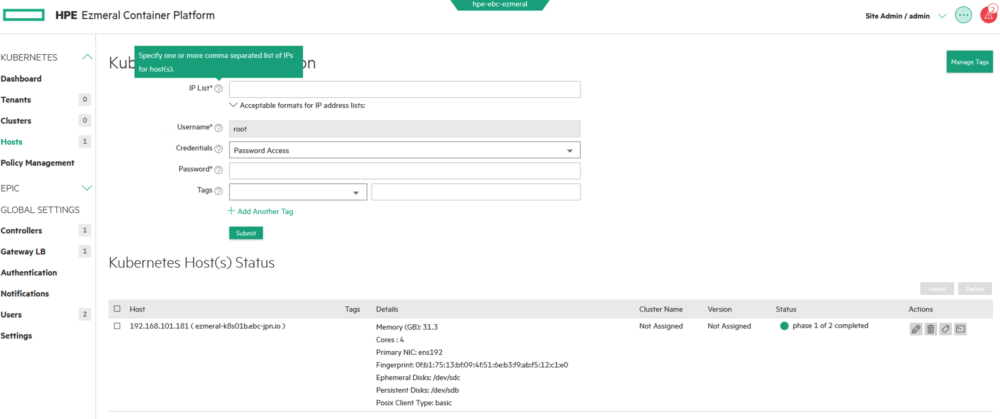

# Ezmeral Container Platform 5.3インストール

## HW要件

- HPEのサーバーじゃなくても良い
- パブリッククラウドでもOK
- [こちらの要件](https://docs.containerplatform.hpe.com/53/reference/system-requirements/general/Host_Requirements.html)を満たしてればなんでもOK

## 各種ノード作成手順
### 事前準備
[こちら要件](https://docs.containerplatform.hpe.com/53/reference/system-requirements/general/Host_Requirements.html)を満たすリソースを準備します。  
今回はHA構成なしでインストールしていきます。以下が本検証環境で準備するノードです。

- Controller x1
- Gateway LB x1
- EPIC Worker x1
- k8s nodes x6 (k8sクラスタを作成する場合、今回動作確認の意味を含めてk8sクラスタも作成)

今回は**インターネットに接続できる環境**に配備しています。
また、Embedded Data Fabric(embedded)も作成するのでPersisitent Storage用のDiskをController/EPIC Worker Nodeに持たせてます。

### OSインストールと基本設定
[お好みOSとバージョン](https://docs.containerplatform.hpe.com/53/reference/system-requirements/general/Operating_System_Requirements.html)を選んでインストールします。私はCentOSを選択しました。

```
[root@ezmeral-template ~]# cat /etc/redhat-release
CentOS Linux release 7.9.2009 (Core)
```


ネットワーク設定等の基本的な設定と[こちらの設定](https://docs.containerplatform.hpe.com/53/reference/system-requirements/general/Configuration_Requirements.html)を行います。**k8sノードを含む全てのノード**を同じ構成にしといて大丈夫です。ただし、k8sノードに関しては**swap**を無効にしてください。IPアドレスはもちろん各ノードで違うものにしてください:)  

### Proxy設定(Proxy環境下で構築する場合のみ)
今回の検証環境はWeb Proxyを介してインターネットに接続させます。プロキシ設定は[こちら](https://docs.containerplatform.hpe.com/53/reference/system-requirements/general/Web_Proxy_Requirements.html)に簡単に記載されています。
*no_proxy*の設定は細かく書かないとインストール後、各種機能で不具合が生じますので注意してください。

- EZMERAL\_CONTROLLERS  
コントローラノードのIPアドレスを記載。今回は１ノードですが、将来HAすることを見越して後述の例では３ノード分のIPアドレスを記載しています。

- EZMERAL\_WORKERS  
EPICワーカーノードのIPアドレスを記載。今回は１ノードですが、将来増えることを見越して後述の例では３ノード分のIPアドレスを記載しています。

- EZMERAL\_GATEWAYS  
ゲートウェイLBノードのIPアドレスを記載。今回は１ノードですが、将来HAすることを見越して後述の例では2ノード分のIPアドレスを記載しています。

- NO\_PROXY\_CIDRS  
プロキシを介さないでアクセスるためのサブネットを記載します。後述の例では、Ezmeral Container Platformを構築する環境のサブネット(192.168.99.0/24,192.168.100.0/24,192.168.101.0/24)、k8sで使用予定のPod/Serviceのサブネット(10.192.0.0/12,10.96.0.0/12)を記載しています。

-  NO\_PROXY\_DOMAINS  
プロキシを介さないでアクセスるためのドメインを記載します。後述の例では、Ezmeral container Platformを構築する環境のドメイン(\*.ebc-jpn.io)、Ezmeral Container Platformが内部的につかっている？ドメイン(\*.svc)、k8sで使用予定のドメイン(\*.cluster.local)、Ezmeral Container Platformに設定する予定のドメイン(\*.hpecplocal)を設定しています。

あとはこれらの環境変数を*no\_proxy*でまとめあげます。

```
# Proxy
export EZMERAL_CONTROLLERS=192.168.101.151,192.168.101.152,192.168.101.153
export EZMERAL_WORKERS=192.168.101.161,192.168.101.162,192.168.101.163
export EZMERAL_GATEWAYS=192.168.101.171,192.168.101.172
export NO_PROXY_CIDRS=192.168.99.0/24,192.168.100.0/24,192.168.101.0/24,10.192.0.0/12,10.96.0.0/12
export NO_PROXY_DOMAINS=.ebc-jpn.io,.svc,.cluster.local,.hpecplocal
export PROXY=http://192.168.101.10:8888
export http_proxy=$PROXY
export HTTP_PROXY=$http_proxy
export https_proxy=$PROXY
export HTTPS_PROXY=$https_proxy
export no_proxy=localhost,127.0.0.1,192.168.99.182,192.168.101.182,$NO_PROXY_CIDRS,$NO_PROXY_DOMAINS,$EZMERAL_CONTROLLERS,$EZMERAL_WORKERS,$EZMERAL_GATEWAYS
export NO_PROXY=$no_proxy

```

Ezmeral Container PlatformではコンテナエンジンとしてDockerが採用されます。そのため、Docker用のProxy設定も必要となります。基本的にはOS側で設定した内容と同じでいいです。

```
[root@ezmeral-template ~]# mkdir -p /etc/systemd/system/docker.service.d/
[root@ezmeral-k8s01b ~]# vi /etc/systemd/system/docker.service.d/docker-proxy.conf
[Service]
Environment="HTTP_PROXY=http://192.168.101.10:8888"
Environment="HTTPS_PROXY=http://192.168.101.10:8888"
Environment="NO_PROXY=localhost,127.0.0.1,192.168.99.0/24,192.168.100.0/24,192.168.101.0/24,10.192.0.0/12,10.96.0.0/12,*.ebc-jpn.io,*.svc,*.cluster.local,*.hpecplocal"
```

## Ezmeral Container Platformのインストール
### プリチェック
各OS用のPrecheckバイナリが提供されていますので、それを使って構成が正しい状態であるか確認します。

- [RHEL/CENTOS用バイナリ](https://bdk8s.s3.us-east-2.amazonaws.com/5.3/3031/hpe-cp-rhel-prechecks-5.3.bin)
- [SLES用バイナリ](https://bdk8s.s3.us-east-2.amazonaws.com/5.3/3031/hpe-cp-sles-prechecks-5.3.bin)

Controller Nodeをチェックします。Controller Node上にPrecheckバイナリを配備して実行します。本検証環境はネットワークインターフェースを複数もっていたので*--controller-public-if*でEzmeral Container Platformで使用するインターフェースを指定しています。また、Web Proxyを介してインターネットへ接続可能な環境なので*--proxy*でWeb Proxyの情報を渡しています。

Precheckバイナリの実行完了と共にインストール用のconfigファイルが*/tmp/bd_prechecks.conf*に生成されます。*--config-file-path*でそのインストール用のconfigファイルパスを指定することができます。

```
[root@ezmeral-controller01b 5.3]# ./hpe-cp-rhel-prechecks-5.3.bin --controller --controller-public-if ens192 --proxy http://192.168.101.10:8888 --config-file-path /root/work/ezmeral/5.3/bd_prechecks.conf

~~~
***************************************************************************
Aggregate tests summary:
             Total : 56
            Failed : 0
           Warning : 1
   Forced(success) : 0
WARNING: Some warnings encountered. Refer to the documentation for more information.
Additional information for debugging is written to /tmp/bd_prechecks.5957.log
***************************************************************************
```

*Failed*が0なら良いです。念のため、生成されたインストールようのconfigファイルも確認します。

```
[root@ezmeral-controller01b 5.3]# cat bd_prechecks.conf
export PRIMARY_IF=ens192
export PRIMARY_IP=192.168.101.151
export HOST_NAME=ezmeral-controller01b.ebc-jpn.io
export PROXY_URL=http://192.168.101.10:8888
export bds_prechecks_selinux=true
export bds_prechecks_iptables=false
export bds_global_automountroot=/net/
export bds_global_user=root
export bds_global_group=root
export bds_global_dnsmasquser=nobody
export bds_global_dnsmasqgrp=nobody
export VMVOLUME="/"
export PRIMARY_IF=ens192
export PRIMARY_IP=192.168.101.151
export HOST_NAME=ezmeral-controller01b.ebc-jpn.io
export PROXY_URL=http://192.168.101.10:8888
export bds_prechecks_selinux=true
export bds_prechecks_iptables=false
export bds_global_automountroot=/net/
export bds_global_user=root
export bds_global_group=root
export bds_global_dnsmasquser=nobody
export bds_global_dnsmasqgrp=nobody
export VMVOLUME="/"

```

Controllerノード以外もPrecheckバイナリを使って確認できますが、同じ構成で作ったのでわざわざチェックする必要はないかと個人的に思います。あと、最初のコントローラーノード以外はGUIでインストールするのでconfigファイルを生成する必要はありません。

### Controller Nodeのインストール
**1台目のController Node**をインストールします。1台コントローラーノードができてしまえば、あとはGUIから各種ノードのインストールができます。

各OS用に用意された*bin*ファイルをController Nodeに配置します。

- [RHEL/CENTOS用バイナリ](https://bdk8s.s3.us-east-2.amazonaws.com/5.3/3031/hpe-cp-rhel-release-5.3-3031.bin)
- [SLES用バイナリ](https://bdk8s.s3.us-east-2.amazonaws.com/5.3/3031/hpe-cp-sles-release-5.3-3031.bin)

*--prechecks-config-file*で生成されたconfigファイルのパスを指定します。*--default-password*でEzmeral Container Platformの**admin**ユーザーのパスワードを指定します。

```
[root@ezmeral-controller01b 5.3]# ./hpe-cp-rhel-release-5.3-3031.bin --prechecks-config-file $PWD/bd_prechecks.conf --default-password <YOUR PASSWORD>
Checking integrity ...
~~~
Successfully installed HPE CP.
Please visit http://192.168.101.151/ to configure the server.

```

*Successfully installed HPE CP.*と出力されたら、ブラウザでController Nodeにアクセスします。あとは画面の指示に従ってクリック、クリックでいけます。

Embedded Data Fabricを作るかどうかはここで決めます。Embedded Data Fabricを作るつもりでNodeにPerstent Storage用のDiskを渡している場合はそのDiskを指定します。Controller/EPIC Workerで同一構成が推奨されているので、間違ったDiskを選ばないように注意しましょう。


Embedded Data Fabricを選択したので、「Ezmeral Data Fabrick on Kubernetesに移行するためには手動でデータ移す必要あるよー」という注意を受け入れます。


あとはコーヒーを飲んで10分くらい待つだけです。


これでController Nodeのインストールは終わりです。他のノードたちをGUI画面からインストールしておきます。

### EPIC Worker Nodeのインストール
Ezmeral Container Platformにログイン後、左ペインからEPIC>Hostsを選択してEPIC Worker Nodeをインストールします。

画面の指示に従ってEPIC Worker Nodeの情報を埋めてSubmitボタンを押します。


あとはコーヒーを飲んで10分くらい待ちます。


*budle complete*のステータスになったら、EPIC Worker Nodeのインストール準備が完了しましたので、Disk情報をController Nodeと合わせてからインストールを実行します。


*lockdown mode*にしなければならない旨のメッセージが出ますので、右上**...**から*Enter site lockdown*を選択してください。


あとはコーヒーを飲んで*configured*になるのを15分くらい待ちます。

### Gateway LBのインストール
左ペインからGLOBAL SETTINGS > Gateway LBを選択してGateway LB Nodeをインストールします。

画面の指示に従ってGateway LB Nodeの情報を埋めてSubmitボタンを押します。


あとはコーヒーを飲んで*configured*になるのを15分くらい待ちます。

## kuberenetesクラスタの作成
### k8sホストの登録
Ezmeral Container Platformとしては完成していますが、きちんと動作するかを確認する意味でk8sホストを登録します。左ペインからKUBERNETES > HOSTSを選択してk8sノードを登録します。

画面の指示に従ってk8sノードの情報を埋めてSubmitボタンを押します。



あとはコーヒーを飲んで*configured*になるのを15分くらい待ちます。

### k8sクラスタ作成
Ezmeral Container Platformとしては完成していますが、きちんと動作するかを確認する意味でk8sクラスターを作成します。左ペインからKUBERNETES > Clustersを選択してk8sクラスタを作成します。

右側*Create Kubernetes Cluster*ボタンを押します。


画面の指示に従って、希望のクラスタの設定を入力します。


Submitボタンを押します。


あとはコーヒーを飲んでk8sクラスタのStatusが*ready*になるのを15分くらい待ちます。

