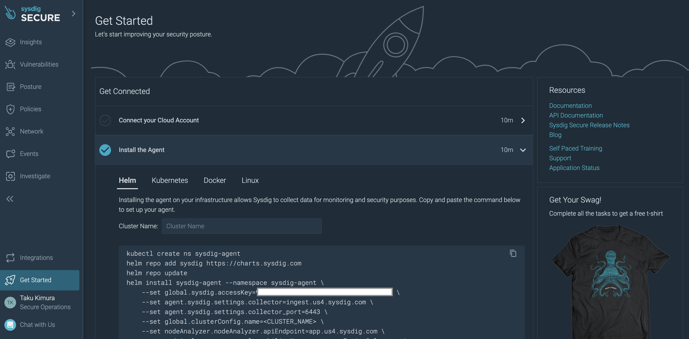
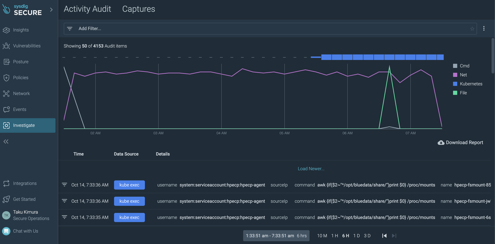

# Sysdig Agent インストール

## 事前要件

- HPE Ezmeral Runtimeがインストール済み
- HPE Ezmeral Runtimeでkubernetesクラスタが作成済み
- 端末にHelmがインストール済み
- Sysdig Platformが使えること(トライアルは[こちらから登録](https://sysdig.com/company/start-free/))

## インストール手順
Sysdig Agentをインストールするnamespace: **sysdig-agent**を作成します。

```
kubectl create ns sysdig-agent
```

EzmeralのAdmission Contorollerでこのnamespaceをチェックさせないようにラベルを振ります。(Sysdig agentが特権ユーザーとノードのルートディレクトリをマウントするから)

```
kubectl label ns sysdig-agent sysdig=true
```

Ezmeralのvalidatingwebhookconfigurations: **gatekeeper-validating-webhook-configuration**を編集します。

```
kubectl edit validatingwebhookconfigurations gatekeeper-validating-webhook-configuration
```

以下を追加してください。

```
  name: validation.gatekeeper.sh
  namespaceSelector:
    matchExpressions:
    - key: admission.gatekeeper.sh/ignore
      operator: DoesNotExist
    - key: sysdig <= 追加
      operator: DoesNotExist <=追加
```

次にEzmeralのvalidatingwebhookconfigurations: **hpecp-webhook**を編集します。

```bash
kubectl edit mutatingwebhookconfigurations  hpecp-webhook
```

以下を追加してください。

```yaml
  namespaceSelector:
    matchExpressions:
    - key: sysdig-agent <=追加
      operator: DoesNotExist <=追加
```

これでSysdig-agentをインストールする準備は整いました。Sysdig SecureにアクセスしてHelmインストールコマンドをコピペして実行してください。



Helmにてインストール後、AgentのPodが立ち上がったことがわかります。

```bash
$ kubectl get pod                                          
NAME                                          READY   STATUS    RESTARTS   AGE
sysdig-agent-4n74p                            1/1     Running   0          14h
sysdig-agent-74nh2                            1/1     Running   0          14h
sysdig-agent-dpgvr                            1/1     Running   0          14h
sysdig-agent-hgdpl                            1/1     Running   0          14h
sysdig-agent-kspmcollector-5784685f78-sxw97   1/1     Running   0          14h
sysdig-agent-node-analyzer-62vd9              3/3     Running   0          14h
sysdig-agent-node-analyzer-6qlfk              3/3     Running   0          14h
sysdig-agent-node-analyzer-f5wsj              3/3     Running   0          14h
sysdig-agent-node-analyzer-hwftm              3/3     Running   0          14h
sysdig-agent-node-analyzer-kl9jk              3/3     Running   0          14h
sysdig-agent-node-analyzer-zht4b              3/3     Running   0          14h
sysdig-agent-snn7j                            1/1     Running   0          14h
sysdig-agent-vprbl                            1/1     Running   0          14h
```

次にSysdig Admission Controllerも入れてみます。先ほどと同じ手順でnamespace: **sysdig-admission-controller**を作成してみます。

```bash
kubectl create ns sysdig-admission-controller
kubectl label ns sysdig-admission-controller sysdig=true
```

HelmでSysdig Admission Controllerをインストールします。API TokenはSysdig SecureのGUIから事前に取得しておいてください。

```bash
helm install sysdig-admission-controller sysdig/admission-controller -n sysdig-admission-controller \
--set sysdig.secureAPIToken=xxxxx-xxxxxx-xxxxxx-xxxxx-xxxxxx \
--set clusterName=HPE-Ezmeral \
--set sysdig.url=https://app.us4.sysdig.com \
--set features.k8sAuditDetections=true \
--set scanner.enabled=false \
--set webhook.autoscaling.minReplicas=1
```

しばらくするとPodが立ち上がってきます。
```bash
$ kubectl get pod                                          
NAME                                                   READY   STATUS    RESTARTS   AGE
sysdig-admission-controller-webhook-6d9b99864f-gdqp9   1/1     Running   0          124m
```

Sysdig SecureのGUIで適切なセキュリティポリシーを適用することで、Ezmeral k8sを高度に監視・管理することができます。

