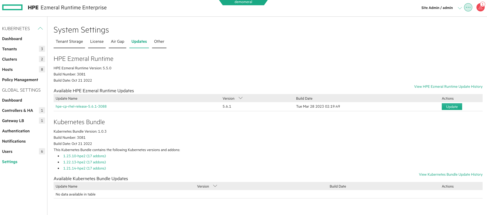
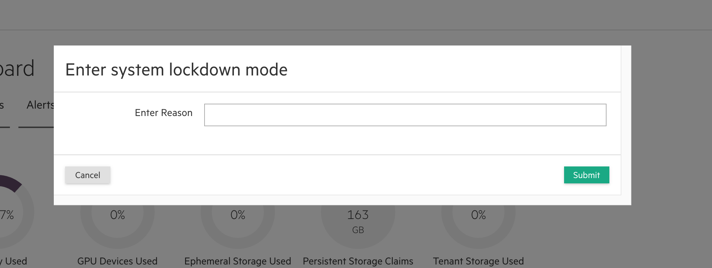
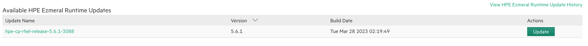
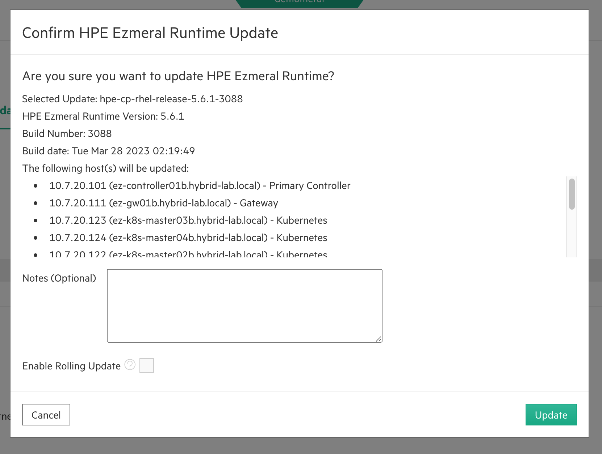
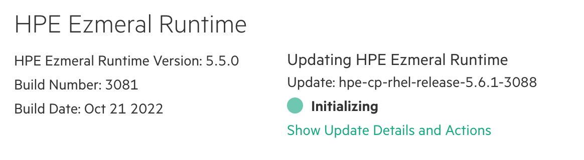
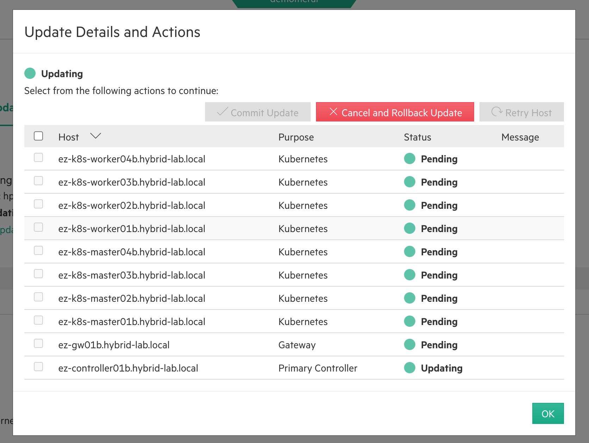
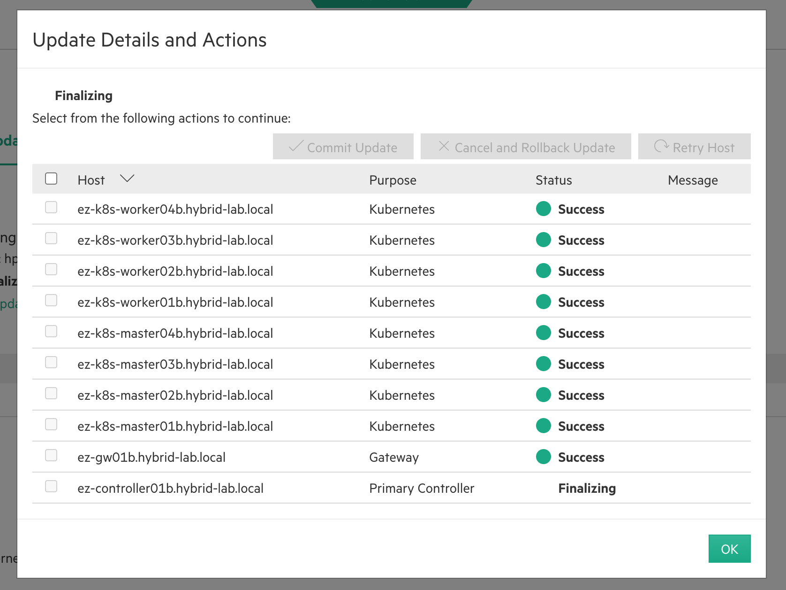
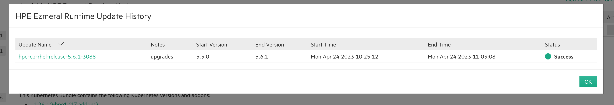
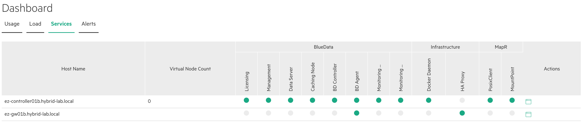
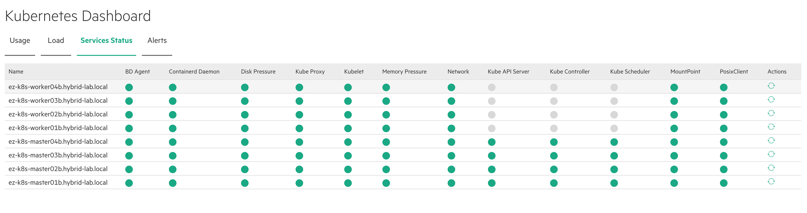

# HPE Runtime Enterpriseをアップグレードしてみる


## 要件
- Ezmeral Runtime5.6.0
- インターネット接続可能

今回のターゲットバージョンはEzmeral Runtime Enterprise 5.6.1です。

## ドキュメント
[Upgrading to HPE Ezmeral Runtime Enterprise 5.6.x](https://docs.ezmeral.hpe.com/runtime-enterprise/56/reference/upgrading-the-platform/upgrading-to-this-release.html)

## 手順
### Ezmeral Kubernetesのアップグレード
Platform全体をアップグレードする前にk8sクラスタを新プラットフォームバージョンがサポートする最小バージョンまでアップグレードをします。
プラットフォームバージョンとk8sクラスタバージョンのコンパチビリティリストは[こちら](https://docs.ezmeral.hpe.com/runtime-enterprise/56/home/about-hpe-ezmeral-container-pl/interoperability-matrixes/interoperability_matrixes.html)でチェックします。

```bash
$ kubectl version                                          
Client Version: version.Info{Major:"1", Minor:"23", GitVersion:"v1.23.10", GitCommit:"7e54d50d3012cf3389e43b096ba35300f36e0817", GitTreeState:"clean", BuildDate:"2022-08-17T18:32:54Z", GoVersion:"go1.17.13", Compiler:"gc", Platform:"darwin/amd64"}
Server Version: version.Info{Major:"1", Minor:"23+", GitVersion:"v1.23.10-hpe2", GitCommit:"7e54d50d3012cf3389e43b096ba35300f36e0817", GitTreeState:"clean", BuildDate:"2022-08-17T18:25:50Z", GoVersion:"go1.17.13", Compiler:"gc", Platform:"linux/amd64"}
```

既存のk8sクラスタバージョンは*v1.23.10-hpe2*となり、ターゲットとなるプラットフォームバージョン5.6.1でサポートされるk8sクラスタバージョンだったので、k8sクラスタのアップグレードはスキップします。

アップグレードが必要な場合はWeb GUIから簡単にk8sクラスタのアップグレードができます。ちなみに、ターゲットとなるプラットフォームがサポートするk8sクラスタバージョンがない場合は、k8s機能だけをアップグレードすることで、新しいk8sクラスタバージョンを使えるようになります。


### Ezmeralプラットフォームのアップグレード
#### 前準備
プラットフォーム全体のアップグレードを始める前に[OSのコンパチビリティ](https://docs.ezmeral.hpe.com/runtime-enterprise/56/home/about-hpe-ezmeral-container-pl/GEN_OS_Support.html)も確認します。
今回の検証環境ではCentOS7.9を使っているので、ターゲットとなるEzmeral Runtime Enterprise 5.6.1でもサポートされます。

アップグレードのためのバイナリパッケージを[HPE Software Center](https://myenterpriselicense.hpe.com/cwp-ui)からダウンロードしておきます。ダウンロードしたバイナリはコントローラーノードの*/srv/bluedata/bundles*に置いて、パーミッションも変更します。

```bash
Controller# pwd
/srv/bluedata/bundles

Controller# ls
hpe-cp-rhel-release-5.6.1-3088.bin

Controller# chmod 770 hpe-cp-rhel-release-5.6.1-3088.bin 
```

ここまでの準備が終わるとWeb GUIのSettings > Updatesで新しいバージョンのアップグレードパッケージが見えます。



#### プリチェック
**全ホスト(全ノード)**でプリチェックスクリプトを実行します。以下のURLからプリチェックスクリプトを入手できます。

- [RHEL/CentOS用プリチェックスクリプト5.6.1](https://ezmeral-platform-releases.s3.amazonaws.com/5.6.1/3088/hpe-cp-prechecks-rhel-5.6.1.bin)
- [SLES用プリチェックスクリプト5.6.1](https://ezmeral-platform-releases.s3.amazonaws.com/5.6.1/3088/hpe-cp-prechecks-sles-5.6.1.bin)


```bash
node# ls -lat
total 48
drwxr-xr-x 2 root root    45 Apr 24 09:21 .
drwxr-xr-x 5 root root    46 Apr 24 09:21 ..
-rw-r--r-- 1 root root 47238 Mar 28 06:46 hpe-cp-prechecks-rhel-5.6.1.bin

node# chmod 755 hpe-cp-prechecks-rhel-5.6.1.bin 

node]# ls -alt
total 48
drwxr-xr-x 2 root root    45 Apr 24 09:21 .
drwxr-xr-x 5 root root    46 Apr 24 09:21 ..
-rwxr-xr-x 1 root root 47238 Mar 28 06:46 hpe-cp-prechecks-rhel-5.6.1.bin
```

なんども言いますが、**全ホスト(全ノード)**で実行します。

```bash
node# ./hpe-cp-prechecks-rhel-5.6.1.bin --upgrade

Pre-install checks for HPE Ezmeral Container Platform 5.6.1

Datafabric checks.
	Checking Datafabric: PASSED.
  Total: 1  --  Failed: 0  --  Warning: 0  --  Forced(success): 0


Kubernetes checks.
	Checking Kubernetes cluster versions: PASSED.
  Total: 1  --  Failed: 0  --  Warning: 0  --  Forced(success): 0


Operating system configuration
	Checking OS Language: PASSED.
	Checking OS Family: PASSED.
	Checking running kernel version: PASSED.
	Checking SELinux setting: PASSED.
	Checking IPtables/Firewalld configuration: PASSED.
	Checking rsyslog setting: PASSED.
	Checking user and group specified: PASSED.
	Checking dnsmasq user and group specified: PASSED.
	Checking cgconfig kernel params: PASSED.
	Checking Checking for presence of erlang cookie: PASSED.
  Total: 10  --  Failed: 0  --  Warning: 0  --  Forced(success): 0


Services checks.
	Checking Monitoring status: PASSED.
	Checking HDFS status: PASSED.
	Checking MapR status: PASSED.
	Checking BDMGMT status: PASSED.
	Checking Data Server status: PASSED.
  Total: 5  --  Failed: 0  --  Warning: 0  --  Forced(success): 0


***************************************************************************
Aggregate tests summary:
             Total : 17
            Failed : 0
           Warning : 0
   Forced(success) : 0
Additional information for debugging is written to /tmp/bd_prechecks.31349.log
***************************************************************************
```

Failedの項目がなければOKです。

#### プラットフォームのアップグレード
プラットフォームを5.6.0 => 5.6.1へアップグレードします。Data Fabric on k8sを使っている場合は[こちら](https://docs.ezmeral.hpe.com/runtime-enterprise/56/reference/upgrading-the-platform/upgrading_data_fabric_clusters.html)の手順をのプラットフォームアップグレード前に実行してください。

アップグレード前にWeb GUIから*System Lockdownモード*に入ります。


Web GUIからSettings > Updatesを選択します。


*Update*ボタンを押します。


ステータスが*Initializing*になったらアップグレードスタートです。


ログは*/var/log/bluedata/install/Upgrade-XXXXXXXXX*に出力されます。

状況が気になる場合は、*Show Update Details and Actions*から見れます。下図ではコントローラーがアップグレードがされています。




アップデートが完了すると*Success*のステータスに変わります。見逃してしまった方はUpdate Historyから確認できます。


#### 事後確認
Controller, Gateway Node, k8s Node全てのステータスが緑になっていることを確認します。





*System Lockdownモード*を解除して完了です。
