# Ezmeral Unified Analytics 1.2を冗長構成でインストール

# 仕組み
インストールのために3つの役割のノードを作る必要があります。
- Installer: インストーラーを実行するDockerノード
- Coordinator: 実際にUA Clusterのインストールをハンドリングするk8s
- UA Cluster: 様々なSWを実行するk8s

```
┌──────────────────┐      ┌──────────────────┐      ┌──────────────────┐
│                  │      │                  │      │                  │
│    Installer     │      │    Coordinator   │      │    UA Cluster    │
│    (Docker)      ├──────► (Single node k8s)├──────►   (k8s Cluster)  │
│                  │      │                  │      │                  │
└──────────────────┘      └──────────────────┘      └──────────────────┘
```

# 要件
- Installer(Launcher) Node x1 (AMD64系LaptopでOK)
  - 2 vcpu
  - 4 GB RAM
  - Docker 20.10

- Coordinator Node x1 (本検証ではHPE Synergy上のKVM使用)
  - RHEL 8.8
  - 4 vcpu
  - 32 GB RAM
  - Nic x1
  - 500+ GB OS Disk

- UA Cluster Node (本検証ではHPE Synergy上のKVM使用)
  - Master(Control) Nodes x3 (非冗長構成の場合はx1)
    - RHEL 8.8
    - 4 vcpu
    - 32 GB RAM
    - Nic x1
    - 500+ GB OS Disk
  - Worker(Workload) Nodes x3
    - RHEL 8.8
    - 32 vcpu
    - 128 GB RAM
    - Nic x1
    - 500+ GB OS Disk
    - 500+ GB Data Raw Disk (ファイルシステム作らないでください)
    - GPUを使いたい場合は挿しとく (現段階ではNvidia A100のみのサポートです)
- LDAP/ADサーバー
- DNSサーバー
- NTPサーバー

コンテナイメージを取得するため、全てのノードはインターネット通信可能にしています。Airgap環境にも対応しています。

詳細な要件は[こちら](https://docs.ezmeral.hpe.com/unified-analytics/12/Installation/prereq-install-pph.html)に記載があります。

# 事前準備
- Installer Node用にLaptop等にDocker環境を用意する
- Coordinator/UA Cluster Node用にRHELの基本セットアップを実施する
  - 全てのノードで単一のssh keyを使ってrootログインできるようにする
  - DNSを介して名前解決できるようにする
  - NTPの時刻同期も忘れずに
- LDAP/ADサーバーにAdminユーザーを作成する
  - mailも設定する
- UA用ドメインを考える(インストール後にDNS設定)
  - TOP Level Domain(TLD)は使用しない
    - 例: ezua.yourcompany.com

# インスタレーション
## Installer Nodeでインストーラーを立ち上げる
[HPE Software Center](https://myenterpriselicense.hpe.com/cwp-ui/auth/login)からEzmeral Unified Analyticsのインストーラースクリプトを入手します。入手後、Installer Node上で展開してスクリプトを実行します。

```bash
$ cd S1U85-70012/

$ ls
start_ezua_installer_ui.sh

$ chmod 755 start_ezua_installer_ui.sh 

$ ./start_ezua_installer_ui.sh 
Starting install of HPE Ezmeral Unified Analytics
Note: If lauching behind a corporate proxy, ensure HTTP_PROXY, HTTPS_PROXY, and NO_PROXY are set properly before continuing
Do you want to continue? [y/n]: y
Starting installer
Checking Docker Install
Unable to find image 'us.gcr.io/mapr-252711/hpe-ezua-installer-ui:1.2.0-d16afb0' locally
1.2.0-d16afb0: Pulling from mapr-252711/hpe-ezua-installer-ui
d28605281af9: Pull complete 
bbf3c4368607: Pull complete 
ddfb00bf0580: Pull complete 
24a0f9bd9273: Pull complete 
4f4fb700ef54: Pull complete 
0cb9062e3961: Pull complete 
dc6603e7f266: Pull complete 
62c80dda53fb: Pull complete 
dbcfcdece54e: Pull complete 
e0537fa79c77: Pull complete 
ff1c56689086: Pull complete 
d1ee8f731ca0: Pull complete 
1954fad8d06b: Pull complete 
Digest: sha256:06ee9cb2fb51446b02a2402807528212b44efe8f6a079fede8218864040daaa9
Status: Downloaded newer image for us.gcr.io/mapr-252711/hpe-ezua-installer-ui:1.2.0-d16afb0
ca8cb42c71748daf47f5efaba593084afd0bf69d1e8371f3188fe2cc49f5d0ab
HPE Ezmeral Unified Analytics Software is ready to install at: http://localhost:8080

$ docker ps
CONTAINER ID   IMAGE                                                       COMMAND                  CREATED          STATUS          PORTS                                       NAMES
ca8cb42c7174   us.gcr.io/mapr-252711/hpe-ezua-installer-ui:1.2.0-d16afb0   "node /root/ezua-ins…"   28 minutes ago   Up 28 minutes   0.0.0.0:8080->8080/tcp, :::8080->8080/tcp   hpe-ezua-installer-ui

```

コンテナイメージを取得し、インストーラーが立ち上がることがわかります。インストール時のログを見るために、コンテナログをウォッチしておきます。


```bash
$ docker logs hpe-ezua-installer-ui -f
```

http://installer-node-ip:8080にアクセスして、インストーラーのGUIを開きます。

## インストーラーGUI
ここからはGUIを介した作業がメインになります。
Coordinator Nodeはない状況なので、上側の*Installation Using New Ezmeral Coordinator*を選択します。

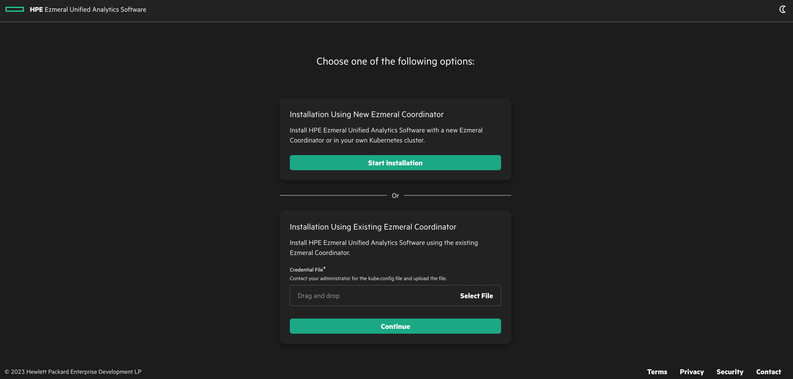 

自身の環境にあったターゲットを選択します。本検証環境はKVMなので、*VM*を選択します。

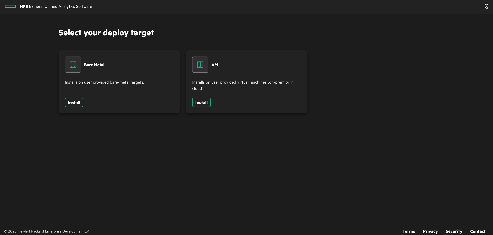 

### 認証設定
まずは各種ノードにアクセスするための認証設定をします。
OS設定時に作成したrootユーザーでアクセスできる単一のssh keyを準備し、*Manual Configuration*を選択します。
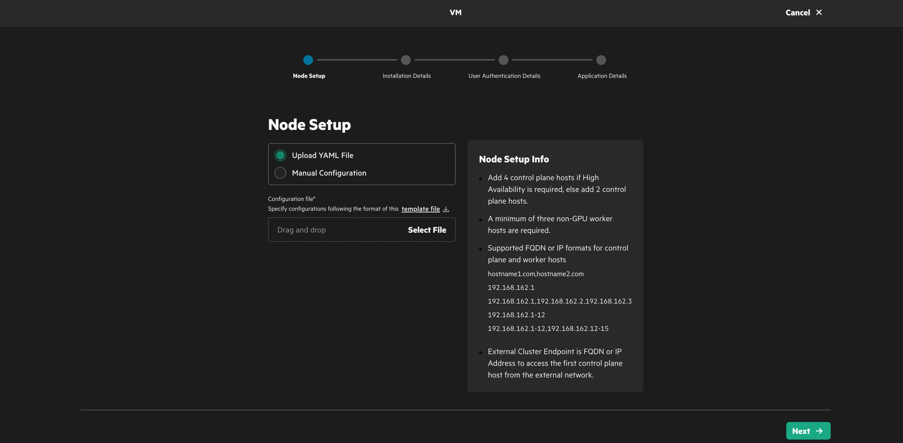

以下のように情報を入力します。注意点としては**Control Plane Hosts**はCoordinator NodeとUA Master Nodeの計４台を入力します。(非冗長構成の場合はCoordinator Node x1 + UA Master Node x1の２台を入力します。)
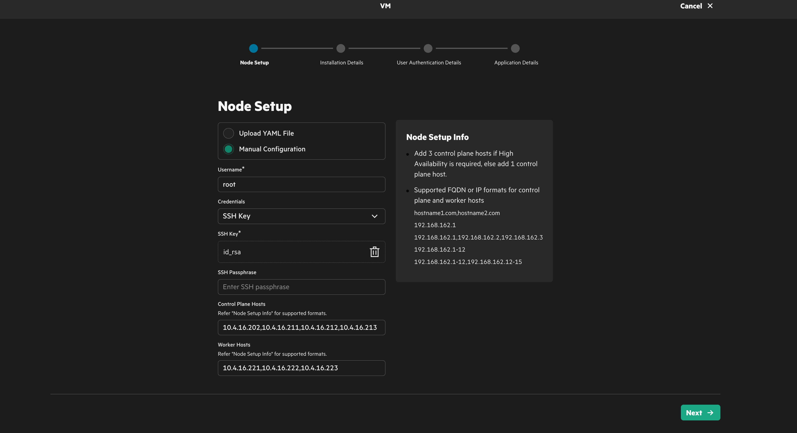 

### UA Cluster設定
クラスタ名やUAサービス用ドメイン名を指定します。ドメイン名は事前に考えたドメイン名にします。くれぐれも**TLDにしない**でください。今回は冗長構成なので、*High Availability*にします。GPUノードがある場合は*Use GPU*をチェックしてください。証明書は今回は自己証明書をつかうので、*Use Self Signed Certificate*をチェックします。
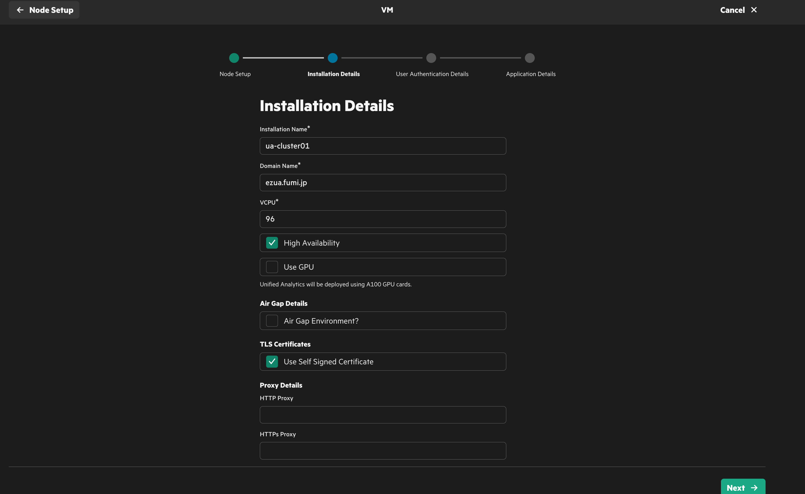 

### LDAP/AD設定
LDAP/ADの設定をします。今回はADではないので、*Active Directory?*はチェックしません。
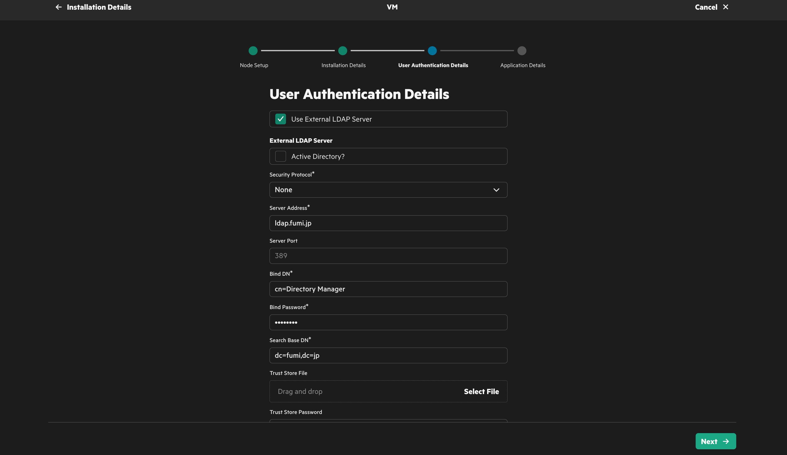 
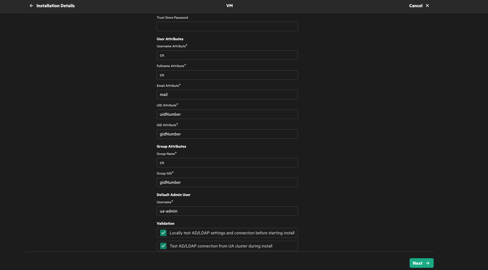 

### アプリケーション設定
UAに入れるアプリケーションは選択できませんので、そのまま*Submit*ボタンを押してください。
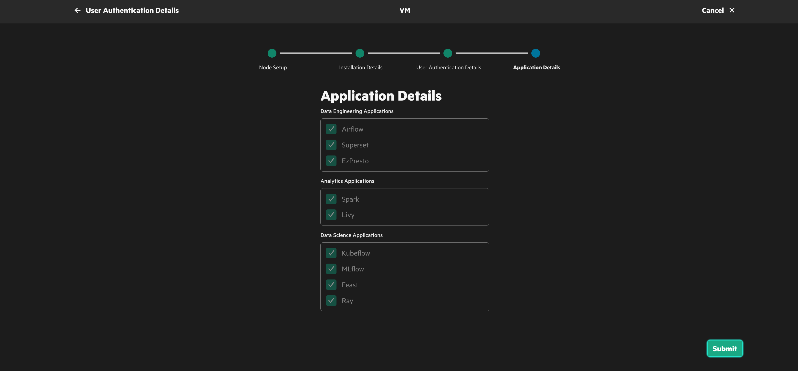

### インストールの開始
#### Coordinator Node
まずはCoordinator Nodeからインストールされます。
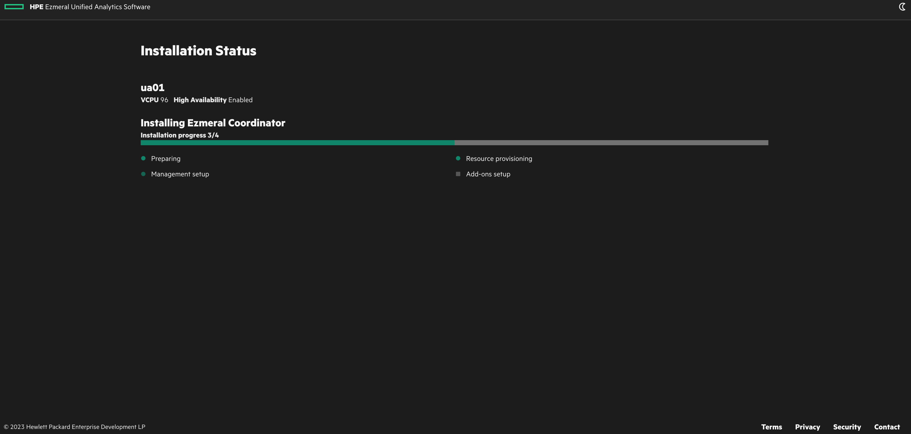
 
少し待ってからCoordinator Nodeにログインすると、k8s環境が立ち上がっていることがわかります。

```bash
$ kubectl get node
NAME                     STATUS   ROLES                  AGE     VERSION
ua-coordinator.fumi.jp   Ready    control-plane,master   4m39s   v1.25.14-hpe1

$ kubectl get po -A
NAMESPACE                 NAME                                                     READY   STATUS    RESTARTS        AGE
capi-system               capi-controller-manager-6c8bf95db7-qvgpq                 1/1     Running   1 (2m57s ago)   9m2s
cert-manager              cert-manager-747d5b5c5-8qxqx                             1/1     Running   0               9m30s
cert-manager              cert-manager-cainjector-7dc5974f7c-hpvzl                 1/1     Running   0               9m30s
cert-manager              cert-manager-webhook-b6fb758f-vpq5g                      1/1     Running   0               9m30s
ezaddon-system            ezaddon-controller-manager-86cf89546-n4fql               1/1     Running   1 (2m50s ago)   5m18s
ezkf-system               ezfabric-controller-manager-57b8b7d69-nzjb5              2/2     Running   1 (2m57s ago)   8m57s
ezkf-system               ezkf-bootstrap-controller-manager-78689db95f-dhlfv       2/2     Running   1 (2m57s ago)   9m1s
ezkf-system               ezkf-control-plane-controller-manager-59789445c6-5zv4b   2/2     Running   1 (2m57s ago)   9m
ezkf-system               ezkf-infrastructure-manager-86597f7c6d-sj5ss             2/2     Running   1 (2m57s ago)   8m59s
kube-system               calico-kube-controllers-68bbb56546-dnkwm                 1/1     Running   0               10m
kube-system               canal-master-q9c78                                       2/2     Running   0               10m
kube-system               coredns-8648b6f76-fnz4r                                  1/1     Running   0               9m32s
kube-system               coredns-8648b6f76-stnlm                                  1/1     Running   0               9m32s
longhorn-system           csi-attacher-5cbcbc5f74-pcblt                            1/1     Running   0               2m13s
longhorn-system           csi-provisioner-5466ccd89c-fs79q                         1/1     Running   0               2m13s
longhorn-system           csi-resizer-6954dcc4db-hgk56                             1/1     Running   0               2m13s
longhorn-system           csi-snapshotter-66c755c589-sb6nq                         1/1     Running   0               2m13s
longhorn-system           engine-image-ei-ec77b23d-zrgx9                           1/1     Running   0               3m49s
longhorn-system           instance-manager-e-25e5cb133fa2361d367bd43eb4c81b55      1/1     Running   0               3m49s
longhorn-system           instance-manager-r-25e5cb133fa2361d367bd43eb4c81b55      1/1     Running   0               3m49s
longhorn-system           longhorn-admission-webhook-77d9b998d5-4xlps              1/1     Running   0               4m46s
longhorn-system           longhorn-conversion-webhook-88dbc4749-8w8cg              1/1     Running   0               4m46s
longhorn-system           longhorn-csi-plugin-xp7bw                                3/3     Running   0               2m13s
longhorn-system           longhorn-driver-deployer-59f68f5b65-lql2t                1/1     Running   0               4m47s
longhorn-system           longhorn-manager-4r4hc                                   1/1     Running   0               4m47s
longhorn-system           longhorn-recovery-backend-6fbd68f78d-87wmg               1/1     Running   0               4m47s
longhorn-system           longhorn-ui-5b66c9c664-cpcqj                             1/1     Running   0               4m46s
mgmt-cluster-ops-system   mgmt-cluster-ops-controller-manager-6d955c48d6-nggq5     2/2     Running   0               3m45s

$ kubectl get ezcl -n ua-cluster01
NAME                   AGE
ua-cluster01           4m1s
```

#### UA Cluster: インフラストラクチャ
Coordinator Nodeが作成された後、UA Clusterのk8s基本アプリケーションがインストールされます。
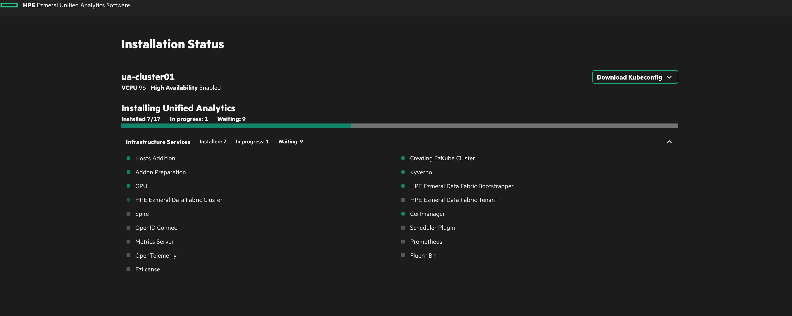

ちなみに、CoordinatorとUA Clusterのkubeconfigがここでダウンロードできます。
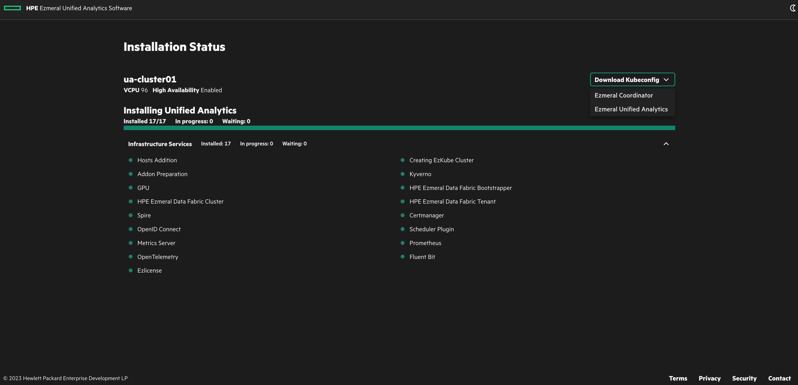

#### UA Cluster: アプリケーション
UA Clusterのk8sが出来上がったのち、実際に提供されるアプリケーション群がインストールされます。
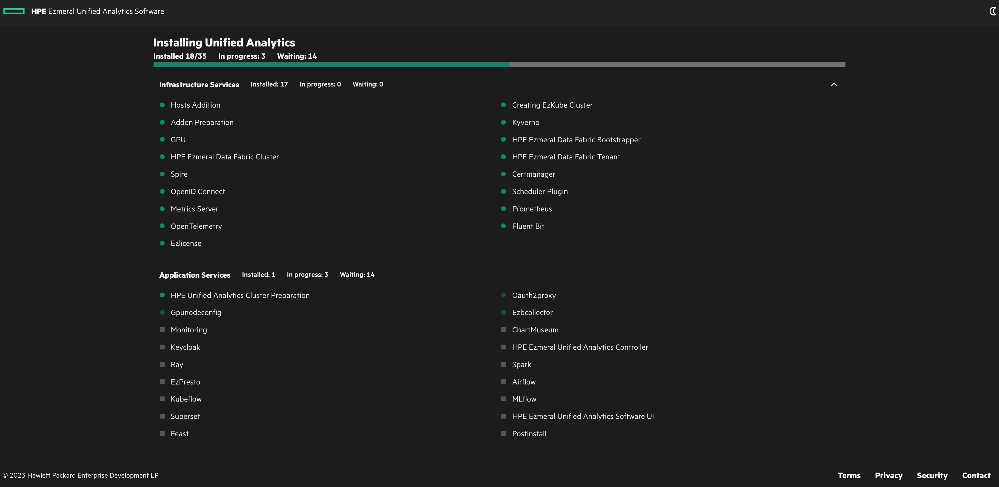

インストールが終了すると**Open HPE Ezmeral Unified Analytics Software**というボタンが現れます。このボタンを押す前に、上側の記されたIPアドレスをDNS内の自身が作成したUAドメインに設定します。
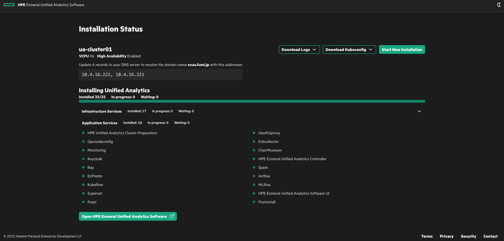

念の為、UA ClusterのMaster Nodeに入ってPodの状況を確認ください。
```bash
$ kubectl get pod -A   
NAMESPACE               NAME                                                     READY   STATUS      RESTARTS        AGE
airflow-base            af-base-postgres-0                                       1/1     Running     1 (13h ago)     14h
airflow-hpe             af-cluster-airflowui-0                                   2/2     Running     1 (13h ago)     14h
airflow-hpe             af-cluster-scheduler-0                                   2/2     Running     2 (13h ago)     14h
airflow-hpe             af-cluster-statsd-d64799998-7pxtx                        1/1     Running     0               14h
airflowop-system        airflowop-controller-manager-0                           1/1     Running     0               14h
cert-manager            cert-manager-7d6b44749c-w5bls                            1/1     Running     0               15h
cert-manager            cert-manager-cainjector-8665f75757-wgxdj                 1/1     Running     1 (13h ago)     15h
cert-manager            cert-manager-webhook-67d6c976cf-bcwqs                    1/1     Running     0               15h
dataplatform            admincli-0                                               1/1     Running     0               14h
dataplatform            cldb-0                                                   1/1     Running     0               14h
dataplatform            cldb-1                                                   1/1     Running     7 (14h ago)     15h
dataplatform            cldb-2                                                   1/1     Running     7 (14h ago)     15h
dataplatform            mcs-0                                                    1/1     Running     0               14h
dataplatform            objectstore-zone1-0                                      1/1     Running     0               14h
dataplatform            zk-0                                                     1/1     Running     0               15h
dataplatform            zk-1                                                     1/1     Running     0               15h
dataplatform            zk-2                                                     1/1     Running     0               15h
ez-chartmuseum-ns       chartmuseum-865bdc4d9f-tn9mg                             1/1     Running     0               14h
ezaddon-system          ezaddon-controller-manager-54fd487c5-jkkb5               1/1     Running     11 (108m ago)   15h
ezapp-system            ezapp-controller-manager-5f8bb97dc9-rxl4r                2/2     Running     6 (13h ago)     14h
ezapp-system            ezcentral-charts-updater-28325940-n7bnh                  0/1     Completed   0               6h53m
ezapp-system            ezcentral-charts-updater-28326000-78g7d                  0/1     Completed   0               5h53m
ezapp-system            ezcentral-charts-updater-28326060-6zctt                  0/1     Completed   0               4h53m
ezapp-system            ezcentral-charts-updater-28326120-fcl6v                  0/1     Completed   0               3h53m
ezapp-system            ezcentral-charts-updater-28326180-9j6pf                  0/1     Completed   0               173m
ezapp-system            ezcentral-charts-updater-28326240-lpq9q                  0/1     Completed   0               113m
ezapp-system            ezcentral-charts-updater-28326300-22mhg                  0/1     Completed   0               53m
ezbcollector-system     ezbcollector-controller-manager-6bd499c8-vjsbf           2/2     Running     8 (13h ago)     14h
ezbcollector-system     ezbcollector-download-echo-server-69fcf55cbf-w8rjq       2/2     Running     0               14h
ezdata-system           ezdata-controller-manager-545f784f7f-nz2j9               2/2     Running     9 (13h ago)     14h
ezdata-system           ezdata-csi-8ltl4                                         2/2     Running     0               14h
ezdata-system           ezdata-csi-fzj9k                                         2/2     Running     0               14h
ezdata-system           ezdata-csi-n9pc9                                         2/2     Running     0               14h
ezdata-system           local-df-dbbwd                                           1/1     Running     0               14h
ezdata-system           local-df-pbwzt                                           1/1     Running     0               14h
ezdata-system           local-df-tb2qw                                           1/1     Running     0               14h
ezdata-system           local-s3-deployment-6b958f9d8-bchdp                      1/1     Running     0               12h
ezlicense-system        ezlicense-controller-manager-687d456f5f-7sc9l            2/2     Running     9 (13h ago)     14h
ezpresto                ezpresto-dep-mysql-556cd4bd94-ml6md                      1/1     Running     1 (13h ago)     14h
ezpresto                ezpresto-dep-web-7c75478bff-jjgrj                        1/1     Running     0               14h
ezpresto                ezpresto-sts-mst-0                                       2/2     Running     0               14h
ezpresto                ezpresto-sts-wrk-0                                       1/1     Running     0               14h
ezpresto                ezpresto-sts-wrk-1                                       1/1     Running     0               13h
ezpresto                ezpresto-sts-wrk-2                                       1/1     Running     0               13h
ezuser-system           ezuser-controller-manager-75d4bb5db4-wt268               2/2     Running     10 (12h ago)    14h
feast                   feast-feast-feature-server-d5445bf6b-bshtr               1/1     Running     0               14h
feast                   feast-feast-ui-5d4c79cb87-pqsgk                          1/1     Running     0               14h
hpe-csi                 hpe-controller-kdf-0                                     7/7     Running     0               15h
hpe-csi                 hpe-csi-nodeplugin-42z2k                                 3/3     Running     0               15h
hpe-csi                 hpe-csi-nodeplugin-8zd4c                                 3/3     Running     0               15h
hpe-csi                 hpe-csi-nodeplugin-fbg5k                                 3/3     Running     0               15h
hpe-csi                 hpe-csi-nodeplugin-gr8vd                                 3/3     Running     0               15h
hpe-csi                 hpe-csi-nodeplugin-rdc4j                                 3/3     Running     0               15h
hpe-csi                 hpe-csi-nodeplugin-v9r8k                                 3/3     Running     0               15h
hpe-nodesvc             nodeservice-2tz5f                                        1/1     Running     0               15h
hpe-nodesvc             nodeservice-k2jcp                                        1/1     Running     0               15h
hpe-nodesvc             nodeservice-vnpd4                                        1/1     Running     0               15h
hpe-scheduler-plugins   scheduler-plugins-controller-6464875c7c-mxrwp            1/1     Running     0               14h
hpe-scheduler-plugins   scheduler-plugins-scheduler-58f87b8679-rn67v             1/1     Running     0               14h
hpe-system              dataplatform-validator-856976585c-fgsrp                  1/1     Running     0               15h
hpe-system              dataplatformoperator-74f46b5c55-m4ttc                    1/1     Running     0               15h
hpe-tenant              tenant-validator-6bc445f449-tx4rk                        1/1     Running     0               14h
hpe-tenant              tenantoperator-664cd95d6f-v6ttr                          1/1     Running     0               14h
hpecp-gpu-operator      gpu-node-feature-discovery-master-69dcb9f459-2xxll       1/1     Running     0               15h
hpecp-gpu-operator      gpu-node-feature-discovery-worker-6w7d9                  1/1     Running     0               15h
hpecp-gpu-operator      gpu-node-feature-discovery-worker-9lvr9                  1/1     Running     0               15h
hpecp-gpu-operator      gpu-node-feature-discovery-worker-xt5f9                  1/1     Running     0               15h
hpecp-gpu-operator      gpu-operator-6854bfcf64-zb7s7                            1/1     Running     8 (13h ago)     15h
hpecp-gpunodeconfig     gpunodeconfig-controller-manager-55878895d8-gwc2p        1/1     Running     9 (13h ago)     14h
istio-system            istio-ingressgateway-6588d46b55-cqrs4                    1/1     Running     0               14h
istio-system            istio-ingressgateway-6588d46b55-p2rjl                    1/1     Running     0               14h
istio-system            istiod-7d894c47-7xkhh                                    1/1     Running     0               14h
istio-system            istiod-7d894c47-fvl9t                                    1/1     Running     1 (14h ago)     14h
keycloak                keycloak-0                                               2/2     Running     3 (14h ago)     14h
keycloak                keycloak-postgresql-0                                    2/2     Running     0               14h
knative-eventing        eventing-controller-6f789b44b-jlqbq                      1/1     Running     0               12h
knative-eventing        eventing-webhook-864c757d88-r2p7v                        1/1     Running     0               12h
knative-serving         activator-5769fd4975-mw4dg                               2/2     Running     0               12h
knative-serving         autoscaler-576fd7f45-zxcf7                               2/2     Running     0               12h
knative-serving         controller-5bb9979f-k29gx                                1/1     Running     0               12h
knative-serving         domain-mapping-5c84549f76-zbjhx                          2/2     Running     0               12h
knative-serving         domainmapping-webhook-5c59997bf5-cgbb5                   2/2     Running     0               12h
knative-serving         net-istio-controller-9d755659c-tc9v7                     2/2     Running     0               12h
knative-serving         net-istio-webhook-7d567c9794-ncdgf                       2/2     Running     0               12h
knative-serving         webhook-77c6c44dd4-nqb9h                                 2/2     Running     0               12h
kube-system             calico-kube-controllers-68bbb56546-242tp                 1/1     Running     0               15h
kube-system             canal-master-gqnp2                                       2/2     Running     0               15h
kube-system             canal-master-pg242                                       2/2     Running     0               15h
kube-system             canal-master-whjq5                                       2/2     Running     0               15h
kube-system             canal-worker-t5cmf                                       2/2     Running     0               15h
kube-system             canal-worker-xx7n5                                       2/2     Running     0               15h
kube-system             canal-worker-xz6km                                       2/2     Running     0               15h
kube-system             coredns-64b6b6fdc5-cvmjn                                 1/1     Running     0               14h
kube-system             coredns-64b6b6fdc5-p59zb                                 1/1     Running     0               14h
kube-system             istio-cni-node-4vf4r                                     1/1     Running     0               14h
kube-system             istio-cni-node-98kcp                                     1/1     Running     0               14h
kube-system             istio-cni-node-dj8cf                                     1/1     Running     0               14h
kube-system             istio-cni-node-hf2hn                                     1/1     Running     0               14h
kube-system             istio-cni-node-mtt4s                                     1/1     Running     0               14h
kube-system             istio-cni-node-mzgjw                                     1/1     Running     0               14h
kube-system             metrics-server-587f8bc59f-lk66n                          1/1     Running     0               14h
kubeflow                admission-webhook-deployment-74c96686d4-wfcgm            1/1     Running     0               12h
kubeflow                cache-deployer-deployment-56d4cdf4f7-q6rtr               2/2     Running     0               12h
kubeflow                cache-server-7b849897c5-zvzx9                            2/2     Running     0               12h
kubeflow                centraldashboard-67dbc8fb5d-tbzlk                        2/2     Running     0               12h
kubeflow                jupyter-web-app-deployment-79694bfd94-n4fqx              2/2     Running     0               12h
kubeflow                katib-controller-945d64c58-gsjv9                         1/1     Running     0               12h
kubeflow                katib-db-manager-7d5c8f5f54-qblzl                        1/1     Running     1 (12h ago)     12h
kubeflow                katib-mysql-65589c6556-kbn2g                             1/1     Running     0               12h
kubeflow                katib-ui-64d4ff5db6-9k86w                                2/2     Running     1 (12h ago)     12h
kubeflow                kf-audit-log-watcher-698498fb59-xtjdd                    1/1     Running     0               12h
kubeflow                kserve-controller-manager-6879b86545-7xjvb               2/2     Running     1 (108m ago)    12h
kubeflow                kserve-models-web-app-d74857586-5wpvx                    2/2     Running     0               12h
kubeflow                kubeflow-pipelines-profile-controller-6857cb65dd-vcv5x   1/1     Running     0               12h
kubeflow                metacontroller-0                                         1/1     Running     0               12h
kubeflow                metadata-envoy-deployment-6f8d8fccb7-4442q               1/1     Running     0               12h
kubeflow                metadata-grpc-deployment-756f479dd9-6q47d                2/2     Running     3 (12h ago)     12h
kubeflow                metadata-writer-7fb45845d6-rc5fg                         2/2     Running     1 (12h ago)     12h
kubeflow                minio-87cfddf84-4brwb                                    2/2     Running     0               12h
kubeflow                minio-console-6b854c8f58-bt2b7                           1/1     Running     0               12h
kubeflow                ml-pipeline-5778c659bf-54j64                             2/2     Running     1 (12h ago)     12h
kubeflow                ml-pipeline-persistenceagent-5c6cfbfcb4-hcjfw            2/2     Running     0               12h
kubeflow                ml-pipeline-scheduledworkflow-567699665-c9bbf            2/2     Running     0               12h
kubeflow                ml-pipeline-ui-69b796f9b8-257ph                          2/2     Running     0               12h
kubeflow                ml-pipeline-viewer-crd-7b97fc7f4b-h8snp                  2/2     Running     1 (12h ago)     12h
kubeflow                ml-pipeline-visualizationserver-64ff98b64f-m8fkc         2/2     Running     0               12h
kubeflow                mysql-6497fb4f4f-2qfgs                                   2/2     Running     0               12h
kubeflow                notebook-controller-deployment-55c4b66b55-2kwdj          1/1     Running     0               12h
kubeflow                profiles-deployment-57558bc95f-jfhm8                     3/3     Running     1 (12h ago)     12h
kubeflow                tensorboard-controller-deployment-5bcdc56d6d-lhn9w       3/3     Running     1 (12h ago)     12h
kubeflow                tensorboards-web-app-deployment-6bfc49b6ff-trjpq         2/2     Running     0               12h
kubeflow                training-operator-6c6b75c665-rvz9h                       1/1     Running     0               12h
kubeflow                volumes-web-app-deployment-58d96cb7c4-m5nf8              2/2     Running     0               12h
kubeflow                workflow-controller-7dbfb9cf55-tk5kl                     2/2     Running     2 (107m ago)    12h
kuberay                 kuberay-head-2dg8d                                       2/2     Running     0               14h
kuberay                 kuberay-operator-76656bb6cb-nrc4m                        1/1     Running     8 (13h ago)     14h
kuberay                 kuberay-worker-smallgroup-76ss2                          1/1     Running     0               14h
kyverno                 kyverno-admission-controller-796d8b6d59-xnh6c            1/1     Running     0               15h
kyverno                 kyverno-background-controller-547cd4c9dc-bmvts           1/1     Running     0               15h
kyverno                 kyverno-cleanup-controller-5749dd8d75-lcpfj              1/1     Running     11 (13h ago)    15h
kyverno                 kyverno-reports-controller-8b489b57d-clqzz               1/1     Running     0               15h
mlflow                  mlflow-684bbb6b99-ntl68                                  1/1     Running     0               14h
monitoring              fluentbit-28kc2                                          1/1     Running     0               14h
monitoring              fluentbit-bfz2n                                          1/1     Running     0               14h
monitoring              fluentbit-pcp8n                                          1/1     Running     0               14h
monitoring              fluentbit-pln6t                                          1/1     Running     0               14h
monitoring              fluentbit-sh5sf                                          1/1     Running     0               14h
monitoring              fluentbit-tphf9                                          1/1     Running     0               14h
monitoring              logrotate-containerd-5nh4p                               1/1     Running     0               14h
monitoring              logrotate-containerd-6xgf6                               1/1     Running     0               14h
monitoring              logrotate-containerd-cbqqw                               1/1     Running     0               14h
monitoring              logrotate-containerd-mdfts                               1/1     Running     0               14h
monitoring              logrotate-containerd-q7gcr                               1/1     Running     0               14h
monitoring              logrotate-containerd-sl7rl                               1/1     Running     0               14h
monitoring              logrotate-fluentbit-6cd87f6fc-wsv4f                      1/1     Running     0               14h
monitoring              opentelemetry-operator-65bff58c87-l8pbx                  2/2     Running     0               14h
monitoring              otel-collector-otel-collector-87789c84f-n6zd5            1/1     Running     0               14h
monitoring              ua-application-metrics-generate-cronjob-28326180-wm97b   0/1     Completed   0               173m
monitoring              ua-application-metrics-generate-cronjob-28326240-hmtvl   0/1     Completed   0               113m
monitoring              ua-application-metrics-generate-cronjob-28326300-jsz76   0/1     Completed   0               53m
monitoring              ua-monitor-deployment-6f545df7d-w9vnp                    1/1     Running     0               14h
oauth2-proxy            oauth2-proxy-c897b7bc4-gpddh                             2/2     Running     6 (14h ago)     14h
oauth2-proxy            oauth2-proxy-redis-master-0                              2/2     Running     0               14h
prometheus              alertmanager-prometheus-kube-prometheus-alertmanager-0   2/2     Running     0               14h
prometheus              prometheus-kube-prometheus-operator-56fb8c4d9c-mb9sj     1/1     Running     0               14h
prometheus              prometheus-kube-state-metrics-b8fd6c6b9-k5gfp            1/1     Running     0               14h
prometheus              prometheus-prometheus-kube-prometheus-prometheus-0       2/2     Running     2 (5h22m ago)   14h
prometheus              prometheus-prometheus-node-exporter-5h294                1/1     Running     0               14h
prometheus              prometheus-prometheus-node-exporter-d49mn                1/1     Running     0               14h
prometheus              prometheus-prometheus-node-exporter-mw44n                1/1     Running     0               14h
prometheus              prometheus-prometheus-node-exporter-nvt6f                1/1     Running     0               14h
prometheus              prometheus-prometheus-node-exporter-pf5s6                1/1     Running     0               14h
prometheus              prometheus-prometheus-node-exporter-ws9m5                1/1     Running     0               14h
prometheus              pushgateway-prometheus-pushgateway-546c4bb664-dvmns      1/1     Running     0               14h
spark                   autoticket-generator-b5565d5b4-8d2nt                     1/1     Running     0               13h
spark                   hpe-spark-operator-5c6f4d4dd9-8rxcg                      1/1     Running     1 (13h ago)     13h
spark                   livy-0                                                   2/2     Running     0               14h
spark                   sparkhs-78c98596cf-2dxpq                                 2/2     Running     0               13h
spark                   tenantcli-0                                              1/1     Running     0               14h
spire                   spire-agent-75l5j                                        3/3     Running     0               14h
spire                   spire-agent-cx24n                                        3/3     Running     0               14h
spire                   spire-agent-xdw8g                                        3/3     Running     0               14h
spire                   spire-server-5f58dcd47f-rknlt                            2/2     Running     10 (13h ago)    14h
superset                superset-5cfb5c7989-p7jgm                                1/1     Running     0               14h
superset                superset-celerybeat-76bddbd5dc-5l944                     1/1     Running     0               14h
superset                superset-postgresql-0                                    1/1     Running     0               14h
superset                superset-redis-master-0                                  1/1     Running     1 (13h ago)     14h
superset                superset-worker-674cb985b9-9tb2v                         1/1     Running     0               14h
superset                superset-worker-674cb985b9-fq977                         1/1     Running     1 (13h ago)     14h
superset                superset-worker-674cb985b9-skp98                         1/1     Running     0               14h
taku                    ml-pipeline-ui-artifact-69fc5c976c-5fstz                 2/2     Running     0               11h
taku                    ml-pipeline-visualizationserver-57c46744fb-tr9kj         2/2     Running     0               11h
taku                    taku-notebook-0                                          2/2     Running     0               11h
ua-admin                ml-pipeline-ui-artifact-69fc5c976c-rqmjt                 2/2     Running     0               12h
ua-admin                ml-pipeline-visualizationserver-57c46744fb-4wg77         2/2     Running     0               12h
ua-admin                ua-admin-notebook-0                                      2/2     Running     0               12h
ui                      app-ui-6b797fc6b6-t744s                                  3/3     Running     0               14h
```

## UA GUIアクセス
LDAP/ADに登録したUA管理者ユーザーでGUIにアクセスします。
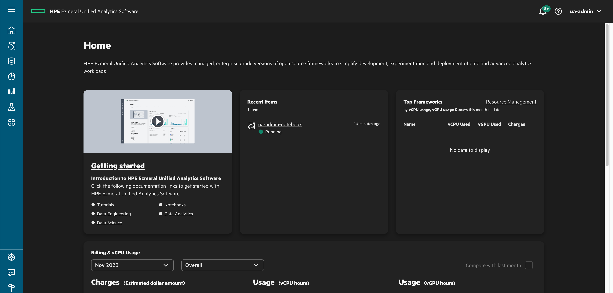
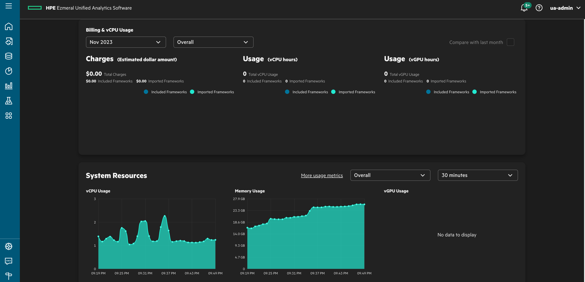

立ち上がってすぐは使用率がサンプリングされていないので、課金情報が表示されません。しばらくすると見れます。
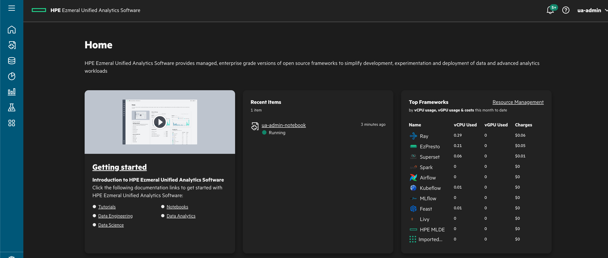

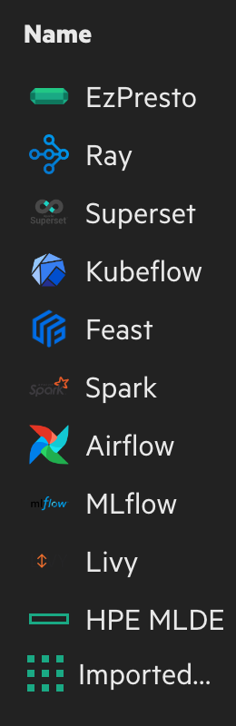

こんなに大量のOSSをエンタープライズサポート付きの従量課金で使用することができます。