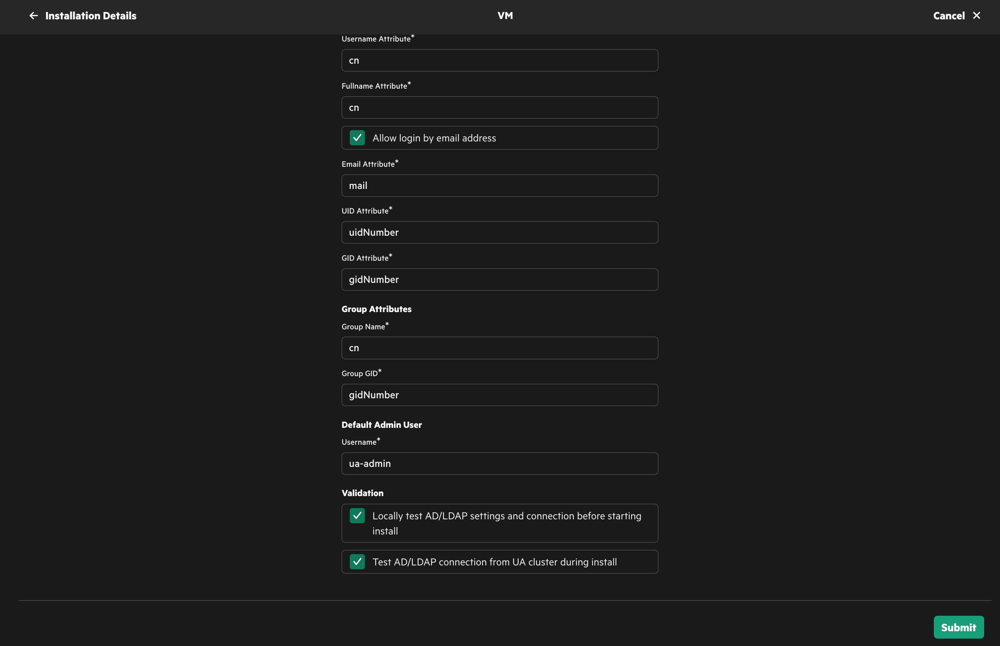

# Ezmeral Unified Analytics 1.4を冗長構成でインストール

## はじめに
基本要件・構成と手順は["Ezmeral Unified Analytics 1.2を冗長構成でインストール"](../installation_1_2)と同じですので、詳しい説明は1.2のインストール手順を確認ください。

今回の検証ではworker node x4としています。(最小は3台)

Ezmeral Unified Anlaytics 1.4から少しGUIインストーラーが変わりましたので、次のセクションでは画面ダンプのみを掲載しています。

## インストーラーGUI

 

※Precheckが必須となりました！

※Worker 4台のため、vCore 96 -> 97に変更しています。詳しい設定は[こちら](https://docs.ezmeral.hpe.com/unified-analytics/14/Installation/install-physhost-vm.html)。

※emailアドレスを使ったログイン可否が選択可能になりました！

## インストールのやり直し
ver 1.4からインスタレーション失敗時のための*Reset & Retry Installation*ボタンがサポートされました！

