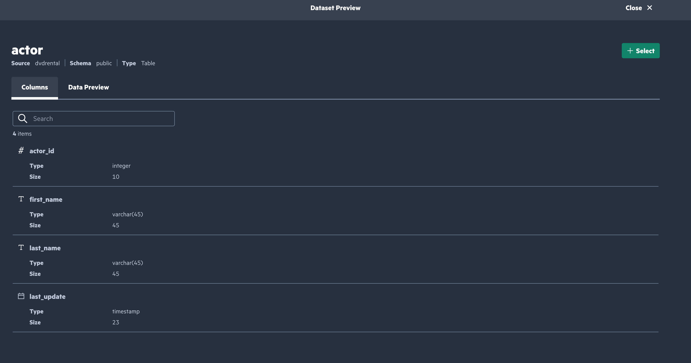

# Ezmeral Unified Analyticsのクエリエディターを使ってみる


## 要件

- HPE Ezmeral Unified Anlytics
- 接続する何かしらのDatabaseがあること

## 参考資料
- [HPE Ezmeral Unified Analytics Software Documentation](https://support.hpe.com/hpesc/public/docDisplay?docId=a00eaf10hen_us&page=GetStarted/get-started.html)


## データソースの追加
Ezmeral Unified Analyticsはデータエンジニアリング、分析、機械学習等の活動で必要となるデータソースへ[Presto](https://prestodb.io/)を使って接続し、データの可視化、カタログ化をします。

### データベースへの接続
Ezmeral Unified Analyticsにログインしてデータベースをデータソースとして追加します。左ペインから*Data Engineering > Data Sources*を選択してください。


右上の*Add New Data Source*を選択します。様々なデータベースがサポートされていることがわかります。


今回用意したデータベースはPostgreSQLですので、PostgreSQLの*Create Connection*を選択します。データベースの中にはサンプルデータとして[レンタルDVDの情報](https://www.postgresqltutorial.com/postgresql-getting-started/postgresql-sample-database/)を**dvdrental**というデータベースに格納しています。接続はJDBCとなるので、以下のような接続先情報を入力する必要があります。

```
jdbc:postgresql://<IP>:<Port>/<Table>
```

また、Prestoによるデータキャッシュを有効にするため、*Enable Local Snapshot Table*を有効にしておきます。*Optional Fields*はデフォルトのままで大丈夫です。


*Connect*ボタンを押すとデータソースが追加されます。


### データカタログの参照
*Data Engineering > Data Catalog*を選択し、接続したデータベースの中身をのぞいてみます。


１つテーブルをクリックします。カラム情報やデータのプレビューを参照できます。




### クエリの実行
データカタログに戻り、適当なテーブルを選択します。*Select*ボタンから選択が可能です。


*Slected Datasets > Query Editor*ボタンを押してクエリを実行します。


左に２つのテーブルのカラム情報が見えるので、その情報を元にJOINしてみます。

```
SELECT t1.actor_id, t1.first_name, t1.last_name, t2.film_info FROM
dvdrental.public.actor t1 INNER JOIN dvdrental.public.actor_info t2 ON
t2.actor_id=t2.actor_id
```


*RUN*からクエリ実行が可能です。下ペインでタスクの実行結果が確認できます。


### クエリの保存
右側*Actions*ボタンからクエリの保存ができます。


*Data Engineering > Cached Assets*を選択すると保存されたクエリを参照できます。


