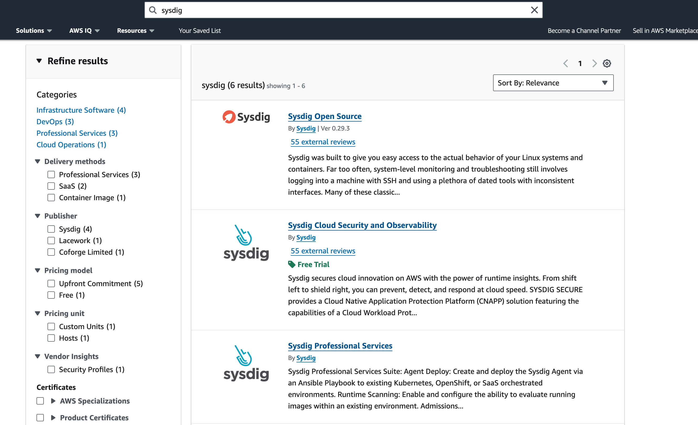
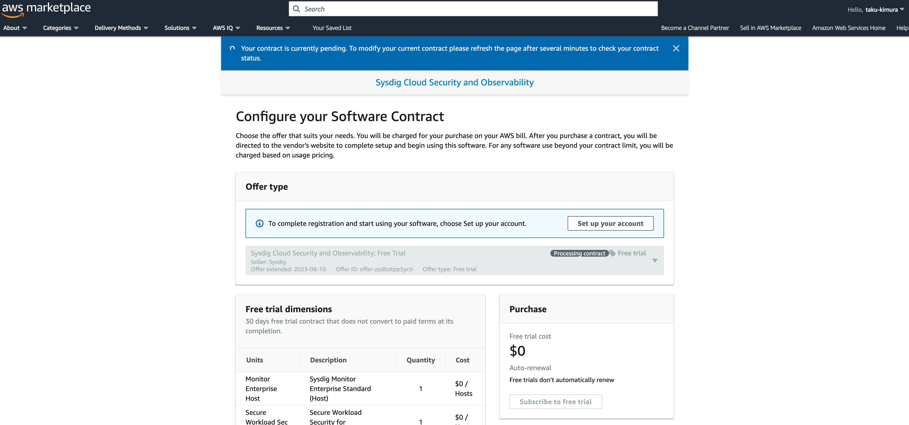
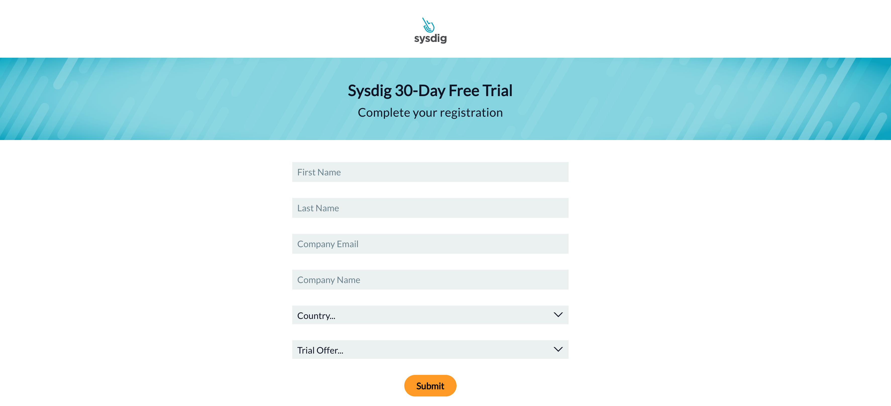
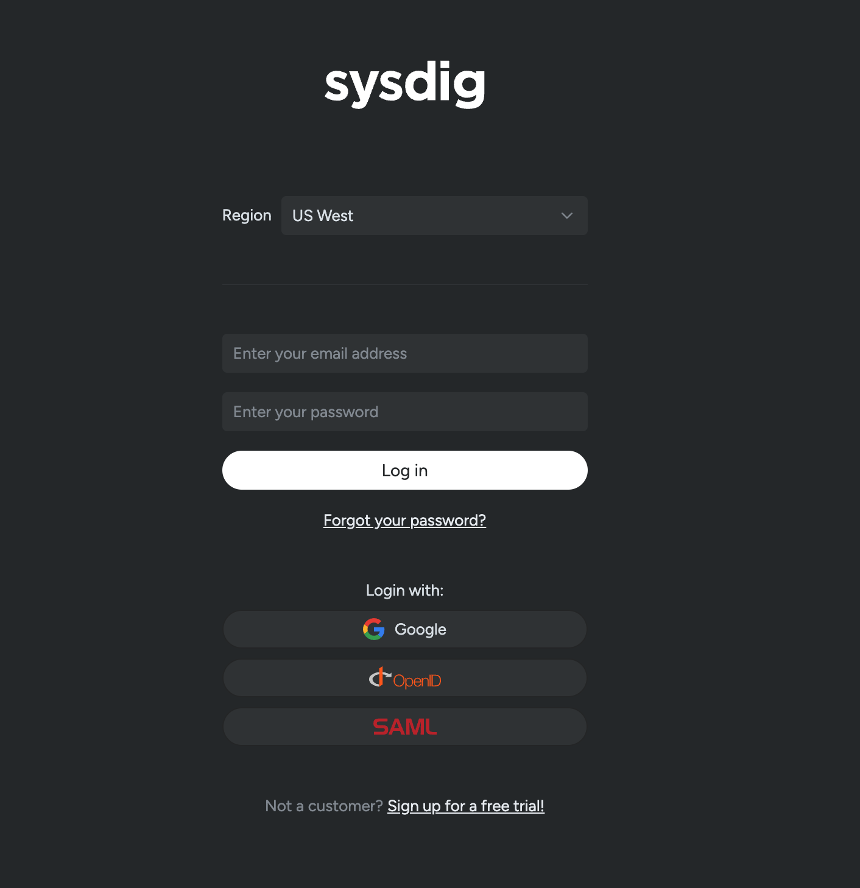
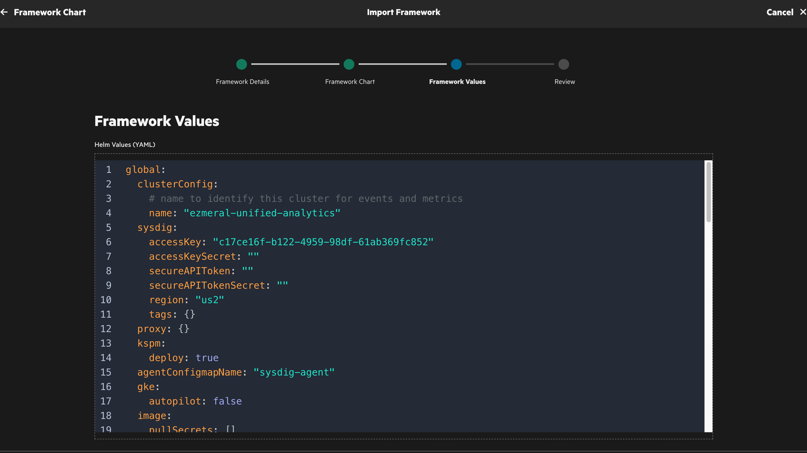
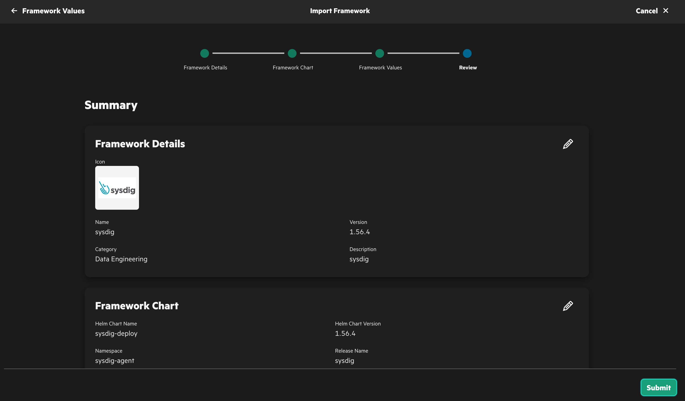
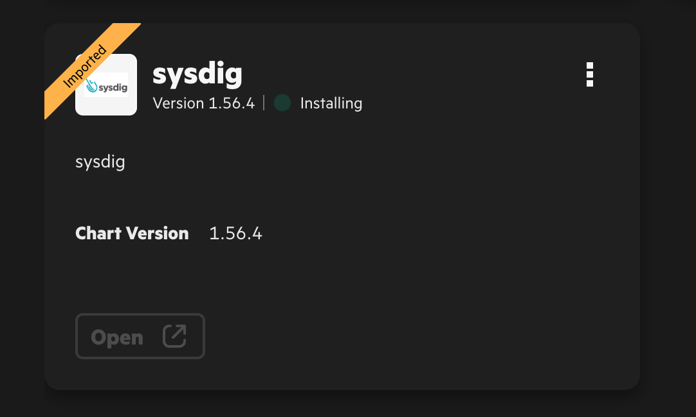
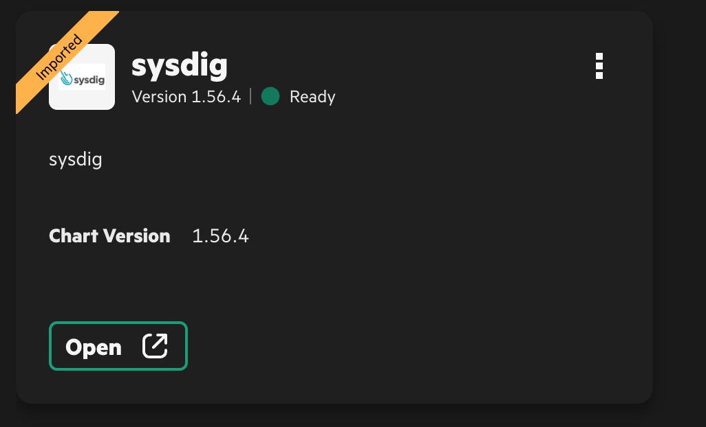
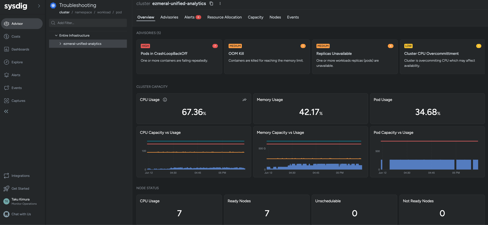

[English](./README_en.md)
# Ezmeral Unified AnalyticsにISVソフトウェアとしてSysdigをインストールする方法

## 前提条件
- HPE Ezmeral Unified Analyticsがインストール済みであること
- Helmが使える端末があること

## トライアル版Sysdig Security/Monitorの登録
AWSマーケットプレイスからSysdigを検索して、トライアル版の申請を行います。






数分待つとSysdigからアカウント登録メールが来るので登録します。

## Sysdigのインストール
Sysdigにログインします。


紐付けたいクラスタ種別を選択します。Ezmeral Unified Analyticsの場合は一番右の*Kubernetes Cluster*を選択します。


*Cluster Name*を入力して、表示されているコマンドを念の為にノートにコピペしておきます。


HELMが利用できる端末で、以下のコマンドを実行します。

```bash
helm repo add sysdig https://charts.sysdig.com
helm repo update
helm pull sysdig/sysdig-deploy
```

tar.gzファイルが生成されましたら、Ezmeral Unified AnalyticsにWebブラウザで接続する予定の端末にそのファイルを置きます。


Ezmeral Unified Analyticsのk8sクラスタにkubectlで接続して、*sysdig-agent*のネームスペースを作成します。

```bash
kubectl create ns sysdig-agent
```

Ezmeral Unified Analyticsに管理者ユーザーでログインして、*Tools & Frameworks*から*Import Framework*を選択します。
指示に従って、入力します。


先ほど、**helm pull**で作成したtar.gzファイルをアップロードします。


設定値を書き換えます。
設定値はsysdigにアクセスした際に出力されたvalueを全て入力します。必要なvalueの例は以下になります。

```bash
    --set global.sysdig.accessKey=XXXXXXXXXXXXXXXXXXXXXXX \
    --set global.sysdig.region=us2 \
    --set nodeAnalyzer.secure.vulnerabilityManagement.newEngineOnly=true \
    --set global.kspm.deploy=true \
    --set nodeAnalyzer.nodeAnalyzer.benchmarkRunner.deploy=false \
    --set global.clusterConfig.name=ezmeral-unified-analytics \
```

Ezmeral Unified AnalyticsのGUI上ではYAML形式になっているので、ネスト構造等に注意して記載します。

例: nodeAnalyzer.secure.vulnerabilityManagement.newEngineOnly=true

```yaml
nodeAnalyzer
  secure
    vulnerabilityManagement
      newEngineOnly: true
```



サブミットしてインストールを待ちます。





*Ready*になり、数分待ちましたらSysdigにアクセスして、クラスタが管理されているかを確認します。






これで、Ezmeral Unified Analyticsは更にセキュアな環境としてご利用いただけます。