[日本語](./README.md)
# Installing Sysdig agents into Ezmeral Unified Analytics as a ISV software

## Prerequisite
- HPE Ezmeral Unified Analytics
- Helm command

## Registration Sysdig Security/Monitor trial
Search Sysdig in AWS marketplace to register your account.

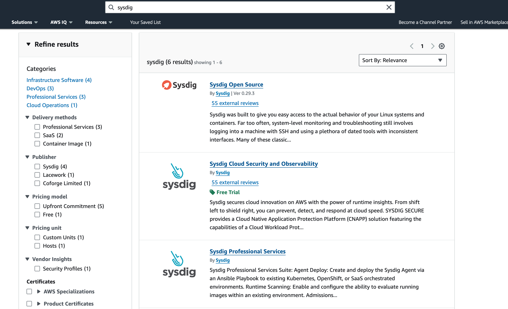
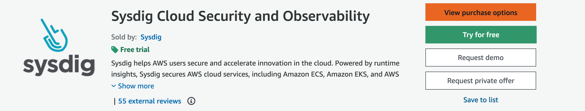
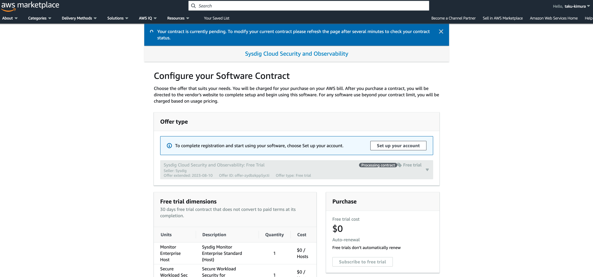
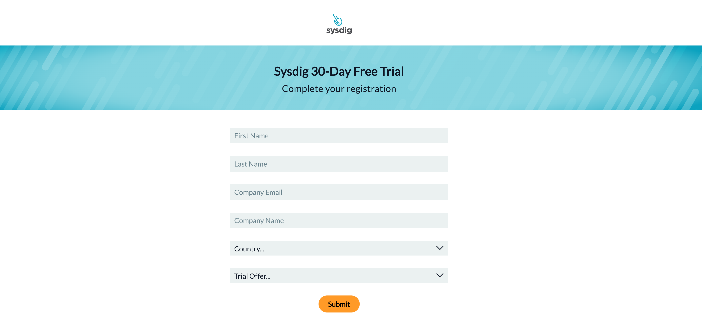

After a few moments, you can get a main from Sysdig. And then register your account.

## Sysdigのインストール
Login to Sysdig SaaS.
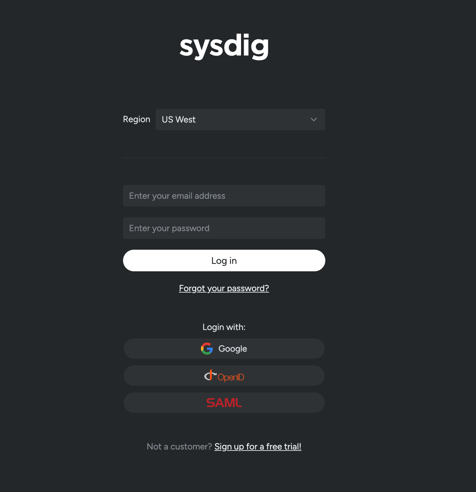

Choose your k8s cluster type. Need to choose *Kubernetes Cluster* for Ezmeral Unified Analytics k8s cluster.
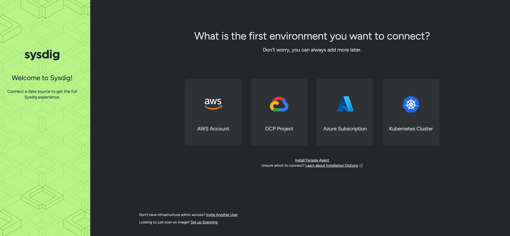

Put your *Cluster Name* and copy and paster the commands displayed to your notebook.
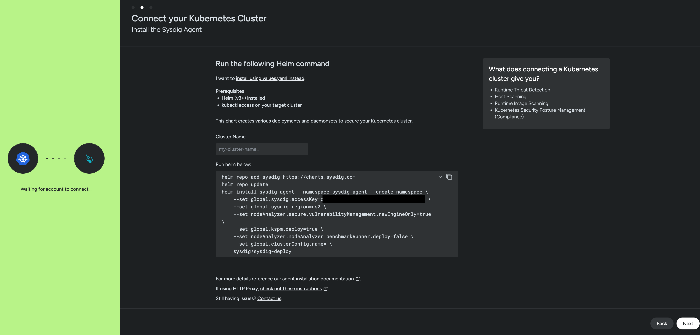

Execute below commands on the laptop or server installed HELM.

```bash
helm repo add sysdig https://charts.sysdig.com
helm repo update
helm pull sysdig/sysdig-deploy
```

After excuting these commands, you can see tar.gz file. Move to this file to your laptop which will access to the web UI of Ezmeral Unified Analytics.

And then, You need to create a namespace *sysdig-agent* for Sysdig by kubectl command.

```bash
k create ns sysdig-agent
```

Login to Ezmeral Unified Analytics as an admin user. Choose *Tools & Frameworks* and *Import Framework* to import Sysdig agent. 

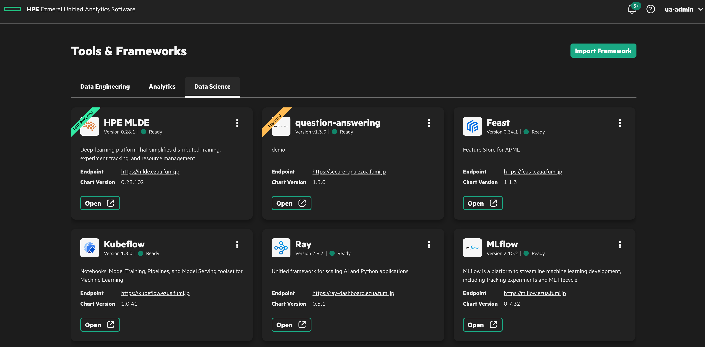
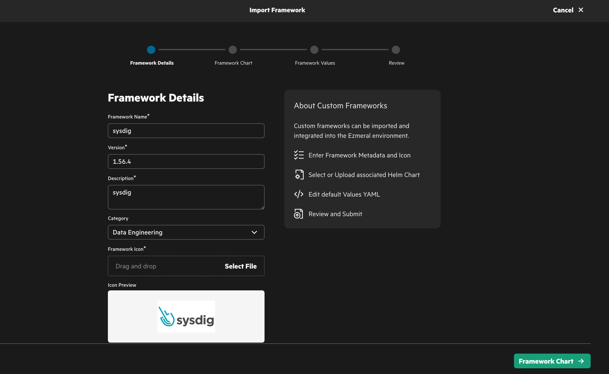

Upload tar.gz file made by **helm pull** on previous step.
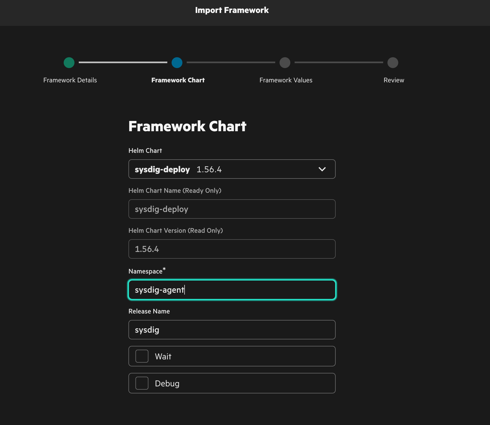

Set helm values. You can put these values as same as the command snipet showed in Sysdig GUI like below.

```bash
    --set global.sysdig.accessKey=XXXXXXXXXXXXXXXXXXXXXXX \
    --set global.sysdig.region=us2 \
    --set nodeAnalyzer.secure.vulnerabilityManagement.newEngineOnly=true \
    --set global.kspm.deploy=true \
    --set nodeAnalyzer.nodeAnalyzer.benchmarkRunner.deploy=false \
    --set global.clusterConfig.name=ezmeral-unified-analytics \
```

You need to pay attetion, you have to describe these values as a YAML.

Example: nodeAnalyzer.secure.vulnerabilityManagement.newEngineOnly=true

```yaml
nodeAnalyzer
  secure
    vulnerabilityManagement
      newEngineOnly: true
```

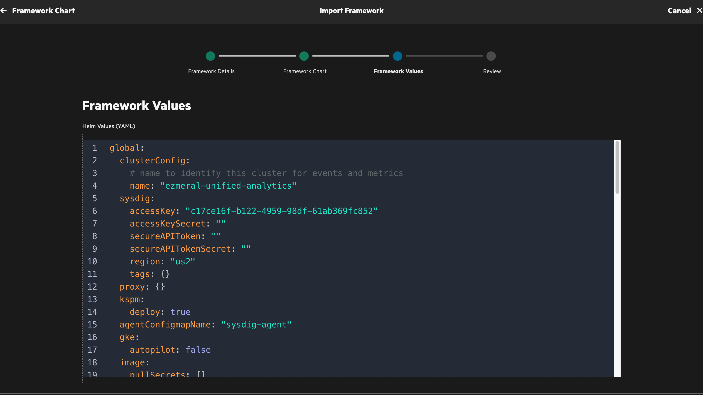

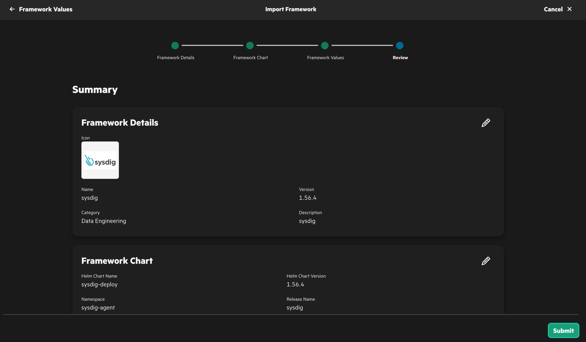

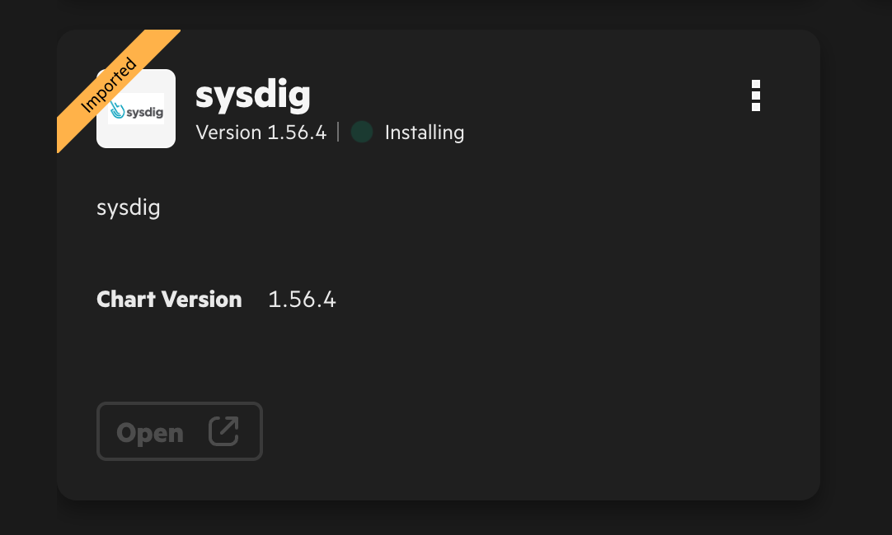

When the status is *Ready*, You can see the various information of Ezmeral Unified Analytics on Sysdig after a few minutes.


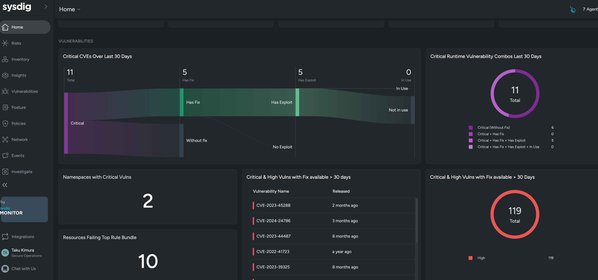
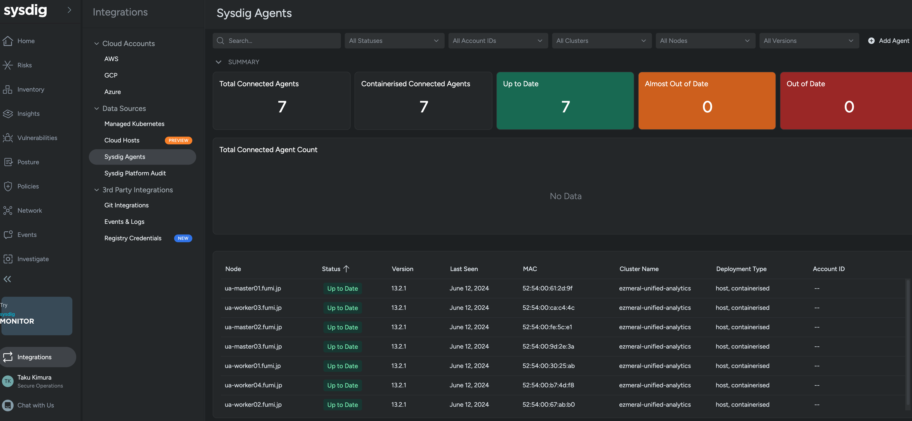
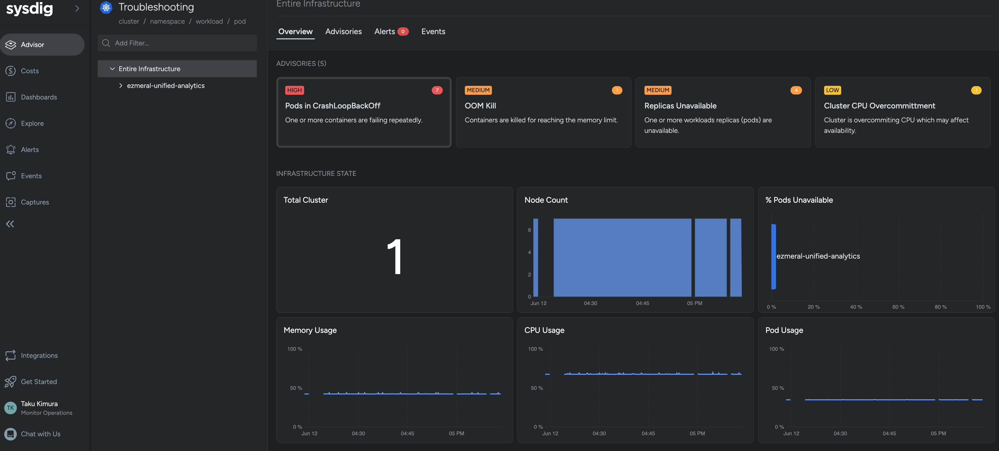
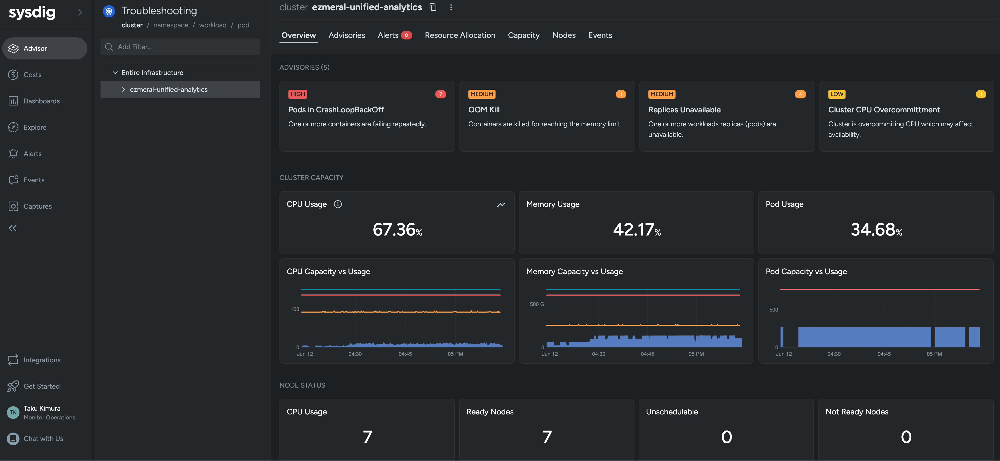

Now you can use Ezmeral Unified Analytics more security environment.