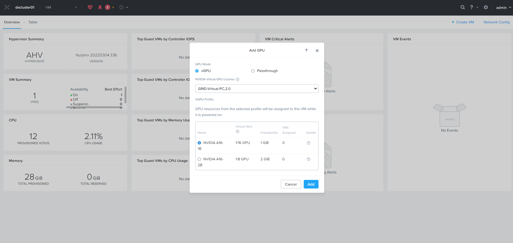

# Acropolis Hypervisor(AHV)上でvGPU Softwareを使ってみる
ProLiant DX(Nutanix Appliance)AHV上でvGPU機能を動かしてみましたので、下記にその方法をまとめます。

## 前提条件
**コンパチビリティの確認**
- [vGPU SoftwareとAOSバージョンのコンパチビリティ](https://portal.nutanix.com/page/downloads?product=ahv&bit=NVIDIA)
- [AOSでサポートしているGPU一覧](https://portal.nutanix.com/page/documents/details?targetId=AHV-Admin-Guide-v6_6:ahv-gpu-supported-cards-ahv-r.html)
- [対応しているGPUプロファイルの確認](https://portal.nutanix.com/page/documents/solutions/details?targetId=TN-2046-vGPU-on-Nutanix:TN-2046-vGPU-on-Nutanix)

例：A16に対応するvGPUプロファイル


**今回の検証環境**<br>
- DX380 Gen10 Plus + NVIDIA A16
  - AOS: AOS 6.5.1.8 LTS
  - AHV: 20220304.336
  - Guest VM: Windows Server 2022
  - vGPU Software v13.3

**※** その他参照ドキュメントはこちら<br>
---<br>
AHVでのvGPU Software適用手順：<br>
[NVIDIA GRID Host Driver for AHV Installation Guide](https://portal.nutanix.com/page/documents/details?targetId=NVIDIA-Grid-Host-Driver-For-AHV-Install-Guide:NVIDIA-Grid-Host-Driver-For-AHV-Install-Guide)<br>
---<br>

## 作業の流れ
①HWとしてGPUが認識しているかチェック<br>
①AHV/CVMにvGPU Softwareをインストール<br>
③Prism上からVMにvGPUをアサイン<br>
③ゲストVMにGPU Driverをインストール<br>
※別途Nutanix Clusterの構築（事前作業）、NVIDIA License Systemの構築（事後作業）は必要となります。


### ①HWとしてGPUが認識しているかチェック
AHV対応のvGPU Softwareをダウンロードします。<br>
[ダウンロードはこちら](https://portal.nutanix.com/page/downloads?product=ahv&bit=NVIDIA)


バージョンが細かく指定されているのでAHVのバージョンをきちんと確認しておく必要があります。
<br>

AHVからバージョン確認すると、**20220304.336**なので、<br>
それに該当するvGPU Driverを再度ダウンロード
```
[root@dx01 ~]# uname -r
5.10.139-2.el7.nutanix.20220304.336.x86_64
```

今回の該当ファイルはこちら。<br>


iLOからHWとしてGPUが認識しているか確認。<br>


Prism Element（AHVのGUI管理ツール）からもHWとしてGPUが認識しているか確認します。


AHVにSSHでアクセスし、HWとしてGPUが認識しているか確認します。
```
[root@dx01 ~]# lspci | grep -i nvidia
13:00.0 3D controller: NVIDIA Corporation Device 25b6 (rev a1)
14:00.0 3D controller: NVIDIA Corporation Device 25b6 (rev a1)
15:00.0 3D controller: NVIDIA Corporation Device 25b6 (rev a1)
16:00.0 3D controller: NVIDIA Corporation Device 25b6 (rev a1)
```

### ②CVM/AHVにvGPU Softwareをインストール
該当するDriverをCVM上に配置し、"tar"コマンドで解凍後、"install_host_package"コマンドを実行

```
nutanix@NTNX-SGH203XV7L-A-CVM:10.7.24.61:~/builds/nvidia-builds/5.10.139-2.el7.nutanix.20220304.336-470.129.04$ install_host_package -r nvidia-vgpu-5.10.139-2.el7.nutanix.20220304.336.x86_64-470.129.04-2.x86_64.rpm

VMs using a GPU must be powered off if their parent host is affected by this
install. If left running, these VMs will be automatically powered off when
installation begins on their parent host, and powered back on after the driver
install is completed.

VMs using vGPU will be migrated if their parent host is affected by this
install. However, some vGPU VMs might be automatically powered off due to lack
of resource when installation begins on their parent host, and powered back on
after the driver install is completed.

Install now (yes/no) yes
2023-01-25 14:37:12,432Z INFO MainThread install_host_package:221 Host GPU driver install       package nvidia-vgpu-5.10.139-2.el7.nutanix.20220304.336.x86_64-470.129.04-2.x86_64 is already installed
. Skipping installation on 10.7.24.71.
```
スキップされたけど既にDriverが当たっているように見えます。

nvidia driverがあたっているか確認します。
```
nutanix@NTNX-SGH203XV7L-A-CVM:10.7.24.61:~/builds/nvidia-builds/5.10.139-2.el7.nutanix.20220304.336-470.129.04$ hostssh "rpm -qa | grep -i nvidia"
============= 10.7.24.71 ============
nvidia-vgpu-5.10.139-2.el7.nutanix.20220304.336.x86_64-470.129.04-2.x86_64
```
OKそうです。

NCCでもヘルスチェックします。
```
nutanix@NTNX-SGH203XV7L-A-CVM:10.7.24.61:~/builds/nvidia-builds/5.10.139-2.el7.nutanix.20220304.336-470.129.04$ ncc health_checks hypervisor_checks gpu_driver_installed_check

####################################################
# TIMESTAMP : Wed Jan 25 23:38:28 2023 (UTC +0900) #
####################################################
Cluster Name: dxcluster01
Cluster Id: 7962615092282959560
Cluster UUID: 0005f2fb-0c60-853e-6e80-e43d1ab0a6c8
Cluster Version: 6.5.1.8
NCC Version: 4.6.1-8fb17d57
    CVM ID(Svmid)            : 3
    CVM external IP          : 10.7.24.61
    Hypervisor IP            : 10.7.24.71
    Hypervisor version       : Nutanix 20220304.336
    IPMI IP                  : 10.7.24.55
    Node serial              : SGH203XV7L
    Model                    : HPE DX380-12 G10 Plus
    Node Position            : A
    Block S/N                : SGH203XV7L


Running : health_checks hypervisor_checks gpu_driver_installed_check
[==================================================] 100%
/health_checks/hypervisor_checks/gpu_driver_installed_check                                                                                                                                                                         [ PASS ]
--------------------------------------------------------------------------------------------------------------------------------------------------------------------------------------------------------------------------------------------+
+-----------------------+
| State         | Count |
+-----------------------+
| Pass          | 1     |
| Total Plugins | 1     |
+-----------------------+
Plugin output written to /home/nutanix/data/logs/ncc-output-latest.log
```

nvidia-smiコマンドを実行します。
```
nutanix@NTNX-SGH203XV7L-A-CVM:10.7.24.61:~/builds/nvidia-builds/5.10.139-2.el7.nutanix.20220304.336-470.129.04$ hostssh nvidia-smi
============= 10.7.24.71 ============
Wed Jan 25 14:34:50 2023
+-----------------------------------------------------------------------------+
| NVIDIA-SMI 470.129.04   Driver Version: 470.129.04   CUDA Version: N/A      |
|-------------------------------+----------------------+----------------------+
| GPU  Name        Persistence-M| Bus-Id        Disp.A | Volatile Uncorr. ECC |
| Fan  Temp  Perf  Pwr:Usage/Cap|         Memory-Usage | GPU-Util  Compute M. |
|                               |                      |               MIG M. |
|===============================+======================+======================|
|   0  NVIDIA A16          On   | 00000000:13:00.0 Off |                    0 |
|  0%   48C    P8    16W /  62W |      0MiB / 15105MiB |      0%      Default |
|                               |                      |                  N/A |
+-------------------------------+----------------------+----------------------+
|   1  NVIDIA A16          On   | 00000000:14:00.0 Off |                    0 |
|  0%   50C    P8    16W /  62W |      0MiB / 15105MiB |      0%      Default |
|                               |                      |                  N/A |
+-------------------------------+----------------------+----------------------+
|   2  NVIDIA A16          On   | 00000000:15:00.0 Off |                    0 |
|  0%   42C    P8    15W /  62W |      0MiB / 15105MiB |      0%      Default |
|                               |                      |                  N/A |
+-------------------------------+----------------------+----------------------+
|   3  NVIDIA A16          On   | 00000000:16:00.0 Off |                    0 |
|  0%   39C    P8    15W /  62W |      0MiB / 15105MiB |      0%      Default |
|                               |                      |                  N/A |
+-------------------------------+----------------------+----------------------+

+-----------------------------------------------------------------------------+
| Processes:                                                                  |
|  GPU   GI   CI        PID   Type   Process name                  GPU Memory |
|        ID   ID                                                   Usage      |
|=============================================================================|
|  No running processes found                                                 |
+-----------------------------------------------------------------------------+
nutanix@NTNX-SGH203XV7L-A-CVM:10.7.24.61:~/builds/nvidia-builds/5.10.139-2.el7.nutanix.20220304.336-470.129.04$
```
きちんとA16 GPUが見えてます。A16は物理的にGPUが4つ搭載されているVDI特化型GPUなので、0～3と4つ見えていることが確認できました。

AHVにアクセスし、同様にGPUが認識するか確認します。
```
[root@dx01 ~]# nvidia-smi
Fri Feb 24 02:58:53 2023
+-----------------------------------------------------------------------------+
| NVIDIA-SMI 470.129.04   Driver Version: 470.129.04   CUDA Version: N/A      |
|-------------------------------+----------------------+----------------------+
| GPU  Name        Persistence-M| Bus-Id        Disp.A | Volatile Uncorr. ECC |
| Fan  Temp  Perf  Pwr:Usage/Cap|         Memory-Usage | GPU-Util  Compute M. |
|                               |                      |               MIG M. |
|===============================+======================+======================|
|   0  NVIDIA A16          On   | 00000000:13:00.0 Off |                    0 |
|  0%   47C    P8    16W /  62W |      0MiB / 15105MiB |      0%      Default |
|                               |                      |                  N/A |
+-------------------------------+----------------------+----------------------+
|   1  NVIDIA A16          On   | 00000000:14:00.0 Off |                    0 |
|  0%   49C    P8    16W /  62W |   1792MiB / 15105MiB |      0%      Default |
|                               |                      |                  N/A |
+-------------------------------+----------------------+----------------------+
|   2  NVIDIA A16          On   | 00000000:15:00.0 Off |                    0 |
|  0%   41C    P8    15W /  62W |      0MiB / 15105MiB |      0%      Default |
|                               |                      |                  N/A |
+-------------------------------+----------------------+----------------------+
|   3  NVIDIA A16          On   | 00000000:16:00.0 Off |                    0 |
|  0%   38C    P8    14W /  62W |      0MiB / 15105MiB |      0%      Default |
|                               |                      |                  N/A |
+-------------------------------+----------------------+----------------------+

+-----------------------------------------------------------------------------+
| Processes:                                                                  |
|  GPU   GI   CI        PID   Type   Process name                  GPU Memory |
|        ID   ID                                                   Usage      |
|=============================================================================|
|    1   N/A  N/A      3500    C+G   vgpu                              896MiB |
|    1   N/A  N/A     83254    C+G   vgpu                              896MiB |
+-----------------------------------------------------------------------------+
```

オプションLコマンドを利用することでA16の個別GPUがシンプルに確認できます。
```
[root@dx01 ~]# nvidia-smi -L
GPU 0: NVIDIA A16 (UUID: GPU-2039ae9a-7b32-009f-d7dc-b5acf0e7aaba)
GPU 1: NVIDIA A16 (UUID: GPU-4c81fa10-f611-4d5d-4f95-cf57270afbfa)
GPU 2: NVIDIA A16 (UUID: GPU-6d96ca7e-db97-dd7b-d18b-821c40747583)
GPU 3: NVIDIA A16 (UUID: GPU-b952c9a5-0ac8-26fb-a02d-60bcf9d0fe83)
```
GPU識別番号を選択し、下記コマンドを実行することでより詳細なログ情報も確認できます。
```
[root@dx01 ~]# nvidia-smi -i 0 -q

==============NVSMI LOG==============

Timestamp                                 : Fri Feb 24 03:00:54 2023
Driver Version                            : 470.129.04
CUDA Version                              : Not Found

Attached GPUs                             : 4
GPU 00000000:13:00.0
    Product Name                          : NVIDIA A16
    Product Brand                         : NVIDIA
    Display Mode                          : Enabled
    Display Active                        : Disabled
    Persistence Mode                      : Enabled
    MIG Mode
        Current                           : N/A
        Pending                           : N/A
    Accounting Mode                       : Enabled
    Accounting Mode Buffer Size           : 4000
    Driver Model
        Current                           : N/A
        Pending                           : N/A
    Serial Number                         : 1320322014845
    GPU UUID                              : GPU-2039ae9a-7b32-009f-d7dc-b5acf0e7aaba
    Minor Number                          : 0
    VBIOS Version                         : 94.07.54.00.01
    MultiGPU Board                        : Yes
    Board ID                              : 0x1100
    GPU Part Number                       : 900-2G171-0000-000
    Module ID                             : 0
    Inforom Version
        Image Version                     : G171.0200.00.04
        OEM Object                        : 2.0
        ECC Object                        : 6.16
        Power Management Object           : N/A
    GPU Operation Mode
        Current                           : N/A
        Pending                           : N/A
    GSP Firmware Version                  : N/A
    GPU Virtualization Mode
        Virtualization Mode               : Host VGPU
        Host VGPU Mode                    : SR-IOV
    IBMNPU
        Relaxed Ordering Mode             : N/A
    PCI
        Bus                               : 0x13
        Device                            : 0x00
        Domain                            : 0x0000
        Device Id                         : 0x25B610DE
        Bus Id                            : 00000000:13:00.0
        Sub System Id                     : 0x14A910DE
        GPU Link Info
            PCIe Generation
                Max                       : 4
                Current                   : 1
            Link Width
                Max                       : 16x
                Current                   : 4x
        Bridge Chip
            Type                          : N/A
            Firmware                      : N/A
        Replays Since Reset               : 0
        Replay Number Rollovers           : 0
        Tx Throughput                     : 0 KB/s
        Rx Throughput                     : 0 KB/s
    Fan Speed                             : 0 %
    Performance State                     : P8
    Clocks Throttle Reasons
        Idle                              : Active
        Applications Clocks Setting       : Not Active
        SW Power Cap                      : Not Active
        HW Slowdown                       : Not Active
            HW Thermal Slowdown           : Not Active
            HW Power Brake Slowdown       : Not Active
        Sync Boost                        : Not Active
        SW Thermal Slowdown               : Not Active
        Display Clock Setting             : Not Active
    FB Memory Usage
        Total                             : 15105 MiB
        Used                              : 0 MiB
        Free                              : 15105 MiB
    BAR1 Memory Usage
        Total                             : 16384 MiB
        Used                              : 1 MiB
        Free                              : 16383 MiB
    Compute Mode                          : Default
    Utilization
        Gpu                               : 0 %
        Memory                            : 0 %
        Encoder                           : 0 %
        Decoder                           : 0 %
    Encoder Stats
        Active Sessions                   : 0
        Average FPS                       : 0
        Average Latency                   : 0
    FBC Stats
        Active Sessions                   : 0
        Average FPS                       : 0
        Average Latency                   : 0
    Ecc Mode
        Current                           : Enabled
        Pending                           : Enabled
    ECC Errors
        Volatile
            SRAM Correctable              : 0
            SRAM Uncorrectable            : 0
            DRAM Correctable              : 0
            DRAM Uncorrectable            : 0
        Aggregate
            SRAM Correctable              : 0
            SRAM Uncorrectable            : 0
            DRAM Correctable              : 0
            DRAM Uncorrectable            : 0
    Retired Pages
        Single Bit ECC                    : N/A
        Double Bit ECC                    : N/A
        Pending Page Blacklist            : N/A
    Remapped Rows
        Correctable Error                 : 0
        Uncorrectable Error               : 0
        Pending                           : No
        Remapping Failure Occurred        : No
        Bank Remap Availability Histogram
            Max                           : 64 bank(s)
            High                          : 0 bank(s)
            Partial                       : 0 bank(s)
            Low                           : 0 bank(s)
            None                          : 0 bank(s)
    Temperature
        GPU Current Temp                  : 48 C
        GPU Shutdown Temp                 : 98 C
        GPU Slowdown Temp                 : 95 C
        GPU Max Operating Temp            : 88 C
        GPU Target Temperature            : N/A
        Memory Current Temp               : N/A
        Memory Max Operating Temp         : N/A
    Power Readings
        Power Management                  : Supported
        Power Draw                        : 16.41 W
        Power Limit                       : 62.50 W
        Default Power Limit               : 62.50 W
        Enforced Power Limit              : 62.50 W
        Min Power Limit                   : 48.75 W
        Max Power Limit                   : 62.50 W
    Clocks
        Graphics                          : 210 MHz
        SM                                : 210 MHz
        Memory                            : 405 MHz
        Video                             : 795 MHz
    Applications Clocks
        Graphics                          : 1755 MHz
        Memory                            : 6251 MHz
    Default Applications Clocks
        Graphics                          : 1755 MHz
        Memory                            : 6251 MHz
    Max Clocks
        Graphics                          : 1755 MHz
        SM                                : 1755 MHz
        Memory                            : 6251 MHz
        Video                             : 1635 MHz
    Max Customer Boost Clocks
        Graphics                          : 1755 MHz
    Clock Policy
        Auto Boost                        : N/A
        Auto Boost Default                : N/A
    Voltage
        Graphics                          : 662.500 mV
    Processes                             : None

```

### ③Prism上からVMにvGPUをアサイン
Prismにアクセスし、" + Create VM "をクリックします。<br>
”Add GPU”を選択すると、GPU Modeや使用可能なGPUプロファイルが確認できます。


ちなみにパススルーだとこんな感じで見えます。


vPCプロファイル（いわゆるベーシックVDI用）で次に進めてみます。

今回は1GBのフレームバッファをもったプロファイルで実行します。


適切なDriverがホストに適用されているか再度確認されます。<br>
最後にBoot Optionですが、必ず”**UEFI**”モードで実施する必要があります。<br>
Legacy BIOSだとゲストOSドライバーが認識せず使用できませんので注意が必要です。<br>


あとはウィザードに従い、VM作成します。<br>
Windows VMの場合は、VirtIO Driverのインストールをお忘れなきよう。<br>
Nutanix AHVはKVMベースのため、Windowsゲストを動かす場合は必要となります。<br>
[VirtIO Driver Downloadはこちら：](https://portal.nutanix.com/page/downloads?product=ahv)

### ④ゲストVMにGPU Driverをインストール
今回利用したGrid Softwareのバージョンは、<br>


vGPU Manager 470.129.04なので、Windows Driver 473.47を利用します。<br>
以下[vGPU Software Relese Note](https://docs.nvidia.com/grid/index.html)より。<br>
<br>

<br>

[Driverのダウンロードはこちら](https://www.nvidia.com/Download/Find.aspx?lang=en-us)

ダウンロードしたドライバーをWindows Server VM上に展開し、ウィザードに従って進めます。<br>


<br>
無事インストール完了です。<br>

デバイスマネージャーからも認識しているのでこれにてベーシックなセットアップは完了です。

