# OpenShift環境下でGPUを活用してみた
Red Hat OpenShift Container Platform上にGPU Operatorを実装し、GPUをアサインしたPodをうまく運用できるように試してみました。


## はじめに
GPU Operatorは使うと便利ですが、使いこなすまでのハードルが高いのも事実です。今回はGPU Operatorを使い始めるまでの諸設定および、GPUをPodで活用するための設定をごにょごにょしてみました。

### 目標
- Red Hat OpenShift上でAIの実行基盤を作ってみる
- GPUの有無でどれだけ性能差が出るか体験してみる (学習モデルやパラメータによっても性能結果は大いに変わってくるので、あくまで実装方法の参考まで)

## TL;DR
- 事前準備がなかなか多い(GPU Operatorを使うまでの道のりが結構長い。)
- GPUの知識（CUDA系）を理解してなくてもOperator君がうまいこと実施してくれるので◎
- トラブったときにはRed Hat OpenShiftの知識はもちろんのこと、コンテナやk8s系の知識も必要になる

## 検証環境概要
- ProLiant DL380 Gen9 x3
  - Intel(R) Xeon(R) CPU E5-2630 v4 @ 2.20GHz (20Core) x2
  - RAM 160GB
  - HDD: 300GB x2 RAID1(OS Boot) / 600GB x4 RAID5(ESXi)
  - VMware ESXi 7.0.2 vSphere 7.0.0
  - VMware vSAN 7.0
  - インターネット接続可能(Proxy経由)

- ProLiant DL380 Gen9 x1 (NVIDIA T4)
  - Intel(R) Xeon(R) CPU E5-2667 v4 @ 3.20GHz (8Core) x2
  - RAM 128GB
  - HDD: 900GB
  - Worker03（GPU Path through）起動用

- vCenter Server 7.0.0
  - 上記vSphere環境にアプライアンスとして配置

- Red Hat OpenShift Container Platform 4.4
  - 上記vSphere環境に仮想マシンとしてMaster x3 / Worker x3を構築
  - うちWorker03のみT4 GPUをパススルーしたVM

## GPU Operatorが使えるようなるまでの大枠の手順
- エンタイトルメントの設定
  - NVIDIAコンテナがパッケージ取得をしに行くときにRed Hatのパッケージレポジトリにアクセスする必要があるため
- NFD Operatorのデプロイ
	- どのWorkerノードにGPUが載っているかのラベル付けをする
- GPU Operatorのデプロイ
  - Driver/LibraryコンテナをデプロイしてGPUがコンテナ環境で使えるようにする

### エンタイトルメントの設定
エンタイトルメントの設定を詳しくご覧になりたい方は下記ドキュメントをご参照ください。<br>
[How to use entitled image builds to build DriverContainers with UBI on OpenShift](
https://www.openshift.com/blog/how-to-use-entitled-image-builds-to-build-drivercontainers-with-ubi-on-openshift)

Red Hat Customer Portalより、Red Hatサブスクリプション管理を開き、RHELレポジトリにアクセス可能なサブスクリプションを探します。（ここではパートナー検証用のNFRライセンスです）<br>
[Red Hat Customer Portalはこちら](https://access.redhat.com/management/)

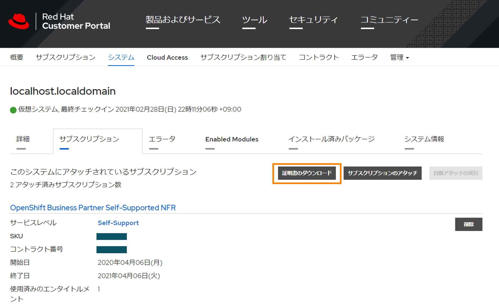
「証明書のダウンロード」より、Zipファイルをダウンロードして2回程解凍すると、".pem"ファイルが出てきます。
".pem"ファイルを踏み台ホスト(OpenShift作業端末)の、**/root/entiletlement/{ID}.pem**のように配置します。


```bash
> podman run -ti --mount type=bind,source=/root/entitlement/3677481695621735869.pem,target=/etc/pki/entitlement/entitlement.pem  --mount type=bind,source=/root/entitlement/3677481695621735869.pem,target=/etc/pki/entitlement/entitlement-key.pem registry.access.redhat.com/ubi8:latest bash -c "dnf search kernel-devel --showduplicates | tail -n2"
Trying to pull registry.access.redhat.com/ubi8:latest...
Getting image source signatures
Copying blob fdb393d8227c done  
Copying blob 6b536614e8f8 done  
Copying config 4199acc83c done  
Writing manifest to image destination
Storing signatures
Red Hat Enterprise Linux 8 for x86_64 - AppStre 3.5 MB/s |  26 MB     00:07    
Red Hat Enterprise Linux 8 for x86_64 - BaseOS  4.0 MB/s |  28 MB     00:07    
Red Hat Universal Base Image 8 (RPMs) - BaseOS  365 kB/s | 775 kB     00:02    
Red Hat Universal Base Image 8 (RPMs) - AppStre 1.9 MB/s | 5.1 MB     00:02    
Red Hat Universal Base Image 8 (RPMs) - CodeRea 9.9 kB/s |  13 kB     00:01    
Last metadata expiration check: 0:00:01 ago on Sun Feb 28 15:46:47 2021.
kernel-devel-4.18.0-240.10.1.el8_3.x86_64 : Development package for building kernel modules to match the kernel
kernel-devel-4.18.0-240.15.1.el8_3.x86_64 : Development package for building kernel modules to match the kernel
```

```bash
> oc create secret generic entitlement --from-file=entitlement.pem=./entitlement/3677481695621735869.pem --from-file=entitlement-key.pem=./entit
lement/3677481695621735869.pem
secret/entitlement created
```
OpenShiftのコンテナランタイムであるCRI-Oはホストから証明書を自動マウントするのがデフォルトみたいなので、
ホストにサブスクリプションを置きたくないのが世の常だと思いますので、MachineConfig（ノードOSレベルの設定適用を宣言的に実施するもの）で自動マウントを無効にしてみます。

```bash
> vim 0000-disable-secret-automount.yaml
apiVersion: machineconfiguration.openshift.io/v1
kind: MachineConfig
metadata:
  labels:
    machineconfiguration.openshift.io/role: worker
  name: 50-disable-secret-automount
spec:
  config:
    ignition:
      version: 2.2.0
    storage:
      files:
      - contents:
          source: data:text/plain;charset=utf-8;base64,Cg==
        filesystem: root
        mode: 0644
        path: /etc/containers/mounts.conf
```
サンプルは[こちら](manifests/0000-disable-secret-automount.yaml)にあります。

```bash
> oc debug node/worker01
Starting pod/worker01-debug ...
To use host binaries, run `chroot /host`
Pod IP: 16.147.201.94
If you don't see a command prompt, try pressing enter.
sh-4.2#
```

Proxy環境の場合は下記の用に"env"項目でProxyを設定を追記します。

```bash
> vim 0001-entitled-pod.yaml
apiVersion: v1
kind: Pod
metadata:
  name: entitled-build-pod
spec:
  containers:
    - name: entitled-build
      image: registry.access.redhat.com/ubi8:latest
      command: [ "/bin/sh", "-c", "dnf search kernel-devel --showduplicates" ]
      env:
      - name: http_proxy
        value: <YOUR IP>
      - name: https_proxy
        value: <YOUR IP>
      volumeMounts:
          - name: secret-entitlement
            mountPath: /etc/pki/entitlement
            readOnly: true
  volumes:
    - name: secret-entitlement
      secret:
        secretName: entitlement
  restartPolicy: Never
```
サンプルは[こちら](manifests/0001-entitled-pod.yaml)にあります。

```bash
[root@bastion ~] oc logs entitled-build-pod |tail -n2
kernel-devel-4.18.0-240.10.1.el8_3.x86_64 : Development package for building kernel modules to match the kernel
kernel-devel-4.18.0-240.15.1.el8_3.x86_64 : Development package for building kernel modules to match the kernel
```
cluster-wide entitlement（MachineConfig）を設定すると、MachineConfig Operatorは各ノードに記載した設定を反映するように動作します。
これを実施することにより、ベースイメージにUBI（Universal Base Image）を利用しているコンテナ（nvidia-driver podなど）をビルドする際にRed Hatのレポジトリを参照することができるようになります。

```bash
[root@bastion ~] vim 0003-cluster-wide-machineconfigs.yaml.template
apiVersion: machineconfiguration.openshift.io/v1
kind: MachineConfig
metadata:
  labels:
    machineconfiguration.openshift.io/role: worker
  name: 50-rhsm-conf
spec:
  config:
    ignition:
      version: 2.2.0
    storage:
      files:
      - contents:
          source: data:text/plain;charset=utf-8;base64,IyBSZWQgSGF0IFN1YnNjcmlwdGlvbiBNYW5hZ2VyIENvbmZpZ3VyYXRpb24gRmlsZToKCiMgVW5pZmllZCBFbnRpdGxlbWVudCBQbGF0Zm9ybSBDb25maWd1cmF0aW9uCltzZXJ2ZXJdCiMgU2VydmVyIGhvc3RuYW1lOgpob3N0bmFtZSA9IHN1YnNjcmlwdGlvbi5yaHNtLnJlZGhhdC5jb20KCiMgU2VydmVyIHByZWZpeDoKcHJlZml4ID0gL3N1YnNjcmlwdGlvbgoKIyBTZXJ2ZXIgcG9ydDoKcG9ydCA9IDQ0MwoKIyBTZXQgdG8gMSB0byBkaXNhYmxlIGNlcnRpZmljYXRlIHZhbGlkYXRpb246Cmluc2VjdXJlID0gMAoKIyBTZXQgdGhlIGRlcHRoIG9mIGNlcnRzIHdoaWNoIHNob3VsZCBiZSBjaGVja2VkCiMgd2hlbiB2YWxpZGF0aW5nIGEgY2VydGlmaWNhdGUKc3NsX3ZlcmlmeV9kZXB0aCA9IDMKCiMgYW4gaHR0cCBwcm94eSBzZXJ2ZXIgdG8gdXNlCnByb3h5X2hvc3RuYW1lID0KCiMgVGhlIHNjaGVtZSB0byB1c2UgZm9yIHRoZSBwcm94eSB3aGVuIHVwZGF0aW5nIHJlcG8gZGVmaW5pdGlvbnMsIGlmIG5lZWRlZAojIGUuZy4gaHR0cCBvciBodHRwcwpwcm94eV9zY2hlbWUgPSBodHRwCgojIHBvcnQgZm9yIGh0dHAgcHJveHkgc2VydmVyCnByb3h5X3BvcnQgPQoKIyB1c2VyIG5hbWUgZm9yIGF1dGhlbnRpY2F0aW5nIHRvIGFuIGh0dHAgcHJveHksIGlmIG5lZWRlZApwcm94eV91c2VyID0KCiMgcGFzc3dvcmQgZm9yIGJhc2ljIGh0dHAgcHJveHkgYXV0aCwgaWYgbmVlZGVkCnByb3h5X3Bhc3N3b3JkID0KCiMgaG9zdC9kb21haW4gc3VmZml4IGJsYWNrbGlzdCBmb3IgcHJveHksIGlmIG5lZWRlZApub19wcm94eSA9CgpbcmhzbV0KIyBDb250ZW50IGJhc2UgVVJMOgpiYXNldXJsID0gaHR0cHM6Ly9jZG4ucmVkaGF0LmNvbQoKIyBSZXBvc2l0b3J5IG1ldGFkYXRhIEdQRyBrZXkgVVJMOgpyZXBvbWRfZ3BnX3VybCA9CgojIFNlcnZlciBDQSBjZXJ0aWZpY2F0ZSBsb2NhdGlvbjoKY2FfY2VydF9kaXIgPSAvZXRjL3Joc20vY2EvCgojIERlZmF1bHQgQ0EgY2VydCB0byB1c2Ugd2hlbiBnZW5lcmF0aW5nIHl1bSByZXBvIGNvbmZpZ3M6CnJlcG9fY2FfY2VydCA9ICUoY2FfY2VydF9kaXIpc3JlZGhhdC11ZXAucGVtCgojIFdoZXJlIHRoZSBjZXJ0aWZpY2F0ZXMgc2hvdWxkIGJlIHN0b3JlZApwcm9kdWN0Q2VydERpciA9IC9ldGMvcGtpL3Byb2R1Y3QKZW50aXRsZW1lbnRDZXJ0RGlyID0gL2V0Yy9wa2kvZW50aXRsZW1lbnQKY29uc3VtZXJDZXJ0RGlyID0gL2V0Yy9wa2kvY29uc3VtZXIKCiMgTWFuYWdlIGdlbmVyYXRpb24gb2YgeXVtIHJlcG9zaXRvcmllcyBmb3Igc3Vic2NyaWJlZCBjb250ZW50OgptYW5hZ2VfcmVwb3MgPSAxCgojIFJlZnJlc2ggcmVwbyBmaWxlcyB3aXRoIHNlcnZlciBvdmVycmlkZXMgb24gZXZlcnkgeXVtIGNvbW1hbmQKZnVsbF9yZWZyZXNoX29uX3l1bSA9IDAKCiMgSWYgc2V0IHRvIHplcm8sIHRoZSBjbGllbnQgd2lsbCBub3QgcmVwb3J0IHRoZSBwYWNrYWdlIHByb2ZpbGUgdG8KIyB0aGUgc3Vic2NyaXB0aW9uIG1hbmFnZW1lbnQgc2VydmljZS4KcmVwb3J0X3BhY2thZ2VfcHJvZmlsZSA9IDEKCiMgVGhlIGRpcmVjdG9yeSB0byBzZWFyY2ggZm9yIHN1YnNjcmlwdGlvbiBtYW5hZ2VyIHBsdWdpbnMKcGx1Z2luRGlyID0gL3Vzci9zaGFyZS9yaHNtLXBsdWdpbnMKCiMgVGhlIGRpcmVjdG9yeSB0byBzZWFyY2ggZm9yIHBsdWdpbiBjb25maWd1cmF0aW9uIGZpbGVzCnBsdWdpbkNvbmZEaXIgPSAvZXRjL3Joc20vcGx1Z2luY29uZi5kCgojIE1hbmFnZSBhdXRvbWF0aWMgZW5hYmxpbmcgb2YgeXVtL2RuZiBwbHVnaW5zIChwcm9kdWN0LWlkLCBzdWJzY3JpcHRpb24tbWFuYWdlcikKYXV0b19lbmFibGVfeXVtX3BsdWdpbnMgPSAxCgojIFJ1biB0aGUgcGFja2FnZSBwcm9maWxlIG9uIGVhY2ggeXVtL2RuZiB0cmFuc2FjdGlvbgpwYWNrYWdlX3Byb2ZpbGVfb25fdHJhbnMgPSAwCgojIElub3RpZnkgaXMgdXNlZCBmb3IgbW9uaXRvcmluZyBjaGFuZ2VzIGluIGRpcmVjdG9yaWVzIHdpdGggY2VydGlmaWNhdGVzLgojIEN1cnJlbnRseSBvbmx5IHRoZSAvZXRjL3BraS9jb25zdW1lciBkaXJlY3RvcnkgaXMgbW9uaXRvcmVkIGJ5IHRoZQojIHJoc20uc2VydmljZS4gV2hlbiB0aGlzIGRpcmVjdG9yeSBpcyBtb3VudGVkIHVzaW5nIGEgbmV0d29yayBmaWxlIHN5c3RlbQojIHdpdGhvdXQgaW5vdGlmeSBub3RpZmljYXRpb24gc3VwcG9ydCAoZS5nLiBORlMpLCB0aGVuIGRpc2FibGluZyBpbm90aWZ5CiMgaXMgc3Ryb25nbHkgcmVjb21tZW5kZWQuIFdoZW4gaW5vdGlmeSBpcyBkaXNhYmxlZCwgcGVyaW9kaWNhbCBkaXJlY3RvcnkKIyBwb2xsaW5nIGlzIHVzZWQgaW5zdGVhZC4KaW5vdGlmeSA9IDEKCltyaHNtY2VydGRdCiMgSW50ZXJ2YWwgdG8gcnVuIGNlcnQgY2hlY2sgKGluIG1pbnV0ZXMpOgpjZXJ0Q2hlY2tJbnRlcnZhbCA9IDI0MAojIEludGVydmFsIHRvIHJ1biBhdXRvLWF0dGFjaCAoaW4gbWludXRlcyk6CmF1dG9BdHRhY2hJbnRlcnZhbCA9IDE0NDAKIyBJZiBzZXQgdG8gemVybywgdGhlIGNoZWNrcyBkb25lIGJ5IHRoZSByaHNtY2VydGQgZGFlbW9uIHdpbGwgbm90IGJlIHNwbGF5ZWQgKHJhbmRvbWx5IG9mZnNldCkKc3BsYXkgPSAxCiMgSWYgc2V0IHRvIDEsIHJoc21jZXJ0ZCB3aWxsIG5vdCBleGVjdXRlLgpkaXNhYmxlID0gMAoKW2xvZ2dpbmddCmRlZmF1bHRfbG9nX2xldmVsID0gSU5GTwojIHN1YnNjcmlwdGlvbl9tYW5hZ2VyID0gREVCVUcKIyBzdWJzY3JpcHRpb25fbWFuYWdlci5tYW5hZ2VyY2xpID0gREVCVUcKIyByaHNtID0gREVCVUcKIyByaHNtLmNvbm5lY3Rpb24gPSBERUJVRwojIHJoc20tYXBwID0gREVCVUcKIyByaHNtLWFwcC5yaHNtZCA9IERFQlVHCg==
        filesystem: root
        mode: 0644
        path: /etc/rhsm/rhsm.conf
---
apiVersion: machineconfiguration.openshift.io/v1
kind: MachineConfig
metadata:
  labels:
    machineconfiguration.openshift.io/role: worker
  name: 50-entitlement-pem
spec:
  config:
    ignition:
      version: 2.2.0
    storage:
      files:
      - contents:
          source: data:text/plain;charset=utf-8;base64,BASE64_ENCODED_PEM_FILE
        filesystem: root
        mode: 0644
        path: /etc/pki/entitlement/entitlement.pem
---
apiVersion: machineconfiguration.openshift.io/v1
kind: MachineConfig
metadata:
  labels:
    machineconfiguration.openshift.io/role: worker
  name: 50-entitlement-key-pem
spec:
  config:
    ignition:
      version: 2.2.0
    storage:
      files:
      - contents:
          source: data:text/plain;charset=utf-8;base64,BASE64_ENCODED_PEM_FILE
        filesystem: root
        mode: 0644
        path: /etc/pki/entitlement/entitlement-key.pem
```

取得済みのpemファイルをbase64エンコードして、MachineConfigを作成します。
MachineConfigによりノードOSレベルの設定適用を宣言的に実施します。
Templateのサンプルは[こちら](manifests/0003-cluster-wide-machineconfigs.yaml.template)にあります。
Templateをベースにしたmachineconfigsのサンプルは[こちら](manifests/0003-cluster-wide-machineconfigs.yaml)にあります。

```bash
[root@bastion ~] sed "s/BASE64_ENCODED_PEM_FILE/$(base64 -w 0 ./entitlement/3677481695621735869.pem)/g" 0003-cluster-wide-machineconfigs.yaml.template > 0003-cluster-wide-machineconfigs.yaml
[root@bastion ~] oc create -f 0003-cluster-wide-machineconfigs.yaml
machineconfig.machineconfiguration.openshift.io/50-rhsm-conf created
machineconfig.machineconfiguration.openshift.io/50-entitlement-pem created
machineconfig.machineconfiguration.openshift.io/50-entitlement-key-pem created
```
クラスタにエンタイトルメントが導入されているかを確認するためのPodを作成します。
サンプルは[こちら](manifests/0004-cluster-wide-entitled-pod.yaml)にあります。

```bash
[root@bastion ~] vim 0004-cluster-wide-entitled-pod.yaml
apiVersion: v1
kind: Pod
metadata:
  name: cluster-entitled-build-pod
spec:
  containers:
    - name: cluster-entitled-build
      image: registry.access.redhat.com/ubi8:latest
      command: [ "/bin/sh", "-c", "dnf search kernel-devel --showduplicates" ]
  restartPolicy: Never
```

```bash
[root@bastion ~] oc create -f 0004-cluster-wide-entitled-pod.yaml
pod/cluster-entitled-build-pod created
```

```bash
[root@bastion ~] oc get pod
NAME                         READY   STATUS      RESTARTS   AGE
cluster-entitled-build-pod   0/1     Completed   0          <invalid>
entitled-build-pod           0/1     Completed   0          17h
```
ログで確認すると、きちんとRed Hatレポジトリから引っ張ってきたkernel-develのパッケージを取得出来ていることがわかります。

```bash
[root@bastion ~] oc logs cluster-entitled-build-pod | grep kernel-devel | tail -n 1
kernel-devel-4.18.0-240.15.1.el8_3.x86_64 : Development package for building kernel modules to match the kernel
```
参考までエンタイトルメント関連のPodの詳細情報を載せておきます。

```bash
[root@bastion ~] oc describe pod
Name:         cluster-entitled-build-pod
Namespace:    default
Priority:     0
Node:         worker02/16.147.201.95
Start Time:   Mon, 01 Mar 2021 23:04:46 +0900
Labels:       <none>
Annotations:  k8s.v1.cni.cncf.io/networks-status:
                [{
                    "name": "openshift-sdn",
                    "interface": "eth0",
                    "ips": [
                        "10.128.2.11"
                    ],
                    "dns": {},
                    "default-route": [
                        "10.128.2.1"
                    ]
                }]
              kubectl.kubernetes.io/last-applied-configuration:
                {"apiVersion":"v1","kind":"Pod","metadata":{"annotations":{},"name":"cluster-entitled-build-pod","namespace":"default"},"spec":{"container...
Status:       Running
IP:           10.128.2.11
IPs:
  IP:  10.128.2.11
Containers:
  cluster-entitled-build:
    Container ID:  cri-o://83d3e94a3bc575291c60a6242d476f04a72fdf44324d3b03e6e5f99bdae23134
    Image:         registry.access.redhat.com/ubi8:latest
    Image ID:      registry.access.redhat.com/ubi8@sha256:100edc1eb5ef7b21f1bf82812c2b1070bb4bbf047061bba324e23cb770fdb413
    Port:          <none>
    Host Port:     <none>
    Command:
      /bin/sh
      -c
      dnf search kernel-devel --showduplicates
    State:          Waiting
      Reason:       CrashLoopBackOff
    Last State:     Terminated
      Reason:       Completed
      Exit Code:    0
      Started:      Tue, 02 Mar 2021 11:42:23 +0900
      Finished:     Tue, 02 Mar 2021 11:43:01 +0900
    Ready:          False
    Restart Count:  136
    Environment:
      http_proxy:   <YOUR IP>
      https_proxy:  <YOUR IP>
    Mounts:
      /var/run/secrets/kubernetes.io/serviceaccount from default-token-dldhd (ro)
Conditions:
  Type              Status
  Initialized       True
  Ready             False
  ContainersReady   False
  PodScheduled      True
Volumes:
  default-token-dldhd:
    Type:        Secret (a volume populated by a Secret)
    SecretName:  default-token-dldhd
    Optional:    false
QoS Class:       BestEffort
Node-Selectors:  <none>
Tolerations:     node.kubernetes.io/not-ready:NoExecute for 300s
                 node.kubernetes.io/unreachable:NoExecute for 300s
Events:
  Type     Reason   Age                   From               Message
  ----     ------   ----                  ----               -------
  Normal   Pulled   131m (x115 over 12h)  kubelet, worker02  Successfully pulled image "registry.access.redhat.com/ubi8:latest"
  Normal   Pulling  56m (x128 over 12h)   kubelet, worker02  Pulling image "registry.access.redhat.com/ubi8:latest"
  Warning  BackOff  2m (x3096 over 12h)   kubelet, worker02  Back-off restarting failed container


Name:         entitled-build-pod
Namespace:    default
Priority:     0
Node:         worker02/16.147.201.95
Start Time:   Mon, 01 Mar 2021 17:57:07 +0900
Labels:       <none>
Annotations:  k8s.v1.cni.cncf.io/networks-status:
              kubectl.kubernetes.io/last-applied-configuration:
                {"apiVersion":"v1","kind":"Pod","metadata":{"annotations":{},"name":"entitled-build-pod","namespace":"default"},"spec":{"containers":[{"co...
Status:       Succeeded
IP:           10.128.2.8
IPs:
  IP:  10.128.2.8
Containers:
  entitled-build:
apiVersion: v1
    Container ID:  cri-o://71368a7c265ada9fa69ab1b7e71d853a3eb829628976779cf5955123c6c4aa79
    Image:         registry.access.redhat.com/ubi8:latest
apiVersion: v1
    Image ID:      registry.access.redhat.com/ubi8@sha256:100edc1eb5ef7b21f1bf82812c2b1070bb4bbf047061bba324e23cb770fdb413
    Port:          <none>
    Host Port:     <none>
    Command:
      /bin/sh
      -c
      dnf search kernel-devel --showduplicates
    State:          Terminated
      Reason:       Completed
      Exit Code:    0
      Started:      Mon, 01 Mar 2021 17:57:34 +0900
      Finished:     Mon, 01 Mar 2021 17:58:09 +0900
    Ready:          False
    Restart Count:  0
    Environment:
      http_proxy:   <YOUR IP>
      https_proxy:  <YOUR IP>
    Mounts:
      /etc/pki/entitlement from secret-entitlement (ro)
      /var/run/secrets/kubernetes.io/serviceaccount from default-token-dldhd (ro)
Conditions:
  Type              Status
  Initialized       True
  Ready             False
  ContainersReady   False
  PodScheduled      True
Volumes:
  secret-entitlement:
    Type:        Secret (a volume populated by a Secret)
    SecretName:  entitlement
    Optional:    false
  default-token-dldhd:
    Type:        Secret (a volume populated by a Secret)
    SecretName:  default-token-dldhd
    Optional:    false
QoS Class:       BestEffort
Node-Selectors:  <none>
Tolerations:     node.kubernetes.io/not-ready:NoExecute for 300s
                 node.kubernetes.io/unreachable:NoExecute for 300s
Events:          <none>
```

```bash
[root@bastion ~] oc api-resources | grep -i node
nodes                                 no                                                     false        Node
nodes                                                  metrics.k8s.io                        false        NodeMetrics
nodefeaturediscoveries                                 nfd.openshift.io                      true         NodeFeatureDiscovery
runtimeclasses                                         node.k8s.io                           false        RuntimeClass
csinodes                                               storage.k8s.io                        false        CSINode
```

### NFD Operatorのデプロイ

OpenShift WebUIよりNFD(Node Feature Discovery) Operatorをインストールします。
NFDを導入することにより、GPUを含めたハードウェア情報がノードのラベルとして付与されます。<br>
これにより、**NVIDIA GPU Operator**が展開するコンポーネントの1つである**NVIDIA Driver**がNFDが付与したラベルからGPU搭載ノードにのみ展開されるような仕組みとなってなっているみたいです。
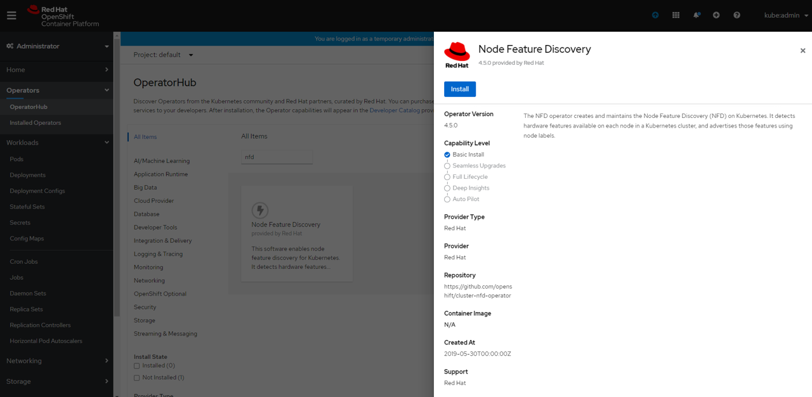

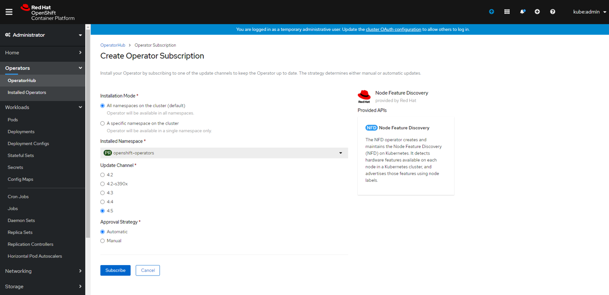

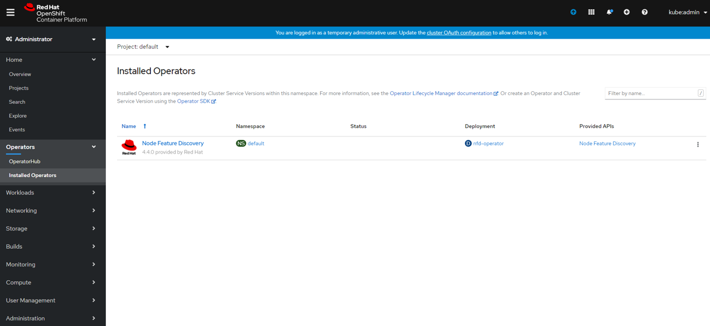
NFD Opearatorのインストールが完了しました。<br>
次にNFDのCustom Resorceを作成します。
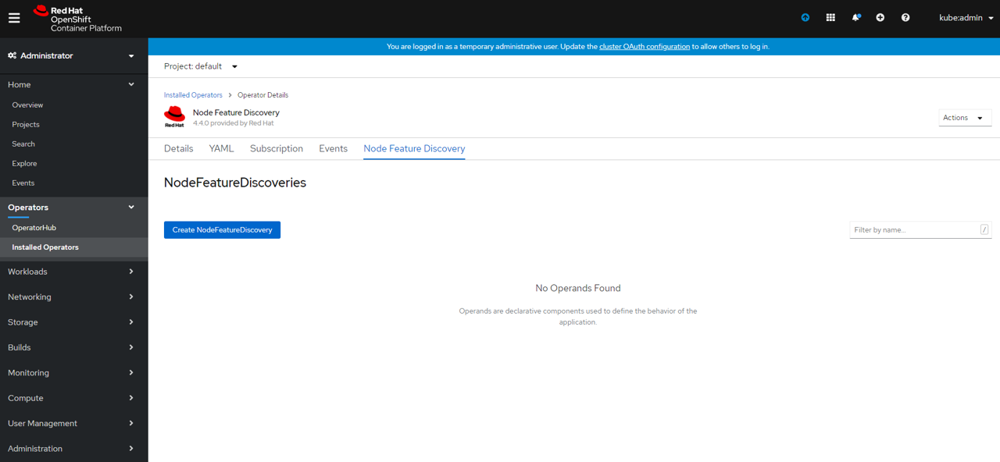

パラメータはデフォルトのまま実行します。
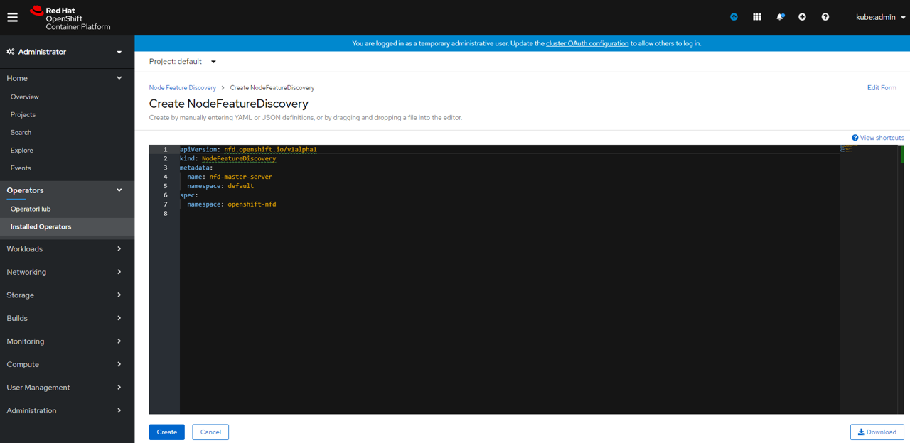

NFD CRが作成されました。
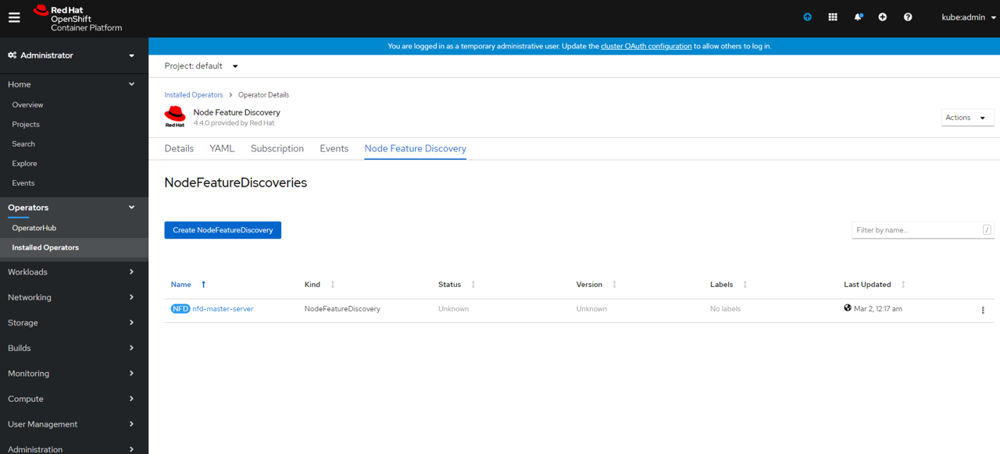

NFDはnfd-masterとnfd-workerの2つのコンポーネントから構成されていることがわかります。
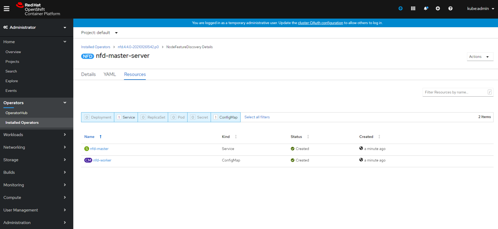

NFDによるハードウェア情報のラベリングができているか確認してみます。
GPUが搭載されたWorkerノード上のPodでGPUがきちんと利用できるか確認していきます。
まず、NFD関連のPodを確認します。
```bash
> oc get pod --all-namespaces | grep nfd
ocp-nfd                                                 nfd-master-tp894                                                  1/1     Running     0          23h
ocp-nfd                                                 nfd-master-w9tj2                                                  1/1     Running     0          23h
ocp-nfd                                                 nfd-master-wc42f                                                  1/1     Running     0          23h
ocp-nfd                                                 nfd-worker-cmplx                                                  1/1     Running     0          23h
ocp-nfd                                                 nfd-worker-n779c                                                  1/1     Running     1          23h
ocp-nfd                                                 nfd-worker-nn8fk                                                  1/1     Running     0          23h
openshift-operators                                     nfd-operator-5789cd8dcb-hvzcq                                     1/1     Running     0          23h
```

GPUラベルの確認をします。
```bash
> oc get node worker03 -o yaml | grep feature.node.kubernetes.io
    feature.node.kubernetes.io/cpu-cpuid.ADX: "true"
    feature.node.kubernetes.io/cpu-cpuid.AESNI: "true"
    feature.node.kubernetes.io/cpu-cpuid.AVX: "true"
    feature.node.kubernetes.io/cpu-cpuid.AVX2: "true"
    feature.node.kubernetes.io/cpu-cpuid.FMA3: "true"
    feature.node.kubernetes.io/cpu-cpuid.IBPB: "true"
    feature.node.kubernetes.io/cpu-cpuid.STIBP: "true"
    feature.node.kubernetes.io/kernel-selinux.enabled: "true"
    feature.node.kubernetes.io/kernel-version.full: 4.18.0-193.29.1.el8_2.x86_64
    feature.node.kubernetes.io/kernel-version.major: "4"
    feature.node.kubernetes.io/kernel-version.minor: "18"
    feature.node.kubernetes.io/kernel-version.revision: "0"
    feature.node.kubernetes.io/pci-10de.present: "true"
    feature.node.kubernetes.io/pci-15ad.present: "true"
    feature.node.kubernetes.io/system-os_release.ID: rhcos
    feature.node.kubernetes.io/system-os_release.VERSION_ID: "4.4"
    feature.node.kubernetes.io/system-os_release.VERSION_ID.major: "4"
    feature.node.kubernetes.io/system-os_release.VERSION_ID.minor: "4"
```
**"feature.node.kubernetes.io"**が新規で付与されているラベルできちんと付与できていることがわかります。<br>
**"10de"**がNVIDIAのベンダーIDみたいです。

### GPU Operatorのデプロイ
NFD Operatorと同様にOpenShift WebUI上からインストールしてみます。
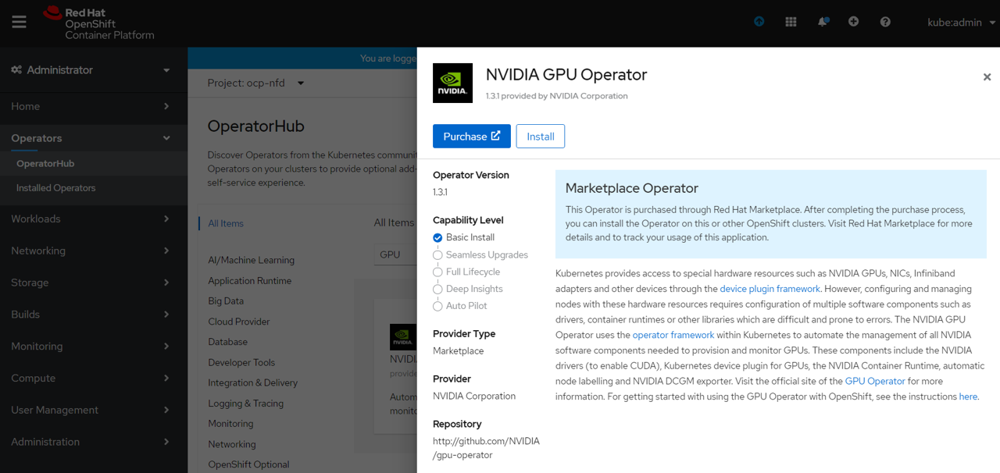

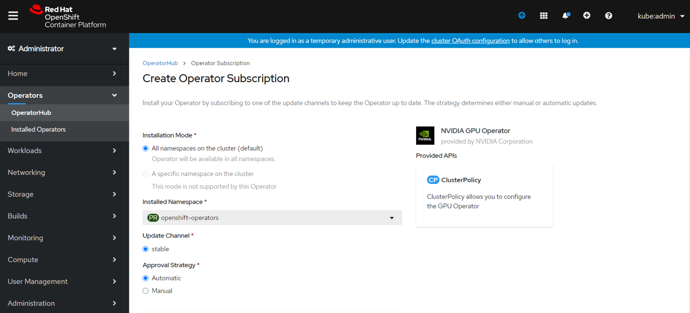

無事GPU Operatorのインストールが完了しました。
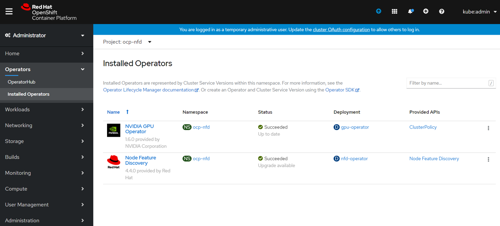

次にCluster PolicyのCustom Resorceを作成します。
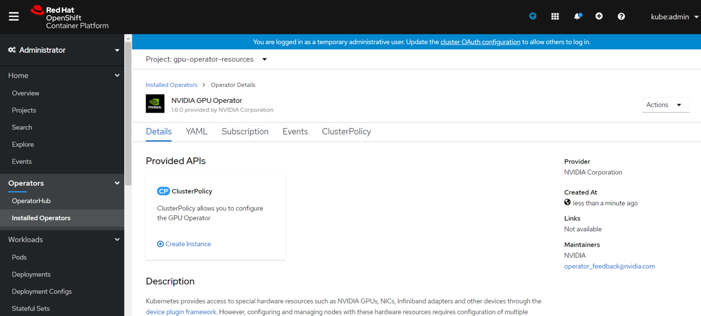

Cluster Policyのマニフェストを変更すれば各リソースのバージョンを任意のバージョンに変更することも可能みたいですが、環境固有の部分以外はデフォルトのまま進めます。
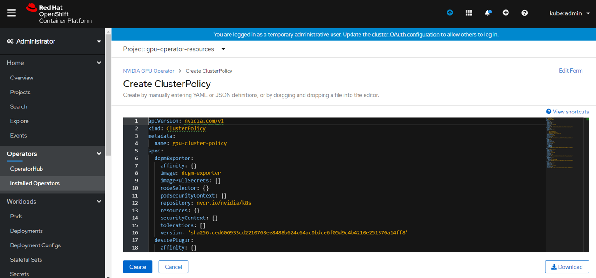

Cluster Policy Custom Resourceまで作成すると関連するpodが起動してきます。
GPU OperatorでデプロイされるGPUコンテナ達は以下のラインナップです。
```bash
> oc get pod --all-namespaces | grep -e nvidia -e gpu
gpu-operator-resources                                  gpu-feature-discovery-jmbrb                                       1/1     Running     0          22h
gpu-operator-resources                                  nvidia-container-toolkit-daemonset-n7scc                          1/1     Running     0          23h
gpu-operator-resources                                  nvidia-dcgm-exporter-f4gmv                                        1/1     Running     0          22h
gpu-operator-resources                                  nvidia-device-plugin-daemonset-k2w8q                              1/1     Running     0          22h
gpu-operator-resources                                  nvidia-device-plugin-validation                                   0/1     Completed   0          22h
gpu-operator-resources                                  nvidia-driver-daemonset-xf7fx                                     1/1     Running     0          22h
gpu-operator-resources                                  nvidia-driver-validation                                          0/1     Completed   1          23h
openshift-operators                                     gpu-operator-6795ff4d45-mtvqk                                     1/1     Running     0          23h
```

GPUが搭載されているノード（Worker03）の確認をします。<br>
GPU Operator起動後は、NFDがGPU情報をラベルとして詳細に付与してくれることがわかります。Tesla-T4が搭載されていることもわかります。
```bash
> oc get node worker03 -o yaml | grep nvidia.com
    nfd.node.kubernetes.io/feature-labels: cpu-cpuid.ADX,cpu-cpuid.AESNI,cpu-cpuid.AVX,cpu-cpuid.AVX2,cpu-cpuid.FMA3,cpu-cpuid.IBPB,cpu-cpuid.STIBP,kernel-selinux.enabled,kernel-version.full,kernel-version.major,kernel-version.minor,kernel-version.revision,nvidia.com/cuda.driver.major,nvidia.com/cuda.driver.minor,nvidia.com/cuda.driver.rev,nvidia.com/cuda.runtime.major,nvidia.com/cuda.runtime.minor,nvidia.com/gfd.timestamp,nvidia.com/gpu.compute.major,nvidia.com/gpu.compute.minor,nvidia.com/gpu.count,nvidia.com/gpu.family,nvidia.com/gpu.memory,nvidia.com/gpu.product,pci-10de.present,pci-15ad.present,system-os_release.ID,system-os_release.VERSION_ID,system-os_release.VERSION_ID.major,system-os_release.VERSION_ID.minor
    nvidia.com/cuda.driver.major: "450"
    nvidia.com/cuda.driver.minor: "80"
    nvidia.com/cuda.driver.rev: "02"
    nvidia.com/cuda.runtime.major: "11"
    nvidia.com/cuda.runtime.minor: "0"
    nvidia.com/gfd.timestamp: "1614836818"
    nvidia.com/gpu.compute.major: "7"
    nvidia.com/gpu.compute.minor: "5"
    nvidia.com/gpu.count: "1"
    nvidia.com/gpu.family: turing
    nvidia.com/gpu.memory: "15109"
    nvidia.com/gpu.present: "true"
    nvidia.com/gpu.product: Tesla-T4
    nvidia.com/gpu: "1"
    nvidia.com/gpu: "1"
```

GPUがきちんと使われているか”nvidia-smi”で確認してみます。
```bash
> oc exec nvidia-driver-daemonset-xf7fx -- nvidia-smi
Wed Mar  3 07:26:25 2021       
+-----------------------------------------------------------------------------+
| NVIDIA-SMI 450.80.02    Driver Version: 450.80.02    CUDA Version: 11.0     |
|-------------------------------+----------------------+----------------------+
| GPU  Name        Persistence-M| Bus-Id        Disp.A | Volatile Uncorr. ECC |
| Fan  Temp  Perf  Pwr:Usage/Cap|         Memory-Usage | GPU-Util  Compute M. |
|                               |                      |               MIG M. |
|===============================+======================+======================|
|   0  Tesla T4            On   | 00000000:13:00.0 Off |                    0 |
| N/A   55C    P8    17W /  70W |      0MiB / 15109MiB |      0%      Default |
|                               |                      |                  N/A |
+-------------------------------+----------------------+----------------------+

+-----------------------------------------------------------------------------+
| Processes:                                                                  |
|  GPU   GI   CI        PID   Type   Process name                  GPU Memory |
|        ID   ID                                                   Usage      |
|=============================================================================|
|  No running processes found                                                 |
+-----------------------------------------------------------------------------+
```
GUIで確認するとこんな感じです。
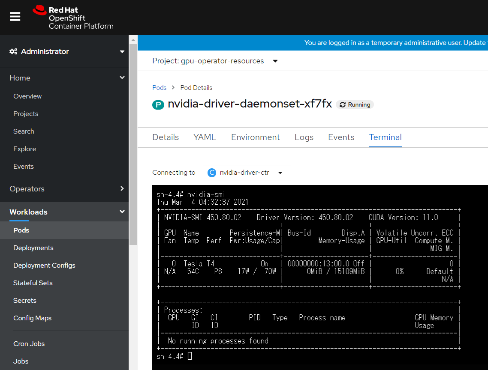

## ハマりポイント/注意点
- バージョンを気にする（OCP、NFD Operator、GPU Operator etc）
- セキュアブートはオフにする
  - 仮想マシン/ベアメタルによらずセキュアブートの機能をオフにしないと各Podからイメージを拾ってこない
- Proxy設定箇所
  - Proxy環境下の場合、どのEnv設定に変更が必要かはコンテナの作りに依存する部分でもあるのでいろいろ試す必要が出てきそう
  - OperatorやDeamonSetのManifestにENVでProxy設定を追加
- GPU搭載ホストにGPUドライバはいれない！
 - ホストの方でGPUをつかんでしまうので、GPUをコンテナに見せるときはNG

セキュアブートオフの参考
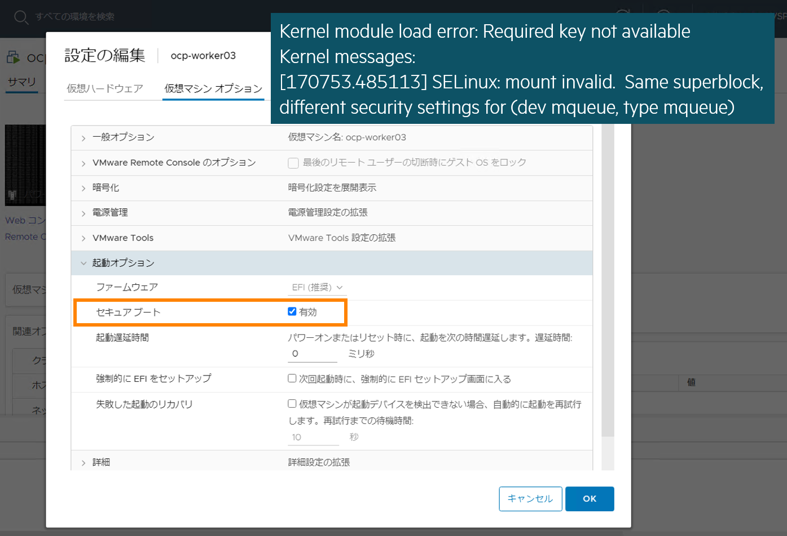

#### env設定の参考
proxy環境下でのOpenShift構成では構築の際に使用するInstall-config.yamlのマニフェスト内でもProxyの設定はしますが、運用中のOperator含めた各Podからのインターネット疎通は別個で実施する必要があります。
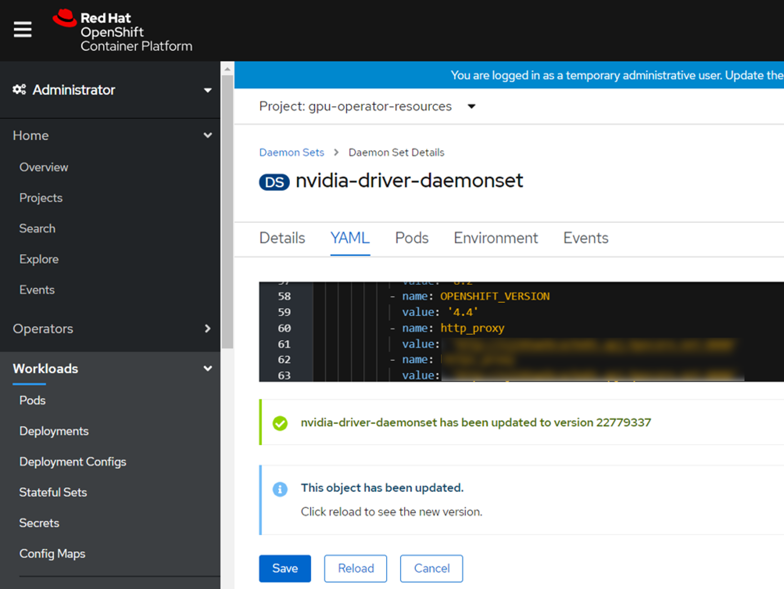


#### GPUを使用しないPodのSchedule設定
GPUを使う指定をしないPodはGPUノード（Worker03）にはScheduleされないよう設定します。
```bash
> oc adm taint node worker03 nodetype=gpu:NoSchedule
node/worker03 tainted
```
- Taints/Tolerations（汚れと容認）
  - 特定のノードにPodをScheduleしないための仕組み、指定しない限りそのNodeにはScheduleされることはない
  - [Taints/tolerationのAPI Referenceはこちら](https://kubernetes.io/docs/concepts/scheduling-eviction/taint-and-toleration/)
