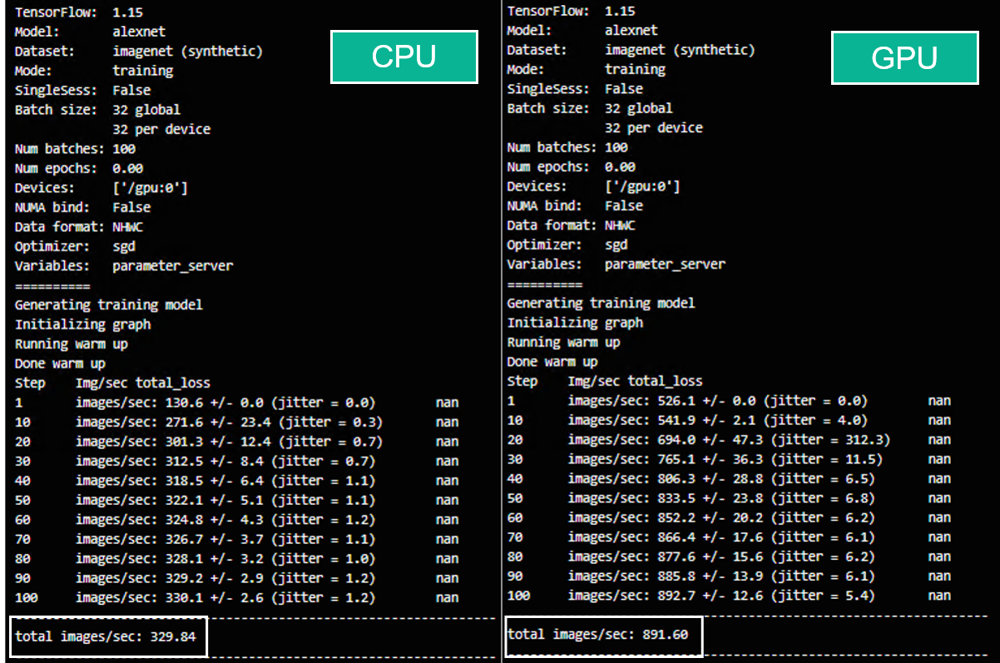

# Tensorflow Benchmarks をGPU Podで実装してみた
Red Hat OpenShift Container Platform上にGPU Operatorを実装し、NVIDIA T4 GPUをアサインしたPodとGPUを使わないPodの2種類で性能を比較してみました。
[Red Hat OpenShift上にGPU Operatorをインストールする手順](../GPU_Operator)はこちらを確認してください。


## はじめに
今回お試しするTensorflow benchmarksは一部既にメンテナンス終了しているスクリプトもあるので、利用する際はご確認ください。

### 目標
- Red Hat OpenShift上でAI/DeepLearningの実行基盤を作ってみる
- GPUの有無でどれだけ性能差が出るか体験してみる (学習モデルやパラメータによっても性能結果は大いに変わってくるので、あくまで実装方法の参考まで)

## TL;DR
- 事前準備がなかなか多い(GPU Operatorを使うまでの道のりが結構長い。[手順はこちら](../GPU_Operator))
- GPUの知識（CUDA系）を理解してなくてもOperator君がうまいこと実施してくれるので◎
- DeepLearningの知識、パラメータ等をある程度抑えておく必要がある

## 検証環境概要
- ProLiant DL380 Gen9 x3
  - Intel(R) Xeon(R) CPU E5-2630 v4 @ 2.20GHz (20Core) x2
  - RAM 160GB
  - HDD: 300GB x2 RAID1(OS Boot) / 600GB x4 RAID5(ESXi)
  - VMware ESXi 7.0.2 vSphere 7.0.0
  - VMware vSAN 7.0
  - インターネット接続可能(Proxy経由)

- ProLiant DL380 Gen9 x1 (NVIDIA T4)
  - Intel(R) Xeon(R) CPU E5-2667 v4 @ 3.20GHz (8Core) x2
  - RAM 128GB
  - HDD: 900GB
  - Worker03（GPU Path through）起動用

- vCenter Server 7.0.0
  - 上記vSphere環境にアプライアンスとして配置

- Red Hat OpenShift Container Platform 4.4
  - 上記vSphere環境に仮想マシンとしてMaster x3 / Worker x3を構築
  - うちWorker03のみT4 GPUをパススルーしたVM

### nvidia-smiコマンドの実行
NVIDIA GPUデバイスの管理・モニタリングを行うコマンドユーティリティとして有名なnvidia-smiでまずはきちんとGPUが使える状況か確認してみます。*nvidia-smi.yaml*というファイル名でマニフェストを作成してデプロイします。サンプルは[こちら](manifests/nvidia-smi.yaml)にあります。

```bash
apiVersion: v1
kind: Pod
metadata:
  name: nvidia-smi
spec:
  containers:
  - image: docker.io/nvidia/cuda:11.2.1-base
    name: nvidia-smi
    command: ["/bin/bash", "-c","nvidia-smi; exit 0" ]
    resources:
      limits:
        nvidia.com/gpu: 1
      requests:
        nvidia.com/gpu: 1
    env:
    - name: http_proxy
      value: <YOUR IP>
    - name: https_proxy
      value: <YOUR IP>
  tolerations:
  - key: "nodetype"
    operator: "Equal"
    value: "gpu"
    effect: "NoSchedule"
  restartPolicy: Never
```
toralationsでGPUを使うPodのみGPUノード（今回はWorker03）にスケジュールされるように設定しています。

```bash
[root@bastion ~] oc apply -f nvidia-smi.yaml
pod/nvidia-smi created
```

```bash
[root@bastion ~] oc logs nvidia-smi
Wed Mar  3 07:26:25 2021       
+-----------------------------------------------------------------------------+
| NVIDIA-SMI 450.80.02    Driver Version: 450.80.02    CUDA Version: 11.0     |
|-------------------------------+----------------------+----------------------+
| GPU  Name        Persistence-M| Bus-Id        Disp.A | Volatile Uncorr. ECC |
| Fan  Temp  Perf  Pwr:Usage/Cap|         Memory-Usage | GPU-Util  Compute M. |
|                               |                      |               MIG M. |
|===============================+======================+======================|
|   0  Tesla T4            On   | 00000000:13:00.0 Off |                    0 |
| N/A   55C    P8    17W /  70W |      0MiB / 15109MiB |      0%      Default |
|                               |                      |                  N/A |
+-------------------------------+----------------------+----------------------+

+-----------------------------------------------------------------------------+
| Processes:                                                                  |
|  GPU   GI   CI        PID   Type   Process name                  GPU Memory |
|        ID   ID                                                   Usage      |
|=============================================================================|
|  No running processes found                                                 |
+-----------------------------------------------------------------------------+
```

### Tensorflow Benchmarks Podのデプロイ(tf_cnn_benchmarks)

今回はTensorflowのベンチマークの中でも手軽にCNNのベンチマークを実施できる
**tf_cnn_benchmarks**（既にメンテナンスは終了）を試してみました。**tf_cnn_benchmarks**のスクリプトでは複数の学習モデル（ResNetやAlexNet等）が選択可能なので、こちらを使ってGPUがうまく使えているかを試すPodを作成していきたいと思います。
[tf_cnn_benchmarksはこちら](https://github.com/tensorflow/benchmarks/tree/master/scripts/tf_cnn_benchmarks)

Getting Startedに習って、tf_cnn_benchmarksのパラメータを変更しながら、*tensorflow-benchmarks-gpu-pod.yaml*というファイル名でマニフェストを作成してデプロイしてみます。
##### パラメータ例
- model: Model to use, e.g. resnet50, inception3, vgg16, and alexnet.
- num_gpus: Number of GPUs to use.
- data_dir: Path to data to process. If not set, synthetic data is used. To use Imagenet data use these instructions as a starting point.
- batch_size: Batch size for each GPU.
- variable_update: The method for managing variables: parameter_server ,replicated, distributed_replicated, independent
- local_parameter_device: Device to use as parameter server: cpu or gpu.

マニフェストの"args"項目に該当のTensorflow Benchmarksスクリプトを引数毎指定しておくことで、コンテナ起動時に実行してくれるように設定してみます。

##### GPU Podのマニフェスト
```bash
apiVersion: v1
kind: Pod
metadata:
  name: tensorflow-benchmarks-gpu
spec:
  containers:
  - image: nvcr.io/nvidia/tensorflow:21.02-tf1-py3
    name: cudnn
    command: ["/bin/sh","-c"]
    args: ["git clone https://github.com/tensorflow/benchmarks.git;cd benchmarks/scripts/tf_cnn_benchmarks;python3 tf_cnn_benchmarks.py --num_gpus=1 --data_format=NHWC --batch_size=32 --model=alexnet --variable_update=parameter_server"]
    env:
      - name: http_proxy
        value: <YOUR IP>
      - name: https_proxy
        value: <YOUR IP>
    resources:
      limits:
        cpu: "2000m"
        memory: "8Gi"
        nvidia.com/gpu: 1
      requests:
        cpu: "2000m"
        memory: "8Gi"
        nvidia.com/gpu: 1
  tolerations:
  - key: "nodetype"
    operator: "Equal"
    value: "gpu"
    effect: "NoSchedule"
  restartPolicy: Never
  ```
なるべくApple to Appleで比較するために、
resourcesのなかで、CPU、メモリに制限、予約をし、
nvidia-smiコンテナと同様に、tolerationsでGPUが搭載されているノードにスケジュールされるように設定しています。サンプルは[こちら](manifests/tensorflow-benchmarks-gpu-pod.yaml)にあります。

##### CPU Podのマニフェスト
同様のベンチマークをGPUを使わずにCPUリソースのみで実施するPodを作成してみます。
```bash
apiVersion: v1
kind: Pod
metadata:
  name: tensorflow-benchmarks-cpu
spec:
  containers:
  - image: nvcr.io/nvidia/tensorflow:21.02-tf1-py3
    name: cudnn
    command: ["/bin/sh","-c"]
    args: ["git clone https://github.com/tensorflow/benchmarks.git;cd benchmarks/scripts/tf_cnn_benchmarks;python3 tf_cnn_benchmarks.py --data_format=NHWC --batch_size=32 --model=alexnet --variable_update=parameter_server --local_parameter_device=cpu"]
    env:
      - name: http_proxy
        value: <YOUR IP>
      - name: https_proxy
        value: <YOUR IP>
    resources:
      limits:
        cpu: "2000m"
        memory: "8Gi"
      requests:
        cpu: "2000m"
        memory: "8Gi"
  nodeSelector:
    test: "yes"
  tolerations:
    - key: "nodetype"
      operator: "Equal"
      value: "gpu"
      effect: "NoSchedule"
  restartPolicy: Never
```
GPUを活用しないため、
**--num_gpus=1**の項目は削除し、
resourcesの**nvidia.com/gpu: 1**のリクエスト、予約はしていない状態でのデプロイにしています。サンプルは[こちら](manifests/tensorflow-benchmarks-cpu-pod.yaml)にあります。

作成したGPU Pod、CPU Podをデプロイして、学習結果を見てみたいと思います。

```bash
[root@bastion ~] oc apply -f tensorflow-benchmarks-gpu-pod.yaml
pod/tensorflow-benchmarks-gpu created
```

```bash
[root@bastion ~] oc logs tensorflow-benchmarks-gpu
```
GPU、CPUの比較を見てみると、
**total images/sec**を見てみると1秒当たりに処理されているイメージ数の数値がわかります。GPUを活用したPodのほうが2倍以上の性能値が出ていることがわかります。




性能値は使用するモデルやバッチサイズなどチューニングにより変わってくるので、
今回の結果がベストパフォーマンスかどうかは否めませんが、GPUを活用したTensorflow Benchmarksの活用例としてご参照いただければ幸いです。
