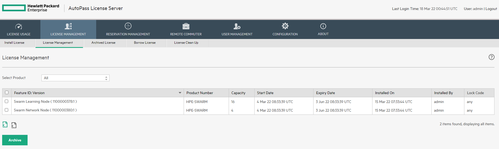

[English](README_en.md)
# Swarm LearningをKubernetes上で実行してみる

## はじめに
Swarm Learningはコンテナイメージとして各種コンポーネントを公開しています。Swarm Learningが提供するインストールスクリプトはDocker環境用しかないので、Kubernetesでもインストールできるように各種マニフェストを作成しました。

本文書は参考文書となります。

## 前提要件
- Swarm Learningの[基本構成](https://github.com/HewlettPackard/swarm-learning)を理解していること
- Swarm Learning用コンテナイメージをダウンロード済み、もしくはダウンロード可能な環境であること  
  - 本検証環境ではSwarm Learning用コンテナイメージはPrivate Registryに格納しています。
  - Docker hubからも途中でイメージ取得しにいきます。
  - Swarm Learning用コンテナイメージの取得方法は[こちら](https://github.com/HewlettPackard/swarm-learning/blob/master/docs/setup.md)
 
- Kuberentesクラスタがあること
  - 本検証環境ではHPE EzmeralのKubernetesクラスタを使用しています。
  - RWXのPVを使いますので、Storage Class等の準備をしてください。
  - コンピュートリソースは48core/64GB RAMくらいあると望ましいと思われる。(後述)  
       公式は[こちら](https://github.com/HewlettPackard/swarm-learning/blob/master/docs/Prerequisites.md)
  - 本検証環境ではGPUなし

- Swarm LearningのNFRライセンスを取得していること
  - [こちら](https://myenterpriselicense.hpe.com/cwp-ui/evaluation/HPE-SWARM/0.3.0/null)から取得してください。

## 各種コンポーネントについて
Swarm Learningは以下のコンポーネントで成り立っています。

- HPE AutoPass License Server  
  Swarm Learningの各種コンポーネント用にライセンス管理をするサーバーです。ライセンスはSwarm Learning Network NodeとSwarm Learning Nodeの起動ノード数で消費されていきます。

- SPIRE SERVER  
  Swarm Learning Network NodeとSwarm Learning Nodeの認証認可を行うサーバーです。

- Swarm Learning Network Node  
  学習時にモデルパラメータを共有するためにethereumのブロックチェーンを作成するサーバーです。

- Swarm Learning Node  
  モデルを学習させるためのサーバーです。
  
- Swarm Learning Command Interface  
  コマンドラインを実行するサーバーです。本検証では使用していません。  


## セットアップ
### HPE AutoPass License Server(APLS)
[こちら](manifests/apls.yaml)のk8sマニフェストを使ってAPLSサーバーを構築します。コンテナイメージ名は自身の環境にあったイメージ名に書き換えてください。

[サンプルマニフェスト](manifests/apls.yaml)では、ライセンス情報を永続化するためにPVリソースを要求していますが、永続化の必要がない環境では削除してください。

```yaml
      containers:
      - name: apls
        image: <swarm-learning/apls:tag> <=書き換え
```

PodがRunningになり、Serviceも作成されましたらブラウザでhttpsアクセスしてください。

```bash
[root@ezmeral-k8s01b ~]# alias k='kubectl'
[root@ezmeral-k8s01b ~]# k get all
NAME       READY   STATUS    RESTARTS   AGE
pod/apls   1/1     Running   0          2m18s

NAME           TYPE       CLUSTER-IP       EXTERNAL-IP   PORT(S)          AGE
service/apls   NodePort   10.101.160.215   <none>        5814:31072/TCP   2m17s

[root@ezmeral-k8s01b ~]# k logs apls
+++ dirname /opt/autopass/AutopassLicenseServer/bin/entrypoint
++ realpath /opt/autopass/AutopassLicenseServer/bin/..
+ aplsRootDir=/opt/autopass/AutopassLicenseServer
+ aplsInstallDir='/opt/autopass/AutopassLicenseServer/HP AutoPass License Server/HP AutoPass License Server'
+ aplsBinDir='/opt/autopass/AutopassLicenseServer/HP AutoPass License Server/HP AutoPass License Server/bin'
+ '/opt/autopass/AutopassLicenseServer/HP AutoPass License Server/HP AutoPass License Server/bin/startup.sh'
Tomcat started.
+ true
+ nc -z 127.0.0.1 5814
+ [[ 1 -eq 0 ]]
+ sleep 5
+ true
+ nc -z 127.0.0.1 5814
+ [[ 0 -eq 0 ]]
+ break
++ ps -C java -opid --no-header
++ tr -d ' '
Waiting for APLS pid 17 to terminate
+ aplsPID=17
+ echo 'Waiting for APLS pid 17 to terminate'
+ tail --pid=17 -f /dev/null
```


初期アカウントはadmin/passwordです。その後、新規パスワード設定を求められるので設定してください


次に事前にダウンロードしたdatファイルのライセンスをアップロードします。License Managementタブ>Install Licenseタブを選択して、Choose Fileからdatファイルをアップロードしてください。


License Managementタブ>License Managementタブからライセンス一覧が確認できるようになります。



### SPIRE Server
次に各コンポーネントの認証認可用にSPIRE Serverを[こちら](manifests/spire-server.yaml)のk8sマニフェストを使って構築します。コンテナイメージ名は自身の環境にあったイメージ名に書き換えてください。

```yaml
  containers:
  - name: spire-server
    image: <spire-server:tag> <=書き換え
```

[サンプルマニフェスト](manifests/apls.yaml)では、ConfigMapでSPIRE Serverの設定ファイルを定義していますが、本検証ではデフォルト設定で進めるので削除しても構いません。Trust Domain等を変更したい場合はConfigMap内の値を変更してください。SPIFFE/SPIREの設定に関しては[公式ドキュメント](https://spiffe.io/docs/latest/spiffe-about/spiffe-concepts/)を参照してください。

PodがRunningになり、Serviceも作成されましたら完了です。

```bash
[root@ezmeral-k8s01b ~]# k get all
NAME               READY   STATUS    RESTARTS   AGE
pod/apls           1/1     Running   0          4m52s
pod/spire-server   1/1     Running   0          41s

NAME                   TYPE       CLUSTER-IP      EXTERNAL-IP   PORT(S)          AGE
service/apls           NodePort   10.101.182.58   <none>        5814:32033/TCP   4m52s
service/spire-server   NodePort   10.106.11.204   <none>        8081:32010/TCP   41s

[root@ezmeral-k8s01b ~]# k logs spire-server
---省略---
time="2022-03-22T08:11:27Z" level=info msg="Starting UDS server" address=/tmp/spire-registration.sock subsystem_name=endpoints
Entry ID         : ec511ec4-f2a4-4718-9196-2d00d09f417d
SPIFFE ID        : spiffe://swarm.learning/swarm/sn
Parent ID        : spiffe://swarm.learning/swarm/sn-agent
Revision         : 0
TTL              : default
Selector         : swarm:node-type:sn
DNS name         : swarm-network-node

Entry ID         : ff80e3b4-8089-45a8-bd31-5a32e1b3c701
SPIFFE ID        : spiffe://swarm.learning/swarm/sl
Parent ID        : spiffe://swarm.learning/swarm/sl-agent
Revision         : 0
TTL              : default
Selector         : swarm:node-type:sl
DNS name         : swarm-learning-node

Entry ID         : f405cdb9-7472-4707-8c04-39ee384e3d85
SPIFFE ID        : spiffe://swarm.learning/swarm/swci
Parent ID        : spiffe://swarm.learning/swarm/swci-agent
Revision         : 0
TTL              : default
Selector         : swarm:node-type:swci
DNS name         : swci-node

```

### Swarm Learning Network Node
次にSwarm Learning Network Nodeを起動してブロックチェーンを作成します。まず、[こちら](manifests/network-node-sentinel.yaml)のk8sマニフェストを使って、初期ブロックを作成してくれるSwarm Learning Network Sentinel Nodeを作成します。コンテナイメージ名は自身の環境にあったイメージ名に書き換えてください。

```yaml
  containers:
  - name: spire-server
    image: <sn:tag> <=書き換え
```

Init ContainerとしてSpire Serverから自動でTokenを取得してくれるコンテナ[fideltak/spire-token-generator](https://github.com/fideltak/spire-token-generator)を使用しています。[サンプルマニフェスト](manifests/network-node-sentinel.yaml)では、このコンテナがSpire ServerからTokenを取得・保存するためにServiceAccout、Role、RoleBinding、Secretを定義しています。コマンド等でTokenをマニュアル取得する場合は、これらオブジェクトの定義は要りません。**SPIRE\_JOIN\_TOKEN**の環境変数にTokenを値として与えてください。コマンドでのToken取得は例は以下です。

```bash
[root@ezmeral-k8s01b ~]# k exec <pod名>  -n <namespace名> -- /spire/bin/spire-server token generate -spiffeID spiffe://swarm.learning/swarm/sn-agent
Token: 9254fff7-0164-4e28-9228-a5788747e89a
```

PodがRunningになり、Serviceも作成されましたら完了です。

```bash
[root@ezmeral-k8s01b swarm]# k get all
NAME                        READY   STATUS    RESTARTS   AGE
pod/apls                    1/1     Running   0          16h
pod/network-node-sentinel   1/1     Running   0          2m12s
pod/spire-server            1/1     Running   0          16h

NAME                            TYPE       CLUSTER-IP      EXTERNAL-IP   PORT(S)                                           AGE
service/apls                    NodePort   10.101.182.58   <none>        5814:32033/TCP                                    16h
service/network-node-sentinel   NodePort   10.97.63.79     <none>        30305:32180/TCP,30304:32361/TCP,30303:32357/TCP   2m13s
service/spire-server            NodePort   10.106.11.204   <none>        8081:32010/TCP                                    16h

[root@ezmeral-k8s01b swarm]# k logs  network-node-sentinel
---省略---
2022-03-23 01:03:39,406 : swarm.smlethnode : INFO : SMLETHNode: Starting GETH ...
2022-03-23 01:03:49,455 : swarm.smlethnode : WARNING : SMLETHNode: Enode list is empty: Node is standalone
2022-03-23 01:05:09,633 : swarm.blCnt : INFO : Setting up blockchain layer for the swarm node: FINISHED
2022-03-23 01:05:10,184 : swarm.blCnt : INFO : Starting SWARM-API-SERVER on port: 30304

```


[サンプル](manifests/network-node-sentinel.yaml)で、多くのコンピュータリソースを渡している理由は、ethereumのブロックチェーンを作成する際のソケット通信タイムアウトが10sで設定されている様子で、その時間内に応答させるためです。このタイムアウト値を変更する方法はSwarm Learningのドキュメントに書いておらず、現段階ではわかりません。誰かわかる人いたら教えてください:(

```log
Traceback (most recent call last):
  File "/usr/local/lib/python3.8/site-packages/web3/providers/ipc.py", line 218, in make_request
    raw_response += sock.recv(4096)
socket.timeout: timed out

During handling of the above exception, another exception occurred:

Traceback (most recent call last):
  File "<string>", line 1, in <module>
  File "start_swarm_sn.py", line 145, in start_swarm_sn.main
  File "swarmfactory.py", line 75, in swarmfactory.createBCSentinelNodeForContainer
  File "swarmbcnode.py", line 517, in swarmbcnode.smlethnode.initialize
  File "/usr/local/lib/python3.8/site-packages/web3/personal.py", line 17, in newAccount
    return self.web3.manager.request_blocking(
  File "/usr/local/lib/python3.8/site-packages/web3/manager.py", line 107, in request_blocking
    response = self._make_request(method, params)
  File "/usr/local/lib/python3.8/site-packages/web3/manager.py", line 90, in _make_request
    return request_func(method, params)
  File "/usr/local/lib/python3.8/site-packages/web3/middleware/gas_price_strategy.py", line 18, in middleware
    return make_request(method, params)
  File "cytoolz/functoolz.pyx", line 250, in cytoolz.functoolz.curry.__call__
  File "/usr/local/lib/python3.8/site-packages/web3/middleware/formatting.py", line 50, in apply_formatters
    response = make_request(method, params)
  File "/usr/local/lib/python3.8/site-packages/web3/middleware/attrdict.py", line 18, in middleware
    response = make_request(method, params)
  File "cytoolz/functoolz.pyx", line 250, in cytoolz.functoolz.curry.__call__
  File "/usr/local/lib/python3.8/site-packages/web3/middleware/formatting.py", line 50, in apply_formatters
    response = make_request(method, params)
  File "/usr/local/lib/python3.8/site-packages/web3/middleware/normalize_errors.py", line 9, in middleware
    result = make_request(method, params)
  File "cytoolz/functoolz.pyx", line 250, in cytoolz.functoolz.curry.__call__
  File "/usr/local/lib/python3.8/site-packages/web3/middleware/formatting.py", line 50, in apply_formatters
    response = make_request(method, params)
  File "cytoolz/functoolz.pyx", line 250, in cytoolz.functoolz.curry.__call__
  File "/usr/local/lib/python3.8/site-packages/web3/middleware/formatting.py", line 50, in apply_formatters
    response = make_request(method, params)
  File "/usr/local/lib/python3.8/site-packages/web3/providers/ipc.py", line 220, in make_request
    timeout.sleep(0)
  File "/usr/local/lib/python3.8/site-packages/web3/utils/threads.py", line 68, in sleep
    self.check()
  File "/usr/local/lib/python3.8/site-packages/web3/utils/threads.py", line 61, in check
    raise self
web3.utils.threads.Timeout: 10 seconds
2022/03/23 01:01:16 exit status 1

```

[こちら](manifests/network-node01.yaml)のk8sマニフェストを使って、もう１つNetwork Nodeを作成します。
PodがRunningになり、Serviceも作成されましたら完了です。

```bash
[root@ezmeral-k8s01b swarm]# k get all
NAME                        READY   STATUS    RESTARTS   AGE
pod/apls                    1/1     Running   0          17h
pod/network-node-sentinel   1/1     Running   0          15m
pod/network-node01          1/1     Running   0          3m26s
pod/spire-server            1/1     Running   0          17h

NAME                            TYPE       CLUSTER-IP       EXTERNAL-IP   PORT(S)                                           AGE
service/apls                    NodePort   10.101.182.58    <none>        5814:32033/TCP                                    17h
service/network-node-sentinel   NodePort   10.97.63.79      <none>        30305:32180/TCP,30304:32361/TCP,30303:32357/TCP   15m
service/network-node01          NodePort   10.110.247.158   <none>        30305:31823/TCP,30304:31350/TCP,30303:31356/TCP   3m26s
service/spire-server            NodePort   10.106.11.204    <none>        8081:32010/TCP                                    17h

```

### Swarm Learning Node
最後にSwarm Learning Nodeを２台作成します。[こちら](manifests/sl-node01.yaml)のk8sマニフェストを使って１つ目のSwarm Learning Nodeを構築します。コンテナイメージ名は自身の環境にあったイメージ名に書き換えてください。

```yaml
  containers:
  - name: sl-node01
    image: <sl-tf:tag> <=書き換え
```
[サンプル](manifests/sl-node01.yaml)ではsl-node01という名前にしています。環境変数**SENTINEL\_NODE\_IP**でSwarm Network Nodeを指定しており、sl-node01ではSentinel Nodeに接続しています。

トレーニング対象モデル、トレーニングデータ、トレーニング済みモデルのパスはそれぞれ以下の環境変数で指定しています。

- MLCMD  
  トレーニング対象のモデルパスを指定しています。*run*の後にトレーニング対象モデルのパスを指定してください。
  
- DATA\_DIR  
  トレーニングデータのパスを指定しています。
  
- MODEL\_DIR  
  トレーニング済みモデルの保存先をパスで指定しています。

[サンプル](manifests/sl-node01.yaml)ではSwarm Learningのレポジトリにある[MNIST](https://github.com/HewlettPackard/swarm-learning/tree/master/examples/mnist)のサンプルモデルとデータを利用しています。  

モデルとデータはRWXのPVを作成し、そこに格納しています。今回Ezmeral Runtimeのk8sを使用しているので、FsMountsの共有ストレージ的な仕組みを使って、PodにData Fabric領域をアサインしています。


２台目も[こちら](manifests/sl-node02.yaml)のk8sマニフェストを使って作成してください。１台目同様に接続するSwarm Network Node、トレーニング対象モデルのパス、トレーニングデータのパス、トレーニング済みモデルの保存先をそれぞれ指定してください。

```yaml
  containers:
  - name: sl-node02
    image: <sl-tf:tag> <=書き換え
```

マニフェストの書き換えが終わったらデプロイしてください。PodがCompletedになったらトレーニング完了です。

```bash
[root@ezmeral-k8s01b swarm]# k get pod
NAME                    READY   STATUS      RESTARTS   AGE
apls                    1/1     Running     0          17h
network-node-sentinel   1/1     Running     0          50m
network-node01          1/1     Running     0          38m
sl-node01               0/1     Completed   0          21m
sl-node02               0/1     Completed   0          21m
spire-server            1/1     Running     0          17h

[root@ezmeral-k8s01b swarm]# k logs sl-node01
---省略---

593/600 [============================>.] - ETA: 0s - loss: 0.1151 - accuracy: 0.9665

598/600 [============================>.] - ETA: 0s - loss: 0.1150 - accuracy: 0.9664

600/600 [==============================] - 70s 117ms/step - loss: 0.1150 - accuracy: 0.9664
2022-03-23 01:35:45,349 : swarm.mlCnt : INFO : Finished local training rounds
2022-03-23 01:35:45,355 : swarm.mlCnt : INFO : Continuing syncs till minimum required peers finish ...
2022-03-23 01:35:45,356 : swarm.mlCnt : INFO : Checkin model: Snapshot, Using Final local version
2022-03-23 01:35:56,187 : swarm.mlCnt : INFO : All peers finished. Loading final model
2022-03-23 01:35:56.367707: W tensorflow/python/util/util.cc:329] Sets are not currently considered sequences, but this may change in the future, so consider avoiding using them.
WARNING:tensorflow:From /usr/local/lib/python3.6/dist-packages/tensorflow/python/ops/resource_variable_ops.py:1817: calling BaseResourceVariable.__init__ (from tensorflow.python.ops.resource_variable_ops) with constraint is deprecated and will be removed in a future version.
Instructions for updating:
If using Keras pass *_constraint arguments to layers.
Saved the trained model!
2022-03-23 01:35:57,945 : swarm.mlApp : WARNING : Releasing license
2022-03-23 01:35:58,033 : swarm.mlApp : WARNING : MLListener: received event: <events.LicenseEvent object at 0x7fc97afb8320>
2022-03-23 01:35:58,033 : swarm.mlApp : WARNING : MLListener: event type: LicenseEventType.LicenseExpired
2022-03-23 01:35:58,034 : swarm.mlApp : WARNING : MLListener: event license: intPasswordType =101 | intFeatureID  = 1100000378 | strFeatureVersion =1 | strFeatureDescription =Swarm Learning Node | strProductNumber =50089_2.0_HPE-Swarm_1.0.0 | intLTU =-1 | intCapacity =1 | lngExtStartDate =1647999154 | lngExtExpDate =1648000954 | intIODuration =-1 | lngIOStartDate =-1 | strIPAddress =10.192.2.145 | strHostID =sl-node01 | strDeviceID =root|sl-node01 | strMACAdd = | strUserName =root | strProductBundle =null | strClusterInfo =null | strAnnotation =  | intLockingType=[] | lngCreatedTime =1647999154 | intIODaysRemaining =-1 |


[root@ezmeral-k8s01b swarm]# k logs sl-node02
---省略---
586/600 [============================>.] - ETA: 1s - loss: 0.1160 - accuracy: 0.9657

591/600 [============================>.] - ETA: 1s - loss: 0.1158 - accuracy: 0.9657

595/600 [============================>.] - ETA: 0s - loss: 0.1155 - accuracy: 0.9658

600/600 [==============================] - 70s 116ms/step - loss: 0.1155 - accuracy: 0.9658
2022-03-23 01:35:44,725 : swarm.mlCnt : INFO : Finished local training rounds
2022-03-23 01:35:44,728 : swarm.mlCnt : INFO : Continuing syncs till minimum required peers finish ...
2022-03-23 01:35:44,729 : swarm.mlCnt : INFO : Checkin model: Snapshot, Using Final local version
2022-03-23 01:35:56,412 : swarm.mlCnt : INFO : All peers finished. Loading final model
2022-03-23 01:35:56.604140: W tensorflow/python/util/util.cc:329] Sets are not currently considered sequences, but this may change in the future, so consider avoiding using them.
WARNING:tensorflow:From /usr/local/lib/python3.6/dist-packages/tensorflow/python/ops/resource_variable_ops.py:1817: calling BaseResourceVariable.__init__ (from tensorflow.python.ops.resource_variable_ops) with constraint is deprecated and will be removed in a future version.
Instructions for updating:
If using Keras pass *_constraint arguments to layers.
Saved the trained model!
2022-03-23 01:35:58,040 : swarm.mlApp : WARNING : Releasing license
2022-03-23 01:35:58,139 : swarm.mlApp : WARNING : MLListener: received event: <events.LicenseEvent object at 0x7fa4b41c7cc0>
2022-03-23 01:35:58,139 : swarm.mlApp : WARNING : MLListener: event type: LicenseEventType.LicenseExpired
2022-03-23 01:35:58,140 : swarm.mlApp : WARNING : MLListener: event license: intPasswordType =101 | intFeatureID  = 1100000378 | strFeatureVersion =1 | strFeatureDescription =Swarm Learning Node | strProductNumber =50089_2.0_HPE-Swarm_1.0.0 | intLTU =-1 | intCapacity =1 | lngExtStartDate =1647999172 | lngExtExpDate =1648000972 | intIODuration =-1 | lngIOStartDate =-1 | strIPAddress =10.192.2.146 | strHostID =sl-node02 | strDeviceID =root|sl-node02 | strMACAdd = | strUserName =root | strProductBundle =null | strClusterInfo =null | strAnnotation =  | intLockingType=[] | lngCreatedTime =1647999173 | intIODaysRemaining =-1 |
```

本当にブロックチェーンを使ってパラメータが共有されたのかログからはわかりづらいですが、トレーニング自体は完了している模様です。**MODEL\_DIR**で指定したパスにトレーニング済みモデルとパラメータが格納されていることがわかると思います。Ezmeral Runtime k8sを使っている人はFsMountsから保存されたトレーニング済みモデルが見えます。

