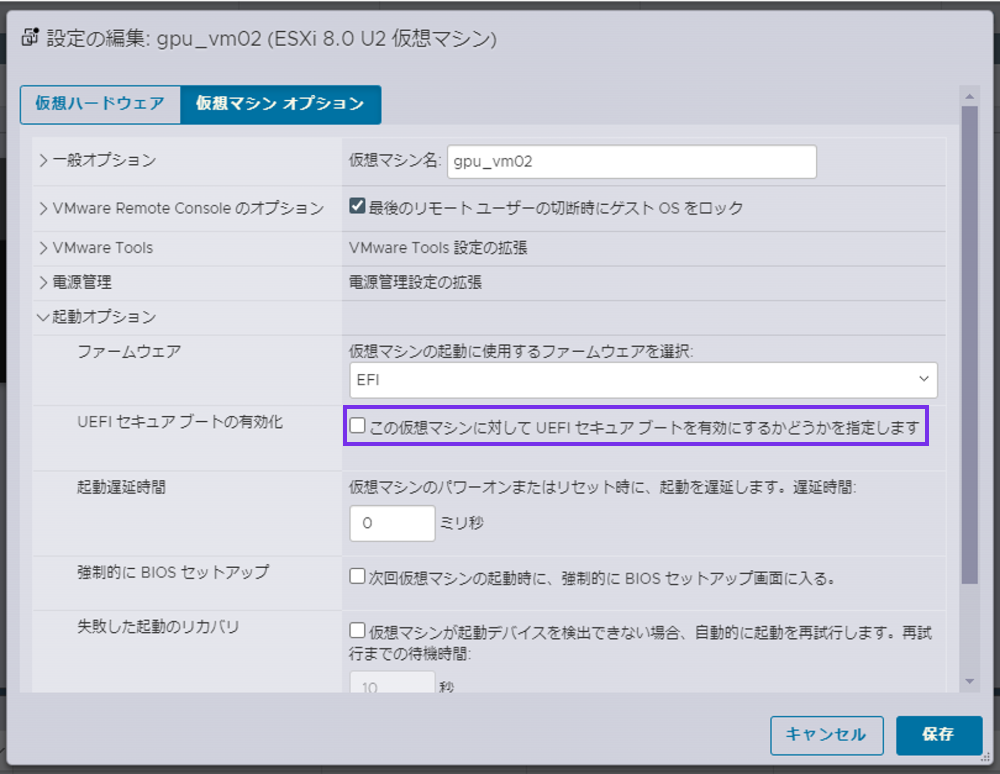

# 仮想マシンでGPUパススルーが使えるようになるまで
ESXi上で仮想マシンに対してGPUパススルーをするときの設定方法を下記にまとめます。

## 機材情報
- DL385 Gen11
- L40S x2
- ESXi 8.0U2

サーバー側でGPUが見えていることを確認します。

今回の環境ではBIOS側ではVideo Controllerのままですが、iLO上でL40Sが見えていることを確認しているため先に進めます。<br>

iLOでもGPU情報が見えなければ、個別でvBIOS（GPUファームウェア）を適用してください。
[HPE Support Center](https://support.hpe.com/connect/s/?language=ja)
より、対象GPUを検索して、vBIOSイメージを取得し、該当サーバー上で展開します。<br>

以下はH100 vBIOSのイメージ例


## ESXiホストでのGPUパススルー設定

ESXiホスト側で、ホスト > 管理 > ハードウェア > PCIデバイス > 該当GPUデバイスを選択 > パススルーの切替 > ☑ > "パススルー"がアクティブになっていることを確認します。


**※**参考ドキュメントはこちら：<br>
[VMware ESX/ESXi ホスト上の VMDirectPath I/O パススルー デバイスの構成 (1010789)](https://kb.vmware.com/s/article/1010789?lang=ja)

仮想マシンの設定編集より、
対象のGPUを”新規PCIデバイス”として追加


メモリ項目の、"すべてのゲストメモリを予約（すべてロック）"をチェック


起動オプション > ファームウェア > EFI
であることを確認し、<br>
UEFIセキュアブートの有効化 > "この仮想マシンに対してUEFIセキュアブートを有効にするかどうかを指定します"
のチェックをします。


仮想マシンオプション > 構成パラメータ　より、<br>
＋パラメータの追加で、<br>
ーーー<br>
pciPassthru.use64bitMMIO="TRUE"<br>
pciPassthru.64bitMMIOSizeGB="128"<br>
ーーー<br>
を足します。<br>
pciPassthru.64bitMMIOSizeGB="128"の数値に関しては、
GPU毎に異なるため確認が必要です。

**※**参考ドキュメントはこちら：<br>
- [VMXファイルの制限緩和の設定](https://kb.vmware.com/s/article/2142307)<br>
- [Creating a Virtual Machine - 18 . Adjust the Memory Mapped I/O（MMIO）settings for the VM](https://docs.nvidia.com/ai-enterprise/deployment-guide-vmware/0.1.0/first-vm.html#creating-a-virtual-machine)


A世代GPUより、必要なBAR領域が32Bit MMIO Size（ESXi）では足りなくなり、
下記A100の例だと、BAR0~3：16MiB + 64GiB + 32MiB = 64GiB以上
必要となるため、上記ESXi側のデフォルトMMIO設定値を変更しないと使用できません。<br>
ただし、このMMIO値は2乗単位でないといけないため、
64GB以上となると、次の値は128GBとなるので、設定値は"128"にする必要があります。


**※**参考ドキュメントはこちら：<br>
[A100 Product Brief](https://www.nvidia.com/content/dam/en-zz/Solutions/Data-Center/a100/pdf/A100-PCIE-Prduct-Brief.pdf)

あとは仮想マシンを起動し、<br>
対象のGPU Driverをインストールすることで仮想マシンでGPUを占有して利用することが可能となります。

```
root@gpu02:vi /etc/modprobe.d/blacklist-nouveau.conf
  blacklist nouveau
  options nouveau modeset=0

root@gpu02:sudo update-initramfs -u
root@gpu02:lspci | grep -i nvidia
root@gpu02:dpkg -l | grep nvidia
root@gpu02:ubuntu-drivers devices
root@gpu02:sudo add-apt-repository ppa:graphics-drivers/ppa
root@gpu02:sudo apt update
root@gpu02:sudo apt install nvidia-driver-550
root@gpu02:reboot

root@gpu02:/home/hpe# nvidia-smi
Fri Apr 12 07:06:57 2024
+-------------------------------------------------------------------------------                                                                                                                                                             ----------+
| NVIDIA-SMI 550.54.14              Driver Version: 550.54.14      CUDA Version:                                                                                                                                                              12.4     |
|-----------------------------------------+------------------------+------------                                                                                                                                                             ----------+
| GPU  Name                 Persistence-M | Bus-Id          Disp.A | Volatile Un                                                                                                                                                             corr. ECC |
| Fan  Temp   Perf          Pwr:Usage/Cap |           Memory-Usage | GPU-Util  C                                                                                                                                                             ompute M. |
|                                         |                        |                                                                                                                                                                            MIG M. |
|=========================================+========================+============                                                                                                                                                             ==========|
|   0  NVIDIA L40S                    Off |   00000000:03:00.0 Off |                                                                                                                                                                                 0 |
| N/A   43C    P8             25W /  350W |       0MiB /  46068MiB |      0%                                                                                                                                                                   Default |
|                                         |                        |                                                                                                                                                                               N/A |
+-----------------------------------------+------------------------+------------                                                                                                                                                             ----------+

+-------------------------------------------------------------------------------                                                                                                                                                             ----------+
| Processes:                                                                                                                                                                                                                                           |
|  GPU   GI   CI        PID   Type   Process name                              G                                                                                                                                                             PU Memory |
|        ID   ID                                                               U                                                                                                                                                             sage      |
|===============================================================================                                                                                                                                                             ==========|
|  No running processes found                                                                                                                                                                                                                          |
+-------------------------------------------------------------------------------                                                                                                                                                             ----------+

 ```


### Tips
上記仮想マシン側のBAR領域の設定をしないと、仮想マシンが起動してきません。

