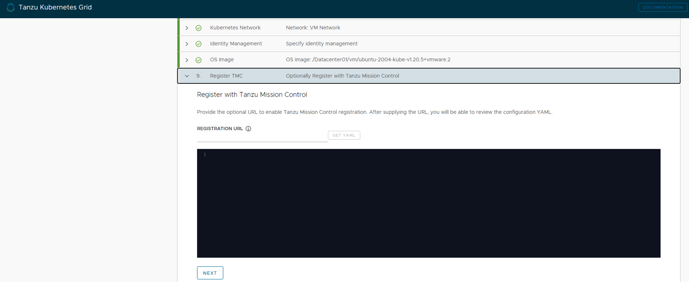
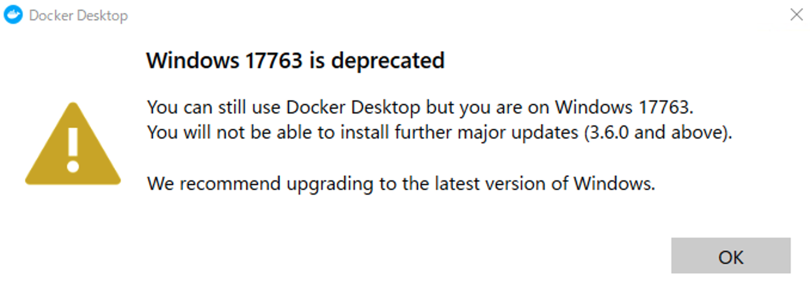

# VMware Tanzu Kubernetes GridをHPE ProLiantにインストール
TKGをインストールした際の手順等になります。検証環境や機材によって手順は異なりますので、あくまで参考資料としてご参照ください。  


## はじめに
初版筆者はオープンソースしか普段触っておらず、VCP6は持っていましたが、VMwareの*V*の字くらいしか覚えていません。さらにはLinuxにしか触らないのでWindowsもさほどわかりません。ただK8sに関しては無免許ですが、おおまかに構造を理解しています。そのため、各種手順説明ではVMware特有の言葉がわからないで無視していることが多々ありますが、皆様にコンテナ環境の素晴らしさを伝えたいがためにTanzu Kubernetes Gridのインストールにチャレンジしていますので、本コンテンツを暖かい目で読んでいただけると幸いです。

### 目標
- VMware Tanzu Kubernetes Grid 1.3 **Without NSX** をインストールしてみる
- どんな感じのKubernetesになっているか触って体験してみる (資料読むのがめんどいので作った方が早いという考え・・・)

## TL;DR

- 事前準備がなかなか多い
- VMwareをきちんと理解していないとドキュメント読むのに苦戦する
- トラブったときにはVMwareの知識はもちろんのこと、Dockerやk8s系の知識も必要になる

## 検証環境概要
- ProLiant SL210t Gen8 x4
  - Intel(R) Xeon(R) CPU E5-2640 v2 @ 2.00GHz (32Core)
  - RAM 128GB
  - HDD: 1TB HW RAID1
  - VMware ESXi 7.0.2 vSphere 7 Standard License
  - インターネット接続可能

- vCenter Server 7.0.0
  - 上記vSphere環境にアプライアンスとして配置

- Windows Server 2019
  - DNS
  - NTP
  - DHCP (DNSやNTP等も取得できるようにしとく)
  - 後ほどTanzuのBootstrap Machineというものにもする
  - 上記vSphere環境にVMとして配置
    - 4 vCore
    - 16 GB RAM
    - 100GB Disk

*すぐに使えるHPEサーバーがなかったので古い世代のサーバーです...ごめんなさい :(

## 手順
### HW準備と初期設定
コロナ禍なのであまり出社できず大変でした...HPE Synergy的なSoftware DefinedなハードウェアとHPE OneViewがあればリモートから簡単に設定できたんだろうなーと後々思いました。  
手順は省略...

### vSphereとvCenterのインストール、初期設定
手順は省略...

### bootstrap machineのセットアップ
Tanzu CLIコマンドを実行できるbootstrap machineを作成します。今回は、DNSサーバー等のためにWindows Server 2019を用意してもらったので、このWindows Serverをbootstrap machineにしようと思います。(Windows全然わかりませんが勉強のためにもあえて...)  

#### Docker Desktop for Windows
Docker Desktopを使ってkind(k8s in Docker)環境をbootstrap machineで作れるようにしなければならないようなので、[ここ](https://www.docker.com/products/docker-desktop)からDocker Desktopをダウンロードして、インストーラーに従いインストールします。vSphere環境で仮想マシンとしてWindows Serverを実行している方は事前に[仮想マシンWindows Server上でのDocker Desktop実行時にハマったこと](#WinOnVmwareDockerDesktopError)を確認してください。

Docker Desktopのライセンス体系が変更になり、条件によっては有償ライセンスが必要となります。詳しくは[こちら](https://www.docker.com/pricing/faq)をご確認ください。なお、本検証はライセンス形態が変更する前に行っています。


Tanzuのインストール要件で、Docker Desktopで使用できる**メモリは最低6GB**でないといけないようなので、Docker Machineの管理画面から設定変更します。


これでDocker Desktopの箇所は完了です。ちなみにbootstrap machineは**ちゃんとNTPサーバーと時刻同期してね**って書いてあったので忘れないでください。*time.google.com*か何かと同期しといてください。

#### Tanzuコマンドインストール
Docker Desktopが一体何に使われるのかが謎のままですが、手順通り各種コマンドのインストールをやります。[ここ](https://customerconnect.vmware.com/en/downloads/info/slug/infrastructure_operations_management/vmware_tanzu_kubernetes_grid/1_x)から*VMware Tanzu Kubernetes Grid*を選択して、各種OSのCLIをダウンロードします。  
本検証環境ではWindows Server2019を使っているので、*VMware Tanzu CLI for Windows*をダウンロードします。あと、*kubectl cluster cli v1.20.5 for Windows*も同時にダウンロードしときます。ダウンロードには**MyVmwareの認証情報が必要**なことに気をつけてください。  

CLIはTarで固まっているので解凍します。

```bash
# tar xvf tanzu-cli-bundle-v1.3.1-windows-amd64.tar
```

解凍しましたら、*C:\Program Files*か何かに*tanzu*というフォルダーを作って、解凍されてできたフォルダー*cli*内の*core/v1.3.1/tanzu-core-windows_amd64.exe*を*tanzu.exe*という名前に変更してから、*tanzu*フォルダーにコピーしておきます。  
その後、*tanzu*フォルダーのアクセス許可に*フルコントロール*を追加します。


次にコマンドにパスを通します。ユーザー環境変数の*Path*に*C:\Program Files\tanzu*を追加します。コマンドを配置したフォルダーが違う方はそのフォルダーのパスを追加してください。  
cmdを開いて、コマンドが打てるかを確認します。

```bash
> tanzu --help
Tanzu CLI

Usage:
  tanzu [command]

Available command groups:

  System
    completion              Output shell completion code
    config                  Configuration for the CLI
    init                    Initialize the CLI
    plugin                  Manage CLI plugins
    update                  Update the CLI
    version                 Version information


Flags:
  -h, --help   help for tanzu

Use "tanzu [command] --help" for more information about a command.

Not logged in
```

#### Tanzuコマンドプラグインインストール
手順に従い、次はTanzuコマンドプラグインをインストールします。初めにTanzu CLIのtarを解凍したフォルダー(*cli*フォルダーがある場所)に移動します。本検証環境の場合、Desktop上にworkというフォルダーを作ったのでcmdで移動します。

```bash
> cd C:\Users\Administrator\Desktop\work
> dir
 C:\Users\Administrator\Desktop\work のディレクトリ

2021/08/26  15:10    <DIR>          .
2021/08/26  15:10    <DIR>          ..
2021/05/07  13:22    <DIR>          cli
2021/08/26  15:06        12,177,495 kubectl-windows-v1.20.5-vmware.1.exe.gz
2021/08/26  15:02       536,811,520 tanzu-cli-bundle-v1.3.1-windows-amd64.tar
               2 個のファイル         548,989,015 バイト
               3 個のディレクトリ  80,906,596,352 バイトの空き領域
```

次にプラグインを以下のコマンドでインストールします。

```bash
> tanzu plugin install --local cli all
<何も出力されない>
```

プロンプトが返ってきたら、以下のコマンドでプラグインがインストールされたかを確認します。

```bash
> tanzu plugin list
  NAME                LATEST VERSION  DESCRIPTION                                                        REPOSITORY  VERSION  STATUS       
  alpha               v1.3.1          Alpha CLI commands                                                 core                 not installed
  cluster             v1.3.1          Kubernetes cluster operations                                      core        v1.3.1   installed
  kubernetes-release  v1.3.1          Kubernetes release operations                                      core        v1.3.1   installed
  login               v1.3.1          Login to the platform                                              core        v1.3.1   installed
  management-cluster  v1.3.1          Kubernetes management cluster operations                           core        v1.3.1   installed
  pinniped-auth       v1.3.1          Pinniped authentication operations (usually not directly invoked)  core        v1.3.1   installed
```

#### Kubectlコマンドのインストール
Kubernetesを管理するためのコマンド*kubectl*をbootstrap machineにインストールします。先ほどTanzu CLIセクションでダウンロードしたと思いますが、忘れてしまった方は[こちら](https://customerconnect.vmware.com/en/downloads/info/slug/infrastructure_operations_management/vmware_tanzu_kubernetes_grid/1_x)からダウンロードしてください。gzip形式で固められているので解凍用ソフトをダウンロードしてください。本検証環境では[Gzip for Windows](http://gnuwin32.sourceforge.net/packages/gzip.htm)を使用しました。

```bash
> gzip -d C:\Users\Administrator\Desktop\work\kubectl-windows-v1.20.5-vmware.1.exe.gz
```

解凍が完了したら、先ほどのTanzu CLI同様に任意の場所にコピー後、リネームしてパーミッションを与えてPathを通します。本検証環境では*C:\Program Files\kubectl*フォルダーを作成して、*kubectl.exe*という名前でコピーしています。  
Pathを通した後コマンドが実行できるかcmdを開いて確認します。

```bash
> kubectl version
Client Version: version.Info{Major:"1", Minor:"21", GitVersion:"v1.21.3", GitCommit:"ca643a4d1f7bfe34773c74f79527be4afd95bf39", GitTreeState:"clean", BuildDate:"2021-07-15T21:04:39Z", GoVersion:"go1.16.6", Compiler:"gc", Platform:"windows/amd64"}
Unable to connect to the server: dial tcp [::1]:8080: connectex: No connection could be made because the target machine actively refused it.
```

#### Carvelツールのインストール
Carvelはk8sを管理を容易にするツール群でPivotal（現VMware）が開発していました。TKGをインストール、管理するためにはCarvel内の以下のツールをインストールする必要があるようです。

- ytt
- kapp
- kbld
- imgpkg

*ytt*からインストールしていきます。初めにTanzu CLIのtarを解凍したフォルダー(*cli*フォルダーがある場所)に移動し、*ytt-windows-amd64-v0.31.0+vmware.1.gz*を解凍します。

```bash
> gzip -d ytt-windows-amd64-v0.31.0+vmware.1.gz
```
*C:\Program Files\carvel*というフォルダを作って、*ytt-windows-amd64-v0.31.0+vmware.1*を*ytt.exe*という名前でそのフォルダにコピーします。その後、*C:\Program Files\carvel*のPathを通します。

cmdを開いて、yttコマンドが実行できるか確認します。
```bash
> ytt version
ytt version 0.31.0
```

*kapp*も同じように解凍して、*C:\Program Files\carvel*に*kapp.exe*という名前でコピー後、コマンドが打てるか確認します。

```bash
> gzip -d kapp-windows-amd64-v0.36.0+vmware.1.gz

<解凍されたものをC:\Program Files\carvelにコピーしてリネーム...>

> kapp version
kapp version 0.36.0

Succeeded
```

*kbld*も*imgpkg*同じように実施します。

```bash
> gzip -d kbld-windows-amd64-v0.28.0+vmware.1.gz
> gzip -d imgpkg-windows-amd64-v0.5.0+vmware.1.gz

<解凍されたものをC:\Program Files\carvelにコピーしてリネーム...>

> kbld version
kbld version 0.28.0

Succeeded

> imgpkg version
imgpkg version 0.5.0

Succeeded
```

### Management Clusterのデプロイ
Management Clusterをデプロイします。CLIとUIどちらかでインストール可能らしく、初心者はUIの方が良いよーって書いてましたので、UIを使ってデプロイしてみます。Management Clusterがよくわかっていませんが、インストール後に触ってみればわかると思いますので、とりあえずやってみます...

#### 要件確認

[TKG 1.3の要件](https://docs.vmware.com/en/VMware-Tanzu-Kubernetes-Grid/1.3/vmware-tanzu-kubernetes-grid-13/GUID-mgmt-clusters-vsphere.html)を確認します。

- bootstrap machineにDocker環境と*tanzu* CLI、*kubectl*をインストールしていること
-  vSphereバージョン要件
  -  [x] vSphere 7
  -  [ ] vSphere 6.7u3 (Enterprise Plus license)
  -  [ ] VMware Cloud on AWS
  -  [ 	] Azure VMware Solution
-  vSphere構成要件
  -  [x] vSphereホストが２台以上 (4台あります！)
  -  [ ] TKG VM群を格納するVMフォルダー (後ほど実施)
  -  [x] いい感じに容量があるデータストア (結構容量あるからたぶん大丈夫)
- ネットワーク要件
  - [x] VMと接続可能なDHCPサーバー
  - [x] VMと接続可能なDNSサーバー
  - [x] Management ClusterとTanzu Kubernetes Cluster用の静的IP (DHCPサーバーからIP振られるのか現段階では理解していない)
  - [x] DHCPサーバーのレンジには含んでないが、DHCPサーバーで提供されるアドレスと同じサブネットにいるKube-VIPの静的IP
  - [x] Management ClusterとTanzu Kubernetes ClusterからvCenterへアクセスできること
  - [ ] Bootstrap MachineとManagement ClusterとTanzu Kubernetes Clusterの各種VMのport 6443(kube-api)にアクセスできること
  - [x] Management ClusterとTanzu Kubernetes Clusterの各種VMがvCenterのPort 443(API)にアクセスできること
  - [x] Bottstrap machineがBOMファイル(~/.tanzu/tkg/bom/にあるらしい)に記載されたコンテナイメージを取得できる環境であること(たぶんインターネットにでれるから大丈夫と信じる)
  - [x] vSphereホスト全てNTPサーバーを介して時刻同期されていること、タイムゾーンも一致していること

と色々書いてありましたが、インストールして失敗してみないと理解できないような要件もあったのでとりあえずやってみます。

#### ロールとユーザーの作成
Management Clusterをデプロイするときに必要となるvCenterロールとユーザーを作成します。

まずは*TKG*というロールを作成していきます。vCenterにアクセスして、管理 > アクセスコントロール > ロールと進み、+マークからロールを作成していきます。*TKG*ロールにアサインする権限は[こちらの表](https://docs.vmware.com/en/VMware-Tanzu-Kubernetes-Grid/1.3/vmware-tanzu-kubernetes-grid-13/GUID-mgmt-clusters-vsphere.html#vsphere-permissions)を確認してください。


つぎにユーザーを作成します。本検証環境では*tkg-user*というユーザーを作成します。vCenterにアクセスして、管理 >Single Sign On>ユーザーおよびグループと進み、ドメイン(本検証環境では*vsphere.local*)を選択して*ユーザー追加*を押します。


最後にそれぞれのvCenterオブジェクトに対して、*tkg-user*ユーザーと*TKG*ロールをアサインしていきます。各vCenterのセクションごとに権限追加する対象オブジェクトを以下に記載してますので、それに従ってください。 基本操作はオブジェクトを選択後、右クリックして*権限の追加*を選択して追加するだけです。

- *ホストおよびクラスタ*セクション
  - ツリーのトップにあるvCenter
  - TKGをデプロイするつもりのデータセンター
  - TKGをデプロイするつもりのクラスター
  - TKGをデプロイするつもりのクラスターに所属する全てのvSphereホスト
  - TKGをデプロイするつもりのリソースプール(子への伝達も必要)
- *仮想マシンおよびテンプレート*セクション
  - TKGで使うつもりのVMフォルダとVMテンプレートフォルダ(子への伝達も必要、後ほど実施)
- *ストレージ*セクション
  - TKGで使うつもりのデータストア全て
- *ネットワーク*セクション
  - TKGで使うつもりのネットワーク全て
  - TKGで使うつもりの分散仮想スイッチ全て
  - TKGで使うつもりの分散仮想スイッチポートグループ全て

#### SSH keyの作成
bootstrap machine上でssh keyを作成します。SSH public keyはManagement Clusterを作成する際に必要になります。以下のコマンドでssh key pairを作成してください。色々聞かれますがエンター連打でデフォルト設定で構いません。

```bash
> ssh-keygen -t rsa -b 4096 -C "tanzu@hpe.com"
```

次にManagement Clusterをデプロイする際に、vCenterの証明書のフィンガープリントが必要なので取得します。vCenter**管理サービス(デフォルトポート5480)**にアクセスして、アクセス> SSHログインを有効にしてください。

bootstrap machineからvCenterにrootユーザーでSSHアクセスします。本検証環境では*192.168.3.30*がvCenterになります。
```bash
> ssh root@192.168.3.30
The authenticity of host '192.168.3.30 (192.168.3.30)' can't be established.
ECDSA key fingerprint is SHA256:zjTunfxW2O3zIUA4ltfTZdAYOjN9ZIYFzZnjmhomcVA.
Are you sure you want to continue connecting (yes/no)? yes
Warning: Permanently added '192.168.3.30' (ECDSA) to the list of known hosts.

VMware vCenter Server 7.0.0.10700

Type: vCenter Server with an embedded Platform Services Controller
Command>
```

**shell**と入力し、SSL証明書のフィンガープリント見ます。このフィンガープリントはコピペして保存しておいてください。

```bash
Command> shell
Shell access is granted to root
root@vcsa [ ~ ]# openssl x509 -in /etc/vmware-vpx/ssl/rui.crt -fingerprint -sha1 -noout
SHA1 Fingerprint=51:C2:C3:95:3A:5C:32:4D:75:64:DD:4C:2D:4F:EE:51:FF:EF:BD:93
```
フィンガープリントの保存が終わりましたら、*exit*でSSHセッションを終わらせてください。

#### ベースイメージテンプレートのインポート
TKGの各種クラスターを構成するためのベースイメージテンプレート(OVA)を最初に取得する必要があります。このベースイメージにはいい感じのOSとk8sがインストールされているようです。

今回ターゲットとするのTKG1.3で必要なベースイメージテンプレートは以下です。クラスターの種別によって異なるようです。

- Management Cluster
  - Ubuntu v20.04 Kubernetes v1.20.5 OVA
  - Photon v3 Kubernetes v1.20.5 OVA

- Workload Cluster
  - VMwareサイトでダウンロードできるお好きなOSバージョンとK8sバージョンのOVAテンプレート

ここでWorkload Clusterというものが出てきましたが、おそらくPodを稼働させるクラスターを指しているのだと思います。Management ClusterはUbuntu OSベースとPhoton OSベースで選べるようなので、本検証環境ではもちろんUbuntuベースを選択します。ダウンロードはCLIの時と同じく、[ここから](https://customerconnect.vmware.com/en/downloads/info/slug/infrastructure_operations_management/vmware_tanzu_kubernetes_grid/1_x)できます。


それではダウンロードしたOVAをデプロイしていきます。ちなみに本検証環境では以下のようにDatacenterとClusterが定義されています。


*Cluster01*に対してOVAをデプロイします。使用許諾契約書の同意、適当なデータストアの選択、DNSやDHCPに繋がっているネットワークの選択以外はVM名含めてデフォルトで進めました。


デプロイが終了したことを確認してください。ここでの注意は**何が起こってもVMの電源をつけないこと**です。いまからこのVMをテンプレートにします。おそらく、VMの電源をつけるとinitプロセスが色々書き換えて、後々このテンプレートを使う際に不具合があるのだと予想します。  

それでは先ほどOVAからデプロイしたVMをVMテンプレートにします。


VMテンプレートへの変換が完了したら、そのVMテンプレートに対して権限を付与します。*TKG*ロールと*tkg_user*ユーザーをアサインします。


#### VMフォルダーの作成
TKGインストール時に作成されるVM群を格納するVMフォルダーを作成します。本検証環境では*tkg*という名前のVMフォルダーを作成しました。*TKG*ロールと*tkg-user*の権限追加 + *子への伝達*を*tkg*フォルダーにしてください。この作業をしなかった場合は[こちらのハマりポイント](#VmFolderForTkg)に書きましたので、気になる方はご参照ください。


#### インストーラーの起動
ついにインストーラーを起動させます。インストーラーはbootstrap machineからTanzu CLIを使って起動させます。

初めに*~/.tanzu/tkg/bom*フォルダーを削除します。

次にManagement Clusterをデプロイする際、bootstrap machineがWindows 環境だと既知問題があるようで、それに対応します。*~/.tanzu/tkg/config.yaml*に**TKG\_CUSTOM\_IMAGE\_REPOSITORY\_SKIP\_TLS\_VERIFY\: true**を最後尾に追加してください。[既知問題](https://docs.vmware.com/en/VMware-Tanzu-Kubernetes-Grid/1.3.1/rn/VMware-Tanzu-Kubernetes-Grid-131-Release-Notes.html)に関してはこちらを参照してください。

```yaml
release:
    version: ""
providers:
    - name: cluster-api
      url: file:///C:/Users/Administrator/.tanzu/tkg/providers/cluster-api/v0.3.14/core-components.yaml
      type: CoreProvider
    - name: aws
      url: file:///C:/Users/Administrator/.tanzu/tkg/providers/infrastructure-aws/v0.6.4/infrastructure-components.yaml
      type: InfrastructureProvider
    - name: vsphere
      url: file:///C:/Users/Administrator/.tanzu/tkg/providers/infrastructure-vsphere/v0.7.7/infrastructure-components.yaml
      type: InfrastructureProvider
    - name: azure
      url: file:///C:/Users/Administrator/.tanzu/tkg/providers/infrastructure-azure/v0.4.10/infrastructure-components.yaml
      type: InfrastructureProvider
    - name: tkg-service-vsphere
      url: file:///C:/Users/Administrator/.tanzu/tkg/providers/infrastructure-tkg-service-vsphere/v1.0.0/unused.yaml
      type: InfrastructureProvider
    - name: kubeadm
      url: file:///C:/Users/Administrator/.tanzu/tkg/providers/bootstrap-kubeadm/v0.3.14/bootstrap-components.yaml
      type: BootstrapProvider
    - name: kubeadm
      url: file:///C:/Users/Administrator/.tanzu/tkg/providers/control-plane-kubeadm/v0.3.14/control-plane-components.yaml
      type: ControlPlaneProvider
    - name: docker
      url: file:///C:/Users/Administrator/.tanzu/tkg/providers/infrastructure-docker/v0.3.10/infrastructure-components.yaml
      type: InfrastructureProvider
TKG_CUSTOM_IMAGE_REPOSITORY_SKIP_TLS_VERIFY: true
```

次に環境変数を使って、インストールするTKGのバージョンを以下のように付与します。Windows環境では値に**ダブルクォーテーション**入れないようにしてください。\"v1.3.1-patch1\"のように記載**しない**でください。

```bash
> set TKG_BOM_CUSTOM_IMAGE_TAG=v1.3.1-patch1
```


次に以下のコマンドを実行します。

```bash
> tanzu management-cluster create
Validating the pre-requisites...
Error: unable to parse provider name: invalid provider name "". Provider name should be in the form name[:version] and name cannot be empty
```

以下のエラーが出力されますが、無視して良いようです。(なんでやねん)  
*~/.tanzu/tkg/bom*にyamlファイルが作成されていれば大丈夫です。詳しくは[こちら](https://kb.vmware.com/s/article/83781)をご参照ください。

```log
Validating the pre-requisites...
Error: unable to parse provider name: invalid provider name "". Provider name should be in the form name[:version] and name cannot be empty
```

*tanzu management-cluster create*コマンドでmanagement clusterが出来上がるのかと思いきや、単にTKG 1.3.1に必要なコンテナイメージ情報とかをとってきているだけのようです。インストーラーUIは以下のコマンドで起動します。

```bash
> tanzu management-cluster create --ui
Validating the pre-requisites...
Serving kickstart UI at http://127.0.0.1:8080
```

webサーバーが立ち上がり、ブラウザが起動します。（Docker環境でコンテナとして立ち上がっているのかと思ったら違いました。）


今回はvSphere環境にTKGをインストールするので*VMweare vSphere*のDeployボタンを押します。するとvCenterの情報を入力する画面になりました。USERNAMEは先ほど作った*tkg-user@vsphere.local*を入力します。


PASSWORDを入力しましたら、CONNECTボタンを押してチェックしてみます。するとSSLフィンガープリントが表示されました。先ほどメモったフィンガープリントと一致しているかを確認し、OKでしたらCONTINUEボタンを押します。


するとvSphere with TanzuかTKG Management Clusterどっちをデプロイするん？ってきかれますので、TKG Management Clusterを選択します。


DATACENTERはTKGをインストールするデータセンターを選び、SSH PUBLIC KEYはbootstrap machineの*~/.ssh/id_rsa.pub*をコピペしてNEXTを押しました。

次にManagement Clusterの設定画面となります。INSTANCE TYPEで*small*を選ぶとk8s関連のさまざまなソフトウェアをデフォルトでインストールしてくれないようなので、Production環境で*medium*を選択してみました。詳しくは[こちら](https://docs.vmware.com/en/VMware-Tanzu-Kubernetes-Grid/1.3/vmware-tanzu-kubernetes-grid-13/GUID-mgmt-clusters-vsphere.html)を参照してください。

MANAGEMENT CLUSTER NAMEは空欄にし、CONTROL PLANE ENDPOINTはDHCP IPプール**外**のIPを指定します。MACHINE HEALTH CHECKはEnableにしてNEXTを押します。


次にNSX Advanced Load Balancerについての設定画面となりました。今回NSX-Tは使っていないので何も入力しません。


次にManagement Clusterのメタデータ設定画面になりました。オプション扱いのようなので何も入力せずにNEXTボタンを押します。


次にResource設定画面になりました。VM FOLDERはプルダウンから*/Datacenter01/vm/tkg*を選択し、DATASTOREは適当なデータストアを選択しました。CLUSTERは表示されているクラスタ名にチェックします。


次にkubernetesのネットワーク設定画面になりました。CNI Providerは選択できなかったので*Antrea*のままで、NETWORK NAMEはk8sで使用して良いネットワーク(*tkg-user*と*TKG*ロール付与したネトワーク)をプルダウンから選択しました。CLUSTER SERVICE CIDRとCLUSTER POF CIDRはデフォルトのままにしています。本検証環境はProxyを介していないので、Proxy Settingのところはオフのままで進めています。


次に認証管理の設定画面になりました。とくにOIDCやLDAPなどは使う予定ないので、オフとします。


次にベースイメージ選択画面になりました。プルダウンから作成したVMテンプレートを選択します。


次にTanzu Mission Controlの設定画面になりました。Tanzu Mission Controlがわかっていないのとオプション扱いだったので何も入力しませんでした。



最後にカスタマー エクスペリエンス向上プログラムに協力するかの同意だったのでデフォルトのまま進めました。


全ての項目を入力し終わるとREVIEW CONFIGURATIONボタンが出現したのでクリックします。


入力したパラメータが出力されますので、間違いがないかチェックします。一番最後にCLI Command Equivalentという箇所がありますが、これはCLIでManagement Clusterをデプロイするためのコマンドなので、コピーせずにそのままUIで進めます。


決意を固めたら、DEPLOY MANAGEMENT CLUSTERボタンを押しますが、その前に[KIND環境でハマったこと](#KindKubeProxyError)を参照してください。


bootstrap machine上でDocker Desktopの様子を見るとコンテナが起動してきていることがわかると思います。

```bash
> docker images
REPOSITORY                                   TAG                IMAGE ID       CREATED        SIZE
projects.registry.vmware.com/tkg/kind/node   v1.20.5_vmware.1   9942e0a0e6a6   4 months ago   1.25GB

> docker ps
CONTAINER ID   IMAGE                                                         COMMAND                  CREATED          STATUS          PORTS                       NAMES
2900cdcbb0a9   projects.registry.vmware.com/tkg/kind/node:v1.20.5_vmware.1   "/usr/local/bin/entr…"   39 seconds ago   Up 28 seconds   127.0.0.1:56730->6443/tcp   tkg-kind-c4k8n2gn8cr0bi1qtvg0-control-plane
```

コーヒーを飲みながら20-30分待つとインストールが完了しました。*CLI Command Equivalent*で表示されているコマンドラインを**コピーしておいてください**。


ちなみにTanzuコマンドは以下のような出力で終了しました。

```bash
> tanzu management-cluster create --ui

Validating the pre-requisites...
Serving kickstart UI at http://127.0.0.1:8080
Identity Provider not configured. Some authentication features won't work.
Validating configuration...
web socket connection established
sending pending 2 logs to UI
Using infrastructure provider vsphere:v0.7.7
Generating cluster configuration...
Setting up bootstrapper...
Bootstrapper created. Kubeconfig: C:\Users\Administrator\.kube-tkg\tmp\config_cmhORVip
Installing providers on bootstrapper...
Fetching providers
Installing cert-manager Version="v0.16.1"
Waiting for cert-manager to be available...
Installing Provider="cluster-api" Version="v0.3.14" TargetNamespace="capi-system"
Installing Provider="bootstrap-kubeadm" Version="v0.3.14" TargetNamespace="capi-kubeadm-bootstrap-system"
Installing Provider="control-plane-kubeadm" Version="v0.3.14" TargetNamespace="capi-kubeadm-control-plane-system"
Installing Provider="infrastructure-vsphere" Version="v0.7.7" TargetNamespace="capv-system"
Start creating management cluster...
Saving management cluster kubeconfig into C:\Users\Administrator/.kube/config
Installing providers on management cluster...
Fetching providers
Installing cert-manager Version="v0.16.1"
Waiting for cert-manager to be available...
Installing Provider="cluster-api" Version="v0.3.14" TargetNamespace="capi-system"
Installing Provider="bootstrap-kubeadm" Version="v0.3.14" TargetNamespace="capi-kubeadm-bootstrap-system"
Installing Provider="control-plane-kubeadm" Version="v0.3.14" TargetNamespace="capi-kubeadm-control-plane-system"
Installing Provider="infrastructure-vsphere" Version="v0.7.7" TargetNamespace="capv-system"
Waiting for the management cluster to get ready for move...
Waiting for addons installation...
Moving all Cluster API objects from bootstrap cluster to management cluster...
Performing move...
Discovering Cluster API objects
Moving Cluster API objects Clusters=1
Creating objects in the target cluster
Deleting objects from the source cluster
Waiting for additional components to be up and running...
Context set for management cluster tkg-mgmt-vsphere-20210830120158 as 'tkg-mgmt-vsphere-20210830120158-admin@tkg-mgmt-vsphere-20210830120158'.

Management cluster created!


You can now create your first workload cluster by running the following:

  tanzu cluster create [name] -f [file]
```

今回*Production*を選択したので、management cluster nodeが3台と+1台謎のVMが作成されました。DatastoreはESXiホストのローカルディスクを使っていますので、冗長性という観点ではあまり意味ないですが・・・


bootstrap machineで*kubectl*コマンドを実行するとmanagement clusterの状況がわかると思います。

```bash
> kubectl get node
NAME                                                    STATUS   ROLES                  AGE   VERSION
tkg-mgmt-vsphere-20210830120158-control-plane-2zqj7     Ready    control-plane,master   63m   v1.20.5+vmware.2
tkg-mgmt-vsphere-20210830120158-control-plane-5clpw     Ready    control-plane,master   68m   v1.20.5+vmware.2
tkg-mgmt-vsphere-20210830120158-control-plane-6ssmn     Ready    control-plane,master   59m   v1.20.5+vmware.2
tkg-mgmt-vsphere-20210830120158-md-0-8558d5fbb5-hc6xs   Ready    <none>                 65m   v1.20.5+vmware.2
```

Rolesがnoneになっている謎ノードに乗っているPodを確認してみます。

```bash
capi-kubeadm-bootstrap-system   capi-kubeadm-bootstrap-controller-manager-5bdd64499b-8z2dz   2/2     Running   1          63m   100.96.1.9     tkg-mgmt-vsphere-20210830120158-md-0-8558d5fbb5-hc6xs   <none>           <none>
capi-system                     capi-controller-manager-c4f5f9c76-k5pjg                      2/2     Running   1          63m   100.96.1.7     tkg-mgmt-vsphere-20210830120158-md-0-8558d5fbb5-hc6xs   <none>           <none>
capi-webhook-system             capi-controller-manager-768b989cbc-b74ws                     2/2     Running   0          63m   100.96.1.6     tkg-mgmt-vsphere-20210830120158-md-0-8558d5fbb5-hc6xs   <none>           <none>
capi-webhook-system             capi-kubeadm-bootstrap-controller-manager-67444bbcc9-676xv   2/2     Running   0          63m   100.96.1.8     tkg-mgmt-vsphere-20210830120158-md-0-8558d5fbb5-hc6xs   <none>           <none>
capi-webhook-system             capv-controller-manager-7cb88894c9-22js7                     2/2     Running   0          63m   100.96.1.10    tkg-mgmt-vsphere-20210830120158-md-0-8558d5fbb5-hc6xs   <none>           <none>
cert-manager                    cert-manager-6cbfc68c4b-kvszt                                1/1     Running   0          64m   100.96.1.4     tkg-mgmt-vsphere-20210830120158-md-0-8558d5fbb5-hc6xs   <none>           <none>
cert-manager                    cert-manager-cainjector-796775c48f-9j5q9                     1/1     Running   1          64m   100.96.1.3     tkg-mgmt-vsphere-20210830120158-md-0-8558d5fbb5-hc6xs   <none>           <none>
cert-manager                    cert-manager-webhook-7646d5bc94-sqhn5                        1/1     Running   0          64m   100.96.1.5     tkg-mgmt-vsphere-20210830120158-md-0-8558d5fbb5-hc6xs   <none>           <none>
kube-system                     antrea-agent-4xxh4                                           2/2     Running   0          59m   192.168.3.52   tkg-mgmt-vsphere-20210830120158-md-0-8558d5fbb5-hc6xs   <none>           <none>
kube-system                     kube-proxy-tjw42                                             1/1     Running   0          70m   192.168.3.52   tkg-mgmt-vsphere-20210830120158-md-0-8558d5fbb5-hc6xs   <none>           <none>
kube-system                     metrics-server-f57d744fc-p64qr                               1/1     Running   0          58m   100.96.1.12    tkg-mgmt-vsphere-20210830120158-md-0-8558d5fbb5-hc6xs   <none>           <none>
kube-system                     vsphere-csi-node-7pg9p                                       3/3     Running   0          59m   100.96.1.11    tkg-mgmt-vsphere-20210830120158-md-0-8558d5fbb5-hc6xs   <none>           <none>
tkr-system                      tkr-controller-manager-5c8c7bf477-vjdnx                      1/1     Running   1          73m   100.96.1.2     tkg-mgmt-vsphere-20210830120158-md-0-8558d5fbb5-hc6xs   <none>           <none>
```

Managment Clusterのワーカーノードみたいな感じでしょうか？

どのような仕組みでManagment Clusterがインストールされるかは簡単に確認しましたので、興味がある方は[こちら](#ArchToInstallMgmtCluster)を参照してください。

#### DHCPサーバーへのIP予約
DHCPサーバーに対して、各ノードに初回アサインされたIPアドレスを登録します。

### Tanzu Kuberentesのデプロイ
待ちに待ったTanzu Kubernetesをデプロイしてみます。

#### Configファイルの作成
Tanzu印のKubernetesをデプロイするための設定ファイルを作成します。(これはインストーラUIないのかい！w)

Management Clusterのインストール完了後、*CLI Command Equivalent*でコピーしたコマンドラインに記載されているyamlファイル名を*~/.tanzu/tkg/clusterconfigs/*から探し出して適当な場所にコピーしてください。ファイル名は適当でいいですが、本検証環境では*myk8s.yaml*としました。

以下のパラメータを追加、または変更します。YAML形式なのでスペースやインデント等に注意してください。値は自身の環境に合った値に適宜読み替えてください。

- CLUSTER_NAM: 作成するk8sクラスタ名
- VSPHERE_CONTROL_PLANE_ENDPOINT: 作成するk8sクラスタAPIサーバーVIP (静的IP)

```yaml:myk8s.yaml
CLUSTER_NAME: "takluster01"
~~~
VSPHERE_CONTROL_PLANE_ENDPOINT:  192.168.3.71
```

#### Tanzuコマンドからk8s作成
Tanzuコマンドを使ってk8sクラスタを作成します。

```bash
>tanzu cluster create --file myk8s.yaml
Validating configuration...
Warning: Pinniped configuration not found. Skipping pinniped configuration in workload cluster. Please refer to the documentation to check if you can configure pinniped on workload cluster manually
Creating workload cluster 'takluster01'...
Waiting for cluster to be initialized...
Waiting for cluster nodes to be available...
Waiting for addons installation...

Workload cluster 'takluster01' created
```

インストール後、Control Plane(Master) x3とWorker x3が作成されました。


そもそも、Control PlaneとWorkerのノード数を指定していませんでしたが、*CLUSTER_PLAN: prod*というパラメータで*Production*環境での稼働を指定していました。この場合はデフォルトで、Control Plane(Master) x3とWorker x3という構成になるようです。*CLUSTER_PLAN: dev*にした場合はデフォルトでControl Plane(Master) x1とWorker x1という構成になるようです。

ノード数をカスタマイズしたい場合は以下のパラメータで設定することができます。詳しくは[こちら](https://docs.vmware.com/en/VMware-Tanzu-Kubernetes-Grid/1.3/vmware-tanzu-kubernetes-grid-13/GUID-tanzu-k8s-clusters-deploy.html#configure-common-settings-4)を参照してください。

- CONTROL_PLANE_MACHINE_COUNT: Control Planeのノード数
- WORKER_MACHINE_COUNT: Workerのノード数

#### kubectlコマンドでアクセスする
作成したTanzu Kubernetesを*kubectl*コマンドでアクセスしてみます。その前にkubeconfigというkubernetes APIサーバーにアクセスするための認証ファイルを取得する必要があります。Management Cluster作成時は自動で*~/.kube/config*にkubeconfigを作成してくれましたが、実際のワークロードとして作成したTanzu K8sクラスタは自身で取得しなければなりません。

kubeconfig取得にはTanzuコマンドを使用します。まずkubeconfigを取得したいクラスタ名を確認します。

```bash
> tanzu cluster list
  NAME         NAMESPACE  STATUS   CONTROLPLANE  WORKERS  KUBERNETES        ROLES   PLAN
  takluster01  default    running  3/3           3/3      v1.20.5+vmware.2  <none>  prod
```

先ほど作成したクラスタ名(本検証環境では*takluster01*)をメモして、このクラスタのkubeconfigを取得します。

```bash
> tanzu cluster kubeconfig get takluster01 --admin
Credentials of cluster 'takluster01' have been saved
You can now access the cluster by running 'kubectl config use-context takluster01-admin@takluster01'
```

その後、上記コマンドで出力した最後のメッセージの通り、*kubectl*コマンドでkubeconfigを切り替えてノード情報を取得してみます。

```bash
>kubectl config use-context takluster01-admin@takluster01
Switched to context "takluster01-admin@takluster01".

> kubectl get node
NAME                                STATUS   ROLES                  AGE   VERSION
takluster01-control-plane-864hp     Ready    control-plane,master   39m   v1.20.5+vmware.2
takluster01-control-plane-9zzxb     Ready    control-plane,master   27m   v1.20.5+vmware.2
takluster01-control-plane-whsqz     Ready    control-plane,master   34m   v1.20.5+vmware.2
takluster01-md-0-85754d9cd9-dms7r   Ready    <none>                 34m   v1.20.5+vmware.2
takluster01-md-0-85754d9cd9-nbx44   Ready    <none>                 34m   v1.20.5+vmware.2
takluster01-md-0-85754d9cd9-wq9g5   Ready    <none>                 34m   v1.20.5+vmware.2
```

Podが全て稼働しているかもみてみます。

```bash
C:\Users\Administrator\Desktop\work>kubectl get pod -A
NAMESPACE     NAME                                                      READY   STATUS    RESTARTS   AGE
kube-system   antrea-agent-fq42x                                        2/2     Running   1          40m
kube-system   antrea-agent-kd4hk                                        2/2     Running   0          43m
kube-system   antrea-agent-ln9ww                                        2/2     Running   1          40m
kube-system   antrea-agent-m2vfz                                        2/2     Running   2          40m
kube-system   antrea-agent-n4zp6                                        2/2     Running   0          40m
kube-system   antrea-agent-t4tzq                                        2/2     Running   0          33m
kube-system   antrea-controller-7d8789cc86-6lwqs                        1/1     Running   0          43m
kube-system   coredns-68d49685bd-4hk4j                                  1/1     Running   0          45m
kube-system   coredns-68d49685bd-kcv9m                                  1/1     Running   0          45m
kube-system   etcd-takluster01-control-plane-864hp                      1/1     Running   0          45m
kube-system   etcd-takluster01-control-plane-9zzxb                      1/1     Running   0          33m
kube-system   etcd-takluster01-control-plane-whsqz                      1/1     Running   0          39m
kube-system   kube-apiserver-takluster01-control-plane-864hp            1/1     Running   0          45m
kube-system   kube-apiserver-takluster01-control-plane-9zzxb            1/1     Running   0          33m
kube-system   kube-apiserver-takluster01-control-plane-whsqz            1/1     Running   0          40m
kube-system   kube-controller-manager-takluster01-control-plane-864hp   1/1     Running   2          45m
kube-system   kube-controller-manager-takluster01-control-plane-9zzxb   1/1     Running   0          33m
kube-system   kube-controller-manager-takluster01-control-plane-whsqz   1/1     Running   0          40m
kube-system   kube-proxy-69lbf                                          1/1     Running   0          40m
kube-system   kube-proxy-c2rwj                                          1/1     Running   0          45m
kube-system   kube-proxy-cl69z                                          1/1     Running   0          40m
kube-system   kube-proxy-gs6wx                                          1/1     Running   0          40m
kube-system   kube-proxy-pwfvh                                          1/1     Running   0          40m
kube-system   kube-proxy-qcnzc                                          1/1     Running   0          33m
kube-system   kube-scheduler-takluster01-control-plane-864hp            1/1     Running   2          45m
kube-system   kube-scheduler-takluster01-control-plane-9zzxb            1/1     Running   0          33m
kube-system   kube-scheduler-takluster01-control-plane-whsqz            1/1     Running   0          40m
kube-system   kube-vip-takluster01-control-plane-864hp                  1/1     Running   2          45m
kube-system   kube-vip-takluster01-control-plane-9zzxb                  1/1     Running   0          33m
kube-system   kube-vip-takluster01-control-plane-whsqz                  1/1     Running   0          40m
kube-system   metrics-server-586c6b5b9c-9ltlq                           1/1     Running   0          43m
kube-system   vsphere-cloud-controller-manager-lzgfh                    1/1     Running   3          43m
kube-system   vsphere-cloud-controller-manager-snjpn                    1/1     Running   0          33m
kube-system   vsphere-cloud-controller-manager-zc9vx                    1/1     Running   0          38m
kube-system   vsphere-csi-controller-7b7dcc5d5f-bnl8n                   6/6     Running   10         43m
kube-system   vsphere-csi-node-4c8rr                                    3/3     Running   0          40m
kube-system   vsphere-csi-node-c6knt                                    3/3     Running   0          33m
kube-system   vsphere-csi-node-fbm82                                    3/3     Running   0          40m
kube-system   vsphere-csi-node-mnmxr                                    3/3     Running   0          43m
kube-system   vsphere-csi-node-p4vqf                                    3/3     Running   0          40m
kube-system   vsphere-csi-node-zxnh9                                    3/3     Running   0          40m
tkg-system    kapp-controller-5df5988d77-bdbzw                          1/1     Running   0          45m
```

無事にノード情報と稼働Pod情報を取得できました。ちなみにManagement Clusterのkubeconfigに戻したいときは以下のような手順で戻せます。

```bash
> kubectl config get-contexts
CURRENT   NAME                                                                    CLUSTER                           AUTHINFO                                NAMESPACE
*         takluster01-admin@takluster01                                           takluster01                       takluster01-admin
          tkg-mgmt-vsphere-20210830120158-admin@tkg-mgmt-vsphere-20210830120158   tkg-mgmt-vsphere-20210830120158   tkg-mgmt-vsphere-20210830120158-admin

> kubectl config use-context tkg-mgmt-vsphere-20210830120158-admin@tkg-mgmt-vsphere-20210830120158
Switched to context "tkg-mgmt-vsphere-20210830120158-admin@tkg-mgmt-vsphere-20210830120158".

> kubectl get node
NAME                                                    STATUS   ROLES                  AGE    VERSION
tkg-mgmt-vsphere-20210830120158-control-plane-2zqj7     Ready    control-plane,master   148m   v1.20.5+vmware.2
tkg-mgmt-vsphere-20210830120158-control-plane-5clpw     Ready    control-plane,master   153m   v1.20.5+vmware.2
tkg-mgmt-vsphere-20210830120158-control-plane-6ssmn     Ready    control-plane,master   145m   v1.20.5+vmware.2
tkg-mgmt-vsphere-20210830120158-md-0-8558d5fbb5-hc6xs   Ready    <none>                 151m   v1.20.5+vmware.2

```

#### DHCPサーバーへのIP予約
DHCPサーバーに対して、各ノードに初回アサインされたIPアドレスを登録します。

## ハマったこと集
<a id="WinOnVmwareDockerDesktopError"></a>
### 仮想マシンWindows Server上でのDocker Desktop実行時のエラー
再起動するように促されるので、ただただ従います。再起動後、デスクトップ上にできたDocker Desktopのアイコンを押して起動してみましたがエラー出ました。



「フルで機能が使えないからWindows Serverのアップデートをしろ」っと鯨が怒っていますが、無視してOKしました。すると、さらに以下のようなエラーがでました。


Docker Desktopで利用するHyper-Vが使えていないようです。Hyper-Vがインストールされていないのかと思い、確認したところインストールされているように見えます。


Hyper-Vの管理画面を見ると、Docker-Machine用のVMが停止していたので起動させてみましたが、以下のように起動できませんでした。エラー詳細みても、Windowsが不慣れなせいか詳細がわからない....


よく考えると、今回のWindows ServerはvSphereの仮想マシンとして起動していて、さらにHyper-Vの仮想技術を使おうとしているので、vSphere側の仮想ハードウェアの設定で「ゲストOS内で仮想化を許可する」的な設定が必要なのではないかと閃きました。そこでWindow Serverを停止して、仮想マシンの設定箇所をみたところ、CPUの項目に「ハードウェア仮想化」というものがあったので、これにチェックを入れて再度Windows Serverを起動してみました。


すると、起動して数分たつとWindows Server上でDocker Desktopが起動してきました!


<a id="KindKubeProxyError"></a>
### Management Clusterインストール時のKind環境Kube-Proxyエラー
Management Clusterインストール時はbootstrap machineのDocker環境にKind環境が構成されます。そのとき、Kube-proxyが正しく起動しないことが原因で他のコンテナも影響してインストールができないことがありました。具体的には以下の手順で確かめられます。

```bash
> docker ps -a
CONTAINER ID   IMAGE                                                         COMMAND                  CREATED          STATUS                       PORTS     NAMES
b6996b6de229   projects.registry.vmware.com/tkg/kind/node:v1.20.5_vmware.1   "/usr/local/bin/entr…"   26 minutes ago   Exited (137) 9 minutes ago             tkg-kind-c4k9fmon8cr0ss5q25u0-control-plane

> docker exec -it  21 bash

root@tkg-kind-c4k9sqgn8cr1uo2ul36g-control-plane:/#
root@tkg-kind-c4k9sqgn8cr1uo2ul36g-control-plane:/# export KUBECONFIG=/etc/kubernetes/admin.conf
root@tkg-kind-c4k9fmon8cr0ss5q25u0-control-plane:/# kubectl get node
NAME                                          STATUS     ROLES                  AGE   VERSION
tkg-kind-c4k9fmon8cr0ss5q25u0-control-plane   NotReady   control-plane,master   79s   v1.20.5+vmware.1

root@tkg-kind-c4k9fmon8cr0ss5q25u0-control-plane:/# kubectl get pod -A
NAMESPACE            NAME                                                                  READY   STATUS    RESTARTS   AGE
cert-manager         cert-manager-6cbfc68c4b-ckrrz                                         0/1     Pending   0          3m27s
cert-manager         cert-manager-cainjector-796775c48f-nn256                              0/1     Pending   0          3m27s
cert-manager         cert-manager-webhook-7646d5bc94-5q2w7                                 0/1     Pending   0          3m27s
kube-system          coredns-68d49685bd-8xh4z                                              0/1     Pending   0          6m10s
kube-system          coredns-68d49685bd-sbbzh                                              0/1     Pending   0          6m9s
kube-system          etcd-tkg-kind-c4k9fmon8cr0ss5q25u0-control-plane                      1/1     Running   0          6m15s
kube-system          kindnet-lpx8n                                                         1/1     Running   2          6m10s
kube-system          kube-apiserver-tkg-kind-c4k9fmon8cr0ss5q25u0-control-plane            1/1     Running   0          6m14s
kube-system          kube-controller-manager-tkg-kind-c4k9fmon8cr0ss5q25u0-control-plane   1/1     Running   0          6m15s
kube-system          kube-proxy-cwd8n                                                      0/1     Error     6          6m10s
kube-system          kube-scheduler-tkg-kind-c4k9fmon8cr0ss5q25u0-control-plane            1/1     Running   0          6m14s
local-path-storage   local-path-provisioner-8b46957d4-p4xz2                                0/1     Pending   0          6m8s

root@tkg-kind-c4k9fmon8cr0ss5q25u0-control-plane:/# kubectl logs kube-proxy-cwd8n -n kube-system
I0827 07:50:23.719943       1 node.go:172] Successfully retrieved node IP: 172.17.0.2
I0827 07:50:23.721319       1 server_others.go:142] kube-proxy node IP is an IPv4 address (172.17.0.2), assume IPv4 operation
W0827 07:50:23.767047       1 server_others.go:578] Unknown proxy mode "", assuming iptables proxy
I0827 07:50:23.767575       1 server_others.go:185] Using iptables Proxier.
I0827 07:50:23.768722       1 server.go:650] Version: v1.20.5+vmware.1
I0827 07:50:23.770229       1 conntrack.go:100] Set sysctl 'net/netfilter/nf_conntrack_max' to 131072
F0827 07:50:23.771252       1 server.go:495] open /proc/sys/net/netfilter/nf_conntrack_max: permission denied
```
*/proc/sys/net/netfilter/nf_conntrack_max: permission denied*というエラーがkube-proxyコンテナから出力されると思います。kindのバージョンによっては[こちら](https://github.com/kubernetes-sigs/kind/issues/2240)の不具合があるようで、今回使用したkindのイメージは*projects.registry.vmware.com/tkg/kind/node:v1.20.5_vmware.1*です。Management Clusterのインストール前にDocker環境で(Windowsの場合はHyper-VのVM)以下のコマンドを実行すればkube-proxyの問題は回避できました。

```
# sysctl net/netfilter/nf_conntrack_max=131072
```

実際にカーネルパラメータ変更後、kind環境で全てのPodが正常に起動したことを確認できました。

```
root@tkg-kind-c4k9sqgn8cr1uo2ul36g-control-plane:/# kubectl get pod -A
NAMESPACE                           NAME                                                                  READY   STATUS    RESTARTS   AGE
capi-kubeadm-bootstrap-system       capi-kubeadm-bootstrap-controller-manager-5bdd64499b-2sbpz            2/2     Running   0          10m
capi-kubeadm-control-plane-system   capi-kubeadm-control-plane-controller-manager-7f89b8594d-dlslz        2/2     Running   0          10m
capi-system                         capi-controller-manager-c4f5f9c76-g2l5r                               2/2     Running   0          10m
capi-webhook-system                 capi-controller-manager-768b989cbc-l4fjk                              2/2     Running   0          11m
capi-webhook-system                 capi-kubeadm-bootstrap-controller-manager-67444bbcc9-prbkf            2/2     Running   0          10m
capi-webhook-system                 capi-kubeadm-control-plane-controller-manager-5466b4d4d6-6mbr2        2/2     Running   0          10m
capi-webhook-system                 capv-controller-manager-7cb88894c9-jjrcg                              2/2     Running   0          10m
capv-system                         capv-controller-manager-6b568576b6-zpjs4                              2/2     Running   0          10m
cert-manager                        cert-manager-6cbfc68c4b-dbbfz                                         1/1     Running   0          12m
cert-manager                        cert-manager-cainjector-796775c48f-zrzcp                              1/1     Running   0          12m
cert-manager                        cert-manager-webhook-7646d5bc94-x8vm2                                 1/1     Running   0          12m
kube-system                         coredns-68d49685bd-lbwgr                                              1/1     Running   0          14m
kube-system                         coredns-68d49685bd-wzdhp                                              1/1     Running   0          14m
kube-system                         etcd-tkg-kind-c4k9sqgn8cr1uo2ul36g-control-plane                      1/1     Running   0          14m
kube-system                         kindnet-t22wd                                                         1/1     Running   0          14m
kube-system                         kube-apiserver-tkg-kind-c4k9sqgn8cr1uo2ul36g-control-plane            1/1     Running   0          14m
kube-system                         kube-controller-manager-tkg-kind-c4k9sqgn8cr1uo2ul36g-control-plane   1/1     Running   0          14m
kube-system                         kube-proxy-ztn9d                                                      1/1     Running   0          14m
kube-system                         kube-scheduler-tkg-kind-c4k9sqgn8cr1uo2ul36g-control-plane            1/1     Running   0          14m
local-path-storage                  local-path-provisioner-8b46957d4-sql5b                                1/1     Running   0          14m
```
<a id="VmFolderForTkg"></a>
### TKG用のVMフォルダーについて
Management Cluster作成時、インストーラー画面で*<Datacenter名>/vm*というフォルダ(DatacenterデフォルトVMフォルダ)を選択したら、Management Cluster VMのクローン失敗エラーが連続して、Management Clusterのデプロイができませんでした。

```log
Clone virtual machine
Status:
The name 'management-control-plane-v69cr' already exists.
Initiator:
VSPHERE.LOCAL\tkg-user
Target:
ubuntu-2004-kube-v1.20.5+vmware.2
Server:
vcsa.hybrid.jp
There are no related events.
```

そこで、*<Datacenter名>/vm/tkg*という*VMおよびテンプレートフォルダ*を作成し、インストーラで指定しましたらうまくいきました。(*tkg-user*と*TKG*ロールの権限アサインおよび*子への伝搬*を忘れずに)  

たぶん*<Datacenter名>/vm*に対して、*tkg-user*と*TKG*ロールの権限アサインをしていなかったからと思われるが、デフォルトで作成される*<Datacenter名>/vm*にどのように権限アサインするかがわからない。。。

## その他
<a id="ArchToInstallMgmtCluster"></a>
### どうやってManagement Clusterをインストールしているか調査
Management ClusterはBootstrap machine上のDocker Desktop上にkind上でコンテナを起動させてインストールするという説明が書いてありましたが、なんでk8s環境がインストール時に必要なのか理解できなかったので、kind環境で起動するPod一覧を確認しました。

```bash
root@tkg-kind-c4m1p5on8cr19m7ebrp0-control-plane:/# kubectl get pod -A
NAMESPACE                           NAME                                                                  READY   STATUS    RESTARTS   AGE
capi-kubeadm-bootstrap-system       capi-kubeadm-bootstrap-controller-manager-5bdd64499b-szr5f            2/2     Running   0          3m26s
capi-kubeadm-control-plane-system   capi-kubeadm-control-plane-controller-manager-7f89b8594d-2xwnf        2/2     Running   0          3m12s
capi-system                         capi-controller-manager-c4f5f9c76-5gf2c                               2/2     Running   0          3m43s
capi-webhook-system                 capi-controller-manager-768b989cbc-hht6f                              2/2     Running   0          3m55s
capi-webhook-system                 capi-kubeadm-bootstrap-controller-manager-67444bbcc9-nlfkt            2/2     Running   0          3m38s
capi-webhook-system                 capi-kubeadm-control-plane-controller-manager-5466b4d4d6-rbzdc        2/2     Running   0          3m22s
capi-webhook-system                 capv-controller-manager-7cb88894c9-2zqrd                              2/2     Running   0          3m6s
capv-system                         capv-controller-manager-6b568576b6-fj2g6                              2/2     Running   0          2m24s
cert-manager                        cert-manager-6cbfc68c4b-dfsvl                                         1/1     Running   0          5m47s
cert-manager                        cert-manager-cainjector-796775c48f-dv6pw                              1/1     Running   1          5m48s
cert-manager                        cert-manager-webhook-7646d5bc94-shzvx                                 1/1     Running   1          5m46s
kube-system                         coredns-68d49685bd-dh54c                                              1/1     Running   0          7m9s
kube-system                         coredns-68d49685bd-g7bpf                                              1/1     Running   0          7m9s
kube-system                         etcd-tkg-kind-c4m1p5on8cr19m7ebrp0-control-plane                      1/1     Running   0          7m31s
kube-system                         kindnet-j9zz7                                                         1/1     Running   0          7m10s
kube-system                         kube-apiserver-tkg-kind-c4m1p5on8cr19m7ebrp0-control-plane            1/1     Running   0          7m31s
kube-system                         kube-controller-manager-tkg-kind-c4m1p5on8cr19m7ebrp0-control-plane   1/1     Running   0          7m31s
kube-system                         kube-proxy-zfv8k                                                      1/1     Running   0          7m10s
kube-system                         kube-scheduler-tkg-kind-c4m1p5on8cr19m7ebrp0-control-plane            1/1     Running   0          7m28s
local-path-storage                  local-path-provisioner-8b46957d4-fmpsb                                1/1     Running   0          7m3s
```

k8sのサブプロジェクトである[Cluster API](https://github.com/kubernetes-sigs/cluster-api)を使ってManagement Clusterをインストールしている模様でした。Cluster APIはk8sの仕組みを使って、他のk8sを作成したり、管理したりする仕組みです。

Management Cluster上にもCluster APIがインストールされていましたので、実際にワークロードとして使用するTanzu印のk8sも同じ仕組みで作成されると予想します。

「Cluster APIを使っているからkind環境が必要なんだ〜Tanzu CLIから各種パラメータをCluster APIに渡してvSphere環境にManagement Cluster作ってんだ〜」と理解したところ満足したのでそれ以上インストールの仕組みを調べてません。すいません。

## 参考資料
- [VMware Tanzu Kubernetes Grid 1.3 Documentation](https://docs.vmware.com/en/VMware-Tanzu-Kubernetes-Grid/1.3/vmware-tanzu-kubernetes-grid-13/GUID-index.html)
