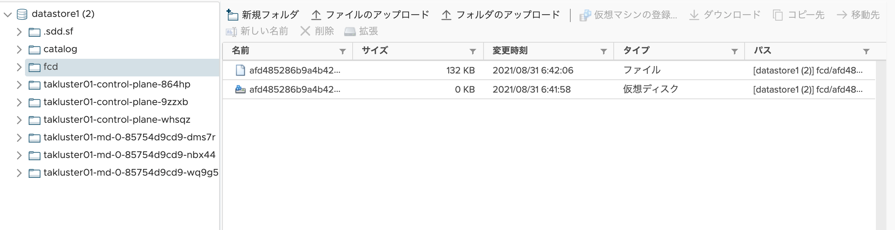

# VMware Tanzu Kubernetes Gridを使ってみる01
本章では実際にTanzu Kubernetes Gridで作成されたKubernetes Clusterをいじってみます。[TKGのインストール](../installation)はこちらを確認してください。


## 注意事項
- 本章では筆者が*kubectl*コマンドを打ちすぎて腱鞘炎になりつつあるので、*kubectl*コマンドのエイリアスを*k*として入力しています
- *kubectl*実行端末はMacOSからとなっていますので、適宜自身の環境にあったコマンドに読み替えてください

## Nginx Webサーバーを公開してみよう
ありきたりですが、Nginx Web Serverを公開するという目的を掲げた上で色々と触ってみます。

### 事前準備

- 適切なkubeconfigを手に入れおり、*kubectl*コマンドでそのk8sクラスターにcluster admin権限でアクセスできること
- YAMLについての構造を理解していること(復習したい方は本レポジトリのAnsible入門編を参照してください)
- K8sリソースに関して大まかに理解していること

### Namespaceの作成
はじめにNamespaceを作成します。Namespace名は*test01*にします。

```bash
➜  manifests git:(dev) ✗ k create ns test01     
namespace/test01 created
```

### Deploymentの作成
次にDeploymentを作成します。*deployment01.yaml*というファイル名でマニフェストを作成してデプロイしてみます。サンプルは[こちら](manifests/deployment01.yaml)にあります。

```yaml:deployment01.yaml
---
apiVersion: apps/v1
kind: Deployment
metadata:
  name: nginx
  namespace: test01
spec:
  replicas: 3
  selector:
    matchLabels:
      app: nginx
  template:
    metadata:
      labels:
        app: nginx
    spec:
      containers:
      - name: nginx
        readinessProbe:
          httpGet:
            path: /index.html
            port: 80
          failureThreshold: 3
          initialDelaySeconds: 30
          periodSeconds: 10
          timeoutSeconds: 3
        image: nginx:1.21.1-alpine
        ports:
        - containerPort: 80
          protocol: TCP
```


```
➜  manifests git:(dev) ✗ k apply -f deployment01.yaml
deployment.apps/nginx created
```

Deploymentが作成され、Podが稼働しているかを確認します。

```bash
➜  manifests git:(dev) ✗ k -n test01 get all                   
NAME                         READY   STATUS    RESTARTS   AGE
pod/nginx-6978d66bbb-47h4q   1/1     Running   0          103s
pod/nginx-6978d66bbb-9rwcj   1/1     Running   0          103s
pod/nginx-6978d66bbb-m78pv   1/1     Running   0          103s

NAME                    READY   UP-TO-DATE   AVAILABLE   AGE
deployment.apps/nginx   3/3     3            3           103s

NAME                               DESIRED   CURRENT   READY   AGE
replicaset.apps/nginx-6978d66bbb   3         3         3       103s
```

### Serviceの作成(Nodeport)
次にNode Portタイプを使ってServiceを作成します。*service01.yaml*というファイル名でマニフェストを作成してデプロイしてみます。サンプルは[こちら](manifests/service01.yaml)にあります。

```yaml:service01.yaml
---
apiVersion: v1
kind: Service
metadata:
  name: nginx
  namespace: test01
spec:
  selector:
    app: nginx
  ports:
    - name: http
      protocol: TCP
      port: 80
      targetPort: 80
  type: NodePort
```

```bash
➜  manifests git:(dev) ✗ k -n test01 get all
NAME                         READY   STATUS    RESTARTS   AGE
pod/nginx-6978d66bbb-47h4q   1/1     Running   0          41m
pod/nginx-6978d66bbb-9rwcj   1/1     Running   0          41m
pod/nginx-6978d66bbb-m78pv   1/1     Running   0          41m

NAME            TYPE       CLUSTER-IP      EXTERNAL-IP   PORT(S)        AGE
service/nginx   NodePort   100.69.56.239   <none>        80:31940/TCP   25m

NAME                    READY   UP-TO-DATE   AVAILABLE   AGE
deployment.apps/nginx   3/3     3            3           41m

NAME                               DESIRED   CURRENT   READY   AGE
replicaset.apps/nginx-6978d66bbb   3         3         3       41m
```

Node Port: 32262がアサインされたので、そこに対してHTTPアクセスをしてみます。しかしながら、TKGで作成されたk8s nodeはDHCPからIPアドレスを取得しているので、vCenterにログインして適当なノードのIPアドレスを調べます。

本検証環境ではノードの１つが192.168.3.55というIPを持つことがわかりましたので、そのノードに対して先ほどアサインされたNode Portを指定してHTTPアクセスしたいと思います。アクセス確認方法はブラウザでもコマンドでもどちらでもいいですが、以下は*curl*コマンドで実行しています。

```bash
➜  manifests git:(dev) ✗ curl 192.168.3.55:31940
<!DOCTYPE html>
<html>
<head>
<title>Welcome to nginx!</title>
<style>
    body {
        width: 35em;
        margin: 0 auto;
        font-family: Tahoma, Verdana, Arial, sans-serif;
    }
</style>
</head>
<body>
<h1>Welcome to nginx!</h1>
<p>If you see this page, the nginx web server is successfully installed and
working. Further configuration is required.</p>

<p>For online documentation and support please refer to
<a href="http://nginx.org/">nginx.org</a>.<br/>
Commercial support is available at
<a href="http://nginx.com/">nginx.com</a>.</p>

<p><em>Thank you for using nginx.</em></p>
</body>
</html>
```

無事アクセスできることがわかりました。ただTanzu Kubernetesは[kub-vip](https://kube-vip.io/)を採用していたので、*kubectl*でアクセスしにいくkube-apiのVIPで本サービスにもアクセスできるのではと思いました。kube-vipに設定したIPアドレスを忘れたので探します。

```bash
➜  manifests git:(dev) ✗ k get all -n kube-system |grep vip                     
pod/kube-vip-takluster01-control-plane-864hp                  1/1     Running   2          140m
pod/kube-vip-takluster01-control-plane-9zzxb                  1/1     Running   0          128m
pod/kube-vip-takluster01-control-plane-whsqz                  1/1     Running   0          135m
```

このPodがVIPの情報を持っているので、適当なPodを選んでVIP情報を探します。

```bash
➜  manifests git:(dev) ✗ k get pod/kube-vip-takluster01-control-plane-whsqz -n kube-system -o yaml
~~~
    env:
    - name: vip_arp
      value: "true"
    - name: vip_leaderelection
      value: "true"
    - name: address
      value: 192.168.3.71 <=これ
    - name: vip_interface
      value: eth0
    - name: vip_leaseduration
      value: "15"
    - name: vip_renewdeadline
      value: "10"
    - name: vip_retryperiod
      value: "2"
~~~
```

VIPが192.168.3.71とわかりましたので、このVIPとNode portを指定してNginxにアクセスしてみます。

```bash
➜  manifests git:(dev) ✗  curl -I 192.168.3.71:31940
HTTP/1.1 200 OK
Server: nginx/1.21.1
Date: Mon, 30 Aug 2021 07:44:46 GMT
Content-Type: text/html
Content-Length: 612
Last-Modified: Tue, 06 Jul 2021 15:21:03 GMT
Connection: keep-alive
ETag: "60e474df-264"
Accept-Ranges: bytes

```

HTTP Status Code 200が返ってきたので、ちゃんとNginxにアクセスできました。


サービスを削除します。

```bash
➜  manifests git:(dev) ✗ k delete -f service01.yaml
service "nginx" deleted
```

### Metal LBの導入
kube-vipを使用してサービスを公開してもいいですが、kube-vipはkube-api-serverへのトラフィックも受け付けるので、なんか気持ち悪いのでLoad Balancerを導入します。NSXを使っている方はVMware NSX Advanced Loadbalancer、通称aviというものが使えます。

今回はNSXがない環境なので、[Metal LB](https://metallb.universe.tf/)というk8s上で構築できるソフトウェアロードバランサーを使います。早速インストールします。

```
➜  manifests git:(dev) ✗ kubectl apply -f https://raw.githubusercontent.com/metallb/metallb/v0.10.2/manifests/namespace.yaml
namespace/metallb-system created
➜  manifests git:(dev) ✗
➜  manifests git:(dev) ✗ kubectl apply -f https://raw.githubusercontent.com/metallb/metallb/v0.10.2/manifests/metallb.yaml
podsecuritypolicy.policy/controller created
podsecuritypolicy.policy/speaker created
serviceaccount/controller created
serviceaccount/speaker created
clusterrole.rbac.authorization.k8s.io/metallb-system:controller created
clusterrole.rbac.authorization.k8s.io/metallb-system:speaker created
role.rbac.authorization.k8s.io/config-watcher created
role.rbac.authorization.k8s.io/pod-lister created
role.rbac.authorization.k8s.io/controller created
clusterrolebinding.rbac.authorization.k8s.io/metallb-system:controller created
clusterrolebinding.rbac.authorization.k8s.io/metallb-system:speaker created
rolebinding.rbac.authorization.k8s.io/config-watcher created
rolebinding.rbac.authorization.k8s.io/pod-lister created
rolebinding.rbac.authorization.k8s.io/controller created
daemonset.apps/speaker created
deployment.apps/controller created
➜  manifests git:(dev) ✗ k get all -n metallb-system
NAME                              READY   STATUS    RESTARTS   AGE
pod/controller-6b78bff7d9-gscxd   1/1     Running   0          53s
pod/speaker-ct4j9                 1/1     Running   0          53s
pod/speaker-fnxn5                 1/1     Running   0          53s
pod/speaker-l6h9d                 1/1     Running   0          53s
pod/speaker-ncs5d                 1/1     Running   0          53s
pod/speaker-q6bdc                 1/1     Running   0          53s
pod/speaker-rn47b                 1/1     Running   0          53s

NAME                     DESIRED   CURRENT   READY   UP-TO-DATE   AVAILABLE   NODE SELECTOR            AGE
daemonset.apps/speaker   6         6         6       6            6           kubernetes.io/os=linux   53s

NAME                         READY   UP-TO-DATE   AVAILABLE   AGE
deployment.apps/controller   1/1     1            1           53s

NAME                                    DESIRED   CURRENT   READY   AGE
replicaset.apps/controller-6b78bff7d9   1         1         1       53s
```

次にロードバランサーのIPプール等を設定します。*configmap_metallb.yaml*というファイル名でマニフェストを作成してデプロイしてみます。サンプルは[こちら](manifests/configmap_metallb.yaml)にあります。IPプールは*192.168.3.81-192.168.3.99*の範囲で設定しています。

```yaml:configmap_metallb.yaml
apiVersion: v1
kind: ConfigMap
metadata:
  namespace: metallb-system
  name: config
data:
  config: |
    address-pools:
    - name: default
      protocol: layer2
      addresses:
      - 192.168.3.81-192.168.3.99
```

インストール手順詳細は[こちら](https://metallb.universe.tf/installation/)をご参照ください。

### Serviceの作成(LoadBalancer)
次にLoadBalancerタイプを使ってServiceを作成します。*service02.yaml*というファイル名でマニフェストを作成してデプロイしてみます。サンプルは[こちら](manifests/service02.yaml)にあります。

```yaml:service02.yaml
---
apiVersion: v1
kind: Service
metadata:
  name: nginx
  namespace: test01
spec:
  selector:
    app: nginx
  ports:
    - name: http
      protocol: TCP
      port: 80
      targetPort: 80
  type: LoadBalancer
```

```bash
➜  manifests git:(dev) ✗ k apply -f service02.yaml
service/nginx created
➜  manifests git:(dev) ✗  k -n test01 get all     
NAME                         READY   STATUS    RESTARTS   AGE
pod/nginx-6978d66bbb-47h4q   1/1     Running   0          62m
pod/nginx-6978d66bbb-9rwcj   1/1     Running   0          62m
pod/nginx-6978d66bbb-m78pv   1/1     Running   0          62m

NAME            TYPE           CLUSTER-IP       EXTERNAL-IP    PORT(S)        AGE
service/nginx   LoadBalancer   100.70.234.149   192.168.3.81   80:32761/TCP   13s

NAME                    READY   UP-TO-DATE   AVAILABLE   AGE
deployment.apps/nginx   3/3     3            3           62m

NAME                               DESIRED   CURRENT   READY   AGE
replicaset.apps/nginx-6978d66bbb   3         3         3       62m
```

Metal LBに設定したIPプールから192.168.3.81がServiceのExternal IPとアサインされています。Nginxにアクセスできるか確認してみます。

```
➜  manifests git:(dev) ✗ curl 192.168.3.81                   
<!DOCTYPE html>
<html>
<head>
<title>Welcome to nginx!</title>
<style>
    body {
        width: 35em;
        margin: 0 auto;
        font-family: Tahoma, Verdana, Arial, sans-serif;
    }
</style>
</head>
<body>
<h1>Welcome to nginx!</h1>
<p>If you see this page, the nginx web server is successfully installed and
working. Further configuration is required.</p>

<p>For online documentation and support please refer to
<a href="http://nginx.org/">nginx.org</a>.<br/>
Commercial support is available at
<a href="http://nginx.com/">nginx.com</a>.</p>

<p><em>Thank you for using nginx.</em></p>
</body>
</html>
```

確認できたらServiceを削除します。

```bash
➜  manifests git:(dev) ✗ k delete -f service02.yaml
service "nginx" deleted
```


Nginxにアクセスできたかと思います。NSX環境でなく、aviのようなLoad Balancerが導入できない方はMetal LB等のロードバランサーを活用しても良いかもしれません。

## ストレージを確認してみよう！
### デフォルトのStorage Classを確認
デフォルトで用意されているStorage Classを確認してみます。

```bash
➜  manifests git:(dev) ✗ k get sc                 
NAME                PROVISIONER              RECLAIMPOLICY   VOLUMEBINDINGMODE   ALLOWVOLUMEEXPANSION   AGE
default (default)   csi.vsphere.vmware.com   Delete          Immediate           true                   3h4m

```

vSphere CSIがデフォルトのStorage Classとして用意されていました。次に単にPVCを作成します。*pvc01.yaml*というファイル名でマニフェストを作成してデプロイしてみます。サンプルは[こちら](manifests/pvc01.yaml)にあります。

```yaml:pvc01.yaml
---
apiVersion: v1
kind: PersistentVolumeClaim
metadata:
  name: test
  namespace: test01
spec:
  accessModes:
  - ReadWriteOnce
  resources:
    requests:
      storage: 1Gi
```

```
➜  manifests git:(dev) ✗ k apply -f pvc01.yaml
persistentvolumeclaim/test created
➜  manifests git:(dev) ✗ k get pvc            
NAME   STATUS   VOLUME                                     CAPACITY   ACCESS MODES   STORAGECLASS   AGE
test   Bound    pvc-c12efc30-9f2e-4967-9412-327d25ff6ab8   1Gi        RWO            default        5s
➜  manifests git:(dev) ✗ k get pv
NAME                                       CAPACITY   ACCESS MODES   RECLAIM POLICY   STATUS   CLAIM         STORAGECLASS   REASON   AGE
pvc-c12efc30-9f2e-4967-9412-327d25ff6ab8   1Gi        RWO            Delete           Bound    test01/test   default                 28s
```

Persistent Volumeが作成されて、Claimされたことがわかります。ではこのVolumeの本体がどこにあるか調べます。Tanzu Kubernetes Clusterを作成する際に使用したdatastoreを見ると、*fcd*というフォルダに仮想ディスクが自動で出来上がっていることがわかります。



このようにコンテナのデータ領域を簡単にdatastoreから切り出すことができます。

確認できたらPVCを削除します。datastoreから仮想ディスクも削除されたことを確認してください。

```bash
➜  manifests git:(dev) ✗ k delete -f pvc01.yaml                                          
persistentvolumeclaim "test" deleted
```

## Ingress Controllerの導入
Ingress ControllerはいわばL7ロードバランサーとなります。今回はNginx Ingress Controllerをインストールしてみます。

### Helmの導入
Helmを使って今回はNginx Ingress Controllerをインストールしてみます。Helmインストール方法は[こちら](https://helm.sh/docs/intro/install/)を参照してください。

### Nginx Ingress Controllerのインストール
まずHelmにNginx Ingress Controllerのレポジトリを追加します。その後、最新レポジトリ情報を取得します。

```bash
➜  manifests git:(dev) ✗ helm repo add ingress-nginx https://kubernetes.github.io/ingress-nginx             
"ingress-nginx" has been added to your repositories
➜  manifests git:(dev) ✗ helm repo update
Hang tight while we grab the latest from your chart repositories...
...Successfully got an update from the "ingress-nginx" chart repository
```

次にNginx Ingress Controller作成のための各種パラメータを設定していきます。以下のコマンドでパラメータ情報を取得してファイルとして保存します。

```bash
➜  manifests git:(dev) ✗ helm show values ingress-nginx/ingress-nginx > helm-nginx-ingress.yaml
```

作成したファイル*helm-nginx-ingress.yaml*を開いて各種パラメータを設定します。サンプルは[こちら](manifests/helm-nginx-ingress.yaml)にあります。変更部分はIngress ControllerのService設定セクションの*loadBalancerIP*をMetalLBで設定したIPレンジの内１つのIPを与えます。

```yaml:nginx-ingress.yaml
    loadBalancerIP: "192.168.3.90"
```

Namespaceを作ってNginx Ingress ControllerをHELMからインストールします。

```bash
➜  manifests git:(dev) ✗ k create ns nginx-ingress
namespace/nginx-ingress created
➜  manifests git:(dev) ✗ helm install ingress-nginx ingress-nginx/ingress-nginx -n nginx-ingress -f helm-nginx-ingress.yaml
NAME: ingress-nginx
LAST DEPLOYED: Tue Aug 31 07:03:15 2021
NAMESPACE: test01
STATUS: deployed
REVISION: 1
TEST SUITE: None
~~~~~~~~

➜  manifests git:(dev) ✗ k -n nginx-ingress get all       
NAME                                            READY   STATUS    RESTARTS   AGE
pod/ingress-nginx-controller-65c4f84996-dk28x   1/1     Running   0          118s

NAME                                         TYPE           CLUSTER-IP       EXTERNAL-IP    PORT(S)                      AGE
service/ingress-nginx-controller             LoadBalancer   100.67.226.30    192.168.3.90   80:31506/TCP,443:32074/TCP   118s
service/ingress-nginx-controller-admission   ClusterIP      100.70.199.211   <none>         443/TCP                      118s

NAME                                       READY   UP-TO-DATE   AVAILABLE   AGE
deployment.apps/ingress-nginx-controller   1/1     1            1           118s

NAME                                                  DESIRED   CURRENT   READY   AGE
replicaset.apps/ingress-nginx-controller-65c4f84996   1         1         1       118s
```

指定したIP*192.168.3.90*でServiceを公開している様子がわかるかと思います。

### Ingressを使ってWebサービスを公開
Ingressを使って、Namespace test01に作成済みのwebサービスを公開します。まず、DNSのAレコードに先ほどIngressで設定したIPアドレスとドメイン名を登録します。本検証環境ではドメイン名を*test-web.hybrid.jp*で登録します。

次にClusterIPタイプを使ってServiceを作成します。*service03.yaml*というファイル名でマニフェストを作成してデプロイしてみます。サンプルは[こちら](manifests/service03.yaml)にあります。

```yaml:service03.yaml
---
apiVersion: v1
kind: Service
metadata:
  name: nginx
  namespace: test01
spec:
  selector:
    app: nginx
  ports:
    - name: http
      protocol: TCP
      port: 80
      targetPort: 80
  type: ClusterIP
```

```bash
➜  manifests git:(dev) ✗ k apply -f service03.yaml
service/nginx created
➜  manifests git:(dev) ✗ k get svc -n test01                                           
NAME    TYPE        CLUSTER-IP       EXTERNAL-IP   PORT(S)   AGE
nginx   ClusterIP   100.66.211.236   <none>        80/TCP    6s
```

続いて、Ingressを作成します。*ingress01.yaml*というファイル名でマニフェストを作成してデプロイしてみます。サンプルは[こちら](manifests/ingress01.yaml)にあります。

```yaml:ingress01.yaml
---
apiVersion: networking.k8s.io/v1
kind: Ingress
metadata:
  name: nginx
  namespace: test01
  annotations:
    kubernetes.io/ingress.class: nginx
spec:
  rules:
  - host: "test-web.hybrid.jp"
    http:
      paths:
      - path: /
        pathType: Prefix
        backend:
          service:
            name: nginx
            port:
              number: 80
```

```bash
➜  manifests git:(dev) ✗ k apply -f ingress01.yaml
ingress.networking.k8s.io/nginx created
➜  manifests git:(dev) ✗ k get -n test01 ingress                                            
NAME    CLASS    HOSTS                ADDRESS   PORTS   AGE
nginx   <none>   test-web.hybrid.jp             80      82s
```

設定したFQDNにHTTPアクセスします。

```bash
> curl http://test-web.hybrid.jp
<!DOCTYPE html>
<html>
<head>
<title>Welcome to nginx!</title>
<style>
    body {
        width: 35em;
        margin: 0 auto;
        font-family: Tahoma, Verdana, Arial, sans-serif;
    }
</style>
</head>
<body>
<h1>Welcome to nginx!</h1>
<p>If you see this page, the nginx web server is successfully installed and
working. Further configuration is required.</p>

<p>For online documentation and support please refer to
<a href="http://nginx.org/">nginx.org</a>.<br/>
Commercial support is available at
<a href="http://nginx.com/">nginx.com</a>.</p>

<p><em>Thank you for using nginx.</em></p>
</body>
</html>
```

Ingressを通してWeb Serverにアクセスできました。確認が完了したらIngressとServiceを削除します。

```bash
➜  manifests git:(dev) ✗ k delete -f service03.yaml
service "nginx" deleted
➜  manifests git:(dev) ✗ k delete -f ingress01.yaml
ingress.networking.k8s.io "nginx" deleted
```

## まとめ
Tanzu KubernetesにMetal LBやNginx Ingress Controllerを導入してサービスを公開しました。NSXを導入してAdvanced Loadbalancerを使って同様のことはできますが、NSXへのハードルが高い方はこの章のようにオープンソースで作成するのも１つの方法かなと思っています。

また、本章ではPersistent VolumeもTanzu KubernetesではDatastoreを使ってすぐに作成できることを確認しました。HPE Storageに関してvSphere CSI同様に[HPE Storage CSI](https://scod.hpedev.io/welcome/index.html)を**無償**で提供しています。ストレージ側でボリュームを自動で切り出してコンテナに付与したい場合はHPE Storage CSIのご利用も検討いただけると幸いです。

### 後片付け
Nginx DeploymentとNamespaceを削除しときます。他の章でMetalLBとNginx Ingress Controllerを使う予定なので残しておきます。

```bash
➜  manifests git:(dev) ✗ k delete -f deployment01.yaml
deployment.apps "nginx" deleted
➜  manifests git:(dev) ✗ k delete ns test01           
namespace "test01" deleted
```
