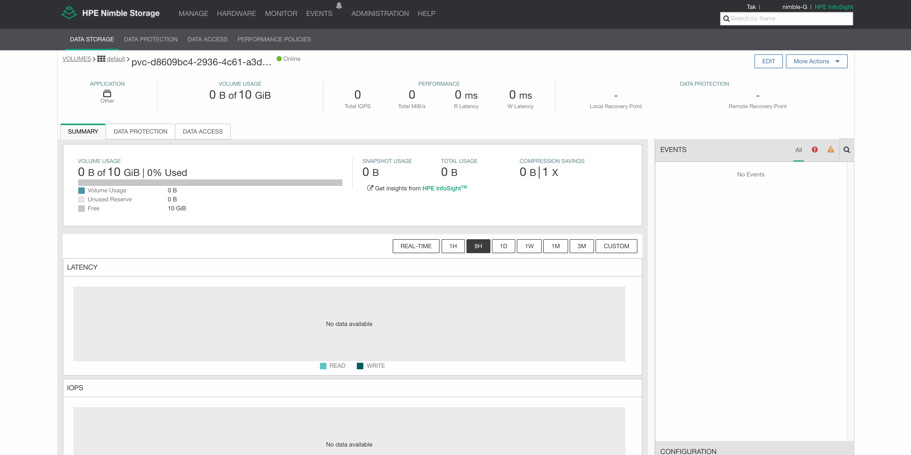

# HPE Nimble Storageと連携してみる
本章では実際にTanzu Kubernetes Gridで作成されたKubernetes Clusterをいじってみます。[TKGのインストール](../installation)はこちらを確認してください。


## 注意事項
- 本章では筆者が*kubectl*コマンドを打ちすぎて腱鞘炎になりつつあるので、*kubectl*コマンドのエイリアスを*k*として入力しています
- *kubectl*実行端末はMacOSからとなっていますので、適時自身の環境にあったコマンドに読み替えてください

## 事前準備

- 適切なkubeconfigを手に入れており、*kubectl*コマンドでそのk8sクラスターにcluster admin権限でアクセスできること
- YAMLについての構造を理解していること(復習したい方は本レポジトリのAnsible入門編を参照してください)
- K8sリソースに関して大まかに理解していること
- HPE 3PAR、Primera、Nimble、Alletra等のストレージがあること

## HPE Nimble Storageをコンテナボリュームとして活用
VMware Tanzu Kubernetes Grid(TKG)はデフォルトでvSphereのデータストア上にコンテナボリュームを作成できるようになっていますが、直接ストレージからボリュームを渡したいサービスもあると思います。今回はHPE Nimble Storageを使ってコンテナボリュームを作成する方法を検証していきます。


### HPE Container Storage Interface Driverについて
HPEは**無償**でCSIドライバーと言われるk8s用のストレージドライバーを提供しています。そのラインナップは主要製品全てをカバーしています。詳しいドキュメントは[こちら](https://scod.hpedev.io/csi_driver/index.html)をご参照ください。

HELMで簡単にインストールしていきます。HPE CSI DriverのArtifact Hubは[こちら](https://artifacthub.io/packages/helm/hpe-storage/hpe-csi-driver)です。

### Namespaceの作成
はじめにNamespaceを作成します。Namespace名は*hpe-storage*にします。

```bash
➜  ~  k create ns hpe-storage
namespace/hpe-storage created
```

### Helm Chart Repositoryの追加
HPE StorageのHelm chart repoを追加して、repo情報を取得します。

```bash
➜  ~ helm repo add hpe-storage https://hpe-storage.github.io/co-deployments/

"hpe-storage" has been added to your repositories

➜  ~ helm repo update                                                       
Hang tight while we grab the latest from your chart repositories...
...Successfully got an update from the "hpe-storage" chart repository
```

HPE CSIドライバーのHelm Chartのバージョンを見ていきます。

```bash
➜  manifests git:(dev) ✗ helm search repo hpe-storage/hpe-csi-driver                           
NAME                      	CHART VERSION	APP VERSION	DESCRIPTION                                       
hpe-storage/hpe-csi-driver	2.0.0        	2.0.0      	A Helm chart for installing the HPE CSI Driver ...
```

### 各種パラメータの確認
HPE CSIドライバーをHelmからインストール時に設定可能なパラメータを確認してみます。

```bash
➜  ~ helm show values hpe-storage/hpe-csi-driver > helm-hpe-csi-driver.yaml
```

作成された*helm-hpe-csi-driver.yaml*を確認してください。各種パラメータの説明は先にあげた[Artifact Hub](https://artifacthub.io/packages/helm/hpe-storage/hpe-csi-driver)に載っています。・・・はずです。

今回の検証環境ではiSCSIを使います。CHAP認証を設定する方は、*helm-hpe-csi-driver.yaml*の*iscsi*項目を設定してください。サンプルは[こちら](manifests/helm-hpe-csi-driver.yaml)にあります。

### HPE CSI Driverと仲間たちをインストール
それではHELMからCSIドライバーをインストールしてみます。HPE CSIドライバーは様々なコンポーネントで成り立っているので、それらも同時にインストールされます。

```bash
➜  manifests git:(dev) ✗ helm install hpe-csi hpe-storage/hpe-csi-driver -n hpe-storage -f helm-hpe-csi-driver.yaml
W0908 15:45:54.168274   17286 warnings.go:67] apiextensions.k8s.io/v1beta1 CustomResourceDefinition is deprecated in v1.16+, unavailable in v1.22+; use apiextensions.k8s.io/v1 CustomResourceDefinition
W0908 15:45:54.242353   17286 warnings.go:67] apiextensions.k8s.io/v1beta1 CustomResourceDefinition is deprecated in v1.16+, unavailable in v1.22+; use apiextensions.k8s.io/v1 CustomResourceDefinition
W0908 15:45:54.285738   17286 warnings.go:67] apiextensions.k8s.io/v1beta1 CustomResourceDefinition is deprecated in v1.16+, unavailable in v1.22+; use apiextensions.k8s.io/v1 CustomResourceDefinition
W0908 15:45:54.327016   17286 warnings.go:67] apiextensions.k8s.io/v1beta1 CustomResourceDefinition is deprecated in v1.16+, unavailable in v1.22+; use apiextensions.k8s.io/v1 CustomResourceDefinition
W0908 15:45:56.815737   17286 warnings.go:67] apiextensions.k8s.io/v1beta1 CustomResourceDefinition is deprecated in v1.16+, unavailable in v1.22+; use apiextensions.k8s.io/v1 CustomResourceDefinition
W0908 15:45:56.860318   17286 warnings.go:67] apiextensions.k8s.io/v1beta1 CustomResourceDefinition is deprecated in v1.16+, unavailable in v1.22+; use apiextensions.k8s.io/v1 CustomResourceDefinition
W0908 15:45:56.872789   17286 warnings.go:67] apiextensions.k8s.io/v1beta1 CustomResourceDefinition is deprecated in v1.16+, unavailable in v1.22+; use apiextensions.k8s.io/v1 CustomResourceDefinition
W0908 15:45:56.885165   17286 warnings.go:67] apiextensions.k8s.io/v1beta1 CustomResourceDefinition is deprecated in v1.16+, unavailable in v1.22+; use apiextensions.k8s.io/v1 CustomResourceDefinition
NAME: hpe-csi
LAST DEPLOYED: Wed Sep  8 15:45:59 2021
NAMESPACE: hpe-storage
STATUS: deployed
REVISION: 1
TEST SUITE: Non
```

以下のようなWarningが出るかもしれませんが無視して大丈夫です。

```log
apiextensions.k8s.io/v1beta1 CustomResourceDefinition is deprecated
```

稼働しているPod等の情報を確認します。

```bash
➜  manifests git:(dev) ✗ k get all -n hpe-storage
NAME                                      READY   STATUS    RESTARTS   AGE
pod/hpe-csi-controller-6f9b8c6f7b-hpfxc   9/9     Running   0          5m28s
pod/hpe-csi-node-789vt                    2/2     Running   1          5m28s
pod/hpe-csi-node-8x7qq                    2/2     Running   1          5m28s
pod/hpe-csi-node-c2w9b                    2/2     Running   1          5m28s
pod/nimble-csp-5f6cc8c744-7gg7f           1/1     Running   0          5m28s
pod/primera3par-csp-7f78f498d5-nz8k5      1/1     Running   0          5m28s

NAME                          TYPE        CLUSTER-IP       EXTERNAL-IP   PORT(S)    AGE
service/alletra6000-csp-svc   ClusterIP   100.69.64.156    <none>        8080/TCP   5m28s
service/alletra9000-csp-svc   ClusterIP   100.66.222.133   <none>        8080/TCP   5m28s
service/nimble-csp-svc        ClusterIP   100.64.137.191   <none>        8080/TCP   5m28s
service/primera3par-csp-svc   ClusterIP   100.68.136.113   <none>        8080/TCP   5m28s

NAME                          DESIRED   CURRENT   READY   UP-TO-DATE   AVAILABLE   NODE SELECTOR   AGE
daemonset.apps/hpe-csi-node   3         3         3       3            3           <none>          5m28s

NAME                                 READY   UP-TO-DATE   AVAILABLE   AGE
deployment.apps/hpe-csi-controller   1/1     1            1           5m28s
deployment.apps/nimble-csp           1/1     1            1           5m28s
deployment.apps/primera3par-csp      1/1     1            1           5m28s

NAME                                            DESIRED   CURRENT   READY   AGE
replicaset.apps/hpe-csi-controller-6f9b8c6f7b   1         1         1       5m28s
replicaset.apps/nimble-csp-5f6cc8c744           1         1         1       5m28s
replicaset.apps/primera3par-csp-7f78f498d5      1         1         1       5m28s
```

複数のオブジェクトが作成されていることがわかると思います。HPE CSIドライバーを使うにはこれら全てのオブジェクトが必要となり、逆にいうとこれさえインストールしてしまえば、HPE 3PAR、Primera、Nimble、AlletraストレージをK8s環境で使用する準備が整いました。

詳しい仕組みについて知りたい方は以下をご参照ください。

- [Tutorial: Introduction to Using the Container Storage Interface (CSI) Primitives - Michael Mattsson](https://www.youtube.com/watch?v=AnfAd6goq-o)


### ストレージ情報の作成
次にストレージ情報をk8s上に作成するためにSecretを作成します。*secret.yaml*というファイル名でマニフェストを作成してデプロイしてみます。サンプルは[こちら](manifests/secret.yaml)にあります。

```yaml:secretyaml
---
apiVersion: v1
kind: Secret
metadata:
  name: hpe-nimble
  namespace: hpe-storage
stringData:
  serviceName: nimble-csp-svc
  servicePort: "8080"
  backend: 192.168.2.200
  username: tak
  password: password
```

- serviceName

HELMでCSIドライバーをインストールした際に作成された各ストレージ製品用のService名を記載します。本検証環境ではNimble Storageを使うので*nimble-csp-svc*と指定しています。

```log
NAME                          TYPE        CLUSTER-IP       EXTERNAL-IP   PORT(S)    AGE
service/nimble-csp-svc        ClusterIP   100.64.137.191   <none>        8080/TCP   5m28s
```

-  servicePort

HELMでCSIドライバーをインストールした際に作成された各Storage製品用のServiceで公開されているPortを指定します。*nimble-csp-svc*は8080を公開しているので*8080*と指定しています。

- backend

Storage管理コンソール(もしくはAPI)のIP Addressを指定します。

- username

Storageにログインするためのユーザー名を指定します。ユーザーはボリューム作成、削除等の権限が必要です。

- password

Storageにログインするためのユーザーのパスワードを指定します。


作成できたらデプロイします。

```bash
➜  manifests git:(dev) ✗ k apply -f secret.yaml      
secret/hpe-nimble created
➜  manifests git:(dev) ✗
➜  manifests git:(dev) ✗ k get secret -n hpe-storage hpe-nimble
NAME         TYPE     DATA   AGE
hpe-nimble   Opaque   5      22s
```

### ストレージの登録
StorageClassオブジェクトを作成します。先ほど作成したストレージ情報を実際に使用可能なストレージとしてk8sに登録するイメージです。*storageclass01.yaml*というファイル名でマニフェストを作成してデプロイしてみます。サンプルは[こちら](manifests/storageclass01.yaml)にあります。


```yaml:storageclass01.yaml
---
apiVersion: storage.k8s.io/v1
kind: StorageClass
metadata:
  name: hpe-nimble-block
provisioner: csi.hpe.com
parameters:
  csi.storage.k8s.io/fstype: xfs
  csi.storage.k8s.io/controller-expand-secret-name: hpe-nimble
  csi.storage.k8s.io/controller-expand-secret-namespace: hpe-storage
  csi.storage.k8s.io/controller-publish-secret-name: hpe-nimble
  csi.storage.k8s.io/controller-publish-secret-namespace: hpe-storage
  csi.storage.k8s.io/node-publish-secret-name: hpe-nimble
  csi.storage.k8s.io/node-publish-secret-namespace: hpe-storage
  csi.storage.k8s.io/node-stage-secret-name: hpe-nimble
  csi.storage.k8s.io/node-stage-secret-namespace: hpe-storage
  csi.storage.k8s.io/provisioner-secret-name: hpe-nimble
  csi.storage.k8s.io/provisioner-secret-namespace: hpe-storage
  description: "Volume created by using a custom Secret with the HPE CSI Driver for Kubernetes"
reclaimPolicy: Delete
allowVolumeExpansion: true
```

作成できたらデプロイします。

```bash
➜  manifests git:(dev) ✗ k apply -f storageclass01.yaml
storageclass.storage.k8s.io/hpe-nimble-block created
➜  manifests git:(dev) ✗
➜  manifests git:(dev) ✗ k get sc                 
NAME                PROVISIONER              RECLAIMPOLICY   VOLUMEBINDINGMODE   ALLOWVOLUMEEXPANSION   AGE
default (default)   csi.vsphere.vmware.com   Delete          Immediate           true                   9d
hpe-nimble-block    csi.hpe.com              Delete          Immediate           true                   43s
```

*hpe-nimble-block*というStorageClass作成できたことがわかります。これでk8sから直接Nimble Storageに対してボリュームを切り出すことができます。もちろん、削除もスナップショットも！

つまり、今までのようにいちいちストレージ管理コンソールにログインしてボリュームを切り出すような作業はもう必要ありません。

### PersistentVolumeClaimしてみる
では本当にk8sを通してStorage側でボリュームを作成・削除できるのかをテストしてみます。PVCを作成してみます。*pvc01.yaml*というファイル名でマニフェストを作成してデプロイしてみます。サンプルは[こちら](manifests/pvc01s.yaml)にあります。

```yaml:pvc01.yaml
---
apiVersion: v1
kind: PersistentVolumeClaim
metadata:
  name: pvc01
  namespace: hpe-storage
spec:
  accessModes:
  - ReadWriteOnce
  resources:
    requests:
      storage: 10Gi
  storageClassName: hpe-nimble-block
```


作成できたらデプロイします。

```bash
➜  manifests git:(dev) ✗ k apply -f pvc01.yaml
persistentvolumeclaim/pvc01 created
➜  manifests git:(dev) ✗
➜  manifests git:(dev) ✗ k get pvc            
NAME    STATUS   VOLUME                                     CAPACITY   ACCESS MODES   STORAGECLASS       AGE
pvc01   Bound    pvc-d8609bc4-2936-4c61-a3de-2884dda55dea   10Gi       RWO            hpe-nimble-block   5s        true                   43s
```

PVCの状態がBoundとなっていることがわかります。つまり、利用可能なボリュームが見つかり、いつでもコンテナにボリュームを渡せる状態です。

裏ではCSIドライバーがk8sからPVCの情報を受け取って、それに見合ったボリュームをNimble Storage上で作成しています。本当に作成されているのか見てみましょう。

PersistentVolume情報を確認します。

```bash
➜  manifests git:(dev) ✗ k get pv
NAME                                       CAPACITY   ACCESS MODES   RECLAIM POLICY   STATUS   CLAIM               STORAGECLASS       REASON   AGE
pvc-d8609bc4-2936-4c61-a3de-2884dda55dea   10Gi       RWO            Delete           Bound    hpe-storage/pvc01   hpe-nimble-block            2m45s
```
*pvc-d8609bc4-2936-4c61-a3de-2884dda55dea*という名前のPVが作成されていることがわかり、このPVを先ほどのPVCで確保しています。同じ名前でNimble Storage上でもボリュームができているはずなので、Nimble管理コンソールにログインして確認します。



きちんと10GBのボリュームが作成されていることがわかると思います。

PVCを削除してください。Nimble上ではボリュームは削除されずにオフラインとなりますので、万が一オペミスで間違って消した場合もボリュームの実体は残ります。

```bash
➜  manifests git:(dev) ✗ k delete -f pvc01.yaml
persistentvolumeclaim "pvc01" deleted
➜  manifests git:(dev) ✗
➜  manifests git:(dev) ✗ k get pvc             
No resources found in hpe-storage namespace.
➜  manifests git:(dev) ✗
➜  manifests git:(dev) ✗ k get pv
No resources found
```
