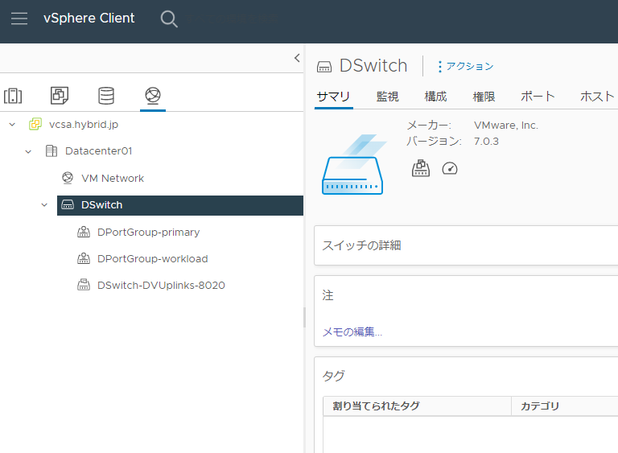

# vSphere with Tanzu / Tanzu K8s Grid Service Installation
NVAIEの基盤の下地を作るため、
vSphere with Tanzuの環境を作っていきます。

## vSphere with Tanzu システム要件
NVAIE環境を作るうえで、まずはvSphere with Tanzuの要件を整理したいと思います。

**参考** 
ーーーーーー 
[vSphere with Tanzuの設定と管理](https://docs.vmware.com/jp/VMware-vSphere/7.0/vmware-vsphere-with-tanzu/GUID-152BE7D2-E227-4DAA-B527-557B564D9718.html) 
[vSphere with Tanzu Quick Start Guide V1a](https://core.vmware.com/resource/vsphere-tanzu-quick-start-guide-v1a#_Toc53677530) 
[vSphere クラスタで vSphere with Tanzu を構成するための前提条件](https://docs.vmware.com/jp/VMware-vSphere/7.0/vmware-vsphere-with-tanzu/GUID-EE236215-DA4D-4579-8BEB-A693D1882C77.html) 
[Tanzu Kubernetes Gird サービス v1alpha2 APIを使用するための要件](https://docs.vmware.com/jp/VMware-vSphere/7.0/vmware-vsphere-with-tanzu/GUID-0CA8BF39-0D7E-4335-9D5B-7C80ED90D4D8.html) 
[HAProxyロードバランサで使用するスーパーバイザークラスタのvSphere Distributed Switchの作成](https://docs.vmware.com/jp/VMware-vSphere/7.0/vmware-vsphere-with-tanzu/GUID-A3EEF5E4-3FAB-4193-B924-5579716D112A.html#GUID-A3EEF5E4-3FAB-4193-B924-5579716D112A) 
ーーーーーー 

システム要件：
- 3台以上のESXiホスト
- vSANはMustではない
- ネットワークはNSX-T構成と、vDS+HAProxyの2パターン

一番手っ取り早いのはNSX-Tを使わず、vDS + HAProxy環境下でのTKGsのため、今回はこちらを採用します。

ざっくりの手順としては、 
①vDS作成 
②共有データストアの作成 
③ロードバランサ用HA Proxyの用意 
④コンテンツライブラリの用意&ストレージポリシーの有効化 
⑤ワークロードの管理の有効化（Supervisor Clusterの作成） 
⑥NameSpaceや子Clusterを作成してK8sを使えるようにしていく 
に沿って実施していこうと思います。

## TKGs構築① - vDS作成　
vDSを作成していきます。

”DataCenter" > "Distributed Switch"

vDSの名前、配置場所を入力、設定

バージョンの選択

ポートグループ情報等記載。
このPrimaryポートグループはスーパーバイザークラスタのプライマリワークロードネットワーク（K8s制御プレーン仮想マシントラフィックの処理）として利用します。

 
設定の確認

作成した”分散仮想スイッチ”に移動し、右クリック。
"分散ポートグループ" > "新規分散ポートグループ"を選択します。

今回はデフォルトの設定で作成します。

今回はすべてのK8s名前空間用のネットワークを一つの分散ポートグループで実施する想定で1つのみ作成しておりますが、名前空間毎にネットワークを隔離したい場合は、ポートグループを複数作成して実施することも可能です。

スーパーバイザークラスターとして構成するvSphereクラスタのホストをvDSに追加します。
vDSを右クリック、"ホストの追加と管理"を選択します。

”ホストの追加”を選択

追加するホストを選択

各ホストから物理NICを選択し、vDS上のアップリンクに割り当てる

特に移行するものがなければ次に進める

vDSの準備ができました。

ただし、後述する["TKGs構築① - ワークロード管理の有効化"において"](nvidia-ai-enterprise/installation05)、 
vDSのポートグループ名で "**-**" が使用できないことが判明したため、最終構成は下記に変更します。

DPortGroup_mgmt → 管理ネットワーク  
DPortGroup_primary → ワークロードネットワーク① 
DPortGroup_secondary → ワークロードネットワーク② 
の構成でこの先を進めます。
