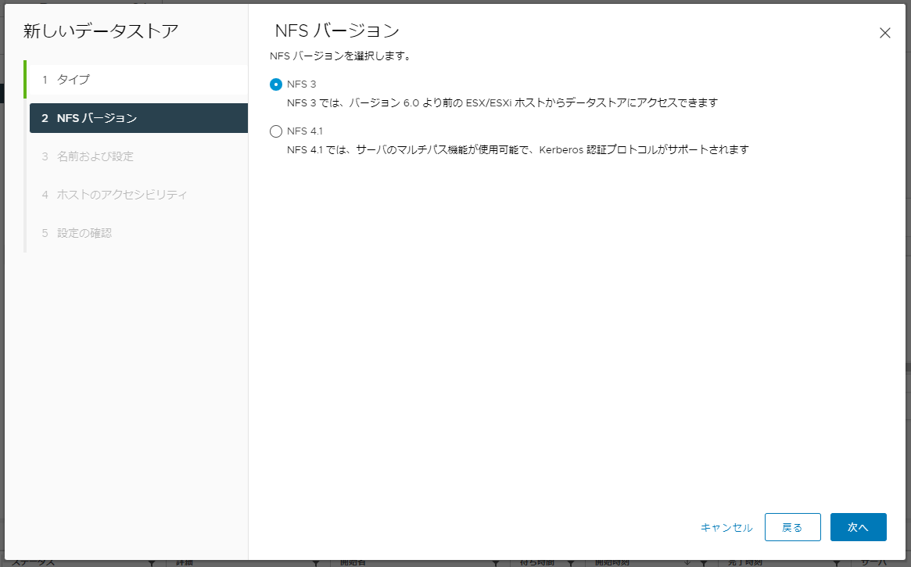

# vSphere with Tanzu / Tanzu K8s Grid Service Installation
NVAIEの基盤の下地を作るため、
vSphere with Tanzuの環境を作っていきます。

## TKGs構築② - 共有データストアの作成
次にクラスターを構成する各ホストがアクセス可能な共有データストアを用意します。 
シンプルに実装できるため今回はWindows ServerでNFS共有データストアを用意して実施してます。 
→ 
実装途中で残念ながらWindows ServerのNFSではパフォーマンスが悪く、子クラスターを作成しする際にコンテナイメージをデプロイすることができませんでしたので、NFS利用時はLinuxで用意することをおすすめします。

今回はWindows Serverで用意

共有用のDドライブを用意し、 
Dドライブ＞”プロパティ”＞”詳細な共有”＞”このフォルダーを共有する”にチェックを入れて適用

サーバーマネージャーを開く

サーバーマネージャーより、 ”ファイルサービスと記憶域サービス” ＞ ”共有”
 ＞ ”タスク” ＞ ”新しい共有” ＞ ”プロファイルの選択” ＞ ”NFS共有-簡易” を選択

パスの設定

認証の設定

共有するESXiホストのアクセス許可を追加、vCenterサーバーは不要

Windows Server側の設定は完了

次に、vCenter側からESXiホストにマウントする

NFSバージョンの選択

データストアの名称とパスの指定

マウントするホストの選択

NFSデータストアが無事作成できました。
