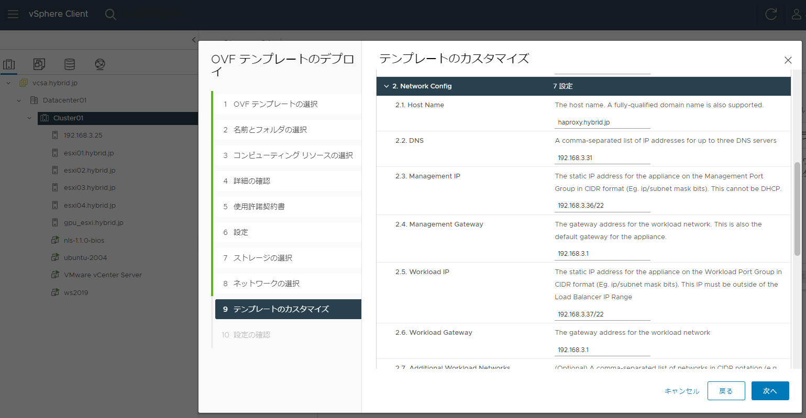
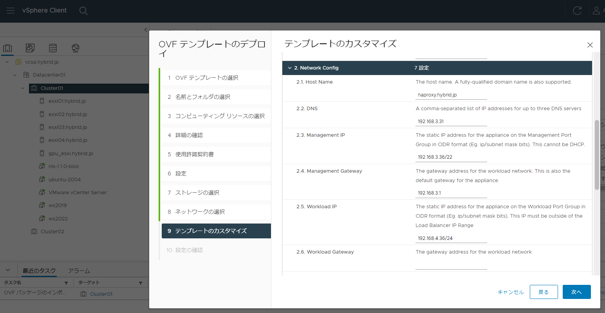
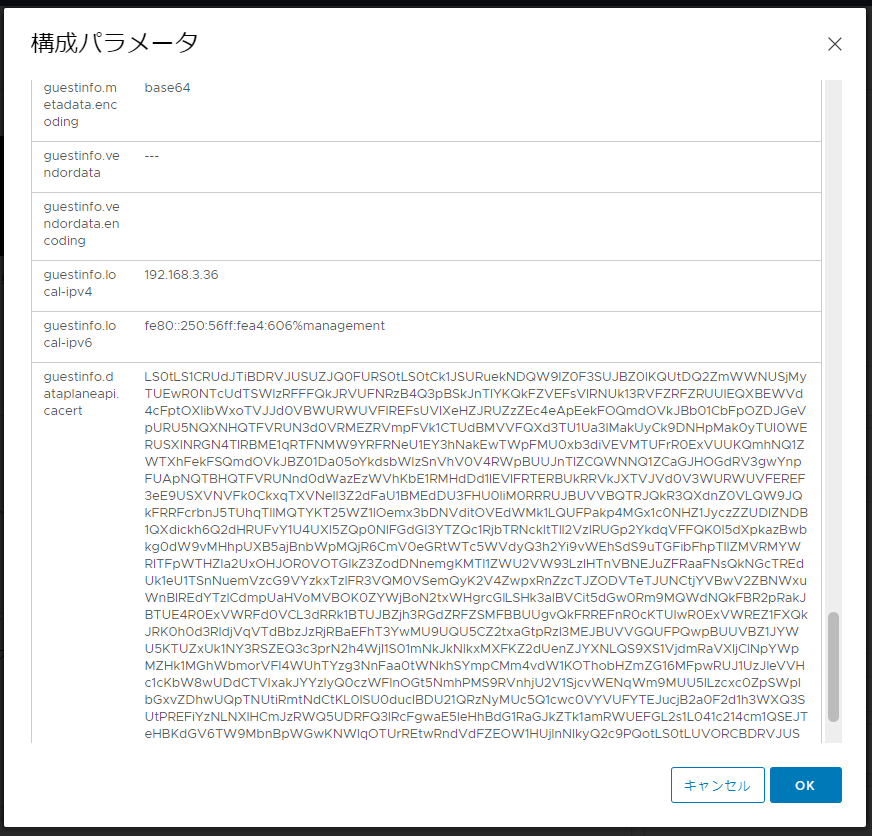

# vSphere with Tanzu / Tanzu K8s Grid Service Installation
NVAIEの基盤の下地を作るため、
vSphere with Tanzuの環境を作っていきます。


## TKGs構築③ - ロードバランサー用HAProxyの配備
NSX-Tによるロードバランサーの代わりとなるHA Proxy仮想アプライアンスをデプロイします。<br>

HAProxyはVMwareがOVA形式で用意しています。<br>
https://github.com/haproxytech/vmware-haproxy <br>

**参考**<br>
ーーーーーー<br>
[Where to find HA Proxy OVA Image and Configuration Requirements for vSphere with Tanzu (80735)](https://kb.vmware.com/s/article/80735)<br>
ーーーーーー<br>
OVA形式のイメージをダウンロードし、
vCenterからデプロイ。


今回は”Default”のネットワーク構成で設定


デプロイ先として、作成した共有データストアを選択


Default設定のため、Frontedで選択したポートグループは無視されるため適当でOKみたいです。ManagementとWorkload用に先に作成したvDSのポートグループを選択



ホスト名、DNSサーバーのアドレス、Management IP（HAProxyのネットワークアダプタ1）、Mgmt IP Gatewary、
Workload IP（HAProxyのネットワークアダプタ2、K8sのワークロード（制御プレーンやPodが通信するネットワーク））、Workload Gatewayを設定




"**Load Balancer IP Range**" はK8sのLoad Balancer（ServiceリリースによるVIP）として使用されます。<br>
後の工程"**ワークロードの有効化**"項目でも同じ払い出しレンジで指定する必要があるのでメモっておきます。<br>
ここで指定したアドレスレンジは実際にVIPを払いださなくてもHA Proxyが応答するすようになってしまうみたいなので、
他で利用しているIPアドレスとは重ならないように指定する必要があるみたいです。<br>

最終的に、HA PROXY仮想IP CIDR => 192.168.4.128/25で設定（上記図から変更）


電源ONにすると、ウィザードで設定した値が反映されます。

#### HAProxyのCA証明書の取得
Tanzu K8s Gridのワークロード管理の有効化時に、
こちらのCA証明書を利用するのであらかじめ取得しておきます。


”HAProxyサーバーの設定の編集” > ”構成パラメータ” ＞ ”設定の編集”
”guestinfo.dataplaneapi.cacert” の長い文字列＝Base64エンコーディングされたCA証明書です。


ただこのままでは使用できず、これをデコードしなければならないので、
下記のようにSSHで取得するのが楽です。
```
root@haproxy [ ~ ]# cat /etc/haproxy/ca.crt
-----BEGIN CERTIFICATE-----
MIIDnzCCAoegAwIBAgIJAISM6fWGwcnaMA0GCSqGSIb3DQEBBQUAMG0xCzAJBgNV
BAYTAlVTMRMwEQYDVQQIDApDYWxpZm9ybmlhMRIwEAYDVQQHDAlQYWxvIEFsdG8x
DzANBgNVBAoMBlZNd2FyZTENMAsGA1UECwwEQ0FQVjEVMBMGA1UEAwwMMTkyLjE2
OC4zLjM2MB4XDTIyMDcyOTE0NTE1NFoXDTMyMDcyNjE0NTE1NFowbTELMAkGA1UE
BhMCVVMxEzARBgNVBAgMCkNhbGlmb3JuaWExEjAQBgNVBAcMCVBhbG8gQWx0bzEP
MA0GA1UECgwGVk13YXJlMQ0wCwYDVQQLDARDQVBWMRUwEwYDVQQDDAwxOTIuMTY4
LjMuMzYwggEiMA0GCSqGSIb3DQEBAQUAA4IBDwAwggEKAoIBAQC9a9eg3R9oj70o
ElI2C/29lkSk2nHyyc6BRDyCDLuQXuSEQzZenl0X1mJrO5jy9vFhIdj23o2esSeA
zymsG+Fap8Z/NH0f4zJ+UGEFVdyqnyrut3vzJOk65DNeo/RaSIHL/vtceJBouHrJ
KHmo18RMGV4Nfz/Utv7wwSKPMXOCkWB6gu//MU5o4vsT+Q0stFejYTKLkEa1qXhV
+s20kWZy0pbKAitpPPxAx53bV4VQJvbsc7vjlXGLTHR9wjIT0CqBhErbGvvX4HvU
gdGYhk5waf7tqSMYlKAz9Vj1E8WJGcyRGPdFmhuUu4U386hAlCKR+RpgJVP0SFcT
vZIMV30PAgMBAAGjQjBAMA8GA1UdEwEB/wQFMAMBAf8wDgYDVR0PAQH/BAQDAgGG
MB0GA1UdDgQWBBTjMmX9zoQU3g3NY9WBaT9ULD3qaDANBgkqhkiG9w0BAQUFAAOC
AQEAk4G/fHbAvgVFipTS86aYphxTC75p4YpAQpQ2ThgCgTc0ATcBi2UFnP60UPTB
VsNg61Ykt3DEpsndlFcelnEtGDVd7WC3UdkM9Gs3NmFhf2TPMjfk6aliug+LUDQq
VYDvPINAG/UpKB2I8QQ9Vbji9WvHt+gxvxeFePBU68ruwertz2xptqcVC8UcdFiz
EaGhV3LYmyC96+U9tARpWn9wXVOpntf7g1Mmeo55i6qVnSiyWPxYmioUMgIdg13h
q7OXJmt5E/B43MTFil9imO00LqqqV4GUxogSJ8VVAkDxnAAu0VgVKCCBzDZuoX7i
UFQsap+C3R6XrpTZeNFh5u2TpA==
-----END CERTIFICATE-----
```
