# vSphere with Tanzu / Tanzu K8s Grid Service Installation
NVAIEの基盤の下地を作るため、
vSphere with Tanzuの環境を作っていきます。

## TKGs構築④ - コンテンツライブラリの用意&ストレージポリシーの有効化
vSphere 7.0U1以降でスーパーバイザークラスタ（ワークロード管理）を有効化するには、 
Tanzu K8s Grid OVF用のコンテンツライブラリの事前作成が必要です。

TKGmの場合、一般的なVMテンプレートからノードをデプロイする必要があるみたいですが、TKC(TKGs内のTanzu K8s Cluster)ではコンテンツライブラリのOVFテンプレートを利用可能なため、こちらを実施します。 

**参考ドキュメント** 
ーーーーーー 
[Tanzu Kubernetes リリース のコンテンツ ライブラリの作成と管理](https://docs.vmware.com/jp/VMware-vSphere/7.0/vmware-vsphere-with-tanzu/GUID-209AAB32-B2ED-4CDF-AE62-B0FAD9D34C2F.html) 
ーーーーーー 

#### コンテンツライブラリ作成

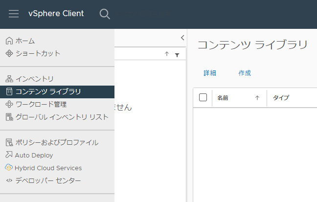 
vCenterメニューより、

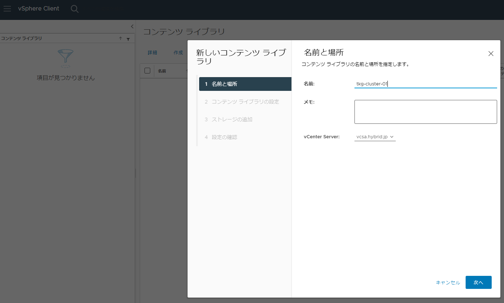
コンテンツライブラリの名称と、vCenterサーバーを選択

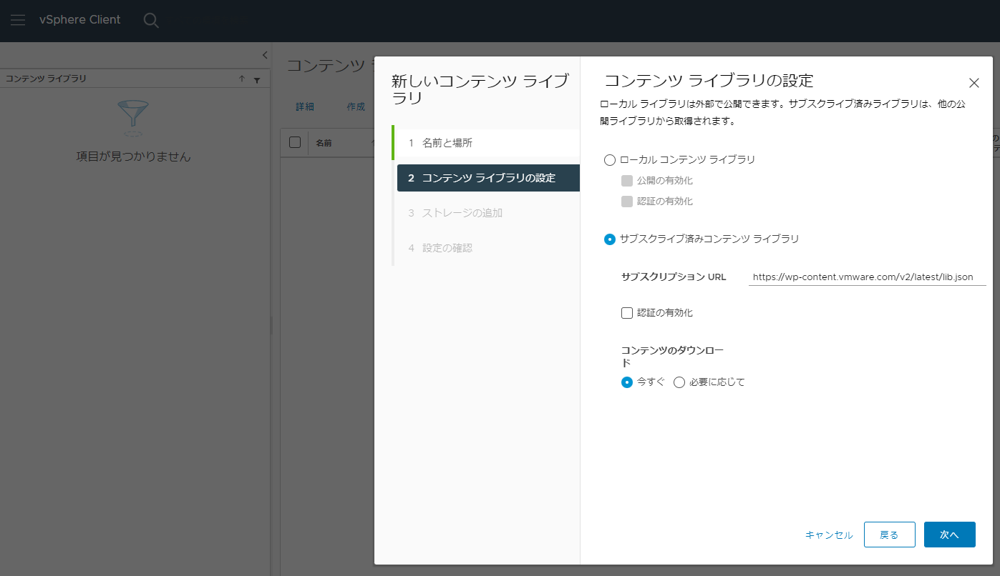
”サブスクライブ済みコンテンツライブラリ”を選択
サブスクリプションURLはドキュメント指定の、 
”https://wp-content.vmware.com/v2/latest/lib.json”
を入力。 
コンテンツダウンロードオプションはデフォルトの”今すぐ”を選択

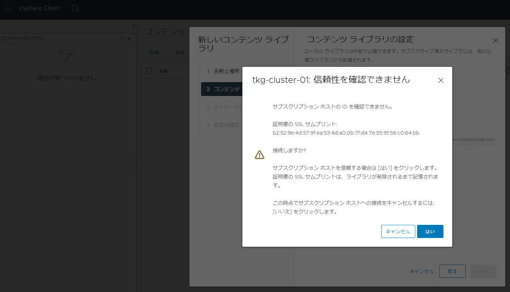

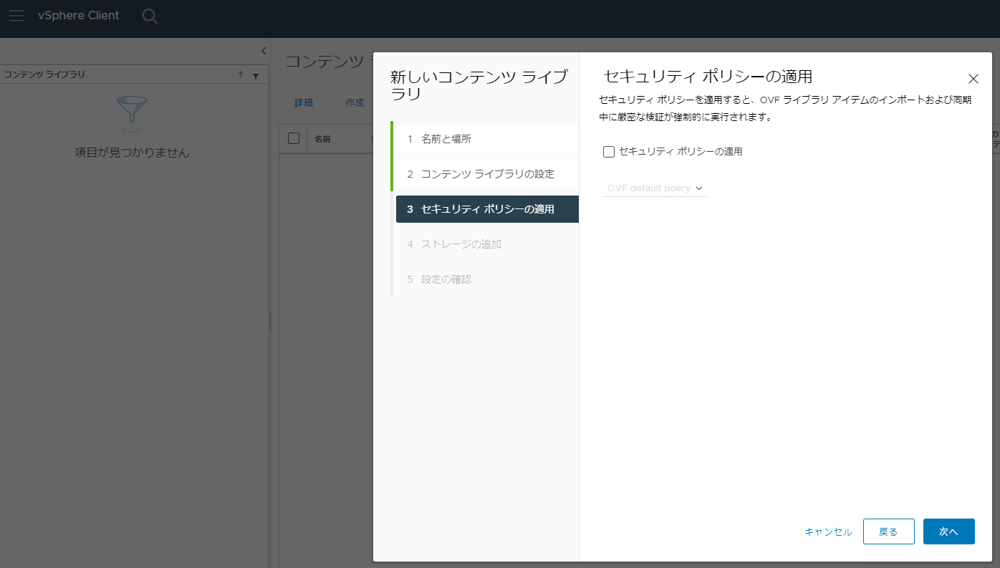
今回は特にセキュリティポリシーの適用はなしで実施

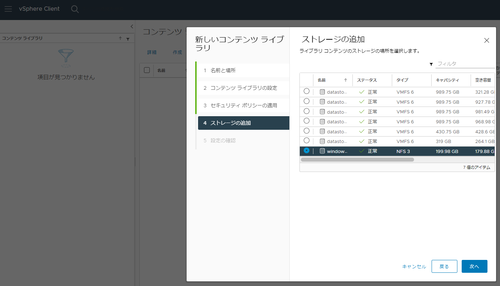
コンテンツライブラリ用のデータストアを選択

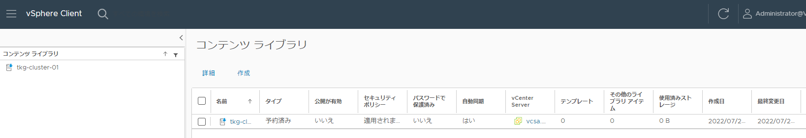
コンテンツライブラリ作成完了

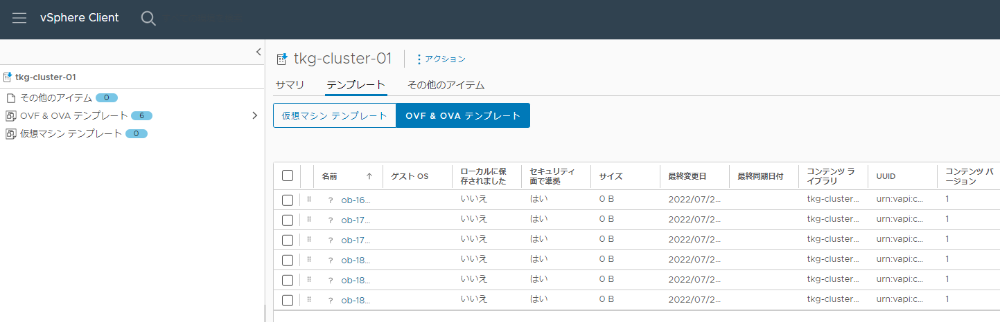
コンテンツのダウンロードを”今すぐ”で実行すると、
K8sバージョンごとに自動的にすべてダウンロードされる。
必要バージョンが明確な場合は、選択してダウンロードしたほうがデータストアも逼迫させずに実行できるので有用かと。

#### ストレージポリシーの有効化

Tanzu環境では使用するデータストアを直接指定せず、ストレージポリシーを利用するため、あらかじめ設定しておく必要あります。 
はじめにvSphereタグを作成します。 
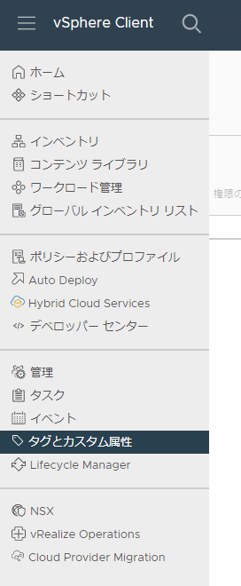
 
vCenterメニューより、"メニュー" > "タグとカスタム属性"

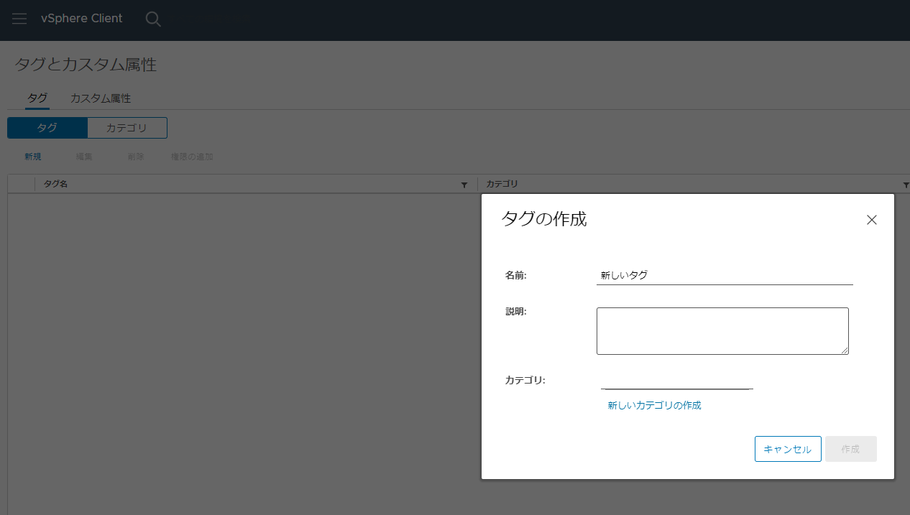
”新規”を選択、”タグの作成”　＞　”新しいカテゴリの作成”

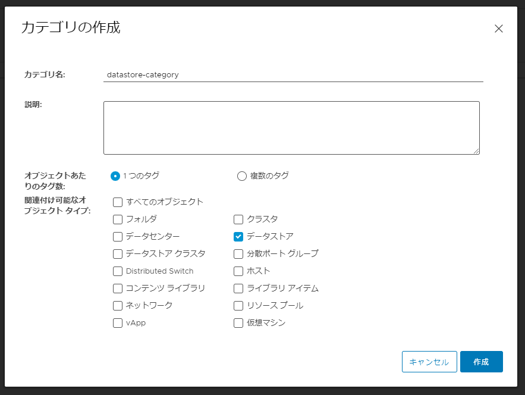

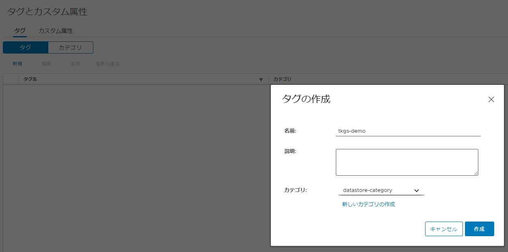
タグの名前：”tkgs-demo” 
カテゴリ："datastore-category"

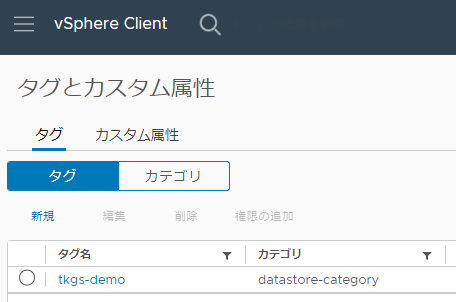

次にデータストアに作成したタグを割り当てます。

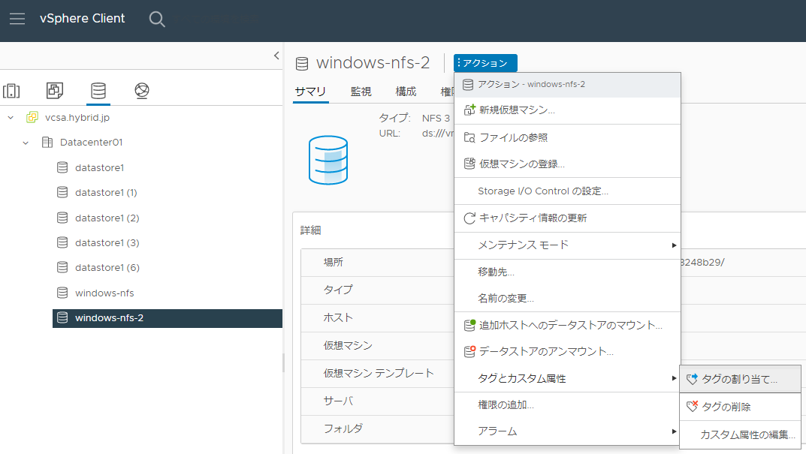
タグ付けするデータストアのサマリー画面より、”タグの割り当て”を選択

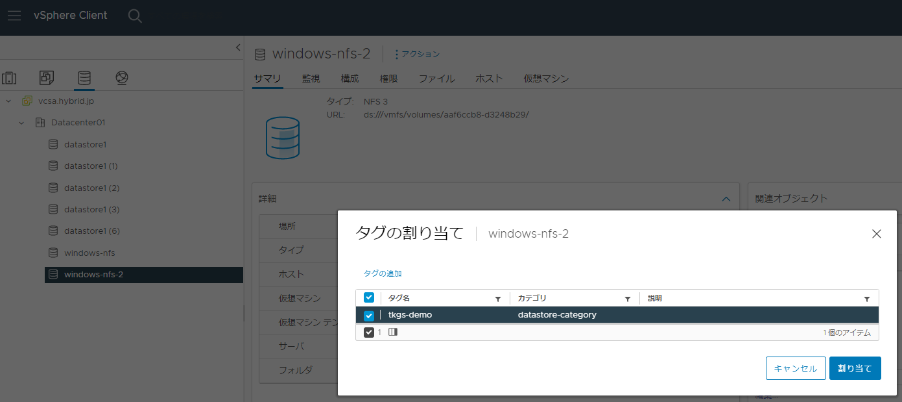

この例では、"windows-nfs-2"というデータストアに作成したタグを割り当ててます。

次に仮想マシンポリシーを作成し、TKGsで作成される仮想マシンに対しても同様のストレージポリシーが適用されるように設定します。

メニューより、”ポリシーおよびプロファイル”を選択

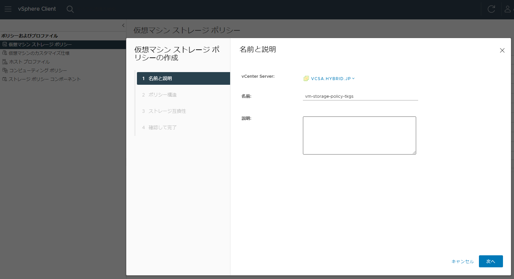
"作成"をクリック後、”vm-storage-policy-tkgs”を作成

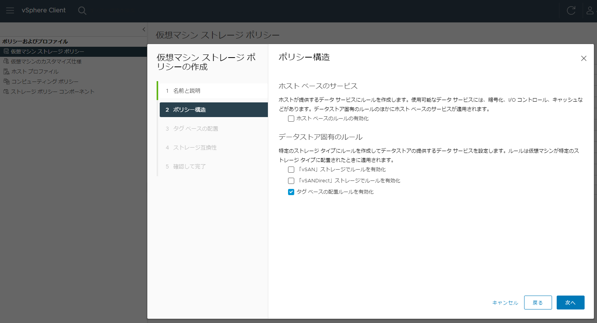
”ポリシー構造”　＞　”データストア固有ルール”　＞　”タグベースの配置ルールを有効化”にチェック

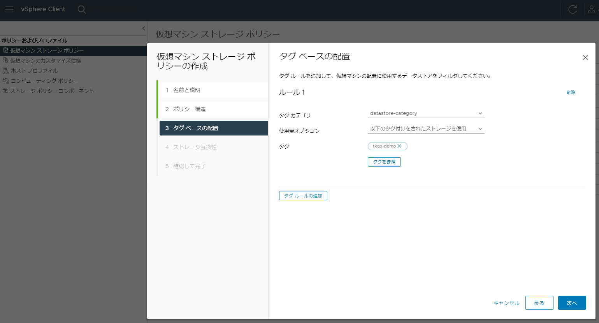
タグカテゴリ：”datastore-category” 
使用量オプション：”以下のタグ付けをされたストレージを使用” 
タグ：”tkgs-demo”

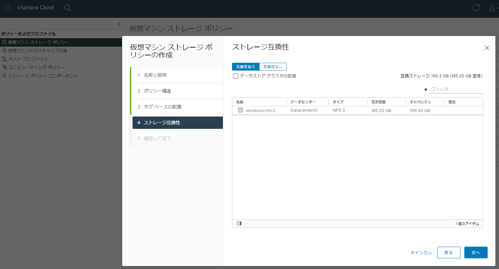
タグを付与したデータストアが表示されることを確認

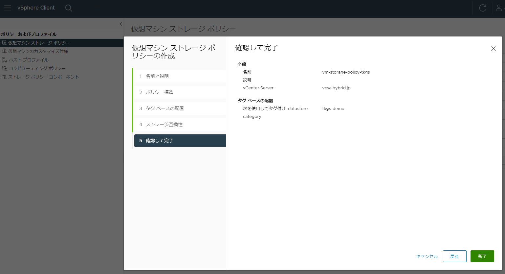
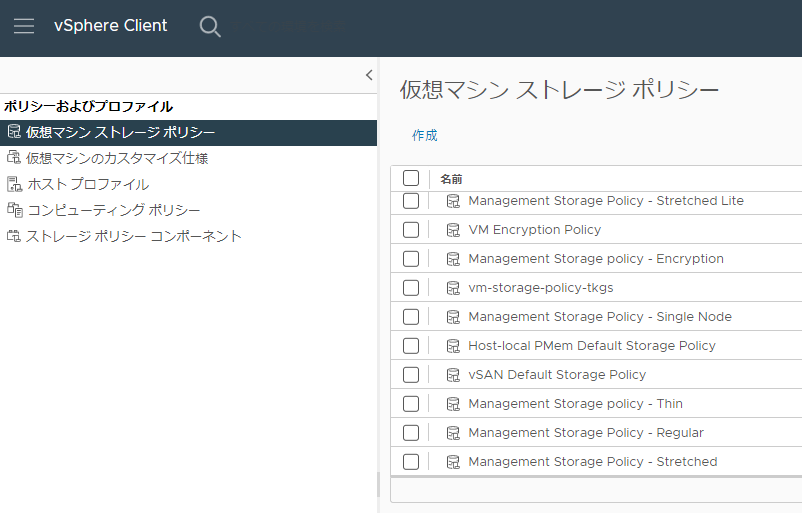
仮想マシンストレージポリシーが作成されたことを確認。 
これでコンテンツライブラリの準備が整いました。
