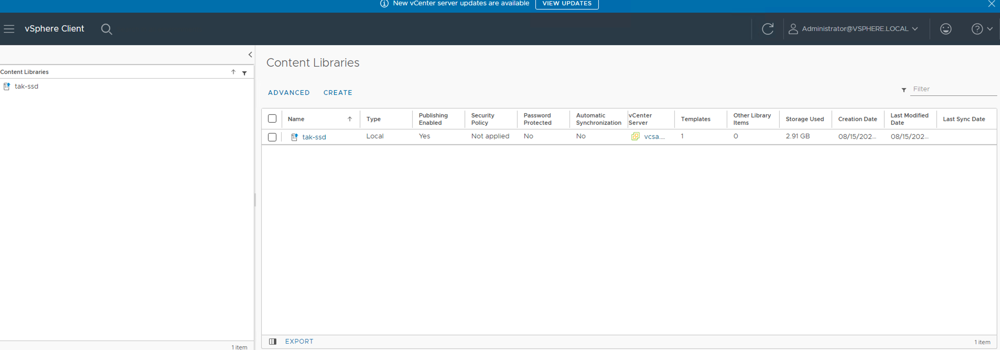
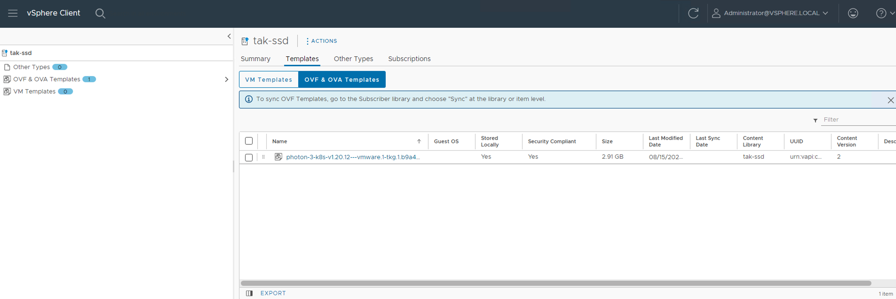
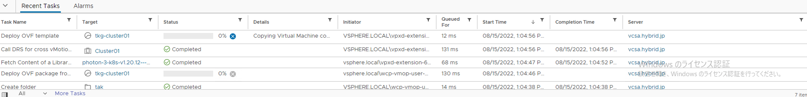
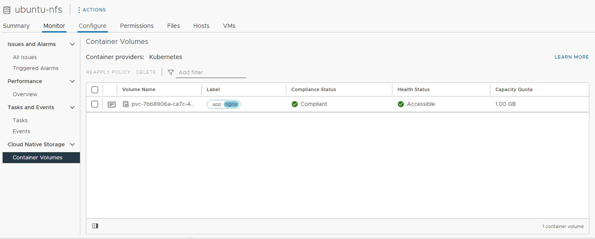

# ユーザー用Kubernetes Clusterの作成してみる

## 検証バージョン
- vSphere 7.0U3
- vCenter 7.0.3

## 前提
- TKGSの初期セットアップが完了していること
- TKGS Supervisor Clusterの作成が完了していること
- Namespaceのセットアップが完了していること
-  クライアントPCにKubectlとKubectl Vsphere Pluginがインストール済みであること
-  Contents Libraryの設定が完了していること

## 手順
### Namespaceにログイン
自身のNamespaceにログインします。*tak*というNamespace内のユーザーに*administrator@vsphere.local*を試しにアサインしています。そのユーザーを使ってログインして、適切なKUBECONFIGを手に入れます。*--server*はSupervisor ClusterのIPアドレスを指定してください。

```bash
$ kubectl vsphere login --server=192.168.3.43 --vsphere-username=Administrator@vsphere.local --insecure-skip-tls-verify

KUBECTL_VSPHERE_PASSWORD environment variable is not set. Please enter the password below
Password:
Logged in successfully.

You have access to the following contexts:
   192.168.3.43
   tak
   test01

If the context you wish to use is not in this list, you may need to try
logging in again later, or contact your cluster administrator.

To change context, use `kubectl config use-context <workload name>`
```

手に入れたKUBECONFIGのContextを確認してみます。

```bash
$ kubectl config get-contexts
CURRENT   NAME           CLUSTER         AUTHINFO                                        NAMESPACE
          192.168.3.43   192.168.3.43    wcp:192.168.3.43:Administrator@vsphere.local
          tak            192.168.4.129   wcp:192.168.4.129:Administrator@vsphere.local   tak
*         test01         192.168.4.129   wcp:192.168.4.129:Administrator@vsphere.local   test01
```

*tak*のネームスペースが設定されたContextが確認できます。現在のContextは*test01*になっていますので、*tak*に変更します。

```bash
$ kubectl config use-context tak
Switched to context "tak".

$ kubectl config get-contexts
CURRENT   NAME           CLUSTER         AUTHINFO                                        NAMESPACE
          192.168.3.43   192.168.3.43    wcp:192.168.3.43:Administrator@vsphere.local
*         tak            192.168.4.129   wcp:192.168.4.129:Administrator@vsphere.local   tak
          test01         192.168.4.129   wcp:192.168.4.129:Administrator@vsphere.local   test011
```

### Contents Libraryの確認
K8sクラスタ作成時に使用するゴールデンイメージがContents Libraryに格納されているか確認します。vCenterからContents Librariesを開いて見ていきます。






*photon-3-k8s-v1.20.12---vmware.1-tkg.1.b9a42f3*のイメージが存在することがわかります。このイメージを使ってk8sクラスタを作っていきます。他のイメージを取得したい場合は[こちら](https://wp-content.vmware.com/v2/latest)からダウンロードできます。

### k8sクラスタ作成用マニュフェスト
k8sクラスタを作成するためのk8sマニュフェストを作成します。k8sクラスタはSupervisor Clusterからデプロイされます。そのため、Supervisor Clusterにk8sクラスタの作成を指示するマニュフェストが必要になります。

Supervisor Clusterがイメージを認識しているか確認します。(*k*というコマンドは*kubectl*のエイリアスです)  

StorageClassも確認できます。

```bash
$ k get tkr
NAME                                VERSION                          READY   COMPATIBLE   CREATED   UPDATES AVAILABLE
v1.20.12---vmware.1-tkg.1.b9a42f3   1.20.12+vmware.1-tkg.1.b9a42f3   True    True         5d21h

$ k get sc
NAME                     PROVISIONER              RECLAIMPOLICY   VOLUMEBINDINGMODE   ALLOWVOLUMEEXPANSION   AGE
tak-tkgs-storage         csi.vsphere.vmware.com   Delete          Immediate           true                   4m11s
vm-storage-policy-tkgs   csi.vsphere.vmware.com   Delete          Immediate           true                   13d

```

このイメージを使って、k8sクラスタを作成してみます。Master Node x1、Worker Node x2のk8sクラスタを試しに作ってみます。**tkg-cluster01.yaml**というファイル名で保存しています。

```yaml
---
apiVersion: run.tanzu.vmware.com/v1alpha2
kind: TanzuKubernetesCluster
metadata:
  name: tkg-cluster01
  namespace: tak
spec:
  topology:
    controlPlane:
      replicas: 1
      vmClass: best-effort-small
      storageClass: tak-tkgs-storage
      tkr:  
        reference:
          name: v1.20.12---vmware.1-tkg.1.b9a42f3
    nodePools:
    - name: tkg-cluster01-worker-nodepool01
      replicas: 2
      vmClass: best-effort-small
      storageClass: tak-tkgs-storage
      tkr:  
        reference:
          name: v1.20.12---vmware.1-tkg.1.b9a42f3
```

*vmClass*と*storageClass*はNamespace作成時に設定したものを使用します。コマンドでも使用可能な*vmClass*と*storageClass*が確認できます。

```bash
$ k get vmclass
NAME                 CPU   MEMORY   AGE
best-effort-large    4     16Gi     10d
best-effort-medium   2     8Gi      10d
best-effort-small    2     4Gi      10d

$ k get sc
NAME                     PROVISIONER              RECLAIMPOLICY   VOLUMEBINDINGMODE   ALLOWVOLUMEEXPANSION   AGE
vm-storage-policy-tkgs   csi.vsphere.vmware.com   Delete          Immediate           true                   10d
```

### k8sクラスタの作成
**tkg-cluster01.yaml**をSupervisor Cluster上で適用します。

```bash
$ k apply -f tkg-cluster01.yaml
tanzukubernetescluster.run.tanzu.vmware.com/tkg-cluster01 created
```

Supervisor Cluster上でk8sクラスタオブジェクトが作成され始めているか確認します。

```bash
$ k get tkc
NAME            CONTROL PLANE   WORKER   TKR NAME                            AGE   READY   TKR COMPATIBLE   UPDATES AVAILABLE
tkg-cluster01   1                        v1.20.12---vmware.1-tkg.1.b9a42f3   49s   False   True

```

vCenter側でも確認してみます。イメージが展開されている様子がわかります。



5分くらい待つとk8sクラスタが完成します。

### 動作確認
k8sクラスタが使用可能な状況かを確認します。以下のコマンドでWatchして、ReadyがTrueになれば使用可能です。

```bash
$ k get tkc -w
NAME            CONTROL PLANE   WORKER   TKR NAME                            AGE     READY   TKR COMPATIBLE   UPDATES AVAILABLE
tkg-cluster01   1               2        v1.20.12---vmware.1-tkg.1.b9a42f3   5m15s   False   True

tkg-cluster01   1               2        v1.20.12---vmware.1-tkg.1.b9a42f3   5m20s   True    True
```

使用可能な状態になりましたら、作成したクラスタのkubeconfigを取得します。*--server*はSupervisor Cluster NodeいづれかのIP、*--tanzu-kubernetes-cluster-name*は作成したk8sクラスタ名、*--tanzu-kubernetes-cluster-namespace*はk8sクラスタを作成したNamespaceを指定します。

```bash
$ kubectl-vsphere login --server=192.168.3.43 --insecure-skip-tls-verify --tanzu-kubernetes-cluster-name tkg-cluster01 --tanzu-kubernetes-cluster-namespace tak

Username: Administrator@vsphere.local
KUBECTL_VSPHERE_PASSWORD environment variable is not set. Please enter the password below
Password:
Logged in successfully.

You have access to the following contexts:
   192.168.3.43
   tak
   tkg-cluster01

If the context you wish to use is not in this list, you may need to try
logging in again later, or contact your cluster administrator.

To change context, use `kubectl config use-context <workload name>`
```

kubeconfigのcontextを作成したk8sクラスタ**tkg-cluster01**に変更します。

```bash
$ k config use-context tkg-cluster01
Switched to context "tkg-cluster01".
```

Nodeの状態とPodの状態を確認してみます。

```bash
$ k get node -o wide
NAME                                                              STATUS   ROLES                  AGE     VERSION             INTERNAL-IP    EXTERNAL-IP   OS-IMAGE                 KERNEL-VERSION       CONTAINER-RUNTIME
tkg-cluster01-control-plane-v8p8c                                 Ready    control-plane,master   12m     v1.20.12+vmware.1   192.168.4.46   <none>        VMware Photon OS/Linux   4.19.198-1.ph3-esx   containerd://1.4.11
tkg-cluster01-tkg-cluster01-worker-nodepool01-c2rgq-84cc97cjv7m   Ready    <none>                 10m     v1.20.12+vmware.1   192.168.4.44   <none>        VMware Photon OS/Linux   4.19.198-1.ph3-esx   containerd://1.4.11
tkg-cluster01-tkg-cluster01-worker-nodepool01-c2rgq-84cc97cpd9j   Ready    <none>                 9m53s   v1.20.12+vmware.1   192.168.4.47   <none>        VMware Photon OS/Linux   4.19.198-1.ph3-esx   containerd://1.4.11

$ k get pod -A
NAMESPACE                      NAME                                                                              READY   STATUS    RESTARTS   AGE
kube-system                    antrea-agent-9htdn                                                                2/2     Running   0          10m
kube-system                    antrea-agent-sn2pw                                                                2/2     Running   0          12m
kube-system                    antrea-agent-zgjnp                                                                2/2     Running   0          10m
kube-system                    antrea-controller-747fd5b76f-5qgh9                                                1/1     Running   0          12m
kube-system                    antrea-resource-init-77584978-4vh7z                                               1/1     Running   0          12m
kube-system                    coredns-848c5cf6b8-5sqw4                                                          1/1     Running   0          12m
kube-system                    coredns-848c5cf6b8-ffls8                                                          1/1     Running   0          11m
kube-system                    docker-registry-tkg-cluster01-control-plane-v8p8c                                 1/1     Running   0          12m
kube-system                    docker-registry-tkg-cluster01-tkg-cluster01-worker-nodepool01-c2rgq-84cc97cjv7m   1/1     Running   0          10m
kube-system                    docker-registry-tkg-cluster01-tkg-cluster01-worker-nodepool01-c2rgq-84cc97cpd9j   1/1     Running   0          10m
kube-system                    etcd-tkg-cluster01-control-plane-v8p8c                                            1/1     Running   0          12m
kube-system                    kube-apiserver-tkg-cluster01-control-plane-v8p8c                                  1/1     Running   0          12m
kube-system                    kube-controller-manager-tkg-cluster01-control-plane-v8p8c                         1/1     Running   0          12m
kube-system                    kube-proxy-qf8wf                                                                  1/1     Running   0          12m
kube-system                    kube-proxy-sfgm6                                                                  1/1     Running   0          10m
kube-system                    kube-proxy-xjdbd                                                                  1/1     Running   0          10m
kube-system                    kube-scheduler-tkg-cluster01-control-plane-v8p8c                                  1/1     Running   0          12m
kube-system                    metrics-server-848cf8949c-8c7vt                                                   1/1     Running   0          12m
vmware-system-auth             guest-cluster-auth-svc-xxqzd                                                      1/1     Running   0          11m
vmware-system-cloud-provider   guest-cluster-cloud-provider-f9dcfd48-swktz                                       1/1     Running   0          12m
vmware-system-csi              vsphere-csi-controller-dcbdd94bb-qz87l                                            6/6     Running   0          12m
vmware-system-csi              vsphere-csi-node-25j2m                                                            3/3     Running   0          10m
vmware-system-csi              vsphere-csi-node-887qh                                                            3/3     Running   0          10m
vmware-system-csi              vsphere-csi-node-nzmcg                                                            3/3     Running   0          12m

```

StorageClassも作成されているか見てみます。

```bash
$ k get sc
NAME               PROVISIONER              RECLAIMPOLICY   VOLUMEBINDINGMODE   ALLOWVOLUMEEXPANSION   AGE
tak-tkgs-storage   csi.vsphere.vmware.com   Delete          Immediate           true                   15m
```

使用できるAPIリソースも備忘録がてら確認しておきます。

```bash
$ k api-resources
NAME                              SHORTNAMES   APIVERSION                                           NAMESPACED   KIND
bindings                                       v1                                                   true         Binding
componentstatuses                 cs           v1                                                   false        ComponentStatus
configmaps                        cm           v1                                                   true         ConfigMap
endpoints                         ep           v1                                                   true         Endpoints
events                            ev           v1                                                   true         Event
limitranges                       limits       v1                                                   true         LimitRange
namespaces                        ns           v1                                                   false        Namespace
nodes                             no           v1                                                   false        Node
persistentvolumeclaims            pvc          v1                                                   true         PersistentVolumeClaim
persistentvolumes                 pv           v1                                                   false        PersistentVolume
pods                              po           v1                                                   true         Pod
podtemplates                                   v1                                                   true         PodTemplate
replicationcontrollers            rc           v1                                                   true         ReplicationController
resourcequotas                    quota        v1                                                   true         ResourceQuota
secrets                                        v1                                                   true         Secret
serviceaccounts                   sa           v1                                                   true         ServiceAccount
services                          svc          v1                                                   true         Service
mutatingwebhookconfigurations                  admissionregistration.k8s.io/v1                      false        MutatingWebhookConfiguration
validatingwebhookconfigurations                admissionregistration.k8s.io/v1                      false        ValidatingWebhookConfiguration
customresourcedefinitions         crd,crds     apiextensions.k8s.io/v1                              false        CustomResourceDefinition
apiservices                                    apiregistration.k8s.io/v1                            false        APIService
controllerrevisions                            apps/v1                                              true         ControllerRevision
daemonsets                        ds           apps/v1                                              true         DaemonSet
deployments                       deploy       apps/v1                                              true         Deployment
replicasets                       rs           apps/v1                                              true         ReplicaSet
statefulsets                      sts          apps/v1                                              true         StatefulSet
tokenreviews                                   authentication.k8s.io/v1                             false        TokenReview
localsubjectaccessreviews                      authorization.k8s.io/v1                              true         LocalSubjectAccessReview
selfsubjectaccessreviews                       authorization.k8s.io/v1                              false        SelfSubjectAccessReview
selfsubjectrulesreviews                        authorization.k8s.io/v1                              false        SelfSubjectRulesReview
subjectaccessreviews                           authorization.k8s.io/v1                              false        SubjectAccessReview
horizontalpodautoscalers          hpa          autoscaling/v1                                       true         HorizontalPodAutoscaler
cronjobs                          cj           batch/v1beta1                                        true         CronJob
jobs                                           batch/v1                                             true         Job
certificatesigningrequests        csr          certificates.k8s.io/v1                               false        CertificateSigningRequest
antreaagentinfos                  aai          clusterinformation.antrea.tanzu.vmware.com/v1beta1   false        AntreaAgentInfo
antreacontrollerinfos             aci          clusterinformation.antrea.tanzu.vmware.com/v1beta1   false        AntreaControllerInfo
addressgroups                                  controlplane.antrea.tanzu.vmware.com/v1beta2         false        AddressGroup
appliedtogroups                                controlplane.antrea.tanzu.vmware.com/v1beta2         false        AppliedToGroup
networkpolicies                                controlplane.antrea.tanzu.vmware.com/v1beta2         false        NetworkPolicy
nodestatssummaries                             controlplane.antrea.tanzu.vmware.com/v1beta2         false        NodeStatsSummary
leases                                         coordination.k8s.io/v1                               true         Lease
externalentities                  ee           core.antrea.tanzu.vmware.com/v1alpha2                true         ExternalEntity
endpointslices                                 discovery.k8s.io/v1beta1                             true         EndpointSlice
events                            ev           events.k8s.io/v1                                     true         Event
ingresses                         ing          extensions/v1beta1                                   true         Ingress
flowschemas                                    flowcontrol.apiserver.k8s.io/v1beta1                 false        FlowSchema
prioritylevelconfigurations                    flowcontrol.apiserver.k8s.io/v1beta1                 false        PriorityLevelConfiguration
nodes                                          metrics.k8s.io/v1beta1                               false        NodeMetrics
pods                                           metrics.k8s.io/v1beta1                               true         PodMetrics
addressgroups                                  networking.antrea.tanzu.vmware.com/v1beta1           false        AddressGroup
appliedtogroups                                networking.antrea.tanzu.vmware.com/v1beta1           false        AppliedToGroup
networkpolicies                                networking.antrea.tanzu.vmware.com/v1beta1           false        NetworkPolicy
ingressclasses                                 networking.k8s.io/v1                                 false        IngressClass
ingresses                         ing          networking.k8s.io/v1                                 true         Ingress
networkpolicies                   netpol       networking.k8s.io/v1                                 true         NetworkPolicy
runtimeclasses                                 node.k8s.io/v1                                       false        RuntimeClass
traceflows                        tf           ops.antrea.tanzu.vmware.com/v1alpha1                 false        Traceflow
poddisruptionbudgets              pdb          policy/v1beta1                                       true         PodDisruptionBudget
podsecuritypolicies               psp          policy/v1beta1                                       false        PodSecurityPolicy
clusterrolebindings                            rbac.authorization.k8s.io/v1                         false        ClusterRoleBinding
clusterroles                                   rbac.authorization.k8s.io/v1                         false        ClusterRole
rolebindings                                   rbac.authorization.k8s.io/v1                         true         RoleBinding
roles                                          rbac.authorization.k8s.io/v1                         true         Role
priorityclasses                   pc           scheduling.k8s.io/v1                                 false        PriorityClass
clusternetworkpolicies            cnp,acnp     security.antrea.tanzu.vmware.com/v1alpha1            false        ClusterNetworkPolicy
networkpolicies                   netpol,anp   security.antrea.tanzu.vmware.com/v1alpha1            true         NetworkPolicy
tiers                             tr           security.antrea.tanzu.vmware.com/v1alpha1            false        Tier
antreaclusternetworkpolicystats                stats.antrea.tanzu.vmware.com/v1alpha1               false        AntreaClusterNetworkPolicyStats
antreanetworkpolicystats                       stats.antrea.tanzu.vmware.com/v1alpha1               true         AntreaNetworkPolicyStats
networkpolicystats                             stats.antrea.tanzu.vmware.com/v1alpha1               true         NetworkPolicyStats
csidrivers                                     storage.k8s.io/v1                                    false        CSIDriver
csinodes                                       storage.k8s.io/v1                                    false        CSINode
storageclasses                    sc           storage.k8s.io/v1                                    false        StorageClass
volumeattachments                              storage.k8s.io/v1                                    false        VolumeAttachment
controllerinfos                                system.antrea.tanzu.vmware.com/v1beta1               false        AntreaControllerInfo
supportbundles                                 system.antrea.tanzu.vmware.com/v1beta1               false        SupportBundle
```

TKGSはデフォルトでPod Security Policyが設定されているため、特権権限(root)を必要とするコンテナイメージを使用できる様にRoleBindingを最初に作成してあげます。これはセキュリティを弱める行為なので本番環境では注意してください。使用するサンプルマニフェストは[こちら](sample/role-binding-privileged.yaml)にあります。

```yaml
---
kind: RoleBinding
apiVersion: rbac.authorization.k8s.io/v1

metadata:
  name: privileged

roleRef:
  kind: ClusterRole
  name: psp:vmware-system-privileged
  apiGroup: rbac.authorization.k8s.io
subjects:
- kind: Group
  name: system:serviceaccounts
  apiGroup: rbac.authorization.k8s.io
```

```bash
$ k apply -f role-binding-privillege.yaml
rolebinding.rbac.authorization.k8s.io/privileged created
```

試しにNginxのサービスを立ててみます。使用するサンプルマニフェストは[こちら](sample/nginx-rwo.yaml)にあります。PVの挙動もみたいので、あえてPVをアサインしています。YAMLは**nginx-rwo.yaml**というファイル名にしています。

```yaml
---
apiVersion: apps/v1
kind: StatefulSet
metadata:
  name: nginx
  namespace: default
spec:
  selector:
    matchLabels:
      app: nginx
  serviceName: "nginx"
  replicas: 1
  template:
    metadata:
      labels:
        app: nginx
    spec:
      containers:
      - name: nginx
        image: nginx:latest
        ports:
        - containerPort: 80
          name: nginx
        volumeMounts:
        - name: cache
          mountPath: /cache
  volumeClaimTemplates:
  - metadata:
      name: cache
    spec:
      accessModes: 
        - "ReadWriteOnce"
      storageClassName: "tak-tkgs-storage"
      resources:
        requests:
          storage: 1Gi
---
apiVersion: v1
kind: Service
metadata:
  name: nginx
  namespace: default
spec:
  selector:
    app: nginx
  ports:
  - port: 80
  type: LoadBalancer
```

```bash
$ k apply -f nginx-rwo.yaml
statefulset.apps/nginx created
service/nginx created

$ k get all,statefulset
NAME          READY   STATUS    RESTARTS   AGE
pod/nginx-0   1/1     Running   0          25s

NAME                 TYPE           CLUSTER-IP      EXTERNAL-IP     PORT(S)        AGE
service/kubernetes   ClusterIP      10.96.0.1       <none>          443/TCP        38m
service/nginx        LoadBalancer   10.111.169.89   192.168.4.133   80:31128/TCP   25s
service/supervisor   ClusterIP      None            <none>          6443/TCP       38m

NAME                     READY   AGE
statefulset.apps/nginx   1/1     25s

```

今回、LoadBalancer TypeのServiceを作成したので、External IPにアクセスすればNginxにアクセスできるはずです。

```bash
$ curl 192.168.4.133 -s
<!DOCTYPE html>
<html>
<head>
<title>Welcome to nginx!</title>
<style>
html { color-scheme: light dark; }
body { width: 35em; margin: 0 auto;
font-family: Tahoma, Verdana, Arial, sans-serif; }
</style>
</head>
<body>
<h1>Welcome to nginx!</h1>
<p>If you see this page, the nginx web server is successfully installed and
working. Further configuration is required.</p>

<p>For online documentation and support please refer to
<a href="http://nginx.org/">nginx.org</a>.<br/>
Commercial support is available at
<a href="http://nginx.com/">nginx.com</a>.</p>

<p><em>Thank you for using nginx.</em></p>
</body>
</html>
```

PVもアサインしていましたので、様子を見てみます。

```bash
$ k get pvc
NAME            STATUS   VOLUME                                     CAPACITY   ACCESS MODES   STORAGECLASS       AGE
cache-nginx-0   Bound    pvc-41bd982a-9a7a-41d6-babd-4025948cfa14   1Gi        RWO            tak-tkgs-storage   35m

$ k get pv
NAME                                       CAPACITY   ACCESS MODES   RECLAIM POLICY   STATUS   CLAIM                   STORAGECLASS       REASON   AGE
pvc-41bd982a-9a7a-41d6-babd-4025948cfa14   1Gi        RWO            Delete           Bound    default/cache-nginx-0   tak-tkgs-storage            35m
```

ちゃんとPVが作成されています。PVの実体はNamespace作成時に指定した共有データストアに存在します。本環境では*ubuntu-nfs*という共有データストアが使われています。これはNFSサーバーを共有データストアとして見せています。



試しにRWX(ReadWriteMany)のPVがNFSサーバーを共有データストアにした際にサポートされているか確認してみます。使用するサンプルマニフェストは[こちら](sample/pv-rwx.yaml)にあります。

```yaml
apiVersion: v1
kind: PersistentVolumeClaim
metadata:
  name: test-rwx
spec:
  accessModes:
  - ReadWriteMany
  resources:
    requests:
      storage: 1Gi
  storageClassName: tak-tkgs-storage
```

```bash
$ k apply -f pvc-rwx.yaml
persistentvolumeclaim/test-rwx created

$ k get pvc
NAME            STATUS    VOLUME                                     CAPACITY   ACCESS MODES   STORAGECLASS       AGE
cache-nginx-0   Bound     pvc-41bd982a-9a7a-41d6-babd-4025948cfa14   1Gi        RWO            tak-tkgs-storage   44m
test-rwx        Pending                                                                        tak-tkgs-storage   5s

$ k describe pvc test-rwx
Name:          test-rwx
Namespace:     default
StorageClass:  tak-tkgs-storage
Status:        Pending
Volume:
Labels:        <none>
Annotations:   volume.beta.kubernetes.io/storage-provisioner: csi.vsphere.vmware.com
Finalizers:    [kubernetes.io/pvc-protection]
Capacity:
Access Modes:
VolumeMode:    Filesystem
Used By:       <none>
Events:
  Type     Reason                Age                From                                                                                                Message
  ----     ------                ----               ----                                                                                                -------
  Normal   ExternalProvisioning  10s (x2 over 13s)  persistentvolume-controller                                                                         waiting for a volume to be created, either by external provisioner "csi.vsphere.vmware.com" or manually created by system administrator
  Normal   Provisioning          6s (x4 over 13s)   csi.vsphere.vmware.com_vsphere-csi-controller-dcbdd94bb-k9pmh_f3399b1e-db3f-44b1-928a-b73fc7051aa3  External provisioner is provisioning volume for claim "default/test-rwx"
  Warning  ProvisioningFailed    6s (x4 over 13s)   csi.vsphere.vmware.com_vsphere-csi-controller-dcbdd94bb-k9pmh_f3399b1e-db3f-44b1-928a-b73fc7051aa3  failed to provision volume with StorageClass "tak-tkgs-storage": rpc error: code = InvalidArgument desc = File volume not supported.

$ k get pv
NAME                                       CAPACITY   ACCESS MODES   RECLAIM POLICY   STATUS   CLAIM                   STORAGECLASS       REASON   AGE
pvc-41bd982a-9a7a-41d6-babd-4025948cfa14   1Gi        RWO            Delete           Bound    default/cache-nginx-0   tak-tkgs-storage            44m
```

どうやらCSIドライバーがRWXをサポートしていないようです。[ドキュメント](https://docs.vmware.com/en/VMware-vSphere/7.0/vmware-vsphere-with-tanzu/GUID-82AC812A-40E3-4563-9329-747634E1AB6E.html)をを見ると、RWXなPVはvSANが必要みたいです。

### 後片付け
いろいろPodやPV等を作成しましたが、一気にクラスタごと消したいと思います。まずk8sクラスタを作成したネームスペースのContextに切り替えます。

```bash
$ k config use-context tak
Switched to context "tak".

```

k8sクラスタを削除します。

```
$ k get tkc
NAME            CONTROL PLANE   WORKER   TKR NAME                            AGE   READY   TKR COMPATIBLE   UPDATES AVAILABLE
tkg-cluster01   1               2        v1.20.12---vmware.1-tkg.1.b9a42f3   61m   True    True

$ k delete tkc tkg-cluster01 --force --grace-period 0
warning: Immediate deletion does not wait for confirmation that the running resource has been terminated. The resource may continue to run on the cluster indefinitely.
tanzukubernetescluster.run.tanzu.vmware.com "tkg-cluster01" force deleted

```
vCenterからもk8sクラスタを構成していたVMが消えていることがわかると思います。