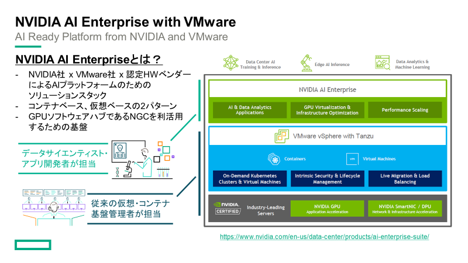
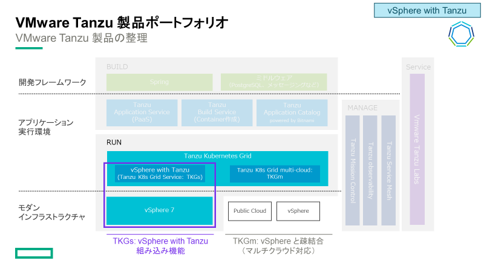
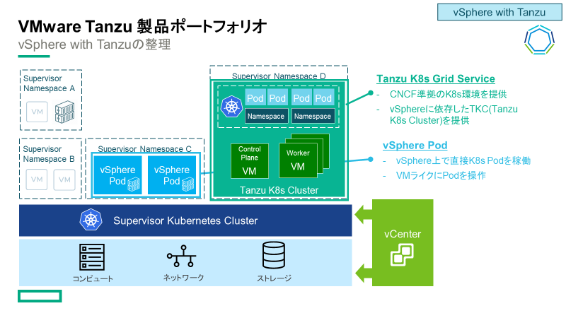

# vSphere with Tanzu / Tanzu K8s Grid Service Installation
NVAIEの基盤の下地を作るため、
vSphere with Tanzuの環境を作っていきます。

## NVAIE対応のTanzu整理
NVIDIA AI Enterpriseに対応しているTanzu製品を整理します。 
そもそもNVIDIA AI Enterprise (NVAIE) とは、
NVIDIA社 x VMware社 x 認定HWベンダーによるAIプラットフォームのためのソリューションスタックのことです。

Tanzu製品は大きく分けて、 
vSphere依存する"**vSphere with Tanzu**"と、 
インフラ依存しない"**Tanzu Kubernetes Grid Multi-Cloud(TKGm)**"の2種類あります。 

さらにvSphere with Tanzuの中には、vSphere上で直接K8s Podを稼働させる"**vSphere Pod**"と、 
仮想マシン環境としてCNCF準拠したK8s Clusterを提供する"**Tanzu Kubernetes Grid Service(TKGs)**"があります。 

現時点では、GPU SupportおよびNVAIE SupportしているTanzu製品は"**Tanzu Kubernetes Grid Service(TKGs)**"のみとなります。

最新の対応状況はこちらをご参照ください。 
ーーーーーー 
[VMware Tanzu Kubernetes Grid Now Supports GPUs Across Clouds](https://tanzu.vmware.com/content/blog/tanzu-kubernetes-grid-supports-gpus-across-clouds) 
[NVIDIA AI Enterprise Release Notes](https://docs.nvidia.com/ai-enterprise/latest/release-notes/index.html) 
[Deploy an AI-Ready Enterprise Platform on VMware vSphere 7 with VMware Tanzu Kubernetes Grid Service](https://core.vmware.com/resource/deploy-ai-ready-enterprise-platform-vmware-vsphere-7-vmware-tanzu-kubernetes-grid-service#overview) 
ーーーーーー
