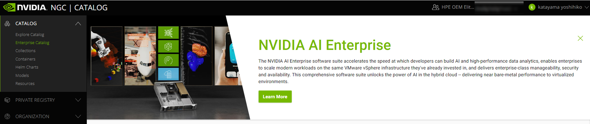

# NGCアカウントの登録作業
NVIDIA AI Enterpriseを実装するうえで、NGCレポジトリに掲載されているコンテナイメージの利用は必要不可欠となります。<br>
Ex. GPU Operator、Tensorflow Container Image etc. <br>

NGCレポジトリを有効に利用するた、NGCアカウントの登録が必要となるので、
下記にその手順をまとめてみます。

## NVIDIA AI EnterpriseのNFRライセンスの取得
NVIDIA AI EnterpriseのNFRライセンスを取得する流れを簡単に記載しておきます。

①NPNの登録をする。<br>
[登録サイトはこちら](https://www.nvidia.com/en-us/about-nvidia/partners/join-npn/)

②NPNのパートナーポータルにアクセスができるようになります。<br>
NVIDIA APPLICATION HUB より、NPNパートナーポータルを選択します。<br>
[NVIDIA APPLICATION HUBへのアクセスはこちら](https://nvid.nvidia.com/dashboard/)


③NVAIEのNFRライセンスの利用申請をします。
Join NVIDIA Partner Network (NPN) Program
Now, You Can Help Us Inspire The Next Generation by Joining the NPN Program

## NGCアカウントとNFRライセンスの紐づけ
NVIDIA AI Enterpriseライセンスを正しく登録できると、NGCサイトに”Enterprise Catalog”のリンクが追加され、
Helmや、podmanからリモート経由でNGCコンテナイメージを取得することが可能となります。
[NGCポータルへのアクセスはこちら](https://ngc.nvidia.com/signin)

NVAIEユーザーであることが正しく紐づけされると、以下のリンクが追加されます。
 - Enterprise Catalog
 - PRIVATE REGISTRY
 - ORGANIZATION


NVAIEユーザー紐づけ前


NVAIEユーザー紐づけ後


NFRライセンスを取得すると、こちらのような"Entitlement"の情報が添付された、件名："NVIDIA Entitlement Certificate - xxxxx" というメールが来ます。


このEntitlement情報の指示に従い、ライセンス登録作業を実施します（上記"register"より）


登録が完了すると、件名："Welcome to NVIDIA NGC"というメールが届きますので、AcceptしNGCポータルにアクセスしてみます。<br>
**※** 1つのOrg Name（こちらの例では、HPE OEM xxxx）に対して、1つのNGCレポジトリしか紐づけることができないため、すでに同じOrganizationに所属している別アカウントで登録作業をし、NGCレポジトリを作成していると、新規で登録することができず、リクエスト処理が止まってしまうみたいです。その場合、既存ですでに作成済みのNGCレポジトリ管理者にメンバーとして追加してもらう必要があります。


無事ライセンスとの紐づけ作業が完了し、Enterprise Catalogが見えていることがわかります。

<br>
API Keyを取得するには、アカウント名をクリックし、"Setup"をクリック


Generate API Key項目の、"Get API Key"をクリック


"Generate API Key"をクリックし、API Keyを新規で発行します。

### 参考ドキュメント
**NGC API Key取得方法はこちら**<br>
[NVIDIA NGC Documentation - Generating Your NGC API Key](
https://docs.nvidia.com/ngc/ngc-private-registry-user-guide/index.html#generating-api-key)

### Tips

きちんと紐づけておかないと、helmやpodmanからNGCコンテナイメージの取得ができません。<br>
Ex.
```
docker login nvcr.io                                          
Authenticating with existing credentials...
Login Succeeded
```
と、NGCレポジトリ自体にはアクセスできるのですが、
```
$ helm repo add nvaie --username=$oauthtoken --password=<YOUR-NGC-API-key> https://helm.ngc.nvidia.com/nvaie
Error: looks like "https://helm.ngc.nvidia.com/nvaie" is not a valid chart repository or cannot be reached: failed to fetch https://helm.ngc.nvidia.com/nvaie/index.yaml : 401 Unauthorized
```
とUnauthorizedされず、コンテナイメージを取得することができません。

6.6 Manage Helm Charts Using the Helm CLI：
https://docs.nvidia.com/ngc/ngc-private-registry-user-guide/index.html#managing-helm-charts-using-helm-cli
