# vSphere with Tanzu / Tanzu K8s Grid Service Installation
NVAIEの基盤の下地を作るため、
vSphere with Tanzuの環境を作っていきます。

## TKGs構築⑤ - ワークロード管理の有効化（Supervisor Clusterの作成）
ここまででTKGs作成の下準備が完了したので、ワークロードを有効化し、Supervisor Clusterを作成していきます。

ワークロードを有効化する前に、今回作成する環境の最終的なネットワーク構成を図示します。

ネットワーク構成はこちらを参照： 
[vSphere with Tanzu Quick Start Guide V1a](https://core.vmware.com/resource/vsphere-tanzu-quick-start-guide-v1a#_Toc53677530)

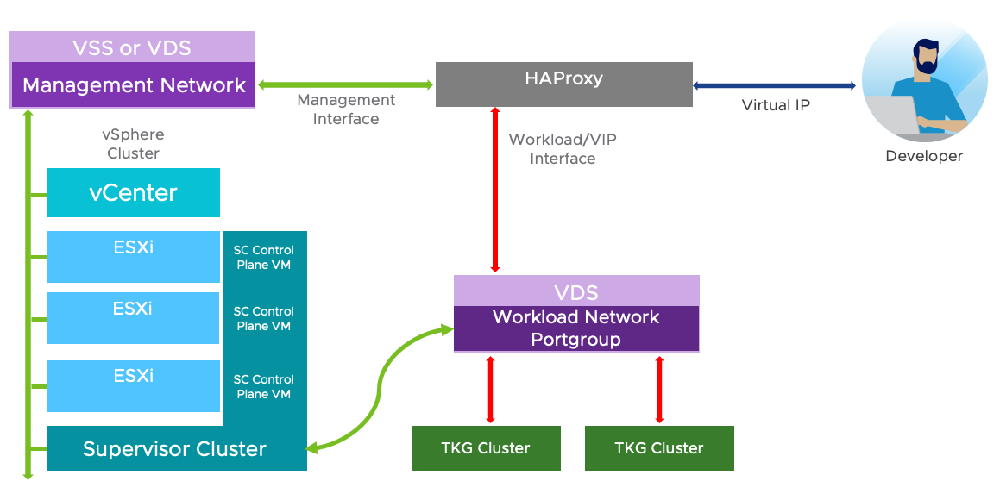
必要なネットワークとして、ルーティング可能なサブネットが2つ必要（重要）、でVLANでのネットワーク分離が推奨みたいです（今回は割愛） 
HA Proxy（Load Balancer）と、Supervisor Clusterは両方のネットワークに足を持つ必要があります。

検証環境では上記ドキュメントを参考に最終的に下記のような構成にしています。

**Management Network:** 

| コンポーネント | 必要IP数 | IPアドレス |
| :---: | :---: | :---: |
| vCenter | 1 IP | 192.168.3.30 |
| ESXi Host | 1 IP per Host | 192.168.3.21-24 |
| HA Proxy | 1 PA | 102.168.3.36 |
| SuperVisor Cluster | 5 IPs | 192.168.3.41-45 |
|  |  |  |

**Workload Network:** 2種類 
Cluster Node Range: 

| コンポーネント | 必要IP数 | IPアドレス |
| :---: | :---: | :---: |
| HA Proxy | 1 IP per K8s LB Services | 192.168.4.xx |
| Supervisor Cluster | 3 IPs | 192.168.4.xx-xx |
| TKC Controller | 1 IP per Control Plane VM | 192.168.4.xx-xx |
| TKC Worker | 1 IP per Worker Node VM | 192.168.4.xx |
|  |  |  |

※Load Balancer IP Rangesとしてセットアップ中に登場します。 

Virtual IP Range： 
K8sの「Service Type:LoadBalancer」リソース作成時に払い出されるVIPのことを指します。

| コンポーネント | 必要IP数 | IPアドレス |
| :---: | :---: | :---: |
| Virtual IPs | 必要数用意 | 192.168.5.10-49 |

### WorkLoad管理の有効化

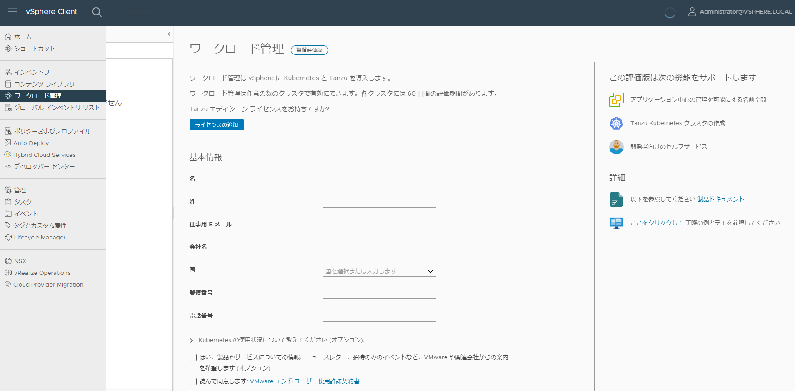
左ペインより、"ワークロード管理"を選択

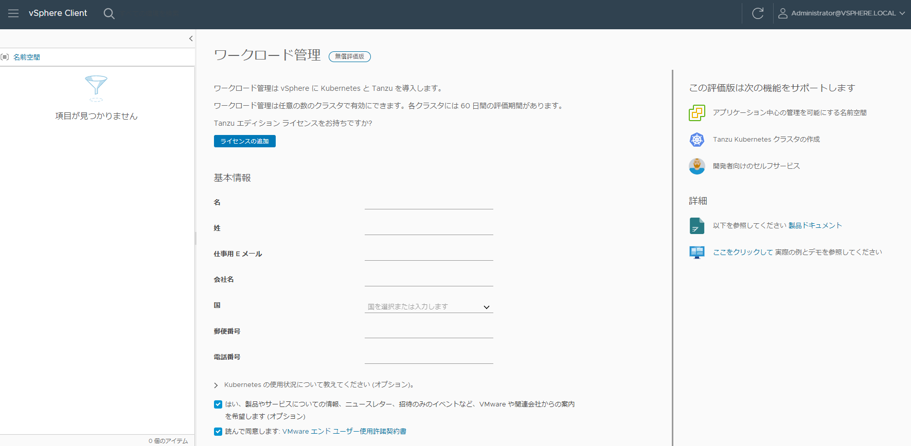

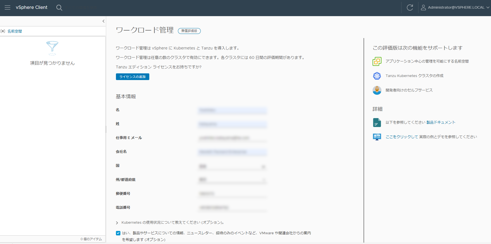

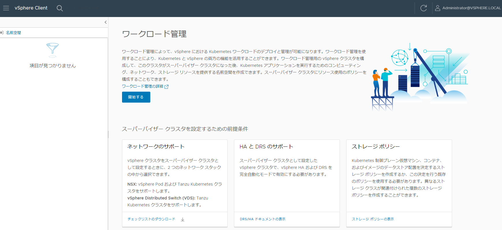
”ワークロード管理” 開始するをクリック

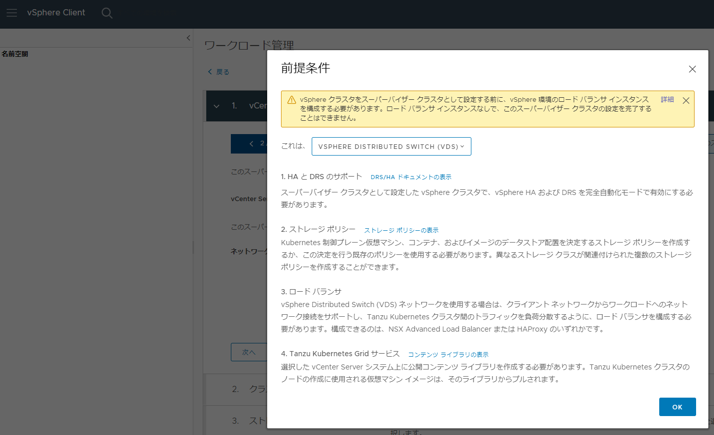
先に進める前に前提条件を確認しておきます。 
vSphere HA の構成などが必要です。

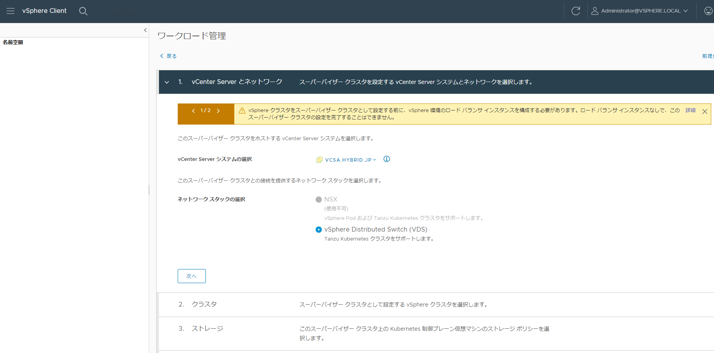
vCenter Serverとネットワーク項目で、今回はNSX-Tを利用しないので、 
”vSphere Distributed Switch(vDS)”を選択します。

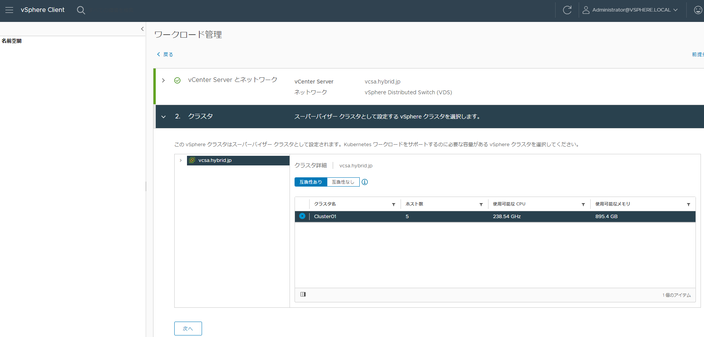
スーパーバイザークラスターとして設定するvSphereクラスタを選択。 
前提条件を満たしたクラスターがない場合は先に進めません。

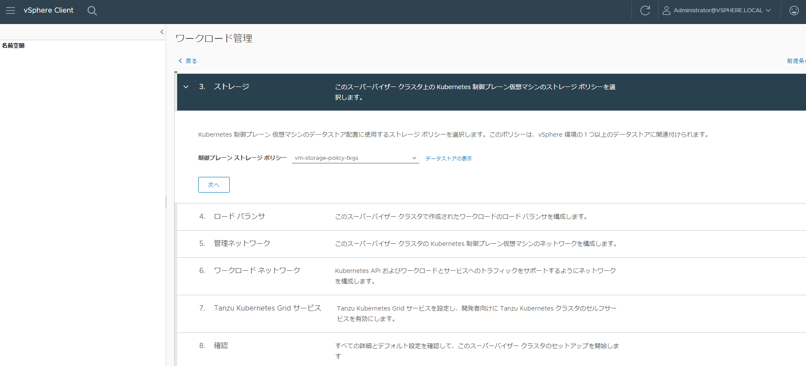
あらかじめ設定してあるストレージポリシーを選択

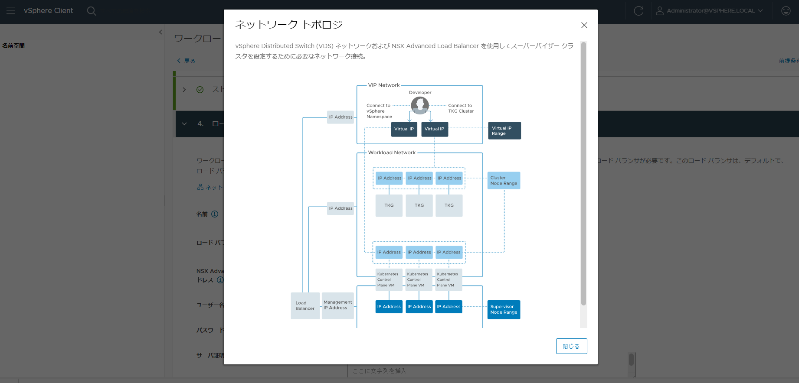
ネットワークトポロジーを確認します。 
この絵は個人的にはわかりづらいのですが、本稿最初にまとめたネットワーク情報をベースに設定していきます。

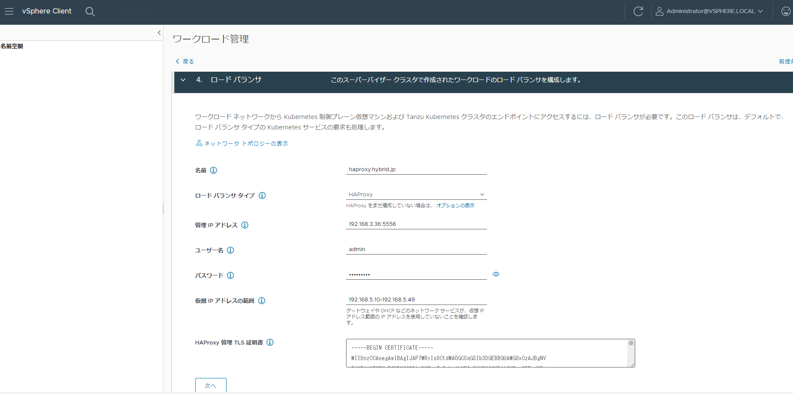
ここで指定する仮想IPアドレスの範囲は、 
K8sの「Service Type:LoadBalancer」リソース作成時に払い出されるVIPのことを指すため、 
HA Proxy VM作成時に設定済みのLoad Balancer IP Ranges内の範囲で指定します。 
今回は、 
"192.168.5.10 - 192.168.5.49" 
で設定。 
証明書情報は、HA Proxy VM作成時に取得した証明書情報を入力します。

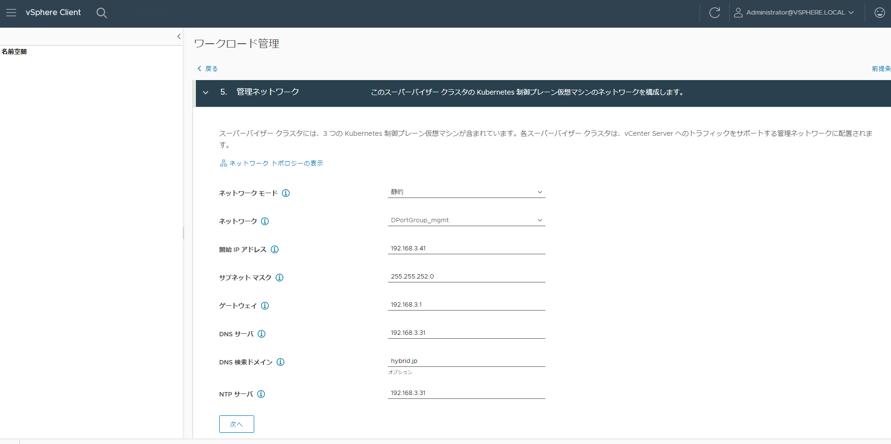
次に管理ネットワーク関連の設定を入力していきます。 

開始IPアドレスは、Supervisor Control Plane VM に割り当てられる IP アドレスとなり、ここから採番されるみたいです。 
今回は、"192.168.3.41"を開始アドレスとしているので、 
"192.168.3.41" → VIP、 
"192.168.3.42 - 44" がControl Plane VMのネットワークアダプター1に採番されるみたいです。

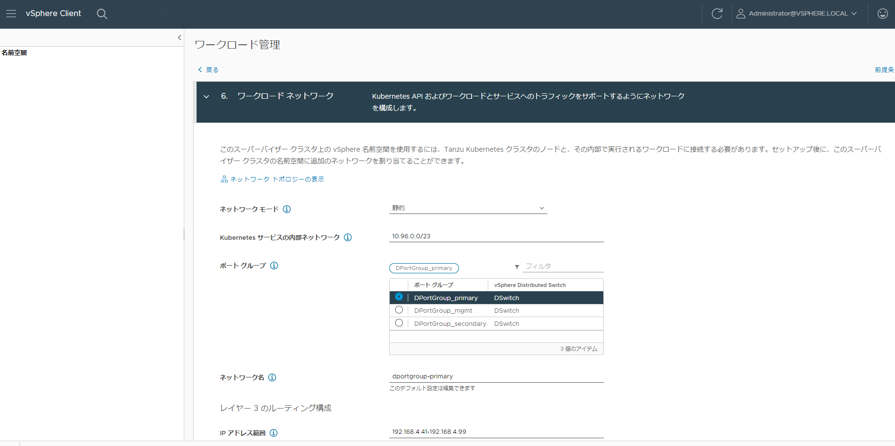
次にワークロードネットワーク関連の設定を入力していきます。 
Kubernetesサービスの内部ネットワークは、 
K8sサービス内で利用されるコンテナネットワークなので、デフォルトのまま進めます。
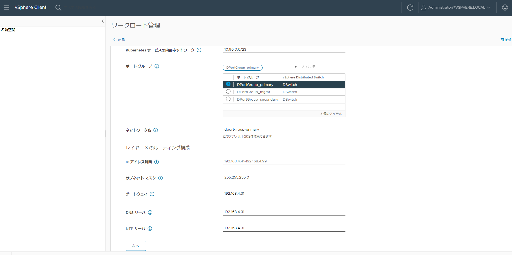
ワークロードネットワークは、最小構成では1つだけでOKなので、今回は"dportgroup_primary"のみ利用します。 
ここのIPアドレス範囲に指定したアドレスは、Supervisor Control Planeのネットワークアダプター2に付与されます。 
以降はおそらくTanzu K8s ClusterのControl Plane Node、Worker Nodeに採番されていくはず、、、。

**※** ワークロードネットワークのIPレンジはHAProxyの ”Load Balancer IP Range” や他サーバーと重ならないレンジを指定する必要があります。

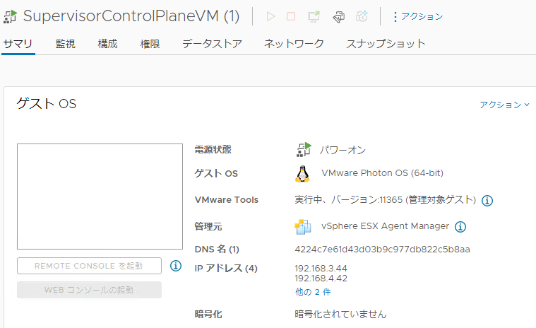
作成後にできるSupervisorControlPlaneVMの情報を見ると、 
管理ネットワーク、ワークロードネットワークどちらのネットワーク範囲のIPアドレスも採番されていることがわかります。
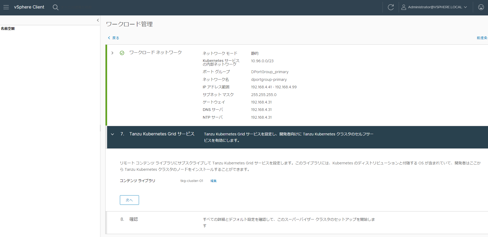
TkGsのイメージを引っ張ってくるための作成済みコンテンツライブラリの情報を入力。
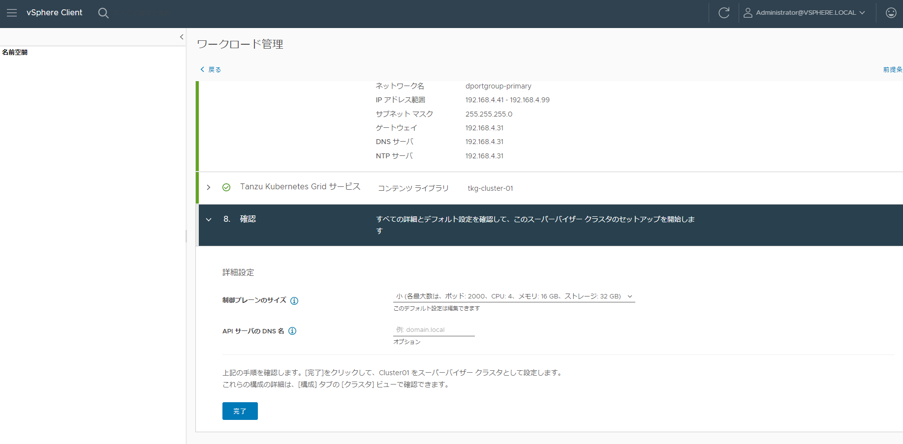
クラスタサイズ次第で制御プレーンの大きさを指定し、 
入力した情報を確認して、”完了”をクリック

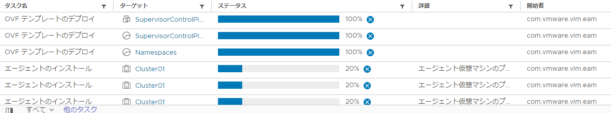
コンテンツライブラリからイメージを参照して、SupervisorControlPlaneVMのデプロイや必要なクラスターエージェントをインストールしています。

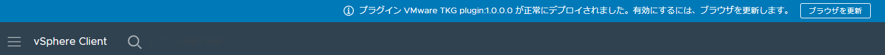
無事完了すると、"VMware TKG plugin x.x.x.xが正常にデプロイされました"と表示され、 
スーパーバイザークラスタの構成ステータスが ”**実行中**” となります。
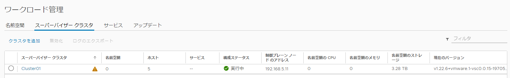
