# 仮想マシンでvGPUが使えるようになるまで
ESXi上で仮想GPUを利用する場合は、vGPU Managerのインストールおよび、vCenter側での設定が必要です。
下記にその方法をまとめます。


## NVIDIA Application Hub へのログイン
vGPU関連ソフトウェアのダウンロードには、NVIDIAライセンスポータルへのアクセスが可能なアカウント登録が必要となります。NVIDIA Partner Network(NPN)アカウントの申請は[こちら](https://www.nvidia.com/en-us/about-nvidia/partners/join-npn/)をご参照ください。

アカウント発行後、[こちら](https://nvid.nvidia.com/siteminderagent/forms/login)のログインフォームに従い、
ログインします。


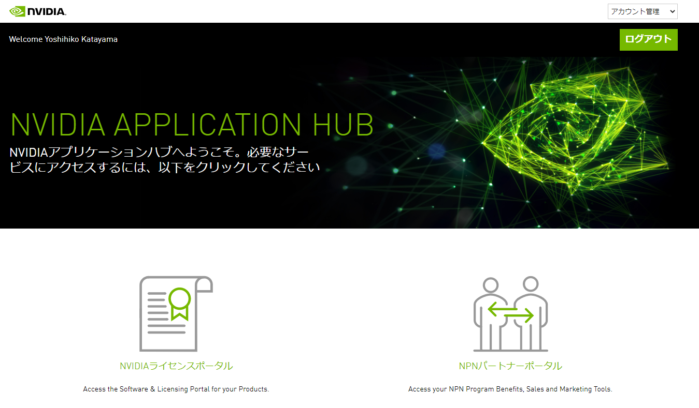
NVIDIAライセンスポータルをクリック

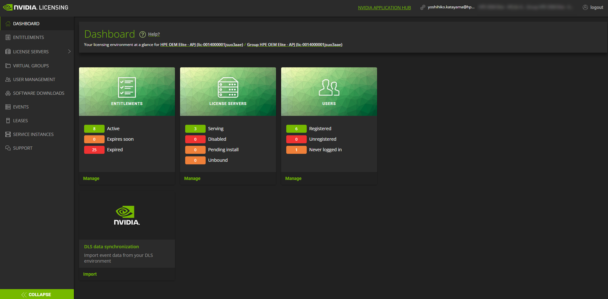
左ペイン上、**SOFTWARE DOWNLOADS**をクリック

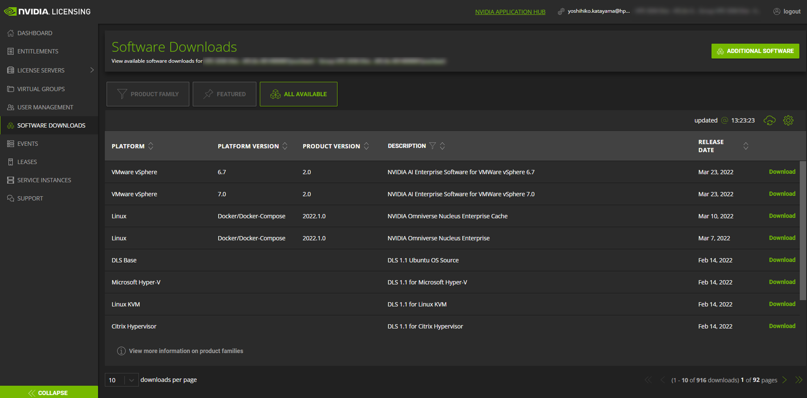
対象のESXiバージョンに対応したNVIDIA AI Enterpriseのソフトウェアをダウンロード

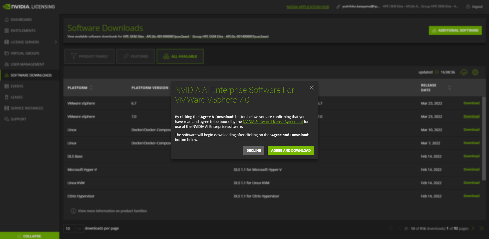

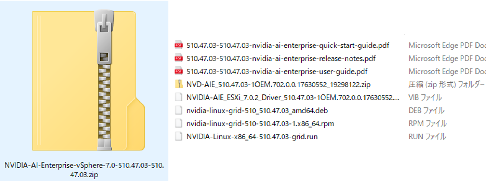
Zipファイルとしてダウンロードされます。
Zip中にはpdfで展開されるマニュアル類も混在していますが、この中にあるZipファイル（例だとNVD-AIE_510.47.03-1OEM.xxxx.zip）がVIBファイル（ESXiのソフトウェアパッケージ）に該当します。

## ESXiホストにVIBイメージのインストール
上記のようにNVIDIA Application Hubよりソフトウェアイメージをダウンロードし、適当なデータストアに配置
 - Ex. NVIDIA-AI-Enterprise-vSphere-7.0-510.47.03-510.47.03.zip

ESXiホストをメンテナンスモードにします
```
 [root@localhost:~] vim-cmd hostsvc/maintenance_mode_enter
 ```
zipファイルよりVIBをインストールします
"NVIDIA-AI-Enterprise-vSphere-7.0-510.47.03-510.47.03.zip"を解凍
```
[root@localhost:~] esxcli software vib install -d /vmfs/volumes/61def4ef-40fc5e8e-cf08-d4f5ef0e4078/NVIDIA-AI-Enterprise-vSphere-7.0-510.47.03-510.47.03/
  510.47.03-510.47.03-nvidia-ai-enterprise-quick-start-guide.pdf    NVIDIA-AIE_ESXi_7.0.2_Driver_510.47.03-1OEM.702.0.0.17630552.vib
  510.47.03-510.47.03-nvidia-ai-enterprise-release-notes.pdf        NVIDIA-Linux-x86_64-510.47.03-grid.run
  510.47.03-510.47.03-nvidia-ai-enterprise-user-guide.pdf           nvidia-linux-grid-510-510.47.03-1.x86_64.rpm
  NVD-AIE_510.47.03-1OEM.702.0.0.17630552_19298122.zip              nvidia-linux-grid-510_510.47.03_amd64.deb
```
```
[root@localhost:~] esxcli software vib install -d /vmfs/volumes/61def4ef-40fc5e8e-cf08-d4f5ef0e4078/NVIDIA-AI-Enterprise-vSphere-7.0-510.47.03-510.47.03/NVD-AIE_510.47.03-1OEM.702.0.0.17630552_19298122.zip
  Installation Result
     Message: Operation finished successfully.
     Reboot Required: false
     VIBs Installed: NVIDIA_bootbank_NVIDIA-AIE_ESXi_7.0.2_Driver_510.47.03-1OEM.702.0.0.17630552
     VIBs Removed:
     VIBs Skipped:
```
ESXiホストの再起動＆メンテナンスモード解除します。
```
[root@localhost:~] esxcli system maintenanceMode get
  Enabled
[root@localhost:~] esxcli system maintenanceMode set --enable false
[root@localhost:~] esxcli system maintenanceMode get
  Disabled
```
きちんと認識しているか確認します。
```
[root@localhost:~] vmkload_mod -l | grep nvidia
  nvidia                         51    35792    
  [root@localhost:~] nvidia-smi
  Thu Apr 14 14:09:46 2022       
  +-----------------------------------------------------------------------------+
  | NVIDIA-SMI 510.47.03    Driver Version: 510.47.03    CUDA Version: N/A      |
  |-------------------------------+----------------------+----------------------+
  | GPU  Name        Persistence-M| Bus-Id        Disp.A | Volatile Uncorr. ECC |

  | Fan  Temp  Perf  Pwr:Usage/Cap|         Memory-Usage | GPU-Util  Compute M. |
  |                               |                      |               MIG M. |
  |===============================+======================+======================|
  |   0  NVIDIA A100-PCI...  On   | 00000000:86:00.0 Off |                    0 |
  | N/A   53C    P0    45W / 250W |      6MiB / 40960MiB |      0%      Default |
  |                               |                      |             Disabled |
  +-------------------------------+----------------------+----------------------+

  +-----------------------------------------------------------------------------+
  | Processes:                                                                  |
  |  GPU   GI   CI        PID   Type   Process name                  GPU Memory |
  |        ID   ID                                                   Usage      |
  |=============================================================================|
  |    0   N/A  N/A   2104081      G   Xorg                                5MiB |
  +-----------------------------------------------------------------------------+
```

**※**参考ドキュメントはこちら：
[Install-update-vgpu-vmware-vsphere](https://docs.nvidia.com/grid/latest/grid-vgpu-user-guide/index.html#install-update-vgpu-vmware-vsphere)

## vGPUプロファイルが使えるようになるまでの設定
vCenter Serverインスタンス > 設定 > 詳細設定 > 設定の編集

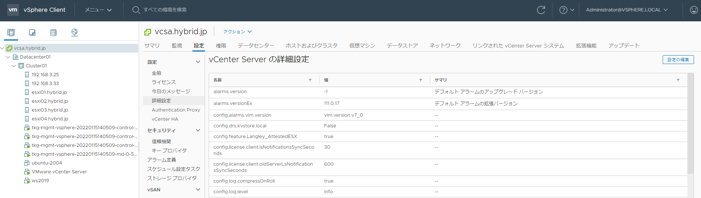

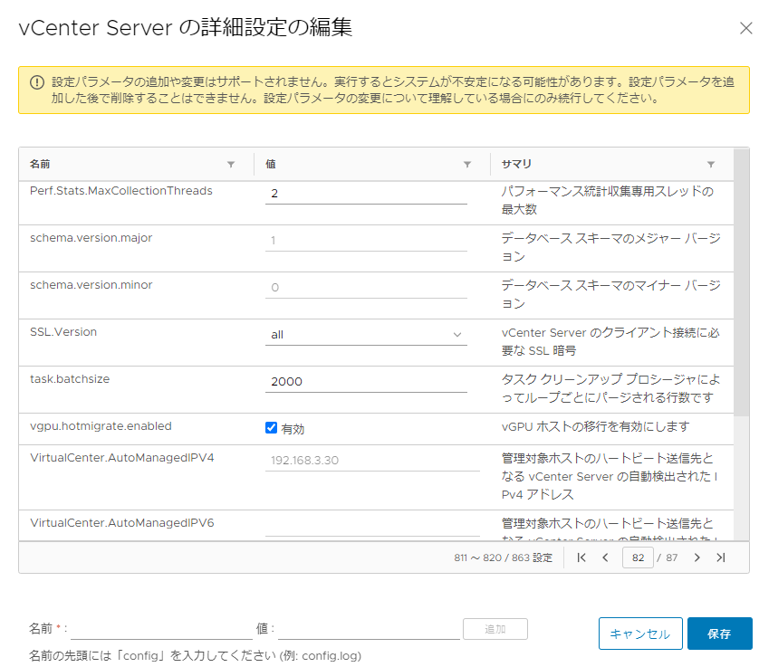
vgpu.hotmigrate.enabledの値を有効にします。

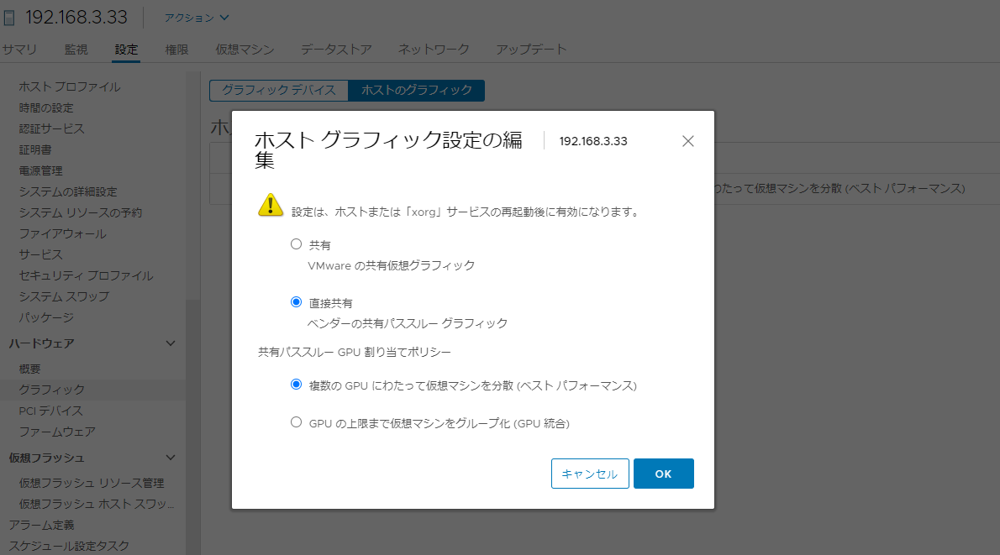
GPUを搭載しているESXiホストを選択、
ハードウェア > グラフィック > ホストのグラフィック　の設定を、
**”直接共有”**に変更

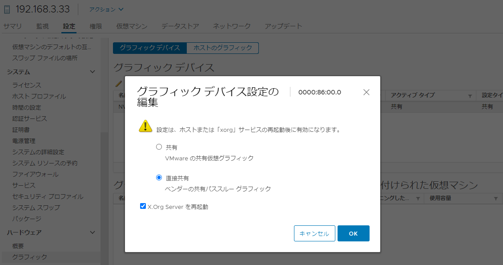
ハードウェア > グラフィック > グラフィックデバイス　の設定も同様に、
**”直接共有”**に変更します。

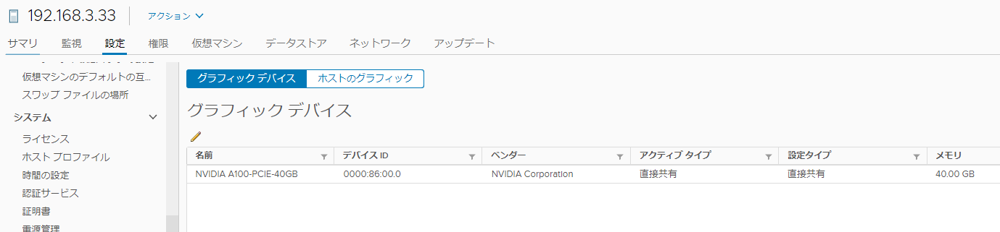
ホスト自体の再起動もしくは、ESXi shellにてnv-hostengineサービスの再起動
```
[root@localhost:~] nv-hostengine -t
Host engine successfully terminated.
```
```
[root@localhost:~] nv-hostengine -d
Started host engine version 1.8.0 using socket path: /tmp/nv-hostengine
```
を実施

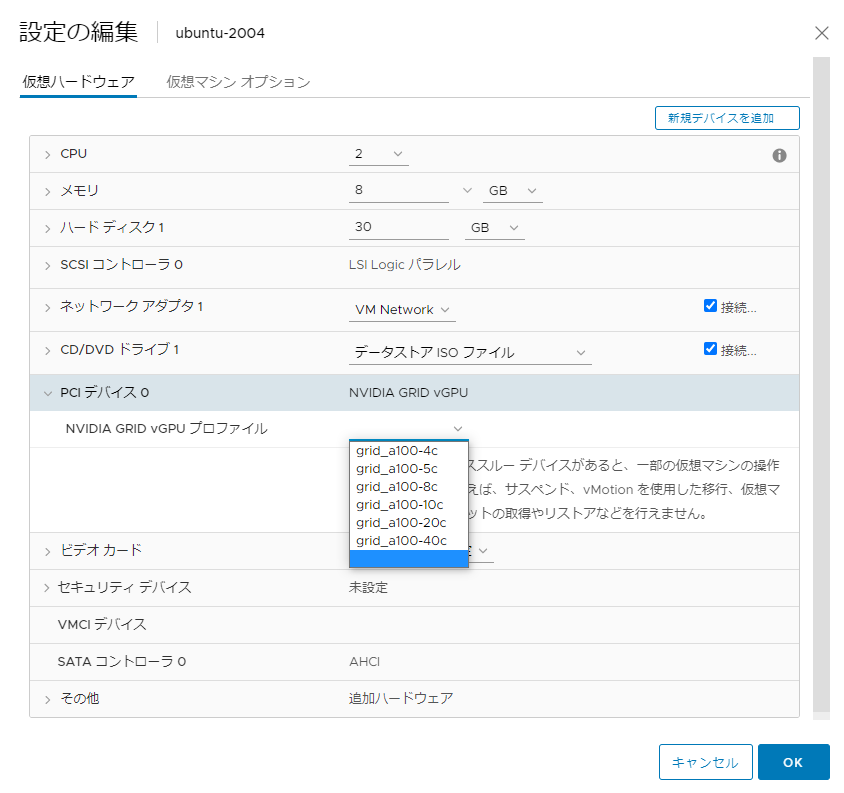
仮想マシンの設定より、新規デバイスとして"PCIデバイス"を追加して見てみると、
上記のようにvGPUプロファイルが設定できるようになりました。

**※**参考ドキュメントはこちら：[changing-default-gpu-mode-vmware-vsphere](https://docs.nvidia.com/grid/latest/grid-vgpu-user-guide/index.html#changing-default-gpu-mode-vmware-vsphere)


### Tips
VIBをインストールしても、上記”直接共有”等々の設定をしないとvGPUプロファイルは見えてこない。
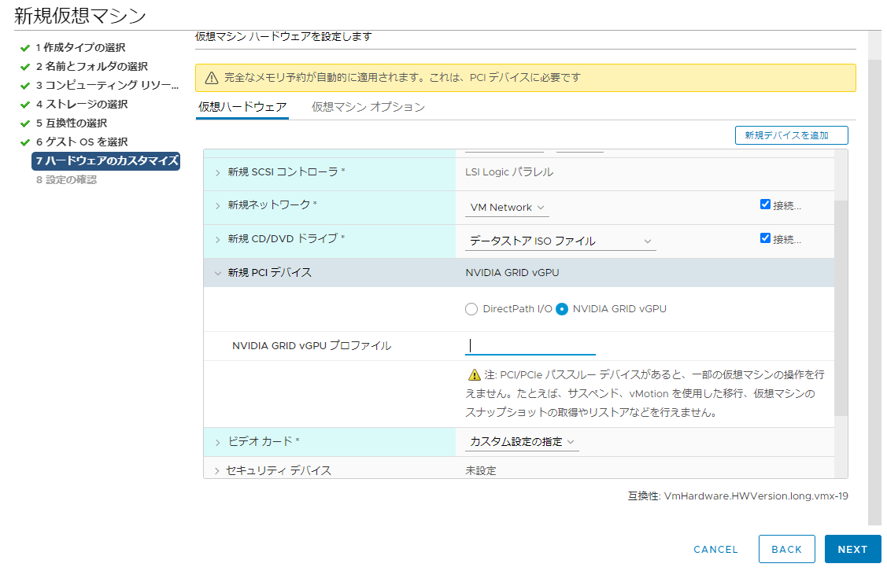
<br>
<br>
**vGPUアサインした仮想マシンが起動しない事象**<br>
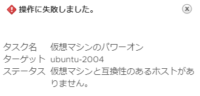<br>
vCenterとESXiのバージョンの差異がある場合に発生する場合もあるみたいです。<br>
KBはこちら：[vSphere ESXi 7.0.3 - 7.0 Update 3 bug with NVidia Grid vGPU](https://communities.vmware.com/t5/Horizon-Desktops-and-Apps/vSphere-ESXi-7-0-3-7-0-Update-3-bug-with-NVidia-Grid-vGPU/td-p/2873904)
