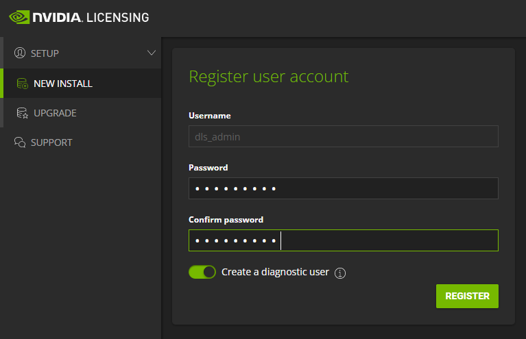

# vGPUライセンスサーバーを構築する
ゲストOS上からvGPUを利用するには、きちんとライセンスサーバーでのvGPUライセンス管理が必要になります。
下記にその方法をまとめます。

## vGPUライセンスサーバーの整理
vGPUのライセンスを管理するサーバーは現在、NVIDIA License System (略称：NLS) と呼びます。<br>
従来のFlexera社の機構からNVIDIA独自のアーキテクチャとして開発しなおしており、<br>
vGPU Spftware v13.0以降、および、NVIDIA AI Enterpriseはこちらのライセンスサーバーを利用します。
クラウド版とオンプレ版の提供形態を用意しており、サービス基盤がインターネット接続可能かどうかでの使い分けでよいかと思います。

**DLS(Delegated License Service)**：
 - ローカル環境内に構築
 - 各ハイパーバイザー向けの仮想アプライアンス形式で提供
 - 冗長構成も可能（推奨）
<br>

**CLS(Cloud License Service)：**
 - NVIDIAのクラウドインスタンスとしての提供
 - 仮想マシンの認証は社外アクセス前提

本手順では構築の手間がかかるDLSでの実施を前提に進めてみたいと思います。CLS利用は基本的にNVIDIA Licenseポータル内の作業で完結します。

## DLSサーバーのインストール
NVIDIA Licenseポータルにログインし、
"**SOFTWARE DOWNLOADS**"タブ、”**ADDITIONAL SOFTWARE**”より、DLSのイメージを入手します。<br>
例: "DLS 1.1 for VMware vSphere" と表記されているものをダウンロードすると、"nls-1.1.0-bios-ESXi.zip"のファイルがダウンロードされます。
今回はこちらを利用していきます。


zipファイルを展開後、OVAファイルをESXi環境にデプロイします。
仮想マシンを立ち上げた後、DLSアプライアンスにWebコンソールでアクセスし、IPアドレスを設定します。


```
nls-si-0 login: dls_system
dls_system@nls-si-0: $ /etc/adminscripts/set-static-ip-cli.sh
```
で起動したウィザード従い、IPアドレス情報を設定。


参考ドキュメントはこちら：[installing dls virtual appliance](https://docs.nvidia.com/license-system/latest/nvidia-license-system-user-guide/index.html#installing-dls-virtual-appliance-on-vmware-vsphere)


## DLS Administratorの登録
Webブラウザで”https://dls-vm-ip-address”を入力して、DLSサーバーにアクセスします。





ローカルリセットシークレットはパスワードを忘れたときのために念のため控えておきます。


"Download DLS instance Toke" より、<br>
DLSトークンファイルを取得<br>
Ex. dls_instance_token_05-19-2022-14-32-17.tok


NVIDIAライセンスポータルに移動し、
"SERVER INSTANCES" > "Actions"


"Upload DLS instance token" より、
先ほど入手したトークンファイルをアップロード


Statusが”**Pending**”のため、対象DLSの”Action”タブより”Register”を実施


Register Done!!


次に"CREATE SERVER"タブからライセンスサーバーを作成します。ライセンスサーバー名、説明書きを加え、


使用するライセンスを選択


作成


まだサーバーインスタンスと紐づいていないので、<br>
"Bind Service Instance" をクリック


先ほど作成した **SERVER INSTANCES** と紐づけます


まだライセンスサーバーがインストールされていないステータス

**※** 参照ドキュメントはこちら：
[registering dls administrator user](https://docs.nvidia.com/license-system/latest/nvidia-license-system-user-guide/index.html#registering-dls-administrator-user)

## DLSインスタンスにライセンスサーバーをインストール


ライセンスポータルより、<br>
"License Servers" > "List Servers" > 対象のサーバーインスタンスを選択、<br>
"Detail" > "Actions" > "download" より、


binファイルをダウンロードする<br>
Ex. license_05-19-2022-14-57-55.bin


DLSアプライアンス側に行き、<br>
"Dashboard" > "Select License Server File" より対象binファイルをアップロードする


アップされたら、”Install Server”をクリック


Install Done!!


ライセンスポータル側から見てもきちんと ”**Installed**” ステータスに変更されていることを確認

**※** 参照ドキュメントはこちら：
[Installing License Server on DLS Instance](https://docs.nvidia.com/license-system/latest/nvidia-license-system-user-guide/index.html#installing-license-server-on-dls-instance)

<br>
<br>

## ゲストOSに配置するTokenを取得


"Service Instance" > "Actions" > "Generate client config token" <br>
Ex. client_configuration_token_05-25-2022-23-56-59.tok


ライセンスは短い間隔でリースされるので、クライアントから見た時のExpiry日時は適宜更新されます。


ゲストOS上でこのTokenファイルを配置します。

```
yoshihiko@vgpu-server:~$ nvidia-smi
Wed May 25 04:05:53 2022       
+-----------------------------------------------------------------------------+
| NVIDIA-SMI 510.47.03    Driver Version: 510.47.03    CUDA Version: 11.6     |
|-------------------------------+----------------------+----------------------+
| GPU  Name        Persistence-M| Bus-Id        Disp.A | Volatile Uncorr. ECC |
| Fan  Temp  Perf  Pwr:Usage/Cap|         Memory-Usage | GPU-Util  Compute M. |
|                               |                      |               MIG M. |
|===============================+======================+======================|
|   0  GRID A100-4C        On   | 00000000:02:01.0 Off |                    0 |
| N/A   N/A    P0    N/A /  N/A |      0MiB /  4096MiB |      0%      Default |
|                               |                      |             Disabled |
+-------------------------------+----------------------+----------------------+

+-----------------------------------------------------------------------------+
| Processes:                                                                  |
|  GPU   GI   CI        PID   Type   Process name                  GPU Memory |
|        ID   ID                                                   Usage      |
|=============================================================================|
|  No running processes found                                                 |
+-----------------------------------------------------------------------------+
```

ライセンス適用状況の確認
```
yoshihiko@vgpu-server:~$ nvidia-smi -q

==============NVSMI LOG==============

Timestamp                                 : Wed May 25 04:08:42 2022
Driver Version                            : 510.47.03
CUDA Version                              : 11.6

Attached GPUs                             : 1
GPU 00000000:02:01.0
    Product Name                          : GRID A100-4C
    Product Brand                         : NVIDIA Virtual Compute Server
    Product Architecture                  : Ampere
    Display Mode                          : Enabled
    Display Active                        : Disabled
    Persistence Mode                      : Enabled
    MIG Mode
        Current                           : Disabled
        Pending                           : Disabled
    Accounting Mode                       : Disabled
    Accounting Mode Buffer Size           : 4000
    Driver Model
        Current                           : N/A
        Pending                           : N/A
    Serial Number                         : N/A
    GPU UUID                              : GPU-62f13b27-1eda-11b2-a8b5-0869ebe25264
    Minor Number                          : 0
    VBIOS Version                         : 00.00.00.00.00
    MultiGPU Board                        : No
    Board ID                              : 0x201
    GPU Part Number                       : N/A
    Module ID                             : N/A
    Inforom Version
        Image Version                     : N/A
        OEM Object                        : N/A
        ECC Object                        : N/A
        Power Management Object           : N/A
    GPU Operation Mode
        Current                           : N/A
        Pending                           : N/A
    GSP Firmware Version                  : N/A
    GPU Virtualization Mode
        Virtualization Mode               : VGPU
        Host VGPU Mode                    : N/A
    vGPU Software Licensed Product
        Product Name                      : NVIDIA Virtual Compute Server
        License Status                    : Unlicensed (Unrestricted)
```

Grid関連の設定値を変更します。<br>
ライセンスサーバーのアドレス、プロファイルタイプを指定
```
root@vgpu-server:/home/yoshihiko# vi /etc/nvidia/gridd.conf
root@vgpu-server:/home/yoshihiko#
――――
# Description: Set License Server Address
# Data type: string
# Format:  "<address>"
ServerAddress=192.168.3.32

# Description: Set License Server port number
# Data type: integer
# Format:  <port>, default is 7070
ServerPort=7070

# Description: Set Feature to be enabled
# Data type: integer
# Possible values:
#    0 => for unlicensed state
#    1 => for NVIDIA vGPU (Optional, autodetected as per vGPU type)
#    2 => for NVIDIA RTX Virtual Workstation
#    4 => for NVIDIA Virtual Compute Server
# All other values reserved
FeatureType=4
―――――
```

取得したTokenファイルを/etc/nvidia/ClientConfigToken配下に配置
```
root@vgpu-server:~# ls -a /etc/nvidia/ClientConfigToken/
.  ..  client_configuration_token_05-25-2022-23-56-59.tok
```

該当サービスの再起動
```
root@vgpu-server:~# systemctl restart nvidia-gridd
```
```
root@vgpu-server:~# systemctl status nvidia-gridd
● nvidia-gridd.service - NVIDIA Grid Daemon
     Loaded: loaded (/lib/systemd/system/nvidia-gridd.service; enabled; vendor preset: enabled)
     Active: active (running) since Wed 2022-05-25 15:13:59 UTC; 1s ago
    Process: 61098 ExecStart=/usr/bin/nvidia-gridd (code=exited, status=0/SUCCESS)
   Main PID: 61109 (nvidia-gridd)
      Tasks: 3 (limit: 38430)
     Memory: 1.4M
     CGroup: /system.slice/nvidia-gridd.service
             └─61109 /usr/bin/nvidia-gridd

May 25 15:13:59 vgpu-server systemd[1]: nvidia-gridd.service: Succeeded.
May 25 15:13:59 vgpu-server systemd[1]: Stopped NVIDIA Grid Daemon.
May 25 15:13:59 vgpu-server systemd[1]: Starting NVIDIA Grid Daemon...
May 25 15:13:59 vgpu-server nvidia-gridd[61109]: Started (61109)
May 25 15:13:59 vgpu-server systemd[1]: Started NVIDIA Grid Daemon.
May 25 15:13:59 vgpu-server nvidia-gridd[61109]: vGPU Software package (0)
May 25 15:13:59 vgpu-server nvidia-gridd[61109]: Ignore service provider licensing
May 25 15:13:59 vgpu-server nvidia-gridd[61109]: Ignore service provider and node-locked licensing
May 25 15:13:59 vgpu-server nvidia-gridd[61109]: NLS initialized
May 25 15:13:59 vgpu-server nvidia-gridd[61109]: Acquiring license. (Info: 192.168.3.32; NVIDIA Virtual Compute Server)
```

License Status が"**Licenced**"になっていればOKです。
```
root@vgpu-server:~# nvidia-smi -q

==============NVSMI LOG==============

Timestamp                                 : Thu May 26 00:18:44 2022
Driver Version                            : 510.47.03
CUDA Version                              : 11.6

Attached GPUs                             : 1
GPU 00000000:02:01.0
    Product Name                          : GRID A100-4C
    Product Brand                         : NVIDIA Virtual Compute Server
    Product Architecture                  : Ampere
    Display Mode                          : Enabled
    Display Active                        : Disabled
    Persistence Mode                      : Enabled
    MIG Mode
        Current                           : Disabled
        Pending                           : Disabled
    Accounting Mode                       : Disabled
    Accounting Mode Buffer Size           : 4000
    Driver Model
        Current                           : N/A
        Pending                           : N/A
    Serial Number                         : N/A
    GPU UUID                              : GPU-62f13b27-1eda-11b2-a8b5-0869ebe25264
    Minor Number                          : 0
    VBIOS Version                         : 00.00.00.00.00
    MultiGPU Board                        : No
    Board ID                              : 0x201
    GPU Part Number                       : N/A
    Module ID                             : N/A
    Inforom Version
        Image Version                     : N/A
        OEM Object                        : N/A
        ECC Object                        : N/A
        Power Management Object           : N/A
    GPU Operation Mode
        Current                           : N/A
        Pending                           : N/A
    GSP Firmware Version                  : N/A
    GPU Virtualization Mode
        Virtualization Mode               : VGPU
        Host VGPU Mode                    : N/A
    vGPU Software Licensed Product
        Product Name                      : NVIDIA Virtual Compute Server
        License Status                    : Licensed (Expiry: 2022-5-27 0:8:28 GMT)
```
